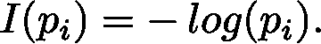
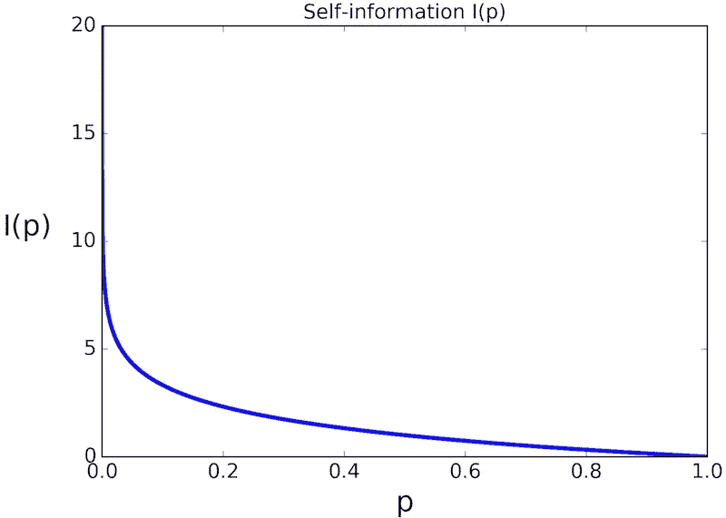
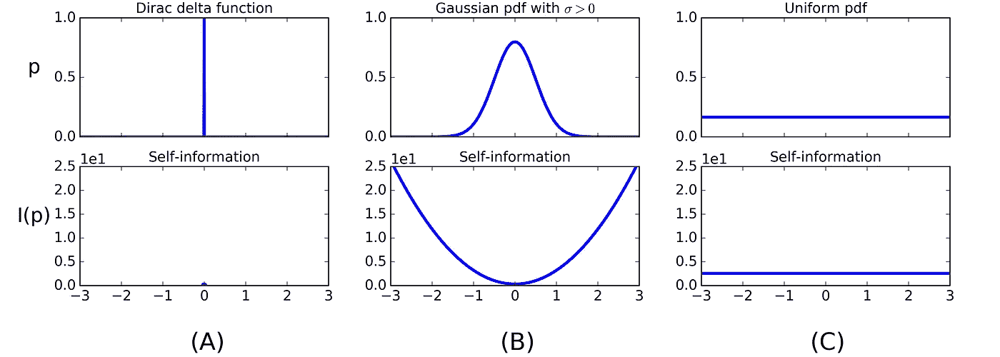
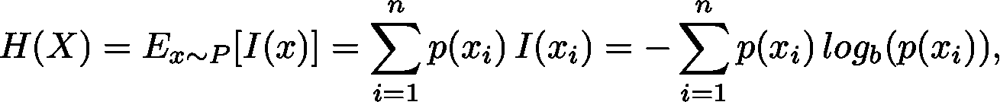
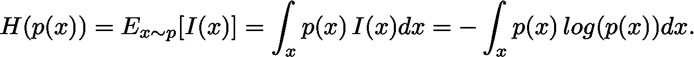
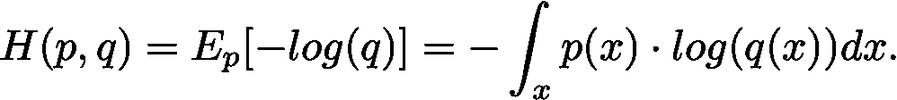
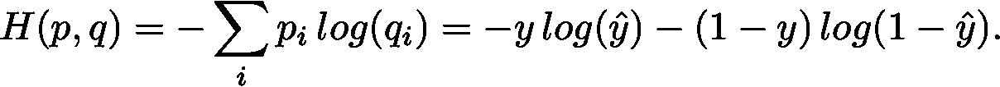
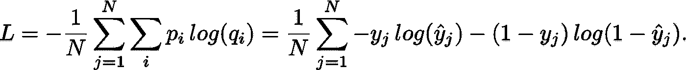
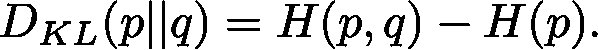

# 机器学习和人工智能背景下的香农熵

> 原文：<https://medium.com/swlh/shannon-entropy-in-the-context-of-machine-learning-and-ai-24aee2709e32>

在这篇文章中，我想在机器学习和人工智能的背景下阐述香农熵的概念。我的目标是对香农熵背后的数学原理提供一些见解，但保持讨论相对非正式。

所以让我们开始吧。在机器学习中，量化与随机事件相关的预期信息量，以及量化概率分布之间的相似性是很常见的。在这两种情况下，香农熵都被用作概率分布的信息量的度量。它是以信息论之父克劳德·香农(1916-2001)的名字命名的。

## 自我信息

香农熵背后的基本概念是一个事件的所谓自我信息，有时被称为惊奇。自我信息背后的直觉如下。当观察到一个事件的不太可能的结果(随机变量)时，我们将其与大量信息联系起来。相反，当观察到更有可能的结果时，我们会将其与更少量的信息联系起来。把自我信息想象成与某个事件相关的惊喜是非常有帮助的。例如，考虑一个总是正面朝上的严重倾斜的硬币。任何抛硬币的结果都是完全可以预测的，因此我们永远不会对结果感到惊讶，这意味着我们从这样的实验中得不到任何信息。换句话说，它的自我信息是零。如果硬币偏向较轻，每次我们扔硬币时都会有一些惊喜，尽管超过 50%的时候我们仍然会看到正面。因此，自我信息大于零。如果硬币总是落在背面(而不是正面)，我们又会以零熵或惊喜告终。最大的惊喜是在一个无偏的硬币的情况下获得的，其中正面或反面落地的机会都是 50%，因为这是投掷硬币的结果最难预测的情况。

基于上述非正式要求，我们可以找到一个合适的函数来描述自我信息。对于可能取值为 x_1，.。。，x_n 和概率质量函数 P(X)，在 0 和 1 之间的任何正的单调递减函数 I(p_i)都可以用作信息的度量。到目前为止一切顺利。然而，另一个重要的性质是独立事件的可加性；后续两次抛硬币的自我信息应该是单次抛硬币的自我信息的两倍。这对于独立变量是有意义的，因为在这种情况下，惊奇或不可预测性的数量会增加两倍。形式上，我们需要 I(p_i p_j) = I(p_i)+I(p_j)对于独立事件 x_i 和 x_j .满足所有这些要求的函数是负对数，

图 1 显示了 I(p)的曲线图。

Figure 1\. The self-information function I(p). Low probabilities are associated with high self-information, and vice versa.

让我们回到简单的抛硬币实验。在信息论的语言中，需要一位(也称为“香农”)信息来表示一次抛硬币的两种可能结果。类似地，对于两次连续的掷硬币，需要两位信息来描述所有四种可能的结果。一般来说，需要 log_2(n)比特的信息来描述 n 个连续的独立随机事件的结果，或者等价地，自我信息。让我们通过简单的计算来完成随后的三次抛硬币。有 2^3 = 8 种可能的结果，任何特定结果的概率是 0.5^3 = 0.125。所以这个实验的自我信息是 I(0.125)=-log _ 2(0.125)= 3。我们需要 3 位来表示所有可能的结果，因此任何特定的三次掷硬币序列的自我信息等于 3.0。

我们也可以计算一个连续随机变量的自信息。图 2 显示了三种不同的 pdf 及其相应的信息内容。2a 中的 Dirac delta 对应于强偏置、零熵的情况，偏置硬币总是落在同一侧。每当 p(x) = 0 时，将关联无限高的信息内容。然而，这是假设性的，因为这些事件实际上不会发生，因为概率为零。图 2B 中的高斯概率密度函数类似于有偏向的硬币，硬币往往落在同一边，但不总是如此。最后，图 2C 描绘了一个统一的 pdf，具有相关的统一信息内容，类似于我们的无偏掷硬币。

Figure 2\. Three different probability densities p on [−3,+3] and their self-information I(p). (A) Dirac delta function (completely deterministic) (B) Gaussian with μ = 0,σ = 0.5 (biased towards x = 0) (C.) Uniform distribution.

## 熵

到目前为止，我们只讨论了自我信息。对于公平硬币的情况，自我信息实际上等于香农熵，因为所有结果在概率上是相等的。然而，一般来说，香农熵是 X 的所有可能值的平均自我信息(期望值),

其中 b 是对数的底数。上面我们使用了 b = 2，其他常见的选择是 b = 10 以及欧拉数 e，但是这个选择并不重要，因为不同基数的对数由一个常数联系起来。我们从这里开始假设基数为 2，省略 b。

如果你密切关注，你可能想知道当 p(x_i) = 0 时熵发生了什么，因为在这种情况下我们必须计算 0 log(0)。原来
lim p→0 p log(p) = 0。一个数学证明可以用洛必达的[法则建立。](http://tutorial.math.lamar.edu/Classes/CalcI/LHospitalsRule.aspx)

香农熵推广到连续域，在那里它被称为微分熵([一些限制适用](https://en.wikipedia.org/wiki/Differential_entropy)，这里将不讨论)。对于连续随机变量 x 和概率密度函数 p(x)，香农熵定义如下:

我们的三个示例分布的熵是 0(狄拉克δ)、174(高斯)和 431(均匀)。从我们的实验中出现的模式是，宽分布具有最高的熵。仔细看看图 2B 和 2C 对你的理解很重要。尽管在高斯情况下，I(p)下的面积比均匀情况下大得多，但是熵比均匀情况下小得多，因为 I(p)由概率密度函数 p 加权，概率密度函数 p 在高斯两边都接近于零。记住宽概率密度具有高熵的最好类比是想象一个装满气体的容器。我们从物理学中知道，一个封闭系统中的熵会随着时间的推移而增加，而不会自行减少。当我们在罐的任一侧注入气体后，气体粒子的分布(每单位体积的气体粒子数)在罐内收敛到一个统一的值。低熵将意味着更高密度的气体粒子在某些区域聚集，这种情况永远不会自行发生。许多气体粒子在一个小区域中的累积对应于我们的高斯 pdf，在一个极端的情况下，对应于狄拉克δ函数，此时所有的气体粒子都被凝聚到一个无限小的区域中。

## 交叉熵

交叉熵是一种比较两个概率分布 p 和 q 的数学工具，它类似于熵，但是我们不是计算 p 下 log(p)的期望，而是计算 p 下 log(q)的期望，

在信息论的语言中，如果我们使用“错误的”编码方案 q 而不是 p，这个量给我们从 q 编码一个事件所需的平均比特数。在机器学习中，它是概率分布相似性的一个非常有用的度量，并充当损失函数(下面有更多详细信息)。

# 机器学习中的用途

在这一点上，你可能想知道熵与机器学习有什么关系。接下来让我们来看看一些特定的领域。

## 贝叶斯学习

首先，上述高斯情况很重要，因为正态分布是机器学习应用中非常常见的建模选择。机器学习的目标是减少熵。我们想要做预测，我们必须对我们的预测有信心。熵给了我们一种量化这种信心的方法。在贝叶斯设置中，通常假设先验分布具有较宽的 pdf，反映了在进行观察之前随机变量的值的不确定性。当数据进来时，熵减少并导致后验概率在参数的可能值周围形成峰值。

## 决策树学习

在决策树学习中，熵用于构建树。构建决策树从根节点开始，根据“最佳”属性的所有可能值，即最小化结果子集中的(组合)熵的值，将数据集 S 分成多个子集。这个过程递归地重复，直到没有更多的属性留下来分裂。这个程序叫做 [ID3 算法](https://en.wikipedia.org/wiki/ID3_algorithm)。

## 分类

在二项式和多项式分类方案中，交叉熵是逻辑回归和神经网络的标准损失函数的基础。通常，p 用于真实(或经验)分布(即训练集的分布)，而 q 是由模型描述的分布。让我们以二元逻辑回归为例。这两个类别被标记为 0 和 1，逻辑模型将概率 q_(y=1) = ŷ和 q _(y = 0)= 1ŷ分配给每个输入 x。这可以简单地写成 q ∈ {ŷ，1 ŷ}.尽管经验标签 p 总是恰好为 0 或 1，但这里使用了相同的符号 p ∈ {y，1y }，所以不要混淆。使用这种符号，单个样本的经验分布和估计分布之间的交叉熵为

当用作损失函数时，使用来自所有 N 个样本的所有交叉熵的平均值，

## KL 散度

与交叉熵密切相关的是，从 q 到 p 的 KL 散度，写为 DKL(p||q)，是机器学习中经常使用的另一种相似性度量。在贝叶斯推理的语言中，DKL(p||q)是当一个人将自己的信念从先验分布 q 修改为后验分布 p 时获得的信息的度量，或者换句话说，是当 q 用于逼近 p 时丢失的信息量。例如，它用于训练变分自动编码器的潜在空间表示。KL 散度可以用熵和交叉熵来表示，

当使用针对 q 优化的编码方案时，交叉熵测量对来自 p 的事件进行编码所需的平均总比特数，而 KL 散度给出了当使用针对 q 的最优编码方案而不是针对 p 的最优编码方案时所需的额外比特数。由此我们可以看出，在机器学习的上下文中，p 是固定的，交叉熵和 KL 散度通过常数加法项相关，因此为了优化的目的，它们是等价的。从理论的角度讲 KL 散度而不是交叉熵可能还是有意义的，KL 散度的一个有用的性质是当 p 和 q 相等时为零。

# 结论

这篇文章的目的是在机器学习和人工智能的背景下，通过解释该理论最重要的方面，以及它在应用中出现的位置，来阐明熵的概念。用于生成上述所有结果的 Python 代码可以在这个要点的[中找到。](https://gist.github.com/fpreiswerk/5cd455d157249a10e874ec91d2e48593)

## 这篇文章发表在[《创业](https://medium.com/swlh)》上，这是 Medium 最大的创业刊物，有 281，454+人关注。

## 订阅接收[我们的头条新闻](http://growthsupply.com/the-startup-newsletter/)。

