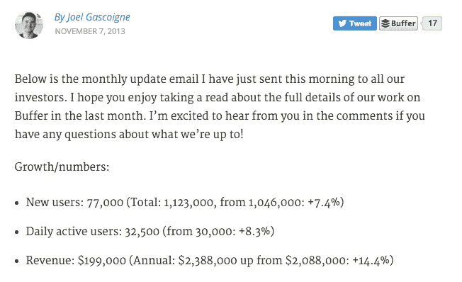
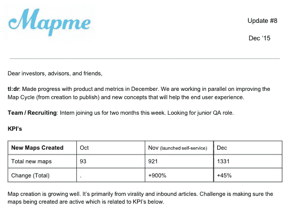

# 公开分享我们最新的投资者动态

> 原文：<https://medium.com/swlh/sharing-our-latest-investor-update-in-public-b1ba046089f8>

我不是管理投资者的专家。到目前为止，我唯一的经历是在我们的种子期之后的几个月里。作为一个早期的创业公司，我一遍又一遍地被告知🔑是让我们的投资者参与进来并获得信息。最简单的方法就是每月更新。

[Buffer’s public investor updates](https://open.buffer.com/category/investor-updates)

我经历了几次 [Mapme](http://www.mapme.com) 的每月更新。以下是目前为止的进展情况:

*   头几个月:在旅途中创建一个，添加部分，删除部分。不是很有效。下面是其中一个[片段](http://i.imgur.com/lLvVvDE.png)。
*   接下来的几个月:[好，坏，丑](http://codingvc.com/investor-update-email-template)。虽然这是自我批评的好方法，但我不认为这是分享有趣信息的好方式。这里有一个这个版本的[片段](http://i.imgur.com/iwovTHE.png)。
*   本月:[布兰登·穆里根](/on-startups/every-seed-stage-founder-should-send-monthly-investor-updates-e4d7380881f4#.hhgyejq0t)的格式。到目前为止，这似乎是最好的，我觉得我能够向投资者传达更多的相关信息。

为了保持“透明度”，让我们的仪表盘[公开](/@benln/dashboard-version-two-8733274fc608#.gaq0u9x21)，开放我们的[面板](/@benln/the-deck-we-used-to-raise-1m-c001eb08f35a#.m2p3msszt)供他人使用，我想发布我们最新的投资者更新。

分享起来很恐怖。可能有敏感的计划、指标和其他你不想让别人知道的事情。但是我想试一试。🎯

下面是我们十二月份的 [**更新**](http://www.scribd.com/doc/294644181/Mapme-Investor-Update-8) 。

[Click here to see](http://www.scribd.com/doc/294644181/Mapme-Investor-Update-8)

在帖子的顶部，我放了一张 Buffer 投资者更新的截图。他们太不可思议了。我最新的帖子 100%受到他们开放文化的启发。

对其他格式有什么建议吗？小贴士？反馈？喜欢听下面的评论。💯

*想聊天？ben@mapme.com/@*[*benln*](http://www.twitter.com/benln)