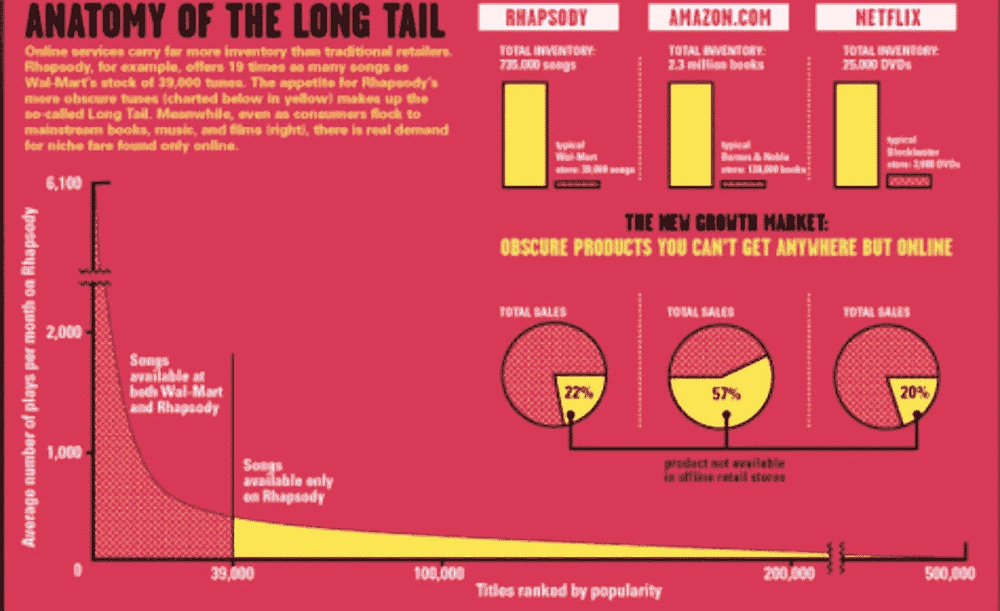
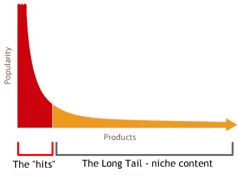
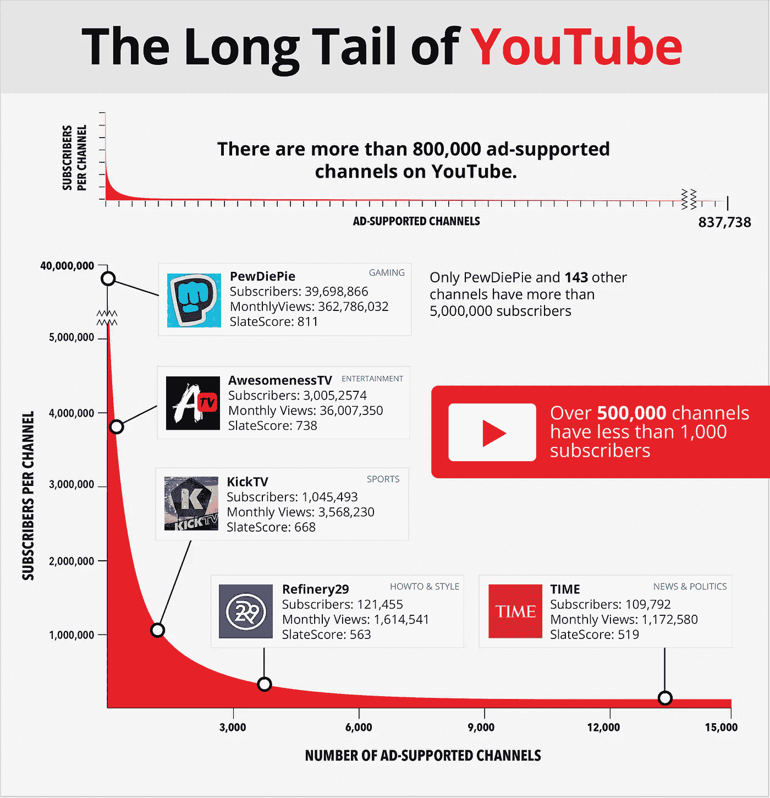

# 与长尾分享爱

> 原文：<https://medium.com/swlh/sharing-the-love-with-the-long-tail-4643a4cf873a>

上周，我讨论了为什么专注于成为刺猬对[未来天才](http://www.futuretalent.com.au)的成功至关重要，现在我想分享第二个关键原因——我们对长尾的爱和对短头的爱一样多。

# 那么什么是长尾呢？

由[克里斯·安德森在 2004 年](https://www.wired.com/2004/10/tail/)广为人知的是，安德森认识到，几十年来，我们消费的产品在很大程度上取决于企业在有限的货架空间上能储存什么。

产品需要既有高需求又有高利润才能维持，对这些产品库存权的竞争非常激烈——想想音乐、电影、书籍、电视节目等，这也为其他业务的进入制造了巨大的障碍。

安德森认识到，互联网正在模糊现实世界和虚拟世界之间的界限，并有能力解开长期以来束缚供应的有限货架空间的约束。

> 热门经济是一个没有足够空间为每个人承载一切的时代的产物。没有足够的货架空间存放所有生产的 CD、DVD 和游戏。没有足够的屏幕来显示所有可用的电影。没有足够的频道来播放所有的电视节目，没有足够的无线电波来播放所有创作的音乐，一天中也没有足够的时间从这些插槽中挤出所有的东西。
> 
> *这就是稀缺的世界。现在，随着在线分销和零售，我们正在进入一个丰富的世界。差异是巨大的。”*

这种戏剧性的转变使在线企业能够以最小的成本提供极其大量和多样的产品，这样他们就能够服务于竞争远不那么激烈的新的利基市场，当作为一个整体进行分析时，使长尾成为一个高利润的市场。

你可以在这里阅读他精彩的变革宣言。

这是一个我们现在认为理所当然的概念，像亚马逊、Itunes 和网飞这样的企业点击一下按钮就给我们提供了数百万本图书，但他们做得如此出色的是认识到，虽然大片可能仍然是消费最多的图书，但它们只占蛋糕的一小部分。

*来源:*[*https://www . openslatedata . com/news/the-long-tail-of-YouTube/*](https://www.openslatedata.com/news/the-long-tail-of-youtube/)

这种向虚拟市场的转变使这些公司不仅能够在价格上竞争，没有实体商店的典型管理费用，而且还能通过提供大量令人无法抗拒的产品来击败竞争对手。

那么，长尾的概念如何应用于一家定制运动卡片公司呢？

虽然这可能不是对这一概念的最真实的解释，但我相信，当观察澳大利亚的体育产业时，这一原则是非常相似的——可能在世界上的大多数地方也是如此。

在澳大利亚，大约有 320 万儿童在课余时间参加有组织的运动或体育活动，这证明我们确实生活在一个高度体育活跃、体育狂热的国家。

有顶级运动，大约 5-10 个代表最大的参与度，最大的观众，大多数企业都在争夺市场份额，然后还有剩余的 160 个运动社区(澳大利亚大约有 170 个)代表高度参与的社区，这些社区经常被忽略，为了讨论的目的，将代表长尾。

下表按参与度列出了最热门的运动，你会立即注意到长尾开始形成的速度，这只是前 20 项运动的概述，所以你可以想象如果它列出了整个 170 项运动会是什么样子。

**那么，你的企业如何探索行业内的长尾效应呢？**

现在，虽然顶级运动代表了未来天才的大多数客户，但它也是所有其他竞争者争夺注意力的地方。

因此，从我们推出的那一刻起，我们就将尽可能多的精力放在确保与长尾群体建立关系上，我们发现这些群体高度参与，关系紧密，他们经常被忽视，但却充满了拥有相同运动梦想的优秀年轻运动员，当我们向他们赠送自己的运动卡时，他们中的许多人都实现了这些梦想。

这将如何改变你的商业模式，或使你能够开拓新的市场，而在此之前你可能认为这些市场太小，在财务上不可行？

当你们思考的时候，我会留给你们一句我喜欢的安德森宣言中的话，留给你们一个简单的问题，你们今天可以问自己。

> ***“人气不再垄断盈利。”***

我完全接受这种心态了吗？

## 这个故事发表在 [The Startup](https://medium.com/swlh) 上，这是 Medium 最大的企业家出版物，拥有 271，476+人。

## 在这里订阅接收[我们的头条新闻](http://growthsupply.com/the-startup-newsletter/)。

