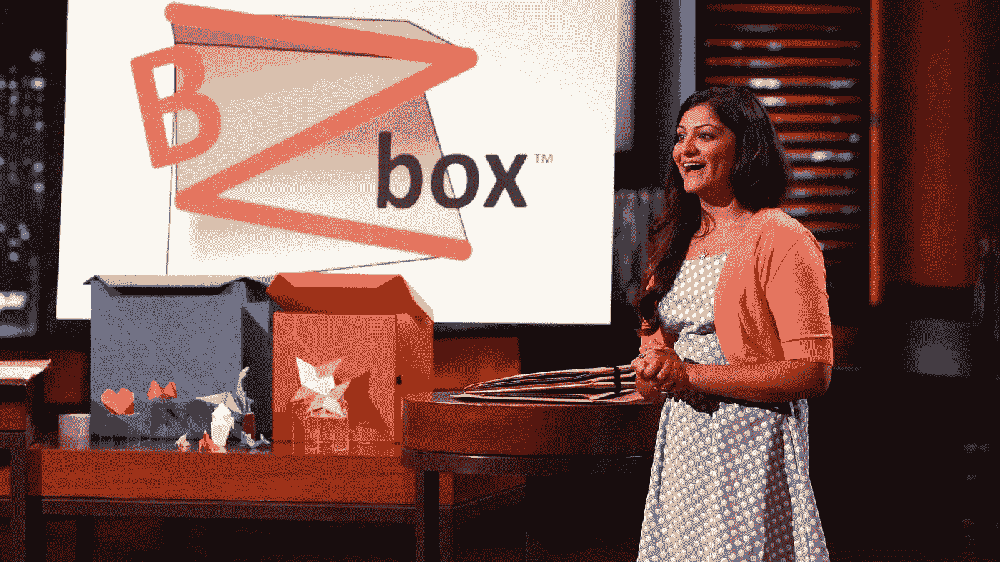
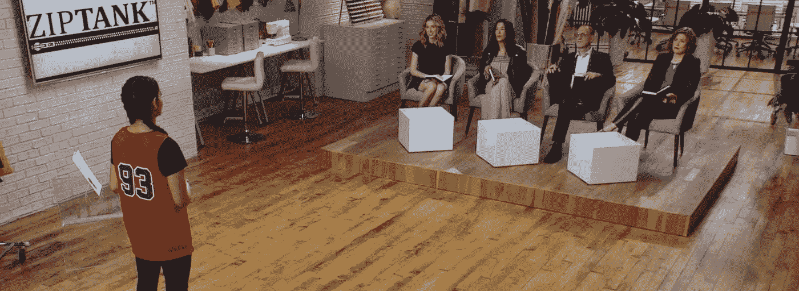
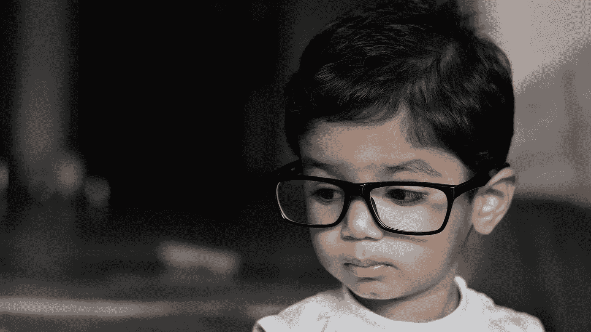

# 鲨鱼池企业家进来寻求投资，却带着工作离开。原因如下…

> 原文：<https://medium.com/swlh/shark-tank-entrepreneur-walks-in-seeking-investment-walks-out-with-job-instead-heres-why-220d31e7c13d>

## 这是一个年轻企业家的故事，她接受了一个投资者的工作邀请，而不是另一个投资者的支票邀请。

19 year old entrepreneur, Kaeya, pitching the Sharks on ABC’s “Shark Tank”

## 企业家

我对建筑产品的热爱始于大学期间，当时我偶然发现了自己的第一次创业。我绊了一下，绊倒了，摔倒在我室友的衣服上，这些衣服刚刚从我从我们宿舍搬到车上的纸板移动箱里掉了出来。她没有用胶带封好她搬家箱子的底部。我一直认为搬进去本身就够痛苦的了，所以盒子真的不应该需要任何额外的胶带或组装工作。

那年夏天，我回家开始研究搬箱子。我了解到组装自由移动箱并不存在，所以我决定尝试设计一个，并去家得宝寻找材料。

> 瞧啊。BZbox 诞生了，这是一个没有麻烦的盒子设计，结合了折纸技术，这样它就可以折叠起来，打开后就可以使用了。

Early BZbox prototype

我制作了更多的原型，并开始在比赛中推销 BZbox，用奖金来支付初始启动成本。然后，我有机会把这些原型带到最终的推介阶段，*鲨鱼坦克，*，尽管我还没有卖出一件。

当时我只有 19 岁，毫无商业头脑，但我还是努力达成了一笔交易。在*鲨鱼池*的那 10 分钟，打开了你无法想象的更多的门，推动我在接下来的三年里疯狂开发微型消费品品牌，销售护肤品、枕头、珠宝、服装等你能想到的东西。

我能够利用战略关系来确保零售分销、新闻报道和名人合作关系，从而推动销售。从一个产品中获得的收入只是制造另一个产品的工具。我没有真正的策略，除了一波又一波的追逐和骑行，但这是令人兴奋的。一天早上，我醒来时看到了一篇[福布斯](https://medium.com/u/3126f7dd42c1?source=post_page-----220d31e7c13d--------------------------------)的文章特写，第二天早上，电视新闻摄制组来到了我的制作工厂，所有这些都推动了爆炸性的销售。

然后我接到了一个新节目《天桥骄子:时尚创业》制作人的电话。制作人邀请我在节目中推介我的一款产品，它旨在成为时尚公司的鲨鱼池。我当时有一个专利服装产品，叫做 ZipTank，一件篮球运动衫，如果你能想象一下，它可以作为一个底部有拉链的袋子。我想，如果这个节目能带来哪怕是《鲨鱼池》带来的一小部分机会，那也是值得的。我不需要说服。我参加了。

制片人通知我，我将向四位经验丰富的时装业高管组成的小组推销，他们将决定是否投资所推销的业务。这些评委是 Birchbox 的首席执行官 Katia Beauchamp、Rebecca Minkoff 的联合创始人 Rebecca Minkoff、Hilldun Corporation 的 Gary Wassner 和 Gwynnie Bee 的首席执行官 Christine Hunsicker。

Kaeya pitching on “Project Runway: Fashion Startup.” Investors from left: Katia, Rebecca, Gary and Christine.

> ***我在*鲨鱼池*的经历告诉我，当试图达成一笔交易时，产品本身不如企业家说服投资者的能力重要。***

在尽职调查的后期，公司的详细信息变得非常重要。所以，这一次，我准备并练习了对每一个可能的反对意见的有力回答，并记住了每一个事实和数字。当我站在评委面前的时候，我自信我能引导这场对话。

经过一些来回，卡蒂亚和丽贝卡退出，缩小到加里和克里斯汀。加里给了我一笔交易。我试图捕捉我周围的克里斯汀的表情，以判断我是否应该接受它。然后不知从哪里，克里斯汀打断了加里的话，并加入了谈话。在那一刻，肾上腺素流过我的全身。我很受鼓舞，想到克莉丝汀要胜过加里，开始为我的这个小产品竞标。

**男孩被我看错了……**

克里斯汀给了我一份工作，这是我绝对没有想到的，房间里的其他人也没有想到。甚至拍摄这一集的摄影师也皱起了眉头。

你知道《疯狗》中的卡通人物燥山姆吗？他被打得满脸通红，当高压锅发出尖锐的汽笛声时，他会从耳朵里喷出蒸汽。

这是当时对我的完美描述，尽管评委们并不知道。我脸上挂着令人信服的扑克脸，但你可以在我的脸颊上吃炒鸡蛋，在我的耳朵附近吃蒸饺。

我气得脸色铁青。

每个人都有自己的*事*。驱动他们、消耗他们的*事物*，区分他们的*事物*，他们身份的核心*事物*。成为一名企业家是我的事情。我日复一日不知疲倦地工作来发展我的公司。我知道投资者总是放弃交易。众所周知，在企业家中，筹集资金是一个漫长而艰难的过程，充满了大量的游说和拒绝。

我能接受拒绝。但是工作邀请呢？那就是 ***解开*。**

克里斯汀是否预见到了我前面的创业列车失事，出于同情，让我绕道而行？但是，我没有像我的对手燥山姆那样激烈地争辩，而是花了一分钟冷静下来思考。当我思绪纷飞时，我想起了脸书的首席运营官·雪莉·桑德伯格说过的一句名言。

> 如果有人在火箭飞船上给你一个座位，那就上吧。

在进入这个项目之前，我做了调查，尽我所能了解这四个投资者的一切，并在知情的情况下进入这个项目。

我不知道如何看待克里斯汀的公司。正如我的朋友兼同事[媒体](https://medium.com/u/504c7870fdb6?source=post_page-----220d31e7c13d--------------------------------)作家[大卫](https://medium.com/u/1b4dbf6ff47c?source=post_page-----220d31e7c13d--------------------------------)所指出的，技术界的每个人都认为他们的公司是一艘火箭飞船。如果他们是对的，我们都会被烟熏死，但是大多数公司都很一般。

我也不知道如何理解这个提议。我已经知道电视交易是如何进行的——以及不进行的。超过 60%的鲨鱼池交易失败。

**但我知道如何理解提供它的人*。***

克里斯汀的创业记录令人震惊。本科毕业后不久，Christine 从 8 号员工一路晋升到 Right Media 的总裁兼首席运营官，这是一家初创公司，2007 年被雅虎以 8 . 5 亿美元收购。然后，她带领另一家创业公司被脸书收购。

现在，克里斯汀正在用 Gwynnie Bee 颠覆时尚界，这是一种订阅服装租赁服务，会员每月支付固定费用，持续租用他们的日常衣柜。《出租跑道》通常被认为是这种模式的先驱，但格温妮·比实际上在《出租跑道》三年前就推出了它。

站在克里斯汀和加里面前，我所能想到的是，克里斯汀从事建造火箭船的工作已经有很长时间了。任何有抱负的企业家都想知道她的蓝图，而她只是给了我一个前排座位。

所以我拿了。

# 员工

此后不久，克里斯汀向我介绍了她的得力助手乔治·戈登伯格，他以前是雅虎的工程副总裁，现在是 Gwynnie Bee 的技术、数据和运营副总裁。乔治花了 30 分钟和我谈论大规模的战略、规划、运营和执行。然后，他和克里斯汀继续讨论他们实现公司下一个里程碑的战略，所有这些对我来说听起来都很陌生，就像他们在说普通话一样。那时候我知道我就在我应该在的地方。

我在虚线上签了名，很快就看到克里斯汀、乔治和克里斯汀的联合创始人 JP 正领导着一个 400 多名员工的团队，他们确实在建造一艘大船，而 Gwynnie Bee 只是其中的一部分。他们从第一天起就在克里斯汀的公寓里开发了这项技术，目的是将其作为一个平台，让其他零售商采用租赁模式并参与共享经济。

这到底会是什么样子？在未来几年，你会看到更多的零售商提供服装租赁项目，比如纽约的[和纽约公司的](http://nyandcompanycloset.com)以及 T2 的【安·泰勒的。这将是 Gwynnie Bee 的技术，他们创造了“ [CaaS](http://caastle.com) ”、**C**lothing**a**S**a**Sservice，在为它们中的每一个提供动力的同时，还能发出安静的嗡嗡声。

换句话说，正如脸书开创了新的社会经济，优步开创了新的交通经济，Airbnb 开创了新的酒店经济，Gwynnie Bee 正在开创新的服装经济，其愿景是在你知道之前，你和你认识的每个人都将租用你衣柜的一部分。

我在 Gwynnie Bee 工作已经快一年了，目前我直接为 George 工作，他是我见过的最聪明的人之一，负责开发新兴技术并将其融入客户体验。

到目前为止，我在这家公司的经历让我大开眼界。克里斯汀和她的团队已经着手完成的事情的重要性，以及她和乔治给我的与他们一起追踪 blaze 的机会是不可思议的。你可能会想，严格来说，克里斯汀没有投资我，我不怪你。她给了我一份工作。我是她的雇员。但是，当我继续探索“格温尼蜜蜂”号火箭飞船的每一个缝隙时，有两件事现在对我来说非常清楚。

# **1。没有蓝图，你无法建造火箭船。**

很容易，实际上太容易了，产生一个想法，制作一个摊位甲板，并陷入筹款狂潮。如今，纸巾创意的百万美元种子轮几乎和麦当劳一样无处不在。为了扩大公司规模，我也陷入其中，但我从未想到，我甚至不知道如何有效地花这笔钱。

现在回想起来，我可以全心全意地证实这种怀疑，因为我没有蓝图。最重要的是，即使我试图召集一个，我也不知道从哪里开始。我的整个生意取决于这样一个前提，即我可以通过电视、名人、有影响力的人和文章特写等媒介让我的产品像病毒一样传播。所有这些在短期内都是有效的。我的产品证明了这一点，但这条道路是不稳定和不可预测的，因此不可扩展。

难怪创业公司的失败率如此天文数字。与乔治一起工作，我变得**如此清晰**，积累了丰富的经验，以至于我想为自己 19 岁时创办第一家公司而自责，尽管它在经济上很有回报。乔治教我知道如何构建蓝图并付诸实施，这是你无法自学的。

这就把我带到了第二课。

# **2。实际上，企业家应该明智地寻找两种类型的投资者，以增加他/她获得长期成功的可能性。**

1.  投资*钱的人。*
2.  投资*时间*的人。

这两者并不相互排斥，理想情况下，投资者两者都提供，但理解其中的区别很重要。

在寻求金融投资时，所有的钱都是绿色的，它可以来自任何人。保护它是一个纯粹的游戏。一次又一次地推销，有人会掏出他们的支票簿。

寻找一个时间投资者，一个导师，要难得多，因为不可能是任何人。你的导师必须比你强 100 倍，因为如果他们只是稍微好一点，他们就会忙着掩饰自己。

因此，如果你足够幸运地遇到克里斯汀或乔治，你将是明智的，抓住他们，即使这意味着暂时用你的“企业家”卡换成“雇员”卡，以了解他们是如何做的。

## 这篇文章发表在 [The Startup](https://medium.com/swlh) 上，这是 Medium 最大的创业刊物，有 313，216+人关注。

## 在此订阅接收[我们的头条新闻](http://growthsupply.com/the-startup-newsletter/)。

