# Shopify 2016 打造商务体验

> 原文：<https://medium.com/swlh/shopify-2016-build-a-business-experience-e07922e1e0ba>

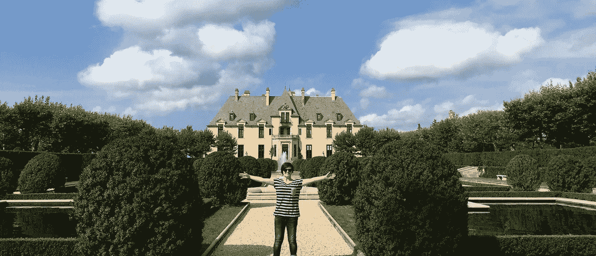

“有时候生活会给你一个机会。这种时刻很少见，你经常毫无准备。但这是提供成长、失败、改变和繁荣机会的时代。这是其中的一个时刻。”— Shopify

[Shopify](http://littlemight.com/recommends/shopify) 对于那些不知道的人来说，是一个电子商务平台，可以让你快速方便地建立一个在线商店。

# 我的 Shopify 之旅

[Shopify](http://littlemight.com/recommends/shopify) 在我从一个 9-5 ' er 到现在的旅程中发挥了巨大的作用。2012 年，我利用电子商务平台推出了[冷静火腿](http://calmtheham.com/)，当时我并没有意识到自己正投身于创业领域。在 2012 年我开了这家店后不久，我了解到了“建立一个企业”竞赛，并报名参赛。

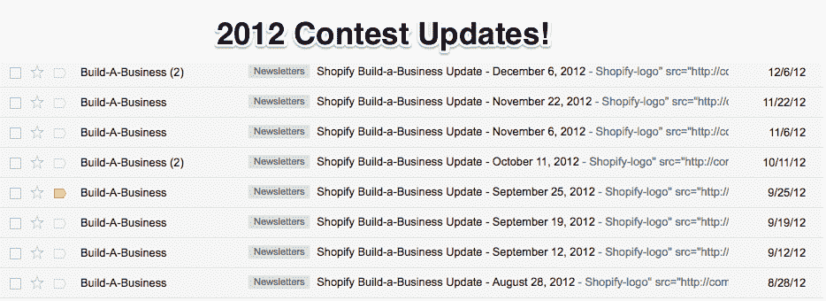

那时候应该是比赛的第二年，可以说我甚至没有接近胜利。然而，作为一个旁观者，我喜欢看到比赛的展开，在导师视频和比赛之间，这甚至在当时都是惊人的。

那家商店最终成为我通往自由的交通工具，并让我在 2014 年辞去了全职工作。

下一次我意识到建立商业竞赛是在 2015 年，当时他们宣布了与 Richard Branson、Daymond John、Tim Ferriss 和 Marie Forleo 在内克岛度过五天的奖励。这看起来很不可思议，我有朋友为了参加比赛而创办了企业，但可惜我当时有太多事情要做，无法加入他们。

快进到一年后，艾伦和我刚刚在 2015 年 9 月 22 日完成了我们为 [SELF Journal](http://bestself.co/products/self-journal) 的 Kickstarter 活动。然后在 2015 年 9 月 23 日，我在收件箱里看到了一封来自 Shopify 的电子邮件，宣布了 2016 年的[比赛](https://www.shopify.com/blog/53937285-announcing-build-a-business-vi-the-ultimate-entrepreneur-experience/?ref=calm-the-ham) …它看起来很壮观。

我知道这是合适的时机。

我是这样想的:

**最好的情况场景**:我们赢了，建立了一个了不起的企业。
**最糟糕的情况**:我们竞争并建立了一个令人敬畏的企业，但是没有赢。

艾伦和我非常专注于比赛，我甚至为我们每个人制作了一张小海报，贴在桌子旁边的墙上，这样我们就能记住它。

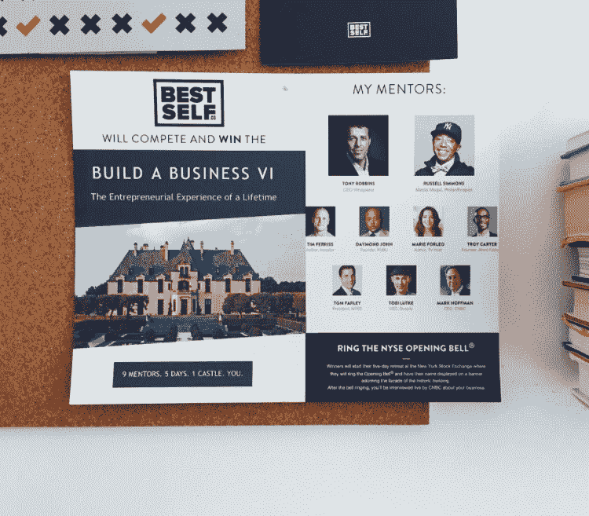

# 比赛的背景故事

这项比赛是作为 Shopify 的一项增长战略发起的，旨在为那些让 T2 一直在考虑开一家店但却从未付诸行动的人提供催化剂。这场比赛是为了让任何人开一家 Shopify 商店，拿出一种产品或服务，并开始销售。

在盖茨比别墅吃晚饭时，我了解了整个竞赛是如何开始的。

一天晚上，鸢·吕特克(Shopify 创始人兼首席执行官)和蒂姆·费里斯(Shopify 早期投资者)在旧金山讨论举办一场比赛来吸引新客户加入该平台的想法。在蒂姆有创造一生一次的体验的想法之前，他们原本就计划好了现金奖励。

为什么？

如果你已经有一家成功的商店，那么金钱就不是真正的激励因素。然而，金钱买不到的体验，比如敲响纽约证券交易所的钟声，或者与理查德·布兰森、托尼·罗宾斯、拉赛尔·西蒙斯·T4 等人会面并共度时光，这绝对是 T5。

这是一段让我们兴奋不已的视频:

从看到这个视频到实际推出我们的商店，我们花了 3 个月的时间。为什么？我们正在等待从制造商那里获得产品，我们有 Kickstarter 支持者要在其他任何人之前完成，最重要的是，我们希望花一些时间建立一个定制商店，与我们希望提供的最佳自我品牌和体验保持一致。

我们使用[自我日志](http://bestself.co/products/self-journal)的框架，通过设定一个目标并将其分解为我们需要做的所有事情来启动商店。

**我们在那里的一些东西:**

*   商店设计和开发
*   设计和制造的产品包装
*   创建交通和营销计划
*   全球履约中心成立

**我们于 2016 年 1 月 1 日开业。**

与我的第一家 [Shopify](http://littlemight.com/shopify) 商店不同，我们做的每一件事都非常谨慎，以指标为导向，以确保商店的日常成功。首先，我们创建了一个每日仪表盘，每天早上都可以查看我们的统计数据:

*   销货收入
*   售出的产品
*   转化率*(我们的目标是保持在 3.25%以上)*
*   每个获得客户的成本
*   总广告支出

# 158 天后…

6 月 7 日，我们接到来自 Shopify 的首席运营官哈利·芬克尔斯坦的电话，宣布我们被选中参加人民选择奖的角逐。这个奖项是一个新的类别，是为那些与其他获奖者相比刚刚错过最高销售收入，但将在投票中与同类其他人竞争的企业设立的。

由于我们面临着一些相当激烈的竞争，艾伦和我在接下来的 5 天里试图获得尽可能多的选票。由于投票是盲目的，我们不知道***我们是如何做的*，所以我们只是不停地催促。**

****成功了——我们赢了。****

**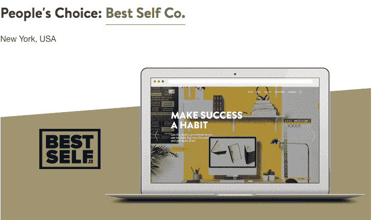**

# **一生的创业经历**

***(他们没有开玩笑)***

**行程安排:**

**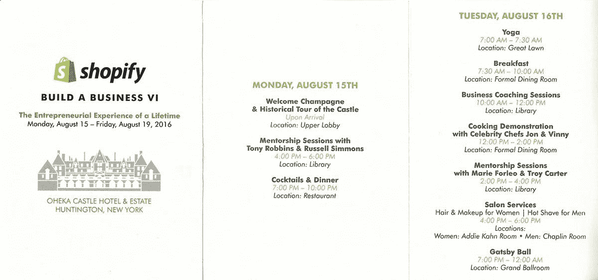****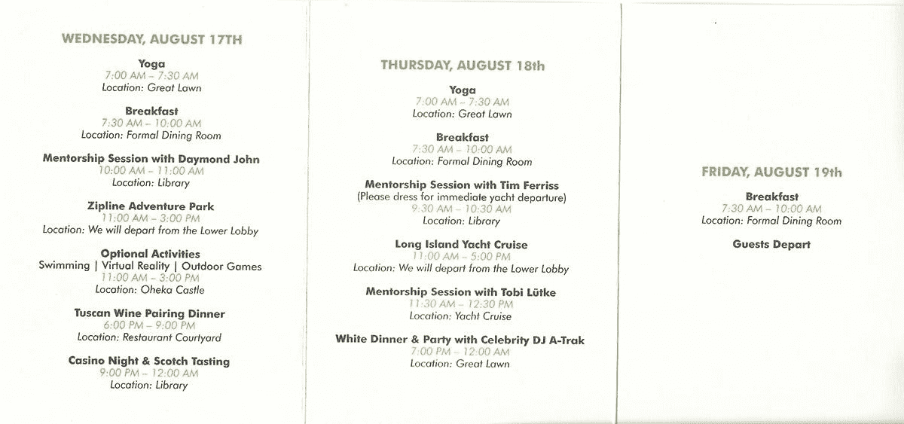**

# **个人亮点:**

**整个一周的活动让人肾上腺素飙升，Shopify 不断推出越来越多令人难以置信的活动，给我们带来惊喜。到了周末，我觉得整个比赛是某种精心策划的招聘计划，因为我在想*“哇，我愿意为 Shopify 工作”* …真实的故事。**

**尽管整整一周都令人惊叹，但还是有一些个人时刻(排名不分先后)让我印象深刻，原因如下:**

# **1.敲响纽约证券交易所的钟声:**

**我想到我在网上或网下做的任何与创业有关的事情，这是我可以告诉父母的第一件事，不需要向他们解释其意义。这很酷，我想他们甚至看了直播。**

**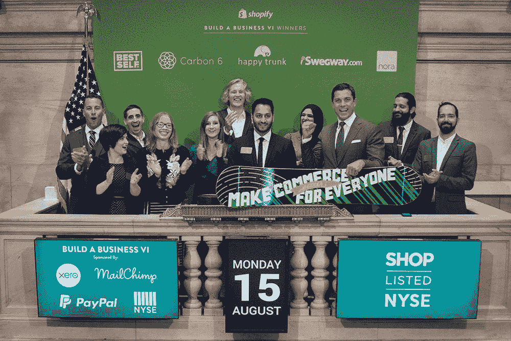****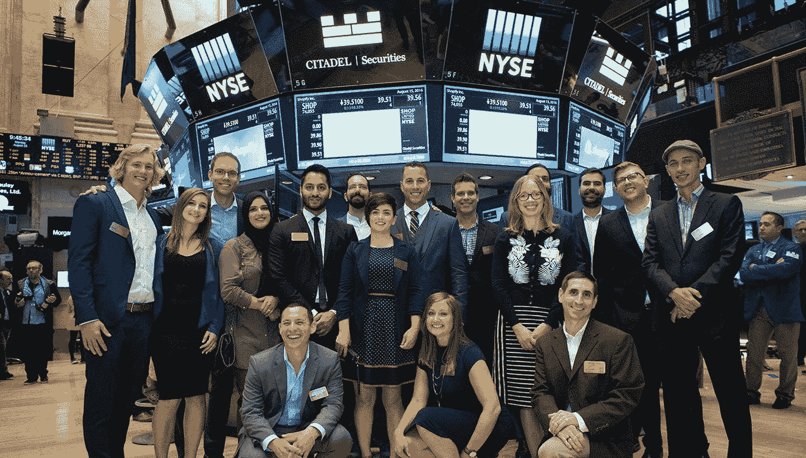**

# **2.我们在纽约证券交易所的标志**

**当我在金融区从事建筑工作时，经常路过这座建筑。我当时做梦也没想到会看到这样的事情发生。**

**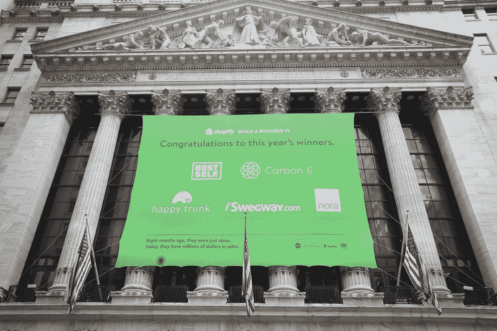**

# **3.和戴蒙德·约翰一起玩大富翁**

**“大富翁”是我以前每年夏天都会和我的兄弟和朋友一起玩的游戏，有时游戏会持续几天。我很好胜，但在玩这个游戏的时候，我知道了戴蒙德“鲨鱼”这个名字的由来。**

**这场比赛持续了 6 个多小时。**

**我很自豪地说，这是我和他的对决，但不幸的是，在凌晨 2 点，我降落在他的木板路上，我的帝国崩溃了。**

**在下面的图片中，请注意这是 Daymond 的个人 3000 美元的大富翁板，它是皮革的，绝对重一吨。他的保镖格林是我们的银行家，他是最好的。**

**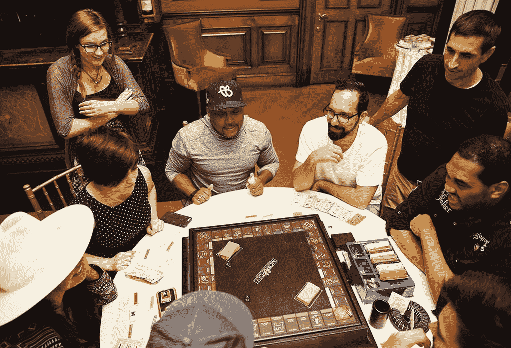**

**自从在那次活动中遇到戴蒙德后，他就开始支持《自我》杂志，并与我们合作向他的观众提供这份杂志。**

# **4.会见托尼·罗宾斯**

**在过去的一年里，我参加了托尼·罗宾斯的几个研讨会，能够与他本人见面并交谈是一种荣誉。**

**作为额外的奖励，所有的获奖者都被邀请作为嘉宾参加 2017 年 1 月托尼·罗宾斯的《商业掌握》。尽管去年已经去过一次(我在这里写了我的经历)，但我非常兴奋能够再次去，这样我就可以回顾我所学到的一切，并重新应用它们，现在我们已经正常运行了。我也很高兴能和其他优秀的获奖者一起出去玩。**

**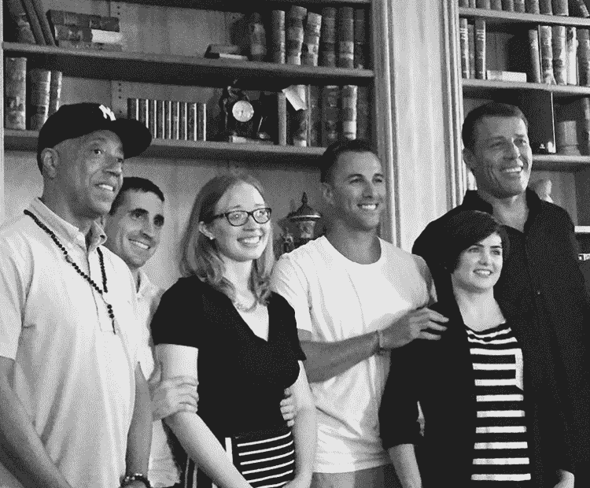**

**拉赛尔·西蒙斯也令人难以置信，非常冷静和冷静。这是他说过的最好的话之一(转述):**

> **“你一生只有一个座位。不管你有多少钱，你一次只能坐在一个座位上。享受舒适和快乐的生活" *—拉赛尔·西蒙斯***

**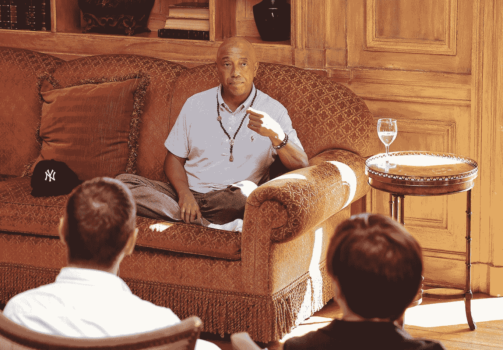**

# **5.蒂姆·费里斯和玛丽·弗里奥的头脑风暴**

**蒂姆·费里斯正在**的深处写他的新书** [**泰坦们的工具**](http://amzn.to/2fhbwmI) **(刚刚发布！当我们在大厦的时候，他和我们的谈话从播客和他自己的经历中吸取了许多知识，并与我们分享。****

**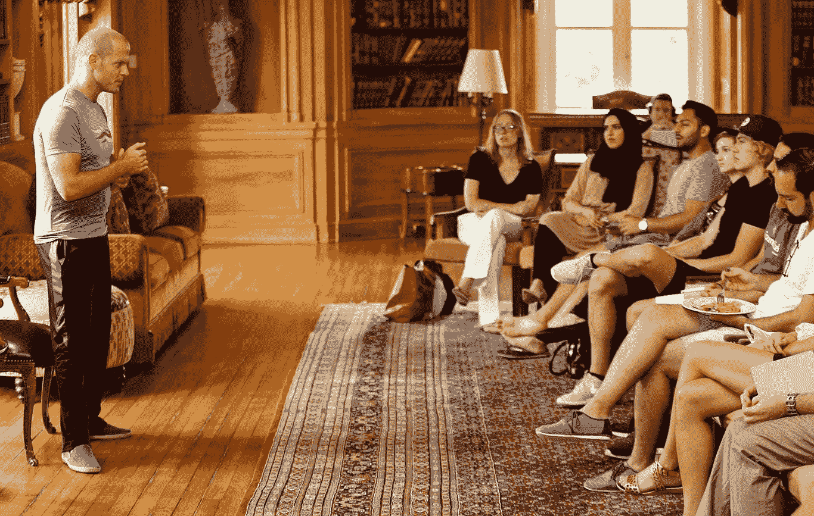**

**我们和他进行了一对一的会谈，还进行了小组问答。**

***我的问题:***

**原来他已经和托尼·罗宾斯一起获得了解决全世界文盲问题的 X 奖。太不可思议了，我不知道他也参与了。可以在这里了解更多 X 奖[。](http://learning.xprize.org/)**

**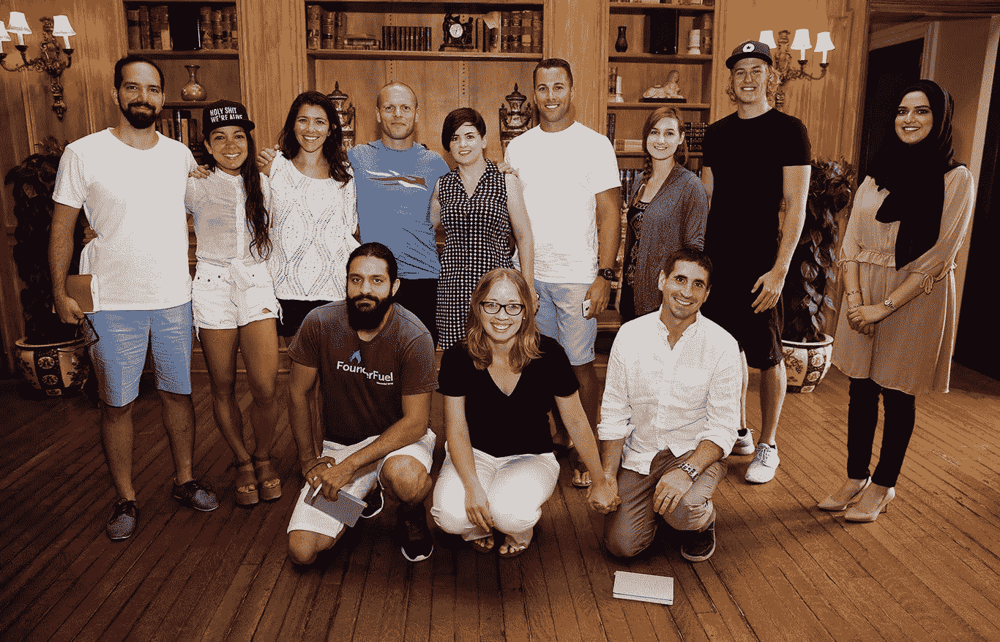**

**玛丽·弗里奥在城堡里呆了几天，她是你见过的最真诚、最可爱的人之一。第一天，我们与她共进了晚餐，她不仅对每家公司进行了调查，以了解我们更多的情况，而且还带着好主意来找我们。**

**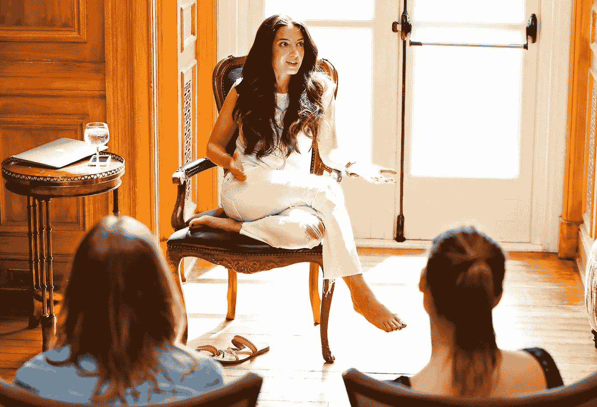**

**下个月我们将为《自我》杂志发行一个新版本，这直接是因为我们和玛丽在晚餐时的讨论。**

# **6.会见其他获奖者**

**老实说，在那次旅行之前，我并没有想过要和其他获奖者一起出去玩，主要是因为最吸引人的是导师和名人。然而，会见其他获奖者并成为朋友是整个活动中我最喜欢的方面之一。我们都一起经历了肾上腺素激增，我们都在我们的业务相似的点上，我们都在这一周内结合在一起。**

**没有墙或虚假的借口，每个人都乐于分享。事实上，在昨晚的聚会后，有一个凌晨 2 点的策划，每个人都在分享广告支出、谷歌广告词、电子邮件渠道的所有细节。哪些有效，哪些无效。**

**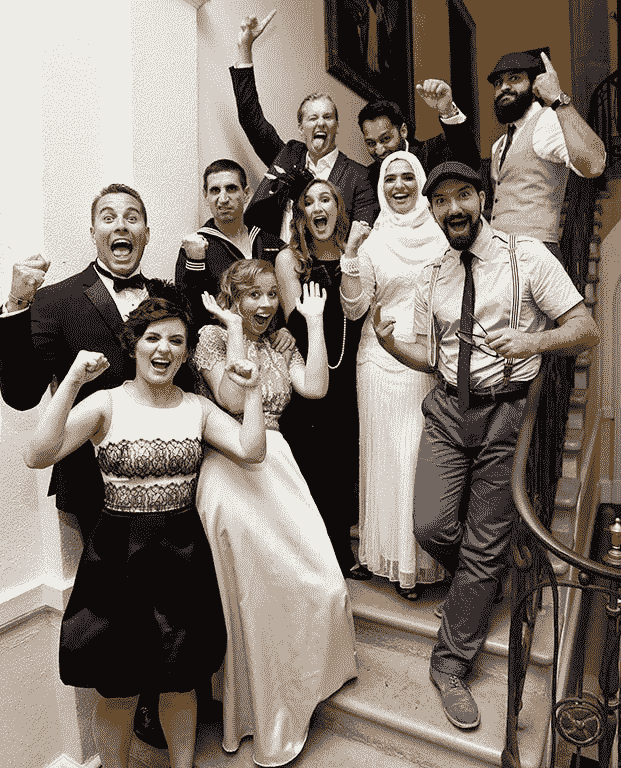**

# **快乐皮箱服饰**

**快乐行李箱(Happy Trunk)是一家波西米亚风格的珠宝店，由艾米丽·威尔福德(Emily Wilford)和乔恩·韦德(Jon Wed)夫妇经营。事实证明，在离开学校并学习这门手艺后，乔恩是脸书广告公司的绝对奇才。他经营着 6 家 Shopify 商店。！)的收入规模相似，但碰巧赢得比赛的是**有故事的商店**。**

**在泰国旅行了 3 个月，并与 Emily 喜欢的大象相处了一段时间后，他们开设了这家商店，并将部分收入捐给了泰国清迈的自然公园。**

**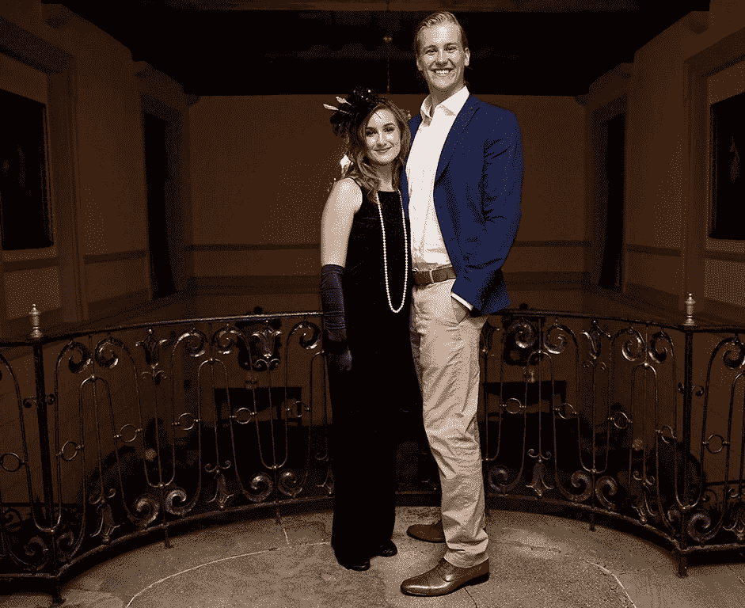**

# **碳 6**

**碳六环乐队(Carbon 6 Rings)由夫妻二人组克莱尔和约翰组成，他们是我见过的最甜蜜的一对，在商业上也非常般配。约翰是一个彻头彻尾的产品人和制造者，你可以从一英里外就看出他对产品的热情。我们会坐在一起吃早餐，他会描述这个过程的每一个部分，以及随着时间的推移他是如何磨练它的。**

**克莱尔负责商业方面的事情，完全被吸引住了，尤其是在问答环节。事实上，在 Tony Robbins 谈论业务和了解你所在的行业时，他要求我们描述我们的理想客户。**

*****保罗:*** *我们的客户是……{随便他怎么说}*
***克莱尔:*** *不，那是我们目前的客户，不是我们的理想客户。我们的理想客户是…* ***托尼:*** 是的，她找到了！**

**如果你认识要结婚的人，我会强烈推荐你看看这些戒指。**

**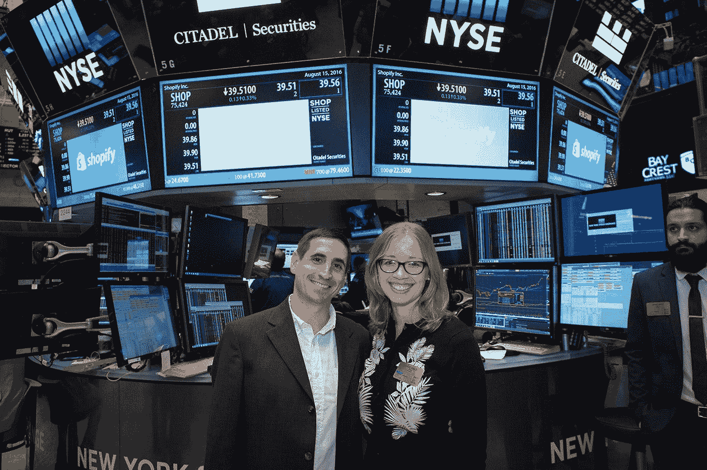**

# **Honora**

**诺拉于 2015 年在 Kickstarter 上推出，并为他们的智能打鼾解决方案筹集了高达 832，523 美元的资金。这项技术是他们的父亲阿里发明的，他们的儿子贝鲁兹和贝扎德和他一起将这项技术应用到生活中。贝鲁兹和贝扎德和我们一起来到城堡，他们是非常有趣的人，**

**如果你认识任何有打鼾问题的人，亲自看过之后，你会发现他们的设备非常不可思议。**

**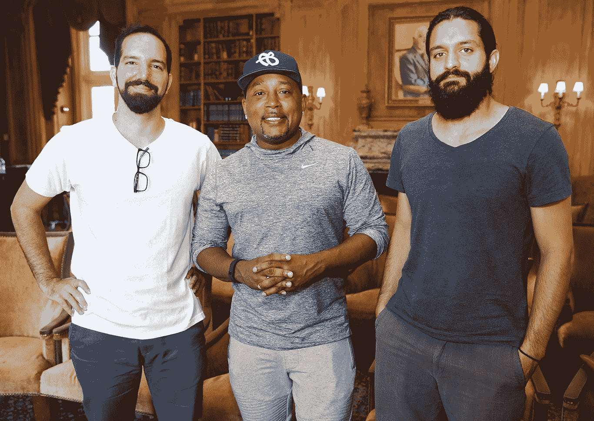**

# **iSwegway**

**还记得新闻里关于悬浮滑板爆炸的故事吗？**

**它们仍然不允许上飞机，甚至在去年圣诞节前就已经下架了。我们大多数人可能听说过，但除了把它从我们的圣诞清单上划掉之外，并没有多想。然而，一位有抱负的英国企业家 Asad 看到了同样的故事，并决定找到一种方法来制造不会爆炸的安全悬浮滑板。**

**在与一家制造商合作，仔细研究安全规范和细节后，他想出了办法。iSwegway 在黑色星期五前一两天发布，仅在 Google Adwords 上发布，在黑色星期五**的销售额超过 80 万美元** …疯狂。阿萨德和他的妻子法伊扎一起来的，法伊扎描述了她在几个月内很少见到他，因为他在公司工作，她将负责公司的客户服务，同时还做全职工作。**

**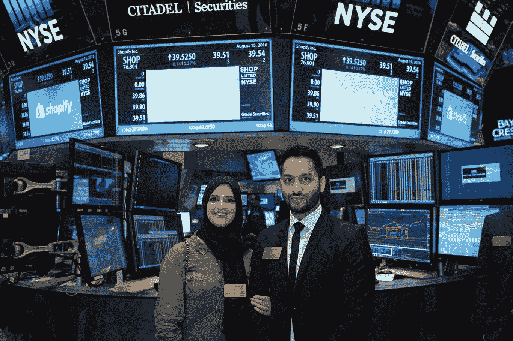**

# **赢家外卖**

****我从获胜者身上学到的一些共性:****

*   ****众筹活动推出的 5 个 Shopify 获奖者中有 3 个。**我们验证了人们在创造产品之前确实想要它。我在我的博客[这里](http://littlemight.com)分享更多关于众筹的内容。**
*   ****获奖产品解决问题**
    无论是和诺拉一起打呼噜，还是创造不爆炸的悬浮滑板。你用产品或服务解决的问题越棘手，你就越成功。**
*   **在你准备好之前开始在伊斯韦格威开始之前，有一个人在他的起居室里想出了一个主意。尽管之前从未销售过悬浮滑板，他还是推出了这款产品，并竭尽全力将其转化为成功。**
*   ****弄清楚什么对你有用，然后双倍下注**
    对于 Happy Trunk，他选择了 facebook 广告，对于 iSwegway，他选择了 Google Adwords，而没有使用脸书。弄清楚什么对你的市场和你的目标客户有效，然后加倍下注。在转到下一个频道之前拥有一个频道。**
*   **选择一个有互补技能的伙伴
    如果你是营销人员，那就找一个产品人员。如果你是一个产品人员，找一个像克莱尔和约翰那样能管理业务的人。**

**我们体验的有趣视频:**

****对建立商业竞争感兴趣？他们已经开放了明年的候选名单，如果你有兴趣，请到这里来。****

**感谢 Shopify 团队:Courtney Symons、Roberto Faria、Lauren Brown、Harley Finkelstein、Craig Miller 和鸢·吕特克让这次体验如此不可思议。**

**更大的道具给他们这个可怕的滑雪板(有史以来最酷的奖杯！)为什么是滑雪板？Shopify 的创始人兼首席执行官鸢·卢特克在决定将重点转向电子商务之前，曾拥有一家滑雪板公司，因此这是对电子商务的回调。**

**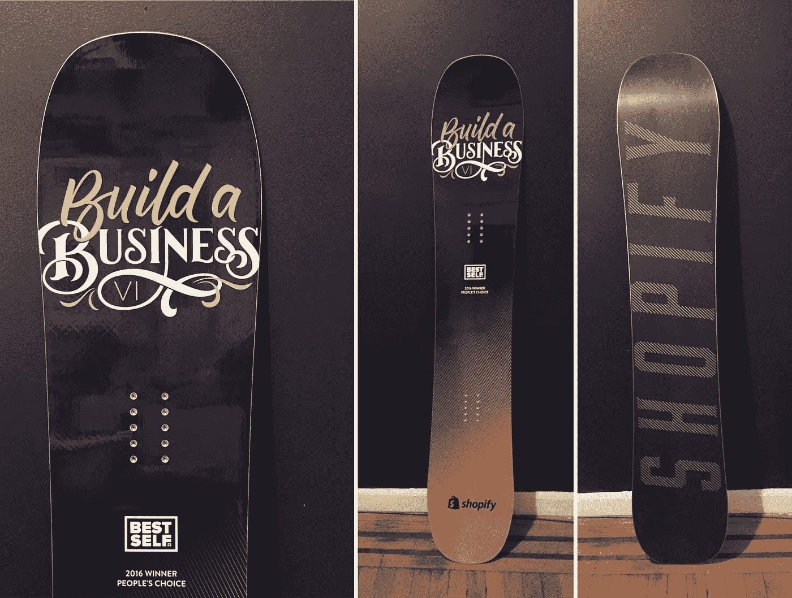**

**我希望你喜欢这次经历回顾，再次回忆起来很有趣。请在下面留言，让我知道我是否遗漏了什么，或者您是否有任何问题🙂**

***最初发表于*[*【www.littlemight.com】*](http://www.littlemight.com/shopify-2016-build-a-business-experience/)*。***