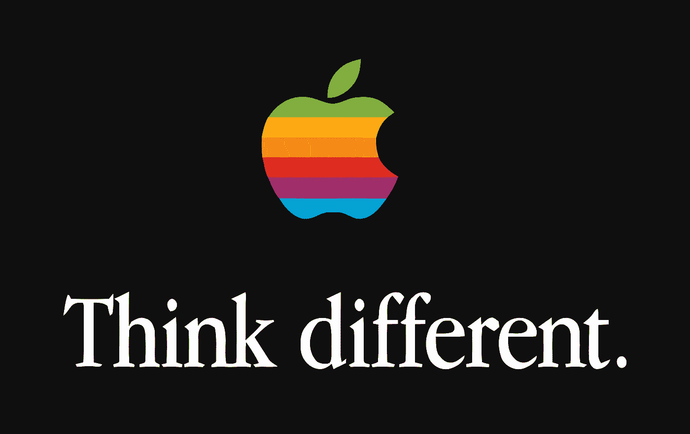
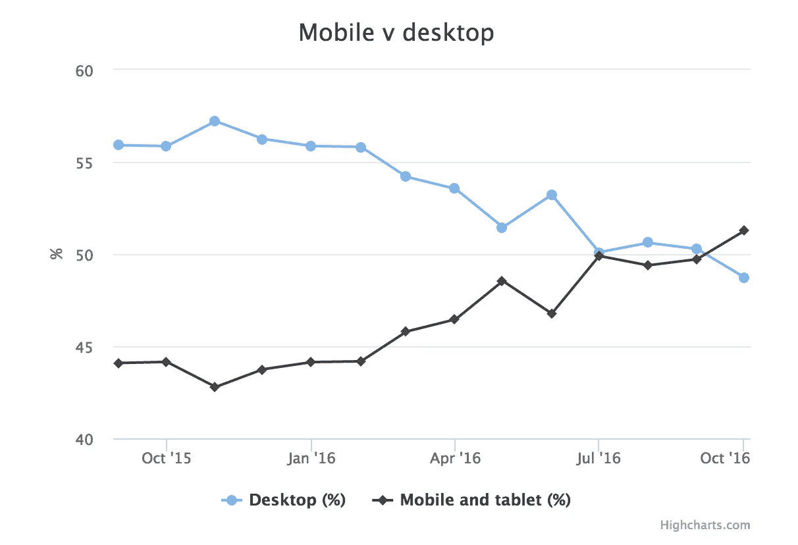
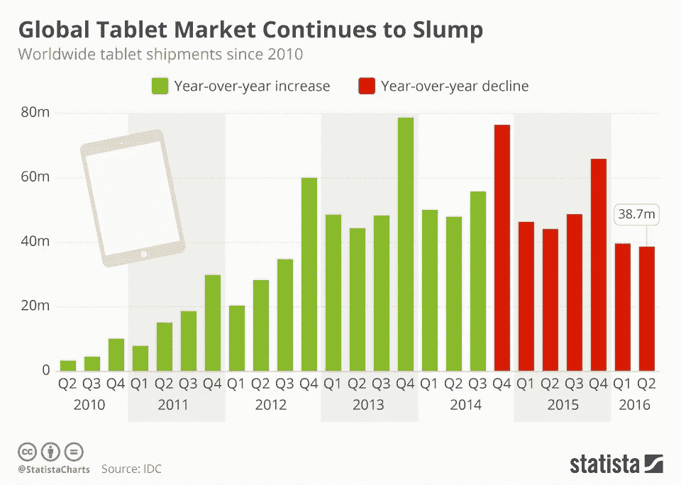
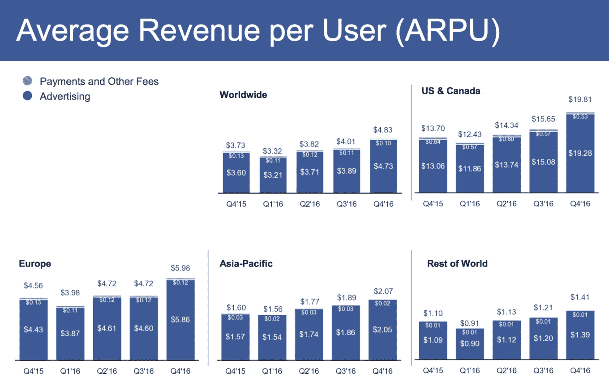
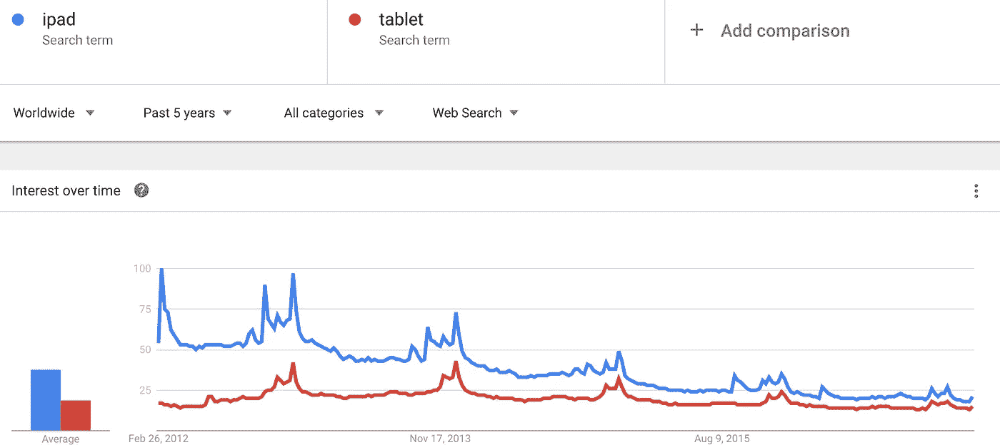
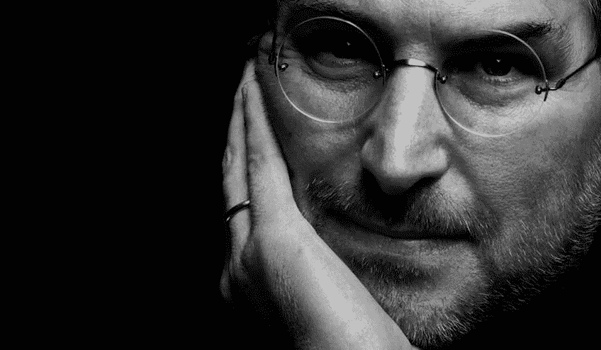

# 谷歌应该依靠苹果重新发明 iPad 吗？

> 原文：<https://medium.com/swlh/should-google-be-relying-on-apple-to-reinvent-the-ipad-4bbdeb1c81d2>

我们都知道，通过移动设备浏览网页现在是一种常态，去年已经超过了桌面浏览。但是那条新闻已经过去了。

相反，我想看看被遗忘的设备——平板电脑，以及谷歌和苹果正在做些什么来挽救这款设备，使其免于过早死亡。

平板电脑从未完全取代台式机，也绝对没有取代移动设备，然而大多数设备/浏览器测量网站将移动设备和平板电脑的使用归为一类，因此很难看到通过平板电脑使用网络的人的比例。

Even the [laggards](http://www.techradar.com/reviews/new-nokia-3310-2017-review) are going to start and get online via mobile in some shape or form soon, so this gap will only grow further

我认为这些设备的分组造成了一些混乱。

德勤在其 2017 年技术预测中暗示平板电脑泡沫已经破裂，称全球将售出不到 1.65 亿台平板电脑，比 2016 年下降 10%。随着手机越来越大，台式机越来越小，我们正在挤压平板电脑曾经占据的空间，我们宁愿使用平板电脑或标准手机来执行类似的任务。

这得到了我最近阅读的谷歌行业报告的支持，该报告反映了 2015 年第四季度与 2016 年第四季度相比的同比查询增长下降。

*移动+27%*

*桌面+1%*

*平板电脑-9%*

Statista 也显示了类似的结果，这只是雪上加霜。

# 为什么谷歌和 Alphabet 会关心这个？

谷歌拥有最受欢迎的网络浏览器 Chrome，占据了 75%的市场份额。除此之外，他们还拥有最受欢迎的移动操作系统——Android，82%的美国人都在使用它。

Chrome 和 Android 完全主导了各自的市场，我们知道这一点。谷歌通过其提供的让用户进入其搜索引擎的软件拥有桌面和移动市场。但是平板电脑(或硬件)市场并不是他们曾经领导过的。

这就是问题所在。平板电脑市场缺乏独创性可能推动了手机市场的增长。但是 90%的移动时间花在应用程序上，这在某种程度上超出了谷歌最传统和最赚钱的广告领域。即移动用户不太可能通过 SERPs 点击广告。

# 使用移动设备时，90%的时间都在应用程序中。使用脸书有很多时间，不需要谷歌的服务。

手机使用量的增长和脸书广告收入的增长之间也有一个明显的模式，这只会影响谷歌非常丰厚的银行账户。

Facebook ARPU

平板电脑是苹果的代名词；史蒂夫·乔布斯的同义词。尽管平板电脑的使用明显下降，但消费者仍然会搜索苹果产品，而不是通用术语，如下图所示。

苹果打破了古老格言的规则——“要么成为第一个 T1，要么成为最好的 T3，要么成为 T2”，因为在这种情况下，他们都不是市场领导者。

*【第一个】*是比尔·盖茨，他在 2000 年发明了第一台平板电脑，乔布斯直到十年后才发布他的版本。但这并没有阻止[商业内幕](http://www.businessinsider.com/heres-visual-proof-of-just-how-badly-microsoft-blew-it-with-tablets-2013-5)的陈述——

> *苹果的 iPad 是一款革命性的产品，它正在给个人电脑行业带来巨大冲击。*

对领先于产品的行业进行抨击，是对“*最佳*”的一次重大投票。

然而，最好的并不总是意味着最受欢迎，当你看实体平板电脑销售时就是这样。相比苹果只在他们的硬件中使用自己的软件，Android 通过多个使用谷歌软件的硬件制造商在这里占据主导地位。很明显，Android 强烈依赖于许多其他制造商将其软件推向大众市场。

[iPad 有一个非常直观的用户界面](https://www.wsj.com/articles/SB10001424052748703916004576271210109389154)，这显然是基于非常成功的 iPhone。但是苹果没有进一步发展这一点。

他们发布了普通大众已经购买的原始 iPad 的迭代版本，但老实说，他们重新发布了同样的旧型号，配备了新的 retina 显示屏和更新的 iOS。谁在乎呢。

# iPad 的创新从推出的那一天就停止了

来自[科技雷达](http://www.techradar.com/reviews/new-ipad)对苹果最新发布的评论称-

> *新 iPad 可能不是苹果有史以来最创新的产品*

苹果的精神是“与众不同”，但他们的平板电脑创新在 2010 年 4 月 3 日首次发布的那一天就停止了。

快进到 2017 年，平板电脑的销量出现了众所周知的下滑。因此，这让你想知道为什么苹果发布了 550 英镑的 iPad Pro，表明远离大众市场。最初的 iPad 售价约为 399 英镑，这是完美的植入式广告(我知道今天你可以以类似的价格买到低价版，但当一款高端产品过去售价类似时，谁会想要低价呢？)

550 英镑花在创造力的暂停上是一大笔钱。

# 苹果已经阻止了消费者对平板电脑的兴奋。

当苹果以其通常的高价发布 iPad 时，它会渗透到市场，直到你接触到低端制造商，他们创造了一个在谷歌 Android 操作系统上运行的类似模型。因此，那些买不起 iPad 的客户可以从另一家制造商那里购买经济型产品。但是，当创新者和采纳者没有从行业中的佼佼者(苹果公司)那里获得任何新鲜和令人兴奋的东西时，“早期多数”市场中的低消费群体不会有兴趣以更低的价格购买 android 平板电脑。

# 这将把平板电脑放在哪里？

苹果处于可以控制平板电脑市场的地位。如果他们不创新(事实上他们没有)，那么整个购买市场将最终失去兴趣。

只有一家公司可以成为第一，但成为第一应该是一个不断进化的过程。作为世界上最富有的公司，谷歌是独一无二的，因为它是少数几家有能力创造一些东西来让消费者重新对市场感兴趣的公司之一，当然，让人们远离他们的移动设备/脸书，回到 SERPs 和 Adwords 上，对他们最有利？

*原载于 2017 年 4 月 18 日*[*【www.venndigital.co.uk】*](https://www.venndigital.co.uk/blog/should-google-be-relying-on-apple-to-reinvent-theipad-81153/)*。*