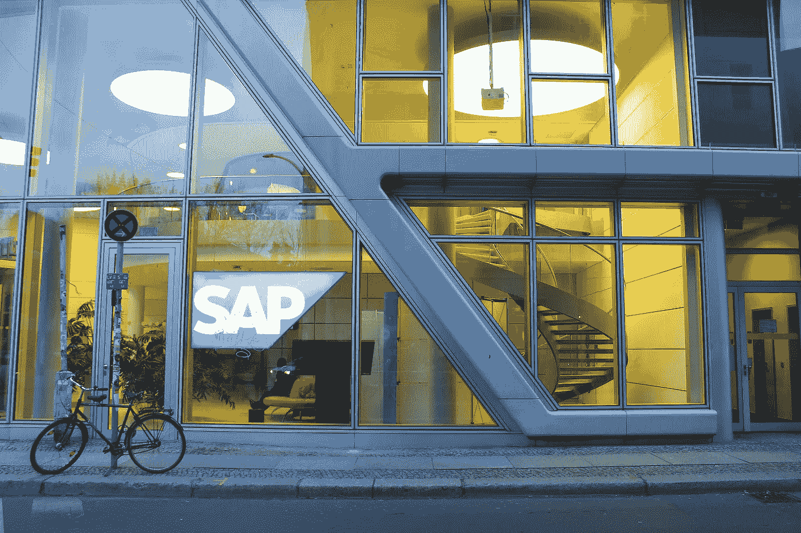
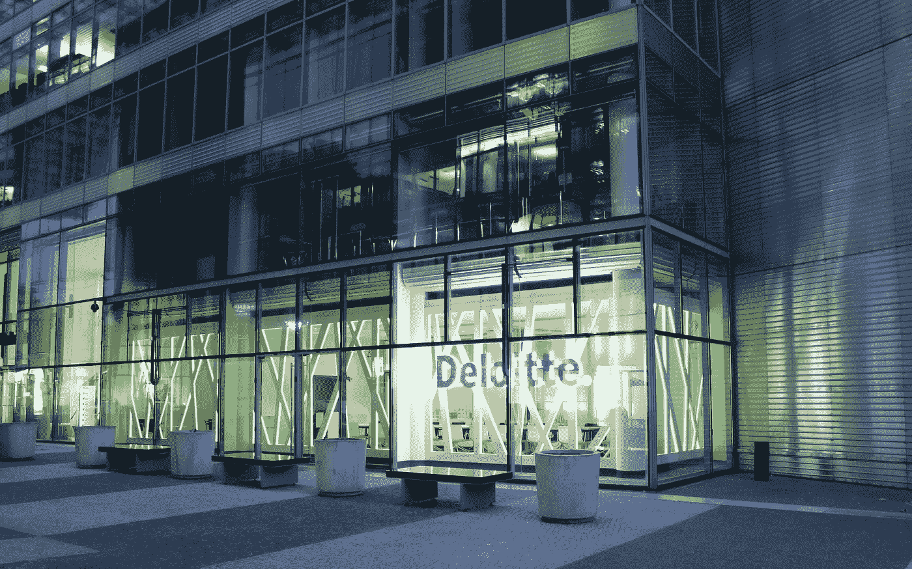
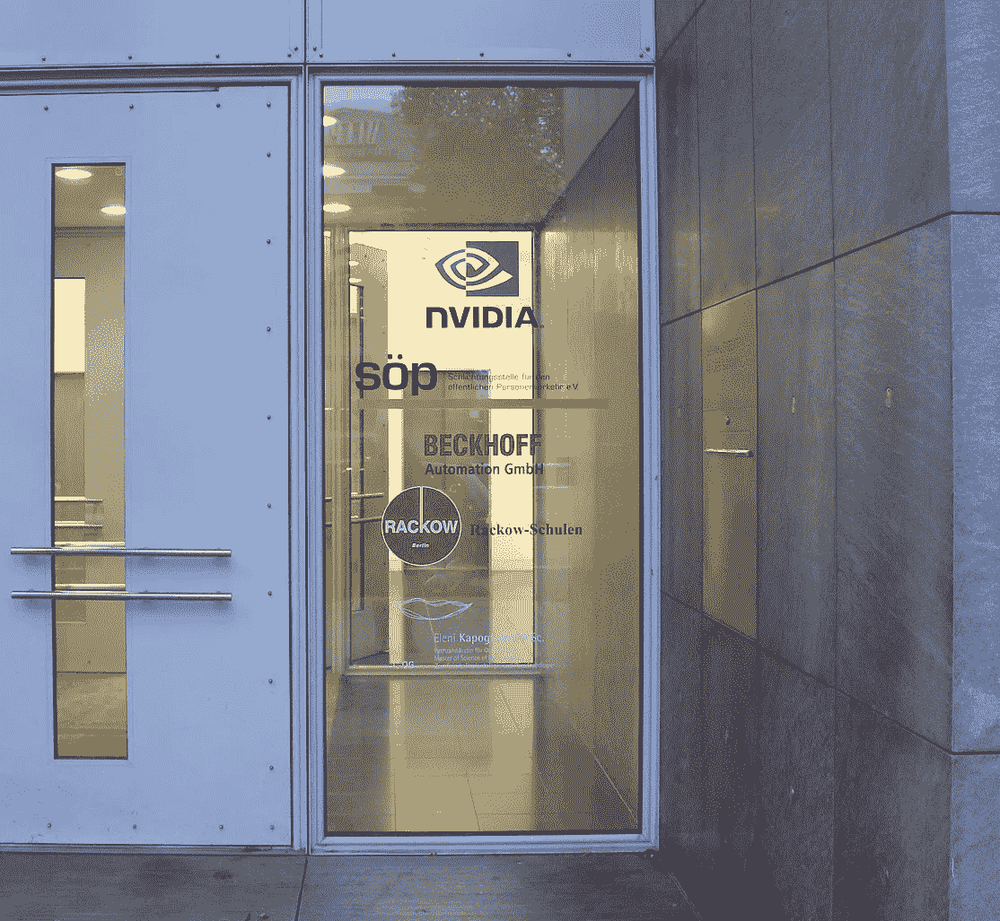
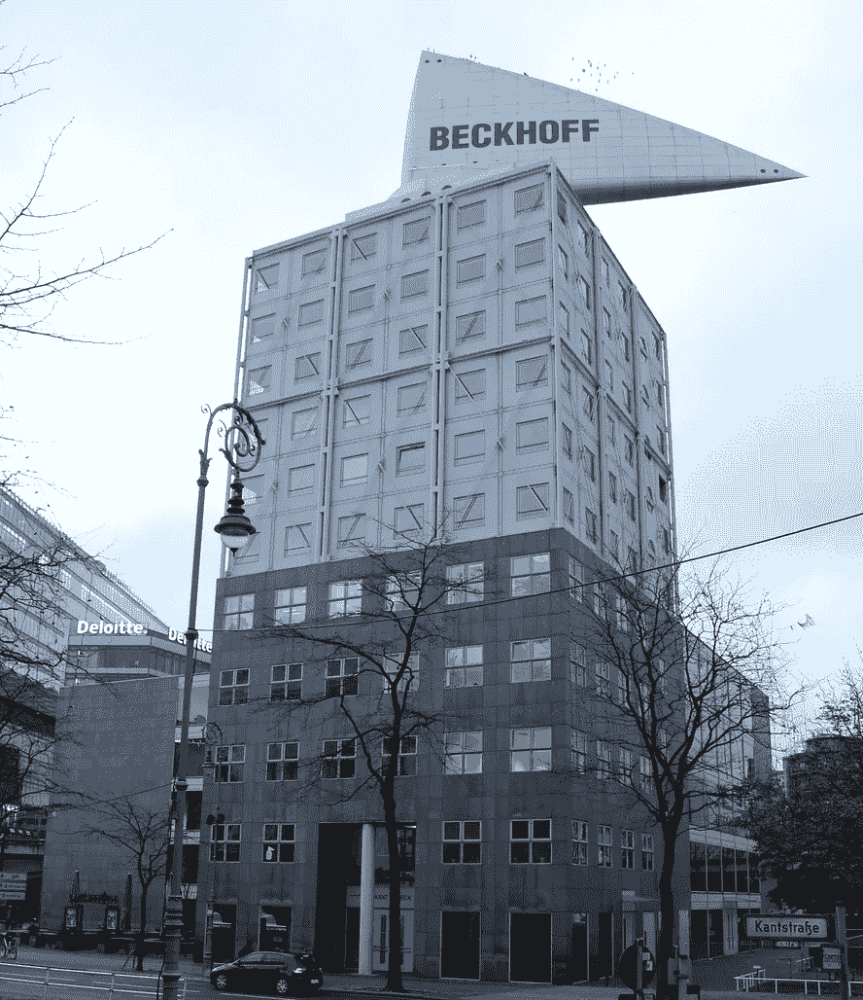
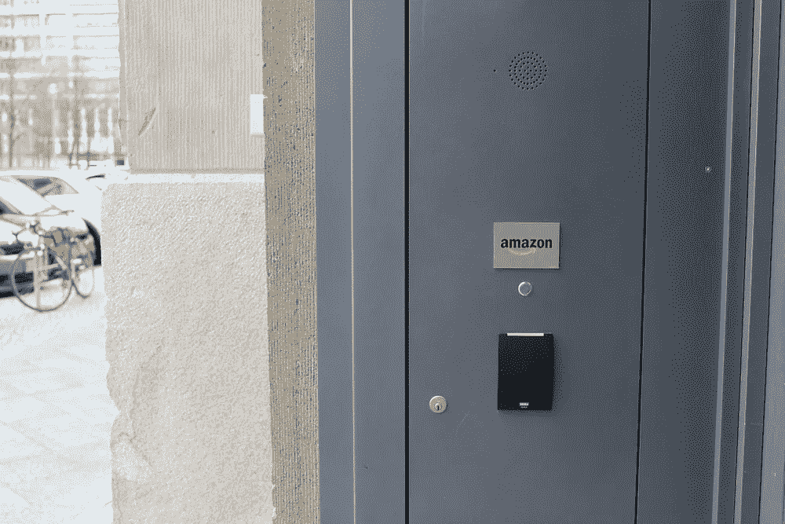
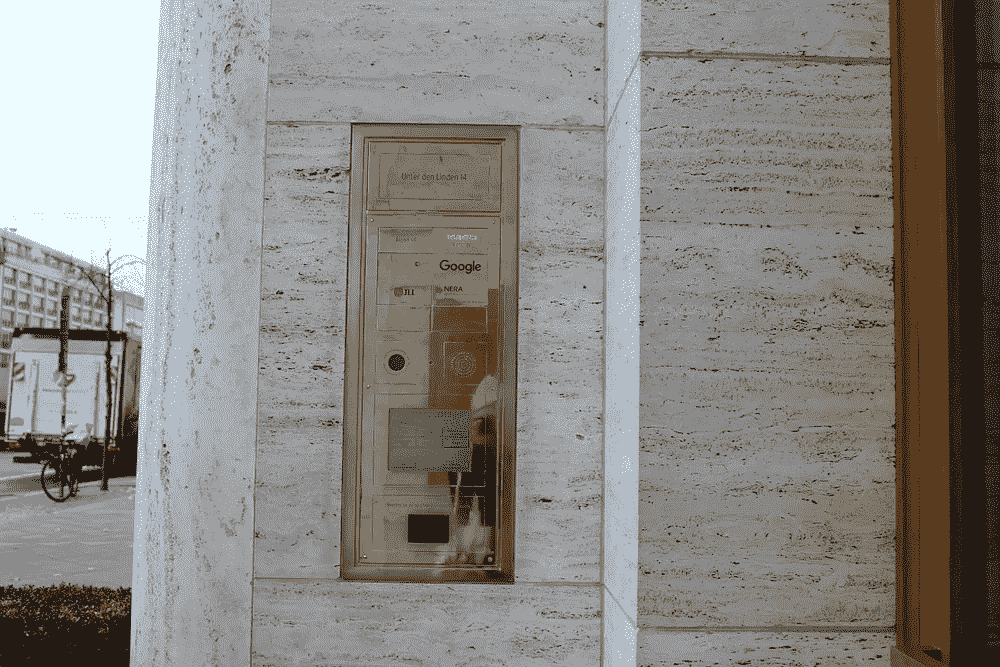

# 谷歌，你应该看到这些迹象

> 原文：<https://medium.com/swlh/should-have-seen-the-signs-google-1a09aaeee58b>

# 在摸索柏林创业园区之前，谷歌应该留意的公司。

柏林——看起来像是一个以谷歌为代价的黑色玩笑，结果却是柏林市官员的真实提议——位于史塔西总部的谷歌创业园区。对一些人来说，东德秘密警察采用的监视策略令人毛骨悚然地想起了谷歌的个人数据收集工具。对另一些人来说，谷歌在柏林东部的 Lichtenberg 区的办公室仅仅意味着一个更好的形象和在该地区更大的投资。

自 2016 年 11 月谷歌首次宣布未来的柏林创业园区以来，该公司和柏林当地人一直存在分歧，这令人惊讶，因为根据市议员 Birgit Monteiro 的说法，谷歌在柏林开设办事处符合[的普遍利益](http://www.abendblatt-berlin.de/2018/11/11/suchmaschine-fuer-den-stasi-campus/)。谷歌最初提议在柏林的时尚中心区 Kreuzberg 建立一个 32，000 平方英尺的园区，遭到了激烈的反对。谷歌在圣保罗、马德里、伦敦、首尔、特拉维夫和华沙建立了六个类似的创业园区，都是在没有当地阻力的情况下引入的。

# **谷歌做错了什么？**

在柏林选址时，谷歌没有考虑到德国与大公司的长期关系。*纽约时报*在 2014 年发表了一篇题为[“为什么德国人害怕谷歌”](https://www.nytimes.com/2014/10/11/opinion/sunday/why-germans-are-afraid-of-google.html)的文章。没错，2014 年。文章认为，德国并不像一些“德国焦虑”的刻板印象所暗示的那样，不信任技术和美国公司。相反，柏林人对科技公司的不信任是因为他们对国家更有信心。文章厚脸皮地总结道，“在德国，牛仔应该留在电影里，”指的是大公司对规章制度的牛仔态度。

尽管遵守规则似乎不太像柏林，但政府似乎已经在执行规则和保护公民自由之间取得了完美的平衡。一年一度的“五一节我的节日”体现了当地人与政府的关系。一个不止一次导致抗议者与执法人员发生冲突的公共假日，现在是当地人公开抗议、跳舞、喝酒和在社交媒体上与全副武装的警察拍照的日子。

政府和选民之间的关系意味着，科技公司需要重新思考它们应该如何接近柏林，并在这座历史悠久的工人之城找到自己的位置。

当地的反对很大程度上归因于害怕进一步的中产阶级化和伤害柏林人喜爱的、前卫的 Kreuzberg 区文化。最近的一份报告称，从 2004 年到 2016 年，柏林的房租上涨了 70%，其中 Kreuzberg 区的涨幅最大。

对一些人来说，谷歌代表着更大的经济变革，这种变革将继续把当地企业主和居民挤出市场。然而，许多当地企业家认为反对外国企业会减缓发展。自英国退出欧盟以来，柏林一直被预测为下一个欧洲科技之都，也被称为欧洲的“硅巷”。支持这一愿景的当地公司和初创公司对新的潜在谷歌园区表示欢迎。[朱利安·约斯特](https://www.spacebase.com)，当地一家名为 Spacebase 的 Kreuzberg 创业公司的老板，认为这个园区会对社区有积极的贡献:“虽然 Kreuzberg 是柏林的创意中心，但我们在这个地区并没有真正的社区工作空间。谷歌的创业园区本可以提供共同工作的空间。

柏林还担心外国投资会超过德国本土企业，尤其是与国防或安全相关的[科技公司。今年秋天早些时候，经济事务部长彼得·阿尔特迈尔(Peter Altmaier)认为，柏林应该被允许调查德国科技公司中任何超过 15%的非欧盟投资。另一方面，总部位于德国的 SAP 公司最近以 80 亿美元的价格收购了美国客户体验管理公司 Qualtics，这一举动受到了柏林大多数新闻媒体的欢迎。阿尔特迈尔在多个场合表示，德国仍然对外国投资非常开放，但政府从外国资本企业转向国内并没有使德国成为未来跨国公司建立自己的吸引力候选人。](https://www.reuters.com/article/us-germany-industry-altmaier/germanys-altmaier-defends-plan-to-protect-some-industries-from-foreign-takeovers-idUSKCN1M51S6)

# **谷歌应该做些什么？**

柏林到处都是跨国公司，包括 SAP、亚马逊、英伟达、微软和德勤，它们在一定程度上通过选择一个合适的地区而在这座城市落户。其次，非欧盟国家的公司几乎一致保持低调。

虽然 SAP 和德勤的大楼对公众来说都是可见的，但英伟达、微软和亚马逊对路人来说则低调得多。

Nvidia、Deloitte 和 Beckhoff 坐在柏林最富有的动物学家公园的同一个街区。这个地区是众多公司、时装设计师和汽车制造商的所在地。

如上图所示，德勤和倍福都是欧盟企业，从街上就可以看到，而 Nvidia 是一家美国公司，其价值几乎是德国公司倍福的 12 倍，路人几乎不可能认出它。

亚马逊的柏林办事处就位于东西柏林之间最著名的过境点查理检查站附近，该检查站如今位于一个大型商业区内。他们的办公室标志不比进入大楼的钥匙大，这并不奇怪，因为与德国人对适当工作条件的心态相比，该公司在工人权利方面的立场完全相反。尽管存在这些明显的意见分歧和与工会的冲突，亚马逊还是设法相对地避开了柏林的注意。

最后，位于市中心的小得多的谷歌办公室仍然相对隐蔽，尽管它位于黄金地段。2012 年，他们的办公室是在对谷歌提起诉讼以及起草新的数据隐私规则期间成立的。 [*《明镜》*](http://www.spiegel.de/international/business/how-google-lobbies-german-government-over-internet-regulation-a-857654.html) 认为，“这些诉讼和计划正在危及一个习惯于成功的互联网巨头的商业模式，因为它们提出了一个问题:谁来制定这个行业的规则:谷歌及其使用条款，还是政府和法院。”

跨国科技公司和德国公众之间的紧张关系基本上没有改变，谷歌似乎误判了这一点。然而，真正的问题是谁实际上遭受这种痛苦？当然不是谷歌。他们将从柏林出发，在其他城市轻松立足。对于柏林来说，这座城市必须做出一个决定——是科技之都，还是技术不适应者和工人阶级的首都？

## 这篇文章发表在 [The Startup](https://medium.com/swlh) 上，这是 Medium 最大的创业刊物，有+391，714 人关注。

## 订阅接收[我们的头条新闻](http://growthsupply.com/the-startup-newsletter/)。

