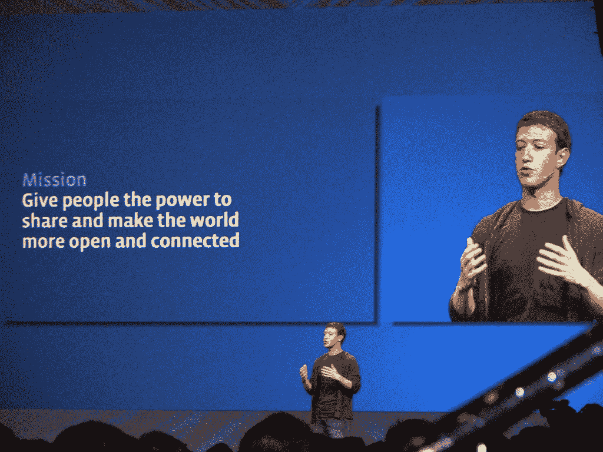

# LinkedIn 真的应该担心 Facebooks 的最新举动

> 原文：<https://medium.com/swlh/should-linkedin-be-worried-that-facebook-have-finally-encroached-on-their-digital-space-bf67cec22ebc>

Image by [David Berkowitz](https://www.flickr.com/photos/davidberkowitz/2726970362)

acebook 正在挑战 LinkedIn 对社交网络的最大吸引力之一，即通过商业档案页面搜索和申请工作的能力。

这是该社交网络最近推出的其他几项重大更新的后续，包括通过应用程序直接从餐馆点餐、预订电影票的功能，以及更受关注的 Craigslist killer，[市场](http://newsroom.fb.com/news/2016/10/introducing-marketplace-buy-and-sell-with-your-local-community/)。

如果所有这些增加都获得成功，那么像 Deliveroo、易贝和前面提到的 Craigslist 这样的公司将会在董事会层面产生一些严重的担忧。

但 LinkedIn 拥有 4.33 亿用户，社交招聘空间几乎完全属于它自己。它是招聘人员发布激励性迷因和引语的天堂，是一个想要引起躲在幕后的雇主和求职者注意的回音室。

这对 LinkedIn 的生态系统来说是完美的，因为每个进入社交网络的人都知道当他们进入那里时会发生什么。但是这种经历如何转移到脸书呢？

订餐、电影票(如果最近增加了一些东西，那么当房屋租赁和出租车租赁被加入这个列表时，不要感到震惊——所以要注意优步和 Airbnb)是相对社会化的做法，符合脸书的模式，因为它们可以被分享、喜欢和评论，而不用担心你的现任雇主会在你的虚拟肩膀上监视你。

我不确定申请工作是不是太多人想在社交场合大声嚷嚷的事情，因为虚拟的围墙花园有耳朵，这可能会导致你在目前的职位上提前被解雇。

# **在当前用户的心理中，把使用脸书和找工作联系在一起是吗？**

LinkedIn 是招聘人员和猎头的同义词，但这家社交网络几乎完全通过确保用户在其求职应用程序中列出来，从而远离了向用户推送工作的做法。不把工作列表硬塞给观众，让用户有更多的理由在网站上互动，而不是找工作，但这是否意味着几乎总是招聘人员与招聘人员互动？可能不会，但是这个平台永远不会在办公时间之外使用！

微软似乎并不担心 LinkedIn 的近期前景，因为这家科技巨头今年早些时候以 260 亿美元的价格收购了这家社交网络。

但是微软的先见之明到底有多好？他们以 85 亿美元收购了 Skype，从他们 100 万的手机下载量来看，这看起来进展不错。但另一方面，这也是 2014 年以 72 亿美元收购诺基亚移动设备部门，然后[在 2016 年以 3.5 亿美元](http://www.cnbc.com/2016/05/18/nokia-phones-are-back-after-microsoft-sells-mobile-assets-for-350-million-to-foxconn-hmd.html)出售其功能手机资产的微软。

LinkedIn 和微软在这一切中最大的救星是，用户在访问该网站时会期待模因和工作邀请，但用户会在脸书期待或享受这一切吗？可能不会，我怀疑这将是社交网络巨头将采取的机智。

脸书已经进入了**17.8 亿**人的日常生活，平均用户每天在上面呆两个小时左右，所以它不会试图通过增加任何过于戏剧化的体验来阻碍这一进程。但是当脸书想要做一些事情时，它通常会成功，除非它决定继续尝试，并且无法与 Snapchat 和 Slingshot 等应用竞争。

不过，随着公司通讯应用程序的推出，脸书最近进入了工作场所，因此它显然将 9-5 岁的用户群视为下一个要征服的市场，只有 LinkedIn 在这个市场有重要的立足点。

# 但是，LinkedIn 如何适应那些寻找人脉、寻找候选人来填补空缺职位的招聘者呢？

依我拙见，不会的，因为企业会通过脸书将他们的空缺职位展示给更多的观众，通过支付广告费用，使用视频来获得对工作的相关关注([脸书的 Nicola Mendelsohn 说，这个社交网络“很可能”在五年内“全是视频”](http://fortune.com/2016/06/14/facebook-video-live/))，并通过定期更新来使他们的企业简介页面吸引潜在的员工；实际上，这省去了中间人。

虽然与 LinkedIn 相比，潜在员工在脸书寻找工作的体验会有所不同，但这种变化确实给了求职者一些权力，让他们可以出去寻找工作，直接与雇主沟通，与朋友聊天，同时购买西装，并在晚上点披萨，但仍然只使用一个界面。

所以我想 LinkedIn 真的会成为招聘人员与其他招聘人员交流的社交网络，只是不会有任何潜在的员工/雇主隐藏在后台。

*原载于* [*安德鲁*](https://twitter.com/andrewakesson) *于*[*thenextweb.com*](http://thenextweb.com/contributors/should-linkedin-be-worried-that-facebook-have-finally-encroached-on-their-digital-space/)*。*