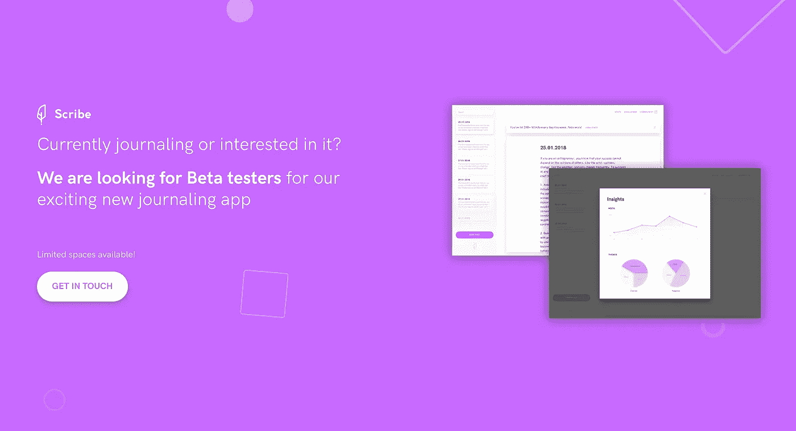

# 客户真的应该放在第一位吗？

> 原文：<https://medium.com/swlh/should-the-client-really-come-first-44e161d80e9>

## 这种方法对 B2B 公司有什么影响

Photo by [LinkedIn Sales Navigator](https://unsplash.com/@linkedinsalesnavigator?utm_source=medium&utm_medium=referral) on [Unsplash](https://unsplash.com?utm_source=medium&utm_medium=referral)

客户发送功能请求。

业务团队急于让它发生，并强加给产品团队。

这是我们现在需要建立的最重要的东西，所以放下其他事情去做吧

如果所请求的解决方案实际上解决了客户端问题，这是有意义的。

如果只有一个客户，整个产品都是专门为他们生产的，这也可能是有意义的。

然而，这种方法很有可能会破坏你的产品。

这是因为以下原因:

## **1。功能请求=混乱**

假设你正在烤一个蛋糕。有人建议加黄油，你就放点黄油。别人建议加一点糖，你就放进去了。

到目前为止一切顺利。

但是接下来，人们建议加入菠菜(？！)，大家都在建议加辣椒。一个人甚至建议加入一些番茄酱。

最终结果？试图取悦所有人，却没有取悦任何人。

**食材本身，特色要求，孤立来看也没那么差。这只是一个小功能，对吧？但是当聚合在一起时，你就有了一个杂乱的产品，没有愿景，没有清晰的价值，没有清晰的用户体验。**

## 2.人们说的不是他们的意思

惊喜惊喜。不管一个人有多少经验，他仍然是人。

人类真的不擅长做出客观的决定。因此，当大客户急着要求一个新功能时，现实通常是这样的:

**他们认为他们想要的:**“你需要尽快构建*这个*功能，因为我们需要它。”

**他们真正想要的:**“我们有*这个*问题&我们不知道如何解决。”

不幸的是，大多数团队在这一点上采取了行动，清除了积压工作，专注于这一个功能需求，而不是停下来考虑 1)产品已经解决了它，但客户不清楚 2)他们面临的问题可以在不构建大的新功能的情况下得到解决。

斗争仍在继续。

产品团队构建他们知道没有用途的功能。一次把产品拖向一百个不同的方向。

业务团队认为产品团队只是做得不好。

与此同时，你的产品只是退化成一个半成品解决方案的垃圾场，没有愿景，没有最终目标，没有用户。

## 这个故事发表在 [The Startup](https://medium.com/swlh) 上，这是 Medium 最大的企业家出版物，拥有 322，555+人。

## 在这里订阅接收[我们的头条新闻](http://growthsupply.com/the-startup-newsletter/)。

