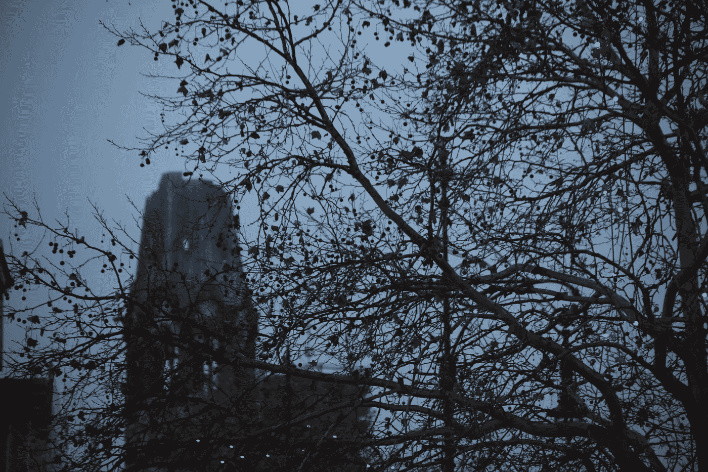

# —我们应该取消圣诞节吗？有一个答案

> 原文：<https://medium.com/swlh/should-we-cancel-christmas-there-is-one-answer-e13268821c64>

## 系列:我们如何修复缺陷#17

Photo: Øivind H. Solheim

# 战争结束了。未来就是现在。

# 我们面对的是什么？

## 这取决于我们每个人。

# 我们面临挑战。