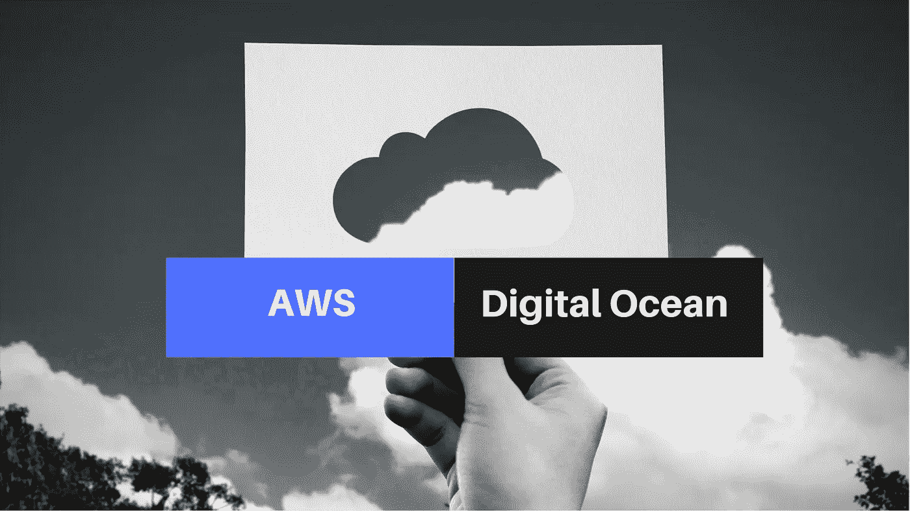

# 对于 Ruby On Rails 应用程序，你应该选择 DigitalOcean 而不是 Amazon AWS 吗？

> 原文：<https://medium.com/swlh/should-you-prefer-digitalocean-over-amazon-aws-for-a-ruby-on-rails-app-4262bb15091e>

Should You Prefer DigitalOcean Over Amazon AWS For A Ruby On Rails App?

你选择如何[部署你的应用](https://www.cognitiveclouds.com/insights/whats-the-best-way-to-deploy-rails-web-applications-on-aws-2/)将取决于你需要从托管提供商那里得到什么。随着 Ruby on Rails 越来越受欢迎，新的选项正被用于 [Web 应用开发](https://www.cognitiveclouds.com/custom-software-development-services/web-application-development-company)。在今天的市场上，如果你正在寻找云平台的主机提供商，亚马逊 AWS 和 DigitalOcean 是很好的选择。AWS 和 DigitalOcean 满足不同受众的需求，了解它们各自的优势将有助于你在它们之间做出选择。让我们仔细看看亚马逊 AWS 和 DigitalOcean 提供了什么。

# 数字海洋

相对而言，DigitalOcean 是一家新的云托管提供商。2011 年推出的 DigitalOcean focus 以开发人员的需求为中心，不像亚马逊的 AWS 那样试图通过一切对所有人的方法来迎合更广泛的受众。DigitalOcean 专注于三个主要卖点以在竞争中脱颖而出:高性能虚拟机、定价和简单性。

DigitalOcean 的价格据说是所有云提供商中最好的价格之一。他们的价格非常实惠，即使你是从一个小的开发设置运行。此外，它们不会让您放松警惕，因为附加服务(如固定 IP 地址和更多流量)会产生隐性费用。DigitalOcean 以只提供高性能机器而自豪。最后，DigitalOcean 提供了一个不复杂、简单的设置。它是面向 Linux 开发人员的基本 IaaS 提供商。

虽然 DigitalOcean 对 Linux 开发者来说是完美的，但是一些人发现用 DigitalOcean 提供一个服务器是有挑战性的和乏味的。有经验的开发人员发现他们花费了太多的时间来照看部署在他们的虚拟 VPS 或虚拟私有服务器上的 Rails 应用程序。他们抱怨不得不处理电子邮件问题和 SSL 证书。从成本角度来看，DigitalOcean 和 AWS 都具有很强的可扩展性。使用 DigitalOcean，缩放可能会有点复杂，需要您弄清楚如何缩放和运行一些 shell 脚本。你需要知道你是需要横向扩展还是纵向扩展，然后自己去做。高级开发人员应该看看 DigitalOcean，它声称你可以在不到 55 秒的时间内启动并运行。

# 亚马逊 AWS

亚马逊和数字海洋有很大不同。它是云计算的巨头和市场领导者。亚马逊的计算能力被认为是非常强大的，它拥有世界上最大的数据中心。亚马逊的 AWS 是一种伞式产品，由各种品牌的 PaaS 和 IaaS 解决方案组成，有时会令人困惑。其中最著名和最大的是 EC2 IaaS 解决方案。

AWS 推荐给中级到高级开发人员，它有一个用户友好的图形界面。AWS 提供了强大的 Ruby 支持。AWS Elastic Beanstalk 恰好是一个易于使用的服务，用于在 Nginx 和 Apache 等熟悉的服务器上部署 Ruby on Rails 应用程序。Elastic Beanstalk 为您管理应用程序堆栈，并提供和操作基础架构，这意味着您不必花费时间或开发专业知识，而是可以专注于编写代码。此外，自动伸缩允许您密切跟踪应用程序的需求曲线，从而减少了提前手动提供 Amazon EC2 容量的需求。AWS 还提供了丰富的开发人员资源，包括教程和文章，以充分利用其服务。有了 AWS，您还可以在短短 20 分钟内让一切正常运行。

结论:

简而言之，AWS 提供的服务比 DigitalOcean 更多。有了 DigitalOcean，您基本上只能靠自己了。这是一个精简的结构，以节约您的主机需求。即便如此，你在费用上省下的钱，你会及时失去。也就是说，你本可以花在编写代码上的时间，最终却花在了开发和运营任务上。

数字海洋并不完全与亚马逊竞争。它面向需要快速启动小型高性能实例的小型开发人员。尽管如此，DigitalOcean 确实为用户提供了一个简洁易用的界面，功能很少，只需一键部署。另一方面，亚马逊提供了一个 PaaS/IaaS 云超市，在那里你可以选择任何你想要的云服务，以及一些你甚至不知道存在的服务，比如云工作流和移动分析。

> 部署您的应用程序并与世界分享有许多选择。在决定哪一个对你和你的用户的需求最有意义之前，花一点时间来权衡这两个主机服务提供商的优缺点。

*最初发表于 CognitiveClouds 的产品洞察博客:Top* [***Ruby on Rails 开发公司***](https://www.cognitiveclouds.com/custom-software-development-services/ruby-on-rails-development-company)

## 这个故事发表在 [The Startup](https://medium.com/swlh) 上，这是 Medium 最大的企业家出版物，拥有 293，189+人。

## 在这里订阅接收[我们的头条新闻](http://growthsupply.com/the-startup-newsletter/)。

