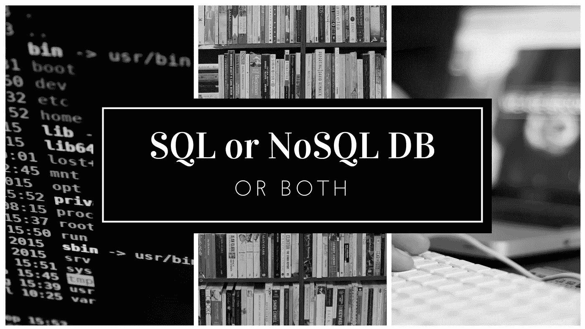

# 应该使用 NoSQL 还是 SQL Db，还是两者都用？

> 原文：<https://medium.com/swlh/should-you-use-nosql-or-sql-db-or-both-349cb26c9add>

围绕 SQL 和 NoSQL 的争论只不过是关系数据库和非关系数据库的比较。区别在于它们是如何构建的，它们存储的信息种类，以及它们存储信息的方式。关系数据库是结构化的，而非关系数据库是面向文档和分布式的。四十多年来，结构化查询语言(SQL)数据库一直是主要的数据存储机制。随着 web 应用程序和开源选项(如 PostgreSQL、MySQL 和 SQLite)的日益流行，使用在 20 世纪 90 年代末出现了爆炸式增长。NoSQL 数据库最近受到了 MongoDB、CouchDB、Redis 和 Apache Cassandra 等流行选项的青睐，尽管它们早在 20 世纪 60 年代就已经存在了。一天结束时，SQL 和 NoSQL 做同样的事情，存储数据。只是，他们的方法不同。尽管 NoSQL 越来越受欢迎，但它并不是 SQL 的替代品。这是一种选择。有些项目更适合使用 SQL 数据库，而其他项目则适合使用 NoSQL。有些人可以互换使用这两个词。

# 结构化查询语言

结构化查询语言(SQL)恰好是更结构化、更严格的数据存储方式，就像电话簿一样。为了使关系数据库有效，您必须以一种非常有组织的方式存储数据。SQL 数据库仍然很受欢迎，因为它们自然地适合许多古老的软件栈，包括 LAMP 和基于 Ruby 的栈。这些数据库得到了广泛的支持和理解，如果您遇到问题，这可能是一个很大的优势。

谈到数据库技术，没有放之四海而皆准的解决方案。这就是为什么大多数企业依赖非关系数据库和关系数据库来完成不同的任务。尽管 NoSQL 数据库因其速度和可伸缩性越来越受欢迎，但在许多情况下，高度结构化的 SQL 数据库仍然是更好的选择。

# 优势:

*   ACID(原子性、一致性、隔离性、持久性)遵从性通过精确建议事务如何与数据库交互来减少异常并保护数据库的完整性。通常，NoSQL 数据库牺牲了处理速度和灵活性的 ACID 合规性。
*   您的数据保持不变和结构化。如果您的公司没有看到大规模增长，这将需要更多的服务器，并且您只处理一致的数据，那么可能没有理由使用旨在支持高流量和大量数据类型的系统。
*   这些工具提供了更好的支持、产品套件和插件来管理这些数据库，因为它们已经上市很长时间了。

# 不足之处

*   SQL 的主要问题是随着数据库的增长而扩展。您知道，尽管可伸缩性通常在生产环境中测试，但它通常低于 NoSQL 数据库。分片也很成问题。

# NoSQL

如果您的组织正在处理大量的非结构化数据，并且您的数据需求在一开始就不明确，那么您可能没有足够的时间来开发具有明确定义的模式的关系数据库。与传统的非关系数据库相比，您可以获得更大的灵活性。将非关系数据库想象成文件夹，集合所有类型的相关信息。

# 优势:

*   这里真正的 NoSQL 动力是大数据，推动了 CouchDB、MongoDB、Cassandra 和 HBase 等 NoSQL 数据库的流行。当您的服务器端应用程序的所有其他组件都被设计为无缝和快速时，NoSQL 数据库确保数据不会成为瓶颈。
*   你可以用很少甚至没有结构的方式存储大量的数据。此外，NoSQL 数据库对可以存储在一起的数据类型没有限制，允许您根据需要的变化添加更多新类型。使用基于文档的数据库，您可以将数据存储在一个地方，而无需事先定义数据类型。
*   基于云的存储是一个很好的节省成本的解决方案，尽管你必须将数据分布在多个服务器上才能扩展。NoSQL 数据库设计为开箱即可跨多个数据中心扩展，不会带来太多麻烦。
*   你不需要提前准备 NoSQL 的数据。NoSQL 数据库的非关系特性使您可以快速创建数据库，而不必开发详细的数据库模型，从而节省了大量开发时间。

# 缺点:

*   NoSQL 社区缺乏成熟的 MySQL 用户群，因为它相对较新。虽然这个社区正在迅速发展，但就目前而言，像 MySQL 这样的 SQL 数据库管理系统很难与其庞大的经验丰富的最终用户网络竞争。
*   NoSQL 数据库的一个主要问题是缺乏用于性能测试和分析的报告工具。另一方面，使用 SQL，您可以找到各种各样的报告工具来帮助您证明应用程序的有效性。
*   您将面临 SQL 指令的兼容性问题。在查询语言中，新的数据库使用它们自己的特征，它们还不能 100%兼容关系数据库中使用的 SQL。
*   缺乏标准化。有很多 NoSQL 数据库，但仍然没有标准，就像存在于关系数据库中的那些。NoSQL 缺乏标准化可能会在迁移过程中造成问题。

# 结论

NoSQL 数据库正在成为当今数据库领域的主要部分。凭借他们的优势，他们可以成为企业领域真正的[游戏规则改变者](https://www.datadab.com)。对于寻求集成大数据的公司来说，NoSQL 的低成本、更容易的可扩展性和开源特性是一个有吸引力的选择。即便如此，NoSQL 碰巧是一项相对年轻的技术，没有像 MySQL 这样的标准 SQL 数据库。一些人认为 NoSQL 是未来的发展方向，而另一些人则担心它缺乏 ACID 合规性和标准化。最终，您复杂的[业务需求](https://www.datadab.com)及其消耗的数据量和种类将决定在 SQL 和 NoSQL 之间做出选择。

> 无论其价值如何，对于大多数项目来说，您都可以负担得起将非分布式、可伸缩的关系数据库作为系统中的单点。这是保持数据一致性和复杂查询的简单方法。我希望这有所帮助，但请记住，每个项目都是不同的，最终，您需要看到什么最适合您的需求。尽管，无论我们有什么选择，我们开发人员都非常擅长证明我们的技术选择是正确的，不管它们有多好。但我建议在权衡风险和优势后，让自己接触新技术。

*原载于* [***CognitiveClouds 产品见解***](https://www.cognitiveclouds.com/insights/should-you-use-a-nosql-db-sql-database-or-both/)***:Top***[***AngularJS 开发公司***](https://www.cognitiveclouds.com/custom-software-development-services/angularjs-development-company)

## 这个故事发表在 [The Startup](https://medium.com/swlh) 上，这是 Medium 最大的企业家出版物，拥有 294，522+人。

## 在这里订阅接收[我们的头条新闻](http://growthsupply.com/the-startup-newsletter/)。

