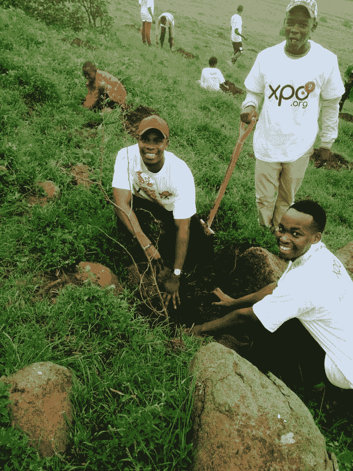

# 这两家公司向世界展示了社会责任和你的底线一样重要

> 原文：<https://medium.com/swlh/show-social-responsibility-important-bottom-line-3df0f7d36a6a>

企业战略中一个经常被忽视的方面是社会责任的重要性。通过与 XPO2 合作，PotNetwork Holdings 展示了为什么这种情况需要改变。

除了几个明显的例外，“回馈”或社会责任是西方社会长期忽视的东西。虽然今天的个人普遍更加意识到我们世界的问题，但这很少转化为实际行动，往往导致“点击主义”或其他形式的表演。这些虚荣心的练习在企业界屡见不鲜，这不足为奇。

公司，尤其是大公司，经常谈论回报他们的社区和世界，但这通常意味着对公共关系很好但没有任何持久影响的项目。问题？大多数公司没有意识到，他们可以利用自己的资源，而不仅仅是一个简单的公关噱头。事实上，对他们的资源的最佳利用是创建可持续的项目，这些项目实际上给世界各地的社区带来了变化。

最能体现这种方法的公司之一是 [PotNetwork 控股有限公司](https://www.potnetworkholding.com/)。( [OTCMKTS:POTN](https://www.google.com/search?tbm=fin&ei=P6jhWvaKK4qtsAGx4oWAAQ&stick=H4sIAAAAAAAAAONgecRowS3w8sc9YSn9SWtOXmPU5OIKzsgvd80rySypFJLmYoOyBKX4uXj10_UNDZMsLLIq47MyeADYzeZ3PQAAAA&q=OTCMKTS%3A+POTN&oq=POTN&gs_l=finance-immersive.1.0.81.36372.36790.0.38184.6.6.0.0.0.0.124.404.2j2.4.0....0...1c..64.finance-immersive..2.4.402.0...0.-VJ_lHO6iXo) )。通过与 Exponential Inc. (XPO2)的合作，他们已经参与了全球范围内卓有成效的慈善活动。

Exponential Inc .是一家与公益事业相关的技术营销公司，也是 white label XPO2(一个筹款、营销和电子商务平台)的创建者。XPO2 帮助中小型非营利组织与世界各地的捐赠者建立联系。这使得这些组织能够获得他们迫切需要的资金，以继续创造和增强他们的社会影响。

# 回馈对社区和公司都有好处

尽管慈善活动和项目无疑是绝佳的公关机会，但事情远不止如此。XPO2 的主要衡量标准**净社会影响**最好地概括了这一理念——即每一美元所做的好事数量。一次单独的慈善活动可以在短时间内做一次好事。如果一个组织承诺回馈他们业务的核心租户，他们和全球社区都会受益。

XPO2 提供的一个关键服务是能够将企业与他们愿意长期支持的事业相匹配。这使得 PotNetwork Holdings 这样的公司能够找到真正与他们作为一个公司的身份产生共鸣的非营利组织，并有助于建立长期关系。

PotNetwork Holdings 是一家能够并且已经支付远期费用的公司的完美例子。由于其高质量的 CBD 产品和有效的营销活动，该公司在过去几年中取得了长足的发展。这一成功让它们被 Harbinger 报告贴上了“强烈投机买入”的标签。不像其他公司那样简单地结束这些成就，PotNetwork Holdings 的人决定为他人做更多的事情。

# PotNetwork 控股公司已经在非洲和亚洲开展了慈善活动——未来还会有更多活动

自从与 XPO2 签订独家营销协议以来，PotNetwork Holdings 已经开始了许多旨在回馈社会的项目。该公司已经与 XPO2 合作组织了[他们在菲律宾马尼拉](https://finance.yahoo.com/news/potnetwork-holdings-diamond-cbd-xpo2-110000941.html)的首次慈善活动。这次活动帮助 100 多名处境危险的儿童获得了急需的物品，如罐头食品、大米、牛奶、肉卷、衣服、毯子、肥皂和许多其他他们难以获得的物品。这仅仅是东南亚许多此类项目中的第一个。

4 月，CBD 行业的领导者也迈出了进军非洲的第一步。XPO2 和 PotNetwork Holdings 能够将肯尼亚各地的利益相关者聚集在一起，开始恢复恩贡山被毁的景观。几十年的过度砍伐毁了这片曾经美丽的风景。它破坏了当地的生态系统，也导致了严重的水土流失。自 2017 年 11 月以来，PotNetwork 已经种植了 8000 多棵树，作为这一重要项目的一部分。

这些努力将对 PotNetwork 产生双重影响。一方面，是的——公司将获得良好的媒体报道，这总是一个因素。另一方面，它也为全球社区做出了贡献，并增加了他们现在和未来成功的**净社会影响**。

成功的公司及其管理团队通常被认为是我们社会的领导者。PotNetwork Holdings 采取的前瞻性方法将为其他人树立榜样。如果公司想在未来的世界中取得成功，他们需要认识到他们的影响不仅仅是他们的底线。

如果你没有对社会产生影响，那还有什么意义呢？

## 这篇文章发表在《初创企业》杂志上，这是 Medium 最大的创业刊物，有 327，829 人关注。

## 订阅接收[我们的头条](http://growthsupply.com/the-startup-newsletter/)。

