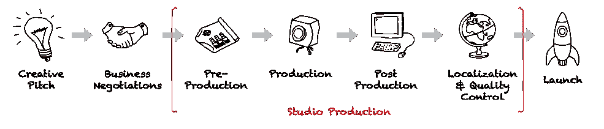

# 适者生存:好莱坞能适应吗？

> 原文：<https://medium.com/swlh/silicon-valley-hollywood-1db79ee51fe4>

两次获得奥斯卡奖的编剧威廉姆·高德曼[有一句名言](https://www.goodreads.com/quotes/457097-nobody-knows-anything-not-one-person-in-the-entire-motion)，"*没有人知道任何事情……在整个电影领域没有一个人确切知道什么会奏效。每次外出都是猜测，如果你幸运的话，还是一个受过教育的猜测。*

然而，由于数据和分析工具的爆炸，我们现在有能力[分析模式](https://www.datascience.com/blog/data-science-revolutionizing-film-amazon-oscars-recommendation-engines)，如观看行为和…