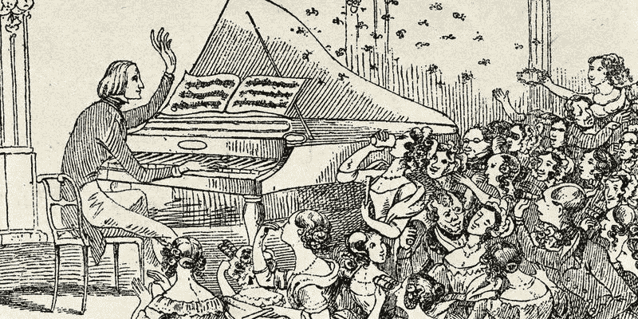
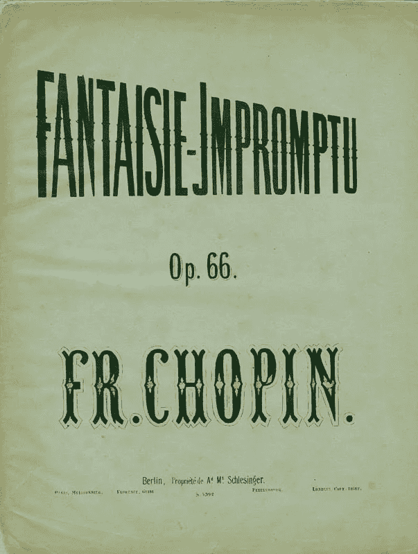

# 简单是最终的成就

> 原文：<https://medium.com/swlh/simplicity-is-the-final-achievement-dc743d28f5f>

Chopin/Dopin (Shutterstock)

## 肖邦能教给我们的策略。

弗雷德里克·肖邦，波兰浪漫主义时期的作曲家，是一个对自己的音乐风格感到满意的人。

如此舒适，事实上，他曾经在演出前沙龙的灯光熄灭时，在一片漆黑中完美地演奏了近一个小时。

有人提议重新点燃灯火，但肖邦拒绝了。

他的表演如此感人，以至于那天晚上出席的肖邦的伟大的“友敌”弗朗茨·李斯特承认肖邦是一位“真正的诗人”，他的作品已经无与伦比。

李斯特的高度赞扬，一个并不总是以谦逊著称的人。

> “简单是最终的成就。当一个人演奏了大量的音符和更多的音符后，简单就成了艺术的最高奖赏。”——肖邦

这种对肖邦媒介的掌握来自于极度的挑剔、专注和实验。

最终，他通过实践完善了他的理论。

在这方面，当我们在日益复杂的数字环境中考虑营销时，我们可以从肖邦的工作态度中学到很多东西。

我们渴望的简单必须赢得——只有经过多次迭代，我们才能开发我们的方法并提炼出信息。

不经实验就期待这一点是注定要失败的。简单不是天生的好东西，也不是可以不惜任何代价去追求的东西。

有意义的简单是彻底的过程和实践的自然结果。

因此，我们的挑战是在时间紧迫的舞台上找到一种独特的、真正的声音，能够经受住时间的考验。

这一挑战在现代社会中当然会让人感觉像是西西弗，因为在现代社会中，便携式设备越来越多，信息也越来越多。然而，无意义的简单不是解药。

对我们的信息进行攻击或频繁改变策略的诱惑是可以理解的；注意力持续时间非常宝贵，轻松娱乐比以往任何时候都更容易找到。

我们也不断地被赋予新的数据来作为我们决策的基础，这些数据经常与我们在别处看到的相矛盾。对即时投资回报和效率的压力增加了即时“执行”活动的额外负担。

这就是肖邦的话提供了一个有用的指导。竞选信息中过于复杂或晦涩的传递将不可避免地淹没在噪音中。

然而，这并不是要把奥卡姆剃刀方法推广到所有事情；看似最简单的广告活动，如果仔细观察，往往是最复杂的。为简单而简单不是答案。

在数字营销世界的背景下，我们可能会专注于数据和目标，从而损害我们的信息。我们也许能够以一种更加个性化的方式锁定目标，但是一旦我们接触到那个人，我们打算说什么呢？

# 媒介和信息必须不断对话。

正如移动用户不应该被视为桌面版的移动用户一样，Snapchat 和脸书等媒体之间的差异也是数不胜数的。

我们的信息应该在不同的平台上保持一致，但是在形式上要加以调整，以利用不同平台给我们带来的好处。保持这种平衡，跨部门和机构合作，提供与受众产生共鸣的真正整合的体验，应该是我们每次发起活动的目标。

这不是一个令人羡慕的任务，但这是一个可以通过耐心的方法、好奇的天性和跨数字渠道的广泛经验来实现的任务。

也许我们永远无法像我们的朋友弗雷德里克一样在黑暗中制定策略，但我们无论如何都应该听从他的建议:只有在演奏了大量的音符之后，才能获得有意义的简单，无论是在我们的舞台上还是在其他任何舞台上。

## 这篇文章发表在《初创企业》杂志上，这是 Medium 最大的创业刊物，有 355，974 人关注。

## 订阅接收[我们的头条新闻](http://growthsupply.com/the-startup-newsletter/)。

