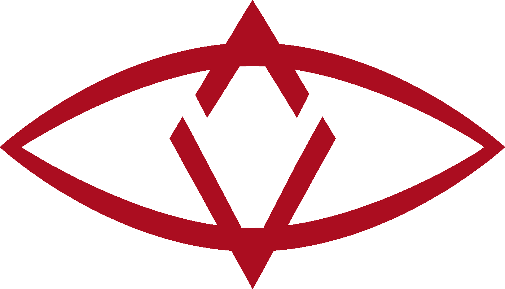

# SingularDTV，区块链之间的未来娱乐，代币和去中介化

> 原文：<https://medium.com/swlh/singulardtv-entertainment-of-the-future-between-blockchain-token-and-disintermediation-a64620f4080d>

SingularDTV 是一个非常雄心勃勃的项目。目标是建立一个去中心化、透明的生态系统，致力于娱乐(电影、音乐、书籍等。)通过基于区块链和 token 的模型；[据其创始人之一、制片人 Kim Jackson](https://www.digitaltveurope.com/2018/09/16/blockchain-company-singulardtv-to-launch-distribution-portal/) 称，“我们希望重新定义整个供应链，从创作到生产，再到视听产品的分销。”所提出的模型将允许有效的非中介化过程，允许直接管理和追踪权利，以及以快速和自动的方式将收入分享给直接参与的人，从艺术家开始。

该公司始于 2016 年，通过一个 ICO 筹集了 750 万美元(在 15 分钟内……)该公司由一个团队创立，除了前面提到的 Kim Jackson 之外，该团队还包括金融家和风险投资家 Arie Levy-Cohen、首席财务官、不拘一格的制片人、导演和编剧 Zach Lebeau 以及区块链和加密货币领域的领先专家之一、以太坊和 [ConsenSys](https://new.consensys.net/) 的联合创始人 Joseph Lubin。

SingularDTV 的战略基于三大支柱。首先是平台，[Tokit](https://tokit.io/)——已经运行——用于通过代币进行项目融资，以及随后的权利和收入管理；从视听作品开始，为多媒体内容的流式分发、货币化和参与提供一个非中介化的透明平台。

第二个支柱涉及原创内容的生产；首批出品的作品中，《T8》信任机，区块链纪录片，电影《T10》快乐的工人，由杜维因·邓纳姆执导，大卫·林奇合拍。

最后，还有一个强有力的宣传活动，包括在节日、研讨会以及与娱乐和区块链世界相关的活动中展示这些项目。

但是还有其他的计划和实验，旨在创建一个由异构社区支持的服务和工具的互联星系。rental list——目前在纽约处于私人测试阶段——被定义为一个 Airbnb 式的平台，允许点对点租赁设备、位置和机组人员搜索。

[我们后面要讨论的 SingularX](https://ex.singularx.com/exchange/SNGLS/ETH) ，是一个以代币形式买卖知识产权的平台。

SingulaDTV 还与两家世界领先的“风险工作室”密切合作，专门制作克里普托瓦卢特和区块链、 [Centrality](https://www.centrality.ai/) 和 ConsenSys。

## 新加坡电视台的“货币体系”

正如我们现在所知，代币(或“定制”加密货币)代表了一种在特定环境下购买商品或服务的交换手段(如游乐场的代币)和/或嵌入公司或网络价值的资产(如股票)。重要的是要记住，一般来说，它们既可以与其他代币/加密货币兑换，也可以与欧元或美元(法定货币)等传统货币兑换。

SingularDTV 创建了自己的主要数字货币 SNGLS，在以太网上实现。它打算用这种货币来代表公司开发的知识产权，并将其作为整个应用和服务生态系统所产生的价值的储备和载体。

[但是 SNGLS 并不是唯一被创造出来的硬币；存在可以与特定服务](/singulardtv/the-encyclopedia-of-singulardtv-194366d0c854)相关联的“子”令牌。例如，SingularX 有自己的令牌，名为 SNGX，交易费(0.3%)流入交换平台。通过一种叫做[空投](/@SingularDTV/omg-to-sngls-airdropping-airdropped-tokens-eec160f2bfb0)的机制，SNGX 代币的价值可以流入“母”SNGLS 货币持有者的“投资组合”。实际上，这些持有者也可以从所有子代币的价值中获益。

## 托吉特

Tokit 被定义为“SingularDTV 的权限管理网关和项目创建应用”。更简单地说，我们可以将它定义为一个高级众筹和/或收入共享(利润再分配)的平台，因为它能够为他们的项目(电影、纪录片、音乐、电子书、视频游戏等)创建个性化的令牌。).

也许解释其工作原理的最有效方式是[描述构建和管理令牌的各个必要步骤](https://tokit.io/faq)。

*   第一步是创建一个钱包，一个存放以太的投资组合(记住以太坊是 SingularDTV 使用的区块链网络)和令牌。这个过程并不直接，项目的创建者至少应该对加密货币有一个基本的了解，也应该了解将用于创建、管理、交换和“增强”其令牌的机制。
*   此时，您可以创建与项目相关联的令牌，选择它的名称、缩写，尤其是数量:通常我们是几十万或几百万(最大值是 1000 万个单位)。代币越多，就越有可能分割相关价值并有效利用它们，例如，在金融家、工作人员和演员(就电影而言)、支持者等之间重新分配收入。这些代币的创建成本为 100 美元，或以以太或加密货币 SingularDTV，SGNLS 的形式:如果您使用此解决方案，您将享受 25%的折扣。
*   现在，让我们想象一下，我们想通过像在“代币众筹”中那样操作来寻找融资；在这种情况下，开始了向用户/粉丝/支持者销售一定数量代币的活动:这些人押注于项目的成功和代币价值的增加。代币代替了“奖励”。然后，项目的创建者设置待售代币的数量、代币的价值、最低活动目标(代币可以报销)以及活动的持续时间。
*   在任何情况下，项目创建者从现在起都有可能使用令牌。

可以使用它们作为工具，通过向利益相关者发送令牌来分配项目权利/奖励/版税

因此，它们可以被用作“股份”,通过智能合约，从分配中获得的利润可以在股份上进行转移。如果作品(例如电影)在未来的 SingularDTV 平台上发行(或者，如果这种模式流行起来，通过协议在其他流媒体平台上发行)，收入将自动转移给令牌持有者。对于从电影院发行中获得的利润，或者说，从出售电视频道的权利中获得的利润，一个“手动”干预将是必要的(目前…)，将它们转换为以太，并将它们存放在与流通中的代币相关联的项目钱包中。

可以使用上述 SingularX 交易平台将它们与其他代币或加密货币进行交换。

不出所料，作为一个全新的融资和收入共享系统，这一程序似乎有些繁琐。还有监管问题以及代币的监管和税收框架问题。例如，目前，意大利税务局已经规定，从 ICO 衍生的代币(在我们的情况下，或许可以与出售给融资项目的代币相比)必须征收 26%的税。

除了这些关键问题之外，仍然有可能理解 SingularDTV 等模式的优势，特别是在非中介化、透明度、收入创造和再分配的新模式、参与甚至打击盗版方面:参与的人越多，甚至在经济上，使用授权分销渠道的动力就越大。

## 这篇文章发表在 [The Startup](https://medium.com/swlh) 上，这是 Medium 最大的创业刊物，有+ 378，529 人关注。

## 订阅接收[我们的头条](http://growthsupply.com/the-startup-newsletter/)。

