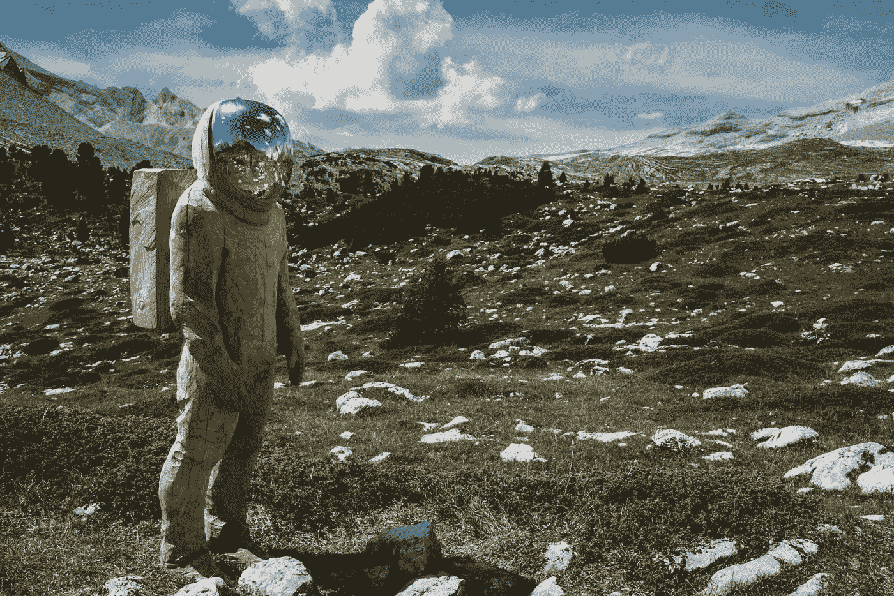
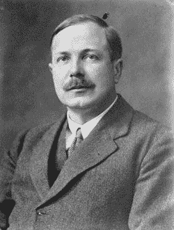

# 查尔斯·达尔文爵士对未来的预测是错误的

> 原文：<https://medium.com/swlh/sir-charles-darwin-was-wrong-about-the-future-2803069a13d4>

1957 年，查尔斯·达尔文的孙子在当时的一本流行杂志上写了一篇关于即将到来的“休闲时代”的文章。

他的论点如下:

> “假设一周有五十个小时的可能工作时间。每周工作 50 个小时的技术专家将会发明创造，这样世界上的其他人只需要每周工作 25 个小时。
> 
> 社区中较为悠闲的成员将不得不在接下来的 25 个小时里玩游戏**，这样他们就不会再胡闹了……**
> 
> 大多数人类真的能够面对休闲娱乐的选择吗？或者说，没有必要给成年人提供像小学生的必修游戏那样的东西吗？"

[Sir Charles Galton Darwin](https://en.wikipedia.org/wiki/Charles_Galton_Darwin)

基本上，达尔文认为所有的空闲时间将导致大规模失业。这会让我们变成坏男孩和坏女孩，所以政府(或任何人)需要想出办法让我们有事可做。

几周后，[对他的文章](https://books.google.com/books?dq=age+of+leisure+sir+charles+darwin&hl=en&id=VpOs5C-U4w8C&lpg=PA41&ots=aJJ4dPTIaM&pg=PA41&sa=X&sig=cVEgoPa82DjDg47-qhvDulUKnxI&source=bl&ved=2ahUKEwjBvsaR7_TeAhWSm1kKHYFeBM4Q6AEwCXoECA0QAQ#v=onepage&q=age%20of%20leisure%20sir%20charles%20darwin&f=false)的反驳指出了一个明显的漏洞。是的，我们会感到无聊，失去理智。但是通过创造“强制性”的玩耍时间，你就违背了玩耍的目的——这是没有报酬的——而且永远不会奏效。

他们没有为达尔文的提议提供任何替代方案，而是继续说:

> “未来的教育必须建议，而不是强迫。它必须鼓励，而不是惩罚……未来的公民将不得不在学校学习他们在家里学不到的东西:如何利用他们越来越多的**闲暇时间。”**

双方一致认为，我们可能会变得调皮捣蛋，无聊到死。

“不可避免，”他们说，科学家们必须在社会崩溃之前搞清楚这一点！

# 渴望时间

快进 50 年——双方都错了。

技术进步的快速步伐，非但没有解放我们，反而给了我们更少的时间。我们不是无聊死了，我们是渴望时间。

我们今天的挑战是在一天中找到足够的空闲时间来放松一下。电子邮件收件箱总是爆满，无论我们如何努力，似乎总有更多的工作要做。

我们正在死于心脏病发作、焦虑和中风——大多数去看医生都与压力有关。

杰弗里·韦斯特解释说:“城市化不可避免地导致了时间的缩短”，而今天我们正“加速走向死亡”

# 未来

摩尔定律并没有减速。50 年还有很长的路要走，一切皆有可能。如果历史告诉了我们什么，那就是我们不擅长预测未来。

> 没有丝毫迹象表明核能将会被获得。这将意味着原子将不得不被随意粉碎。”—阿尔伯特·爱因斯坦，1932 年。
> 
> **“任何个人都没有理由在家里拥有一台电脑。”——肯·奥尔森，数字设备公司总裁、董事长兼创始人**
> 
> **“我预测互联网将很快成为壮观的超新星，并在 1996 年灾难性地崩溃。”—罗伯特·梅特卡夫，3Com 的创始人，以太网的发明者。**

你可能已经厌倦了听到艾和区块链，但他们将改变世界。他们已经在改变世界了。

在比特币基地首席技术官和 AngelList 创始人 Naval Ravikant 的风险故事播客中，他们谈论了未来可能会是什么样子。

*   加密技术在全球的兴起将会产生“即时工作”想象一个脸书 feed 或 Twitter feed，除了所有的帖子都是你可以做的微任务和工作。(这类似于 app [Earn](https://news.earn.com/earn-com-joins-coinbase-a282a36411d2) 的工作方式)
*   **无人驾驶汽车在飞行中互相争夺通行权**。想象一下，一辆汽车对另一辆汽车说“我想让红灯马上变绿，所以我出价 X 硬币来实现它”
*   计算机最终能被训练去做的任何事情，计算机都会去做。
*   **创办一家公司很容易:**“对我们的孩子来说，创建一家公司，只需点击一个按钮，一系列智能合同就会启动，一家公司就会成立。他们会拖放谁是雇员，谁是投资者，谁欠了多少钱。你将能够经营这家完全分布式、虚拟、可跟踪、不可信的公司，而不需要大批律师或法官。”—海军
*   “你可以让人们资助整个国家、一场战争或一场革命。可能性是无穷无尽的。 " —海军

稍微发挥一下你的想象力。

真的很难想象一个群龙无首、去中心化的社会吗？这已经在内华达州的 T21 发生了。或者我们只需按一下按钮就可以访问一系列全球工作？或者是一个经济体，我们有 100 种不同的收入来源，来自世界各地的微支付形式？

世界将继续变小，技术将继续创造机会…我认为我们可能会没事。

## *感谢阅读！*

## 识别被低估的加密项目的最佳评估框架和工具是什么？你如何做出更明智的投资，并停止亏损？关于成为更好的交易者，李小龙教了我们什么？

## 我采访了几十个投资者、交易者和企业家，问他们这些问题以及更多更多的问题。

## 从奖金到赚取代币的头像，[看好比特币](http://mybook.to/bullishonbitcoin)，概述了几十种交易、投资、创造和探索新的去中心化经济的策略。今年圣诞节即将来临。*。*

## 这篇文章发表在 [The Startup](https://medium.com/swlh) 上，这是 Medium 最大的创业刊物，有+393，714 人关注。

## 订阅接收[我们的头条新闻](http://growthsupply.com/the-startup-newsletter/)。

