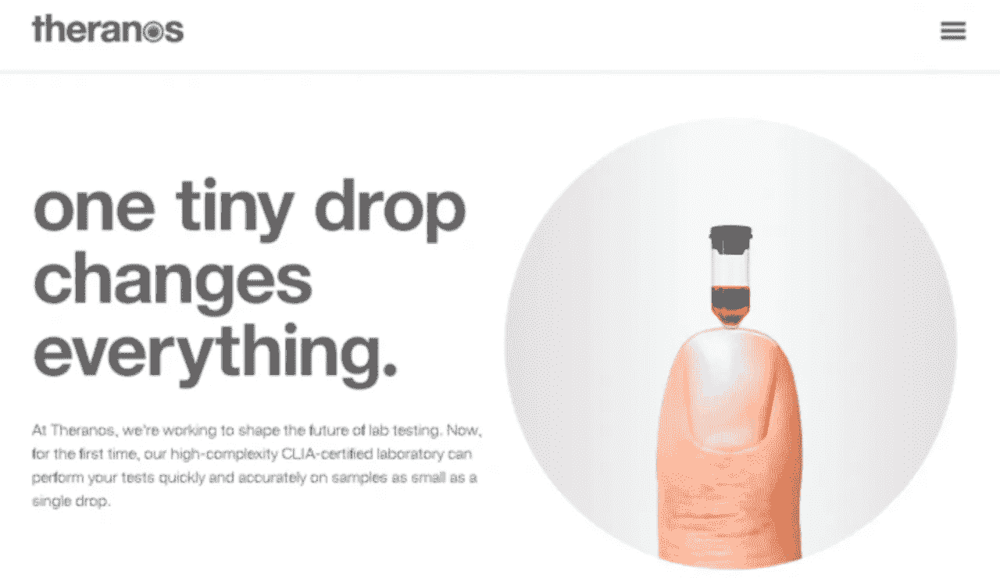

# Theranos 的六大致命产品错误

> 原文：<https://medium.com/swlh/six-deadly-mistakes-of-theranos-4260486e79bd>

约翰·卡瑞鲁(John Carreyrou)的非虚构惊悚小说《恶灵》(Bad Blood )很快成为了旧金山湾区的必读之作。许多人认识前员工或投资者，有些人还直接与该公司首席执行官伊丽莎白·霍姆斯互动过。Theranos 的估值达到 90 亿美元，它建造了复杂的新公司和实验室设施，迷住了一个行业，同时抓住了各地企业家的想象力。

Theranos 公司因卡瑞鲁在《华尔街日报》上发表的[调查文章](https://www.wsj.com/articles/theranos-has-struggled-with-blood-tests-1444881901)质疑霍尔姆斯及其公司的主张和合法性而戛然而止。

从那以后，许多人都在猜测这个必然会发生的案例研究的*是什么，为什么和如何*。这对斯坦福来说是必须做的，因为他们关系密切，可以从内部视角了解 Theranos 的人、动机、情感和事实。

作为一名联网家庭硬件初创公司的企业家和前风险投资家，我在阅读 *Bad Blood* 时感到了巨大的痛苦。我知道领导一个团队创造突破性技术的难度，也能理解霍姆斯需要说服团队相信做一些看似不可能的事情。克服每一个障碍所需的个人意志力是巨大的。

但是，我的感同身受到此为止。霍姆斯创造并策划了一种文化，这种文化注定了 Theranos 的失败。她雇佣了非常有才华和能力的人，用他们来展示自己和提高可信度。然后开始摧毁他们的灵魂。

表现得好像她是房间里最聪明、最有洞察力和最有魅力的人一样，她犯了六个严重的错误。他们中的任何一个都是致命的，但是所有的？Theranos 没有机会。

错误 1:她无法接受真相。(对知道参考资料的人大声喊出来)首席执行官的首要工作是通过问一些艰难但基本的问题来找到真相。他们必须知道他们的团队、他们的产品和他们的客户的真实情况。诸如“这个产品有用吗？”或者“我们如何向自己证明我们可以让它工作？”需要直接问和回答。一个好的 CEO 能感觉到扯淡，乐于谈论或淡化一个严肃的问题。他们像冠军松露猎犬一样嗅出真理的奖赏。她完全回避了真相。

**错误 2:认为困难的产品评审会议只是人们的抱怨或者他们不相信自己**。作为一家颠覆性公司的首席执行官，你经常会听到有人说他们做不到，或者他们需要更多的资源，或者你太用力了。你可以开始相信把人们从悬崖边上劝下来就够了。让抱怨者自我感觉良好，他们就会把事情做好。或者解雇他。慢慢地，这位首席执行官陷入了自己编织的幻想茧中。如果你的产品团队告诉你一些事情，倾听。也许你有错误的人，但你可能有错误的文化或选择了错误的问题。

**错误 3:不与热衷于解决问题的人为伍。**与问题解决者在一起。正确的团队希望自己在数据、事实和证据的基础上找到真相。在健康的团队中，坏消息传得很快。不是责怪别人，而是优先排除故障。在我的公司，任何人都可以“叫手榴弹”。我挑选了一些在“手榴弹”(这可能是一个严重的问题)出现时不会视而不见的人。我们不能冒险让它陷入责任漏洞。如果任何人，任何级别，称之为“手榴弹”——正确的人会聚集起来迅速评估，理解，优先考虑和解决问题。事实证明，如果被赋予拉火警或停止装配线的权力，它很少被完成。但当它真的发生时，这是一个强大的时刻。霍姆斯则反其道而行之，解雇了那些提高嗓门的人。她珍视员工对自身进步的满意，同时尽职尽责地保持对自身背景的无知。

第四个错误:霍姆斯缺乏领导团队应对雄心勃勃的技术挑战的技能。ther anos 血液检测设备的工作需要许多技术突破。她不知道他们为了成功要面对多少风险。如果有 10 个关键风险，而你能在每一个上取得 90%的成功，那么这些风险组合起来实际上保证了产品永远不会工作。即使你达到了 99%的正确率，仍然有 10%的几率不工作。通过试图一次接受太多的技术挑战，她制造了无尽的不稳定循环。这个团队可以一直工作十年而不成功。通过将一些挑战推迟到未来版本，您交付的是一个不如预想的产品。*但你船，学习和提高。重复*。在微软，我们被批评说一个产品直到 3.0 版本才变得伟大，这是有一定道理的。但要做到这一点，我们必须经历 1.0 版和 2.0 版。在后来的版本使它变得伟大之前，第一款发布的 iPhone 在许多方面都有所妥协。在雄心勃勃的 1.0 版本产品中，可实现的技术风险水平是有限的。霍姆斯缺乏对技术风险和工程领导力的基本认识。

**错误 5:永远不要相信演示**。不要伪造或相信演示不是真实的。了解您要演示的内容，并描述演示的目的和局限性。演示是虚假的数据点——不可靠和不可信，因为它们很少解决任何困难的技术挑战。我参加了一家初创公司的董事会会议，他们的第一次董事会会议公布了一项重大投资，首席执行官无法证明他的演示(软件代理系统)是真实的，就像投资前声称的那样。我们立即讨论解除交易。成为演示怀疑论者。

错误 6:福尔摩斯培养了深厚的保密文化。在开发颠覆性产品时，一些首席执行官实施严格的外部保密规则，让竞争对手不知情，并保持一定的市场惊喜。那是合理的。然而，实施严格的内部保密制度，不让领导知道公司其他部门的相关产品开发工作，是一个警告信号。在创业公司中，信息的条块分割是灾难性的。

警告信号很明显。霍姆斯触发了一些致命的信号，这些信号是有产品制造经验的人会看到的。唯一的董事会成员 Avi Tevanian 在寻找真相后不久就离开了。他找到了它，并意识到没有其他人感兴趣。

Theranos 的故事引人入胜，令人悲伤，也令人愤怒，它讲述的不是一个创新团队取得伟大成就却过早上市或因悲剧事件而倒下的故事。这不是一般的魔术或 Go 或 WebVan，所有的商业失败，而是对硅谷结构非常重要的公司。

这是硅谷的阴暗面。这就是 Theranos，一个欺诈性的公司，一个无能的领导者，只是在许多致命的错误中存活了很长时间。

## 这篇文章发表在 [The Startup](https://medium.com/swlh) 上，这是 Medium 最大的创业刊物，有+393，714 人关注。

## 订阅接收[我们的头条新闻](http://growthsupply.com/the-startup-newsletter/)。

