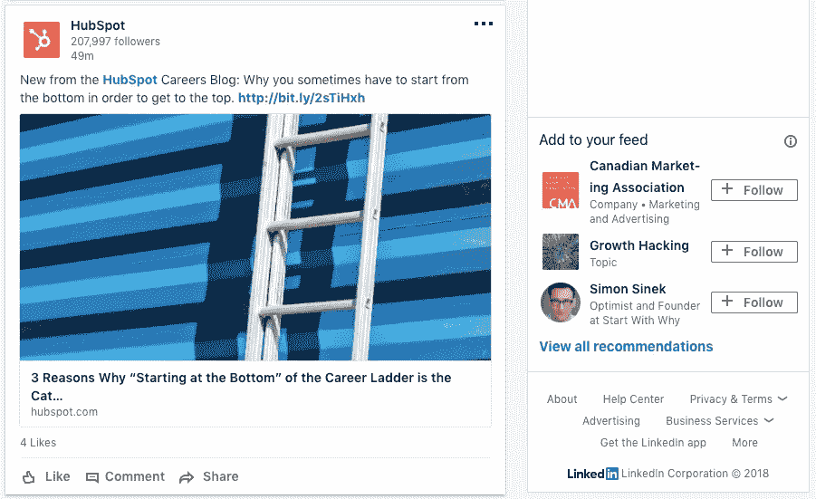
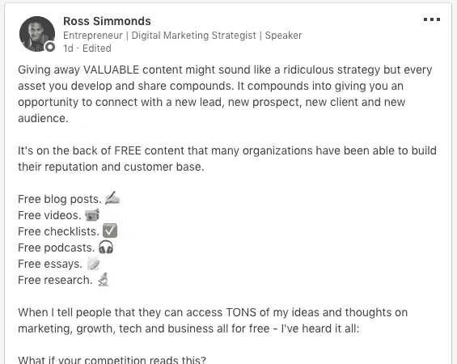
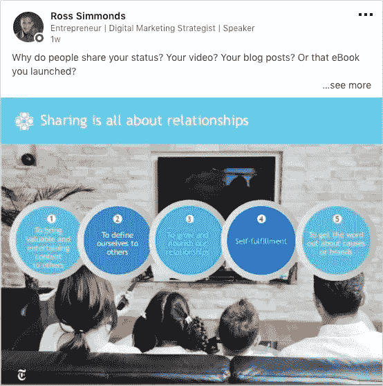

# 利用 LinkedIn 进行 B2B 内容营销的六种有效方法

> 原文：<https://medium.com/swlh/six-effective-ways-to-leverage-linkedin-for-your-b2b-content-marketing-efforts-f70d8790f1d4>

如果你在 B2B 领域，LinkedIn 营销和推广作为一个潜在客户产生的渠道是你的想法。

无论你专注于哪个领域，总会有一个重点是带来合格的线索。毕竟，线索变成客户，客户变成收入。

那么作为一个 B2B 营销人员，你的大部分时间都花在哪里呢？当您考虑内容分发时，您会首先考虑哪些渠道？

你用什么策略来获得这些线索？

你看到你希望的结果了吗？

我要让你知道 B2B 营销世界中最糟糕的秘密…

在 B2B 领域，LinkedIn 营销和推广是王道。

当然，脸书和 Twitter 有更多的用户，Instagram 因为有趣而更受欢迎，但最重要的是 LinkedIn 带来了结果。如果你正在寻找一些专注于 B2B 的 LinkedIn 统计数据 …

*   *它是 B2B 营销人员用来分发 94%内容的第一渠道。*
*   *91%的营销主管将 LinkedIn 列为寻找优质内容的首选。*
*   LinkedIn 占 B2B 网站社交流量的 50%以上&博客。

尽管这些数据很棒，但最重要的是:

80%的 B2B 线索[来自 LinkedIn](https://blog.kissmetrics.com/linkedin-strategies-b2b-marketing/) 和 Twitter &的 13%和脸书的 7%。

如果你关注的是潜在客户的产生，这些数字本身就应该是你跳上 LinkedIn 营销马车所需要的全部说服力。一旦你接受了 LinkedIn 的“为什么”,下一个问题将是如何正确地做这件事。在这篇博文中，我将详细介绍你可以在 LinkedIn 上使用的每一种营销和推广技巧。但在此之前…

理解太多人在 LinkedIn 上犯的错误很重要。以下是一些最常见的错误，你可以避免它们:

既然已经不碍事了。

让我们深入探讨一些最好的方法，让您的内容在正确的时间通过正确的渠道到达正确的人手中…

即使你有资源在 LinkedIn 上投入付费分发的世界，忽略免费有机分发的可能性也是一个错误。当你为如何让你的内容在 LinkedIn 上传播而制定你的[分发清单](https://rosssimmonds.com/distropack)时，这里有一些我用来获得有意义结果的策略:

# 1.从您的 LinkedIn 商务页面分享

这看起来似乎是一个显而易见的问题，但是我看到太多的 B2B 品牌把球扔了。当你考虑在 LinkedIn 上发布内容时，确保你建立了一个公司页面，并使用它来分享你的内容。

当你的内容出现在 LinkedIn 用户的 feed 中时，你希望让他们尽可能容易地认出你的品牌，并将其与你提供的价值联系起来。

# 2.在其他 LinkedIn 帖子上发表评论

我强烈支持在尽可能多的帖子上删除评论，原因有二:

当你评论一篇文章时，你就在文章作者和你之间建立了一个对话。这种对话是建立你们两人之间关系的关键，你对他们的帖子评论和参与越多，他们就越有可能对你的帖子做同样的事情。

除了一对一的关系建设，如果你对某人的帖子发表评论，当帖子出现时，你的名字将会出现在他们所有的联系人面前。一些简单的事情，比如在一个有价值的帖子上发表有价值的评论，就可以让你的名字出现在一群对你的专业领域感兴趣的人面前。

# 3.写长篇 LinkedIn 帖子或文章

为了让你的内容像你希望的那样成功，重点首先需要放在提供价值上。如果你不提供任何价值，没有人会关注你分享的任何东西。

有价值地进入某人的 feed 的最好方法之一是分享[像这样的长篇帖子](https://www.linkedin.com/feed/update/urn:li:activity:6372135974129922048)和有价值的 LinkedIn 文章。与其只是快速更新 20 到 50 个角色，不如分享一些有意义的东西。

不要认为仅仅因为你只是分享一个标准的帖子，你就不能发挥创造力，给大家带来一些价值。

# 4.在 LinkedIn 群组中分发内容

根据 LinkedIn 自己的说法，[LinkedIn 群体再次崛起。鉴于脸书集团最近取得的成功，这则新闻应该不会让人感到意外。让我们把它分解一下…](https://www.linkedin.com/pulse/linkedin-groups-set-make-comeback-candice-galek-/)

LinkedIn 群本质上是一个巨大的房间，里面挤满了你想要锁定的人。如果你想接触 B2B 营销人员，加入一些 B2B 营销 LinkedIn 小组。想联系 SaaS 创始人吗？加入一个专注于 SaaS 的 LinkedIn 群组。

一旦你进去了，就开始加入讨论帖子，这些帖子可以完成两件事:(1)为那些看到它的人提供主要价值，因为价值应该永远放在第一位，(2)将流量带回你的内容。如果你有一篇关于如何在 B2B 中使用表情符号的博文，那么群组可以成为你让 B2B 营销人员登陆该内容的渠道。

# 5.请同事分享你的 LinkedIn 帖子

在算法的[时代，你的帖子在早期阶段获得的牵引力越大，它就会从算法中获得越多的爱，最终它的影响力也会越大。](https://rosssimmonds.com/linkedin-algorithm/)

不要回避不要脸的喜欢和分享请求。

如果你在一个 10 人的销售团队中，不要只是点击发布，然后希望他们看到它并给它一个赞。给你的团队发一个链接，问问他们是否愿意花点时间来喜欢它。即使只有 6 到 7 个人给你这样的评价，你仍然比你提出要求前多了 6 到 7 个评价。

当然，这听起来不像你在寻找的病毒式吸引，但请记住:无论何时你分享一个新的 LinkedIn 帖子，*你得到的参与越多，你的影响力就越大。*

# 6.参照内容共享图像

在这一点上，我们知道在你的每一篇文章中提供价值是关键。记住这一点，尝试从你的内容片段中分享某些图片，这些图片提供了一点点价值。

如果你的博客文章中有信息图表，把它插入你的 LinkedIn 文章，如果他们想看更多，就发给他们完整的文章。如果你已经做了一些初步研究，分享你的图表来武装他们的洞察力。当你把价值放在第一位的时候，你就为自己的成功做好了准备。

在我上面分享的帖子中，图片本身就为任何看到它的人提供了一些价值。如果他们想要更多的价值，只需点击帖子末尾的链接就可以了。如果他们甚至在打开完整的博客帖子之前就已经从我这里获得了一些价值，他们就更有可能相信它的可信度。

# **把这个包起来**

当您开始实施最适合您需求的策略时，请始终牢记这样一个理念:如果您想看到真正的结果，价值必须是第一位的。

给他们一个关心你分享内容的理由，并确保他们在每次互动时都带着他们可以使用的东西。建立这种信任和信誉只会增加你从分销努力中看到的结果。

如果你真的想进入 LinkedIn 上的内容分发游戏，我已经整理了一篇博文，分解了另外六种分发策略(付费和有机)，你可以开始在 LinkedIn 上使用。看看吧！

## 这篇文章发表在《T4》杂志《创业》(The Startup)上，这是 Medium 最大的创业刊物，拥有 324，834+读者。

## 在这里订阅接收[我们的头条新闻](http://growthsupply.com/the-startup-newsletter/)。

