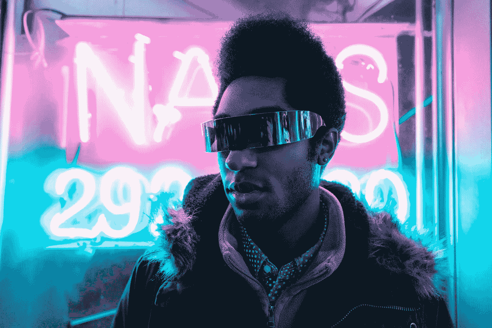

# 现在要采取的六个基本行为，你未来的自己会感谢你的。

> 原文：<https://medium.com/swlh/six-essential-behaviors-to-adopt-now-that-your-future-self-would-thank-you-for-bf4ef8bd544d>

You future self will thank you for not having to wear these awful glasses. Photo by [Alex Iby](https://unsplash.com/photos/9-ZsdNfxfr4?utm_source=unsplash&utm_medium=referral&utm_content=creditCopyText) on [Unsplash](https://unsplash.com/search/photos/future?utm_source=unsplash&utm_medium=referral&utm_content=creditCopyText)

## 1.关掉它

你有没有考虑过你每周盯着屏幕的时间？

根据美国眼科学会，由于近视率的增加…