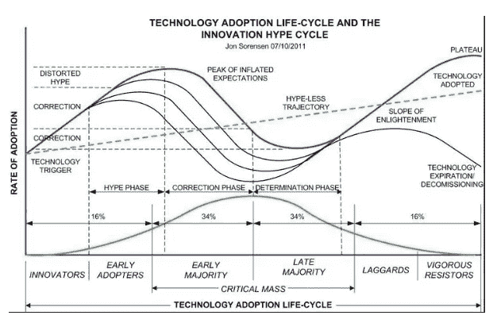
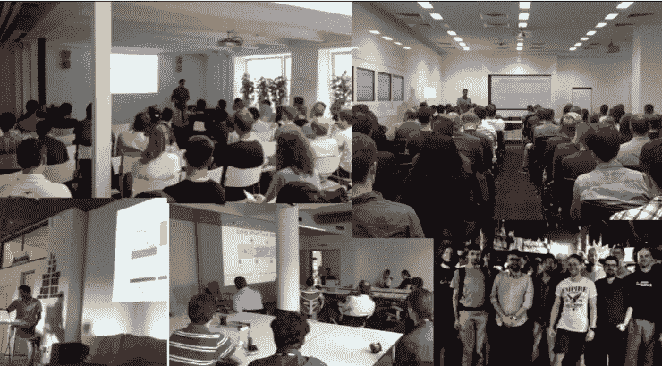

# 为什么社区驱动的人工智能是未来的六个原因

> 原文：<https://medium.com/swlh/six-reasons-on-why-community-driven-ai-is-the-key-to-impact-entrepreneurs-ddc1ffbee4d1>

如果一群人聚在一起投入他们的努力，任何现实世界的问题都可以得到最好的解决。当涉及到具有奉献精神的个人的集体努力时，成功是必然会发生的！”印度 Shri Mata Vaishno Devi 大学四年级学生 Iresh Mishra 说。

让我以一个猜想开始这篇文章:AI 和机器学习(ML)的未来将由社区通过草根运动来驱动。这是一种自下而上的模式，在这种模式下，人们聚集在一起，为他们能够联想到的问题构建解决方案。

但是我为什么会做出这个猜想呢？

ML/AI 有能力改造我们的社会，打造让大多数人受益的产品。然而，为此，技术必须从炒作阶段进入修正阶段。在修正阶段，产品面向大多数人，当他们看到明确的有形价值并信任该技术时，就会采用该技术。

不幸的是，大多数人采用人工智能和机器学习将面临问题:主要是由于大多数人之间的不信任和滥用个人数据的故事。

Technology adoption life-cycle and the innovation hype cycle.

为了改变认知和现实，产品需要由社区来构建。当社区有了一个合适的平台，有了合适的基础设施、指导、支持和环境，他们就可以一起开发这些产品。

为了证明我的观点，我一直在与一群学生和人工智能爱好者合作，建立一个机器学习解决方案，以增加屋顶太阳能电池板的采用(详情[此处](https://towardsdatascience.com/using-image-segmentation-to-identify-rooftops-in-low-resolution-satellite-images-c791975d91cc))。这些学生来自印度各地，彼此素未谋面，他们正在合作开发这个产品。

Students from all over India — who have never met each other — are collaborating to build a Machine Learning product for the clean energy sector. From the top - Jitendra, Abhigyan, Raghav, Devendra, Rasika, Iresh, Jerin Paul, and Shivani.

使用社区开发产品的想法来自两个领域:开源开发和分散式产品开发。我们已经看到，这种 AI/ML 产品开发的方法有许多优点。

# **赋予青年权力和分享知识**

在过去的一年里，我有机会在 17 个国家的 50 多场活动中发言。在每个地方，我都遇到了令人敬畏的有才华的人——学生、职业人士和企业家。我可以毫不含糊地说，人才不局限于某些地区(如湾区)，而是随处可见——无论是在塞尔维亚诺维萨德或乌克兰敖德萨这样的小镇，还是在越南胡志明这样的大城市。

随着今天的技术进步，在线课程和可用工具，人才无处不在，可以很容易地获得。例如，对于机器学习项目，我们有大约 50 名高度参与的初级 ML 工程师贡献和开发产品。任务在社区中公布，学生可以承担这些任务，并在导师的监督下开始工作。在分析低分辨率图像以识别屋顶方面，我们已经取得了超出预期的结果，比我所知道的任何系统都要好。

Results from predictions — quite close to the target

> 帮助收集数据的学生 Abhigyan Das 说"我认为这种社区模式应该被更多的组织效仿，因为我们作为学生不仅可以获得关于工作的第一手经验，还可以学到很多任何课程都无法学到的东西。
> 
> **Shivani Bhawsar 也在一家大型科技公司从事这个项目的全职工作，他说"*所有成员都非常乐于助人，我们都作为一个团队互相帮助，互相学习。*
> 
> **来自 IIT·古瓦哈蒂大学的新硕士生 Smriti Bahugana 补充道,“同样重要的是要看到，这样有影响力的项目不需要沉重的设置，我们正在我们的笔记本电脑上，在我们的家里，做我们都热衷的事情。”**

# ****建立对彼此和产品的信任和尊重****

**社区也有助于建立信任。从社区中成长起来的公司有着共同的价值观、信仰，通常还有服务于这些社区长期利益的更大愿景。这建立了更多的信任，使人们更愿意使用这样的系统和分享他们的数据，这在大公司制造的产品中正在消退。**

> ***IIT(ISM)丹巴德分校的四年级学生皮尤什·乔杜里(Piyush Choudhury)说:“既然我们远程工作，我们就需要更多地相互信任。每个人都明白一个人不可能总是自由的，因此我们根据他人调整我们的时间，这建立了对彼此的尊重。***
> 
> ***"* 我觉得这样的工作符合两方面的要求，一方面是工作社区的热心人，另一方面是刚刚开始在这个领域做出贡献的成员，他们可以通过努力交付自己的产品来增加自己的学习曲线，了解他们的小想法的影响。这只有在相互信任和尊重的情况下才有可能。Smriti Bahugana 补充道。**

****

**Piyush Choudhury and Smriti Bahugana**

# ****通过不同的观点帮助打造真正的公共产品****

**我们需要世界各地植根于不同价值观和观点的社区来构建伟大的产品，以增强我们的能力并解决当今和未来世界的紧迫问题。由不同观点构建的产品最终会更具包容性，吸引更多的受众。**

> **韦洛尔理工学院的四年级学生 Raghav Saraf 说，*每个人都可以分享他们的观点来帮助解决问题，这很好，因为我们可以从多个角度来看待问题。***
> 
> ***Sri Shankaracharya 机构集团的四年级学生 Devendra Barmate 说,“我很喜欢这种工作方式，来自不同地区的人聚在一起，分享他们的想法和意见，带来很多东西*。****

# ****获取数据****

**产品背后的社区可以提供大量数据。群体的智慧，通过来自不同背景和地点的人促进多样性，可以产生收集和处理数据的创新方法。对于特定项目，成员甚至可以通过图像、音乐、电影推荐、文本等方式引入他们的数据。对于上面提到的太阳能项目，我们也使用社区驱动的方法来收集数据。**

> ***其中一名学生 Rasika Joshi 说:“*我可以更专注于构建神经网络，并对所需的格式化数据集进行训练，因为我和同学们一起工作，他们在给定的时间框架内为我提供数据*。”***

****

**Masked images generated by the community.**

# ****降低开发成本，让 AI 民主化****

**数据科学家的薪水非常高，例如，加州的一名数据科学家可以赚到 15 万美元或更多。另一方面，年轻的初级机器学习工程师和数据科学家有数百种想法，他们发现在现实世界的项目中工作极其困难。通过这种方法，我们可以结合两个世界的优点。像这样的模型可以减少三分之一到五分之一的开发成本，从而使技术人人可及，AI 民主化。**

**此外，产品开发方面仍然存在无法由一个人解决的重大挑战；例如数据收集和准备。因此，社区驱动的方法不仅适用于开发，也适用于数据收集。**

# ****建立一个分散的、机会均等的世界****

> **想象一下这样一个世界，无论你出生在哪里，生活在哪里，只要你有才华，你都可以和世界上其他地方的人一样获得平等的工作和机会—工作的未来:分散的、透明的、基于信任的[1]**

**这是社区驱动开发背后的哲学。人们聚在一起寻找解决方案的模式不仅使问题分裂并被征服，而且还提供了解决问题的各种观点和不同策略，因为当来自不同背景和文化的人们聚在一起时，集思广益会更有成效。**

**这就是我们想要建立的工作的未来。一个工作被分配、平等、透明和值得信赖的世界。我们的愿景是创造更好的工作环境。**

# ****参考文献****

**[1]工作的未来:去中心化、透明、基于信任，Rudradeb Mitra，2018 年 4 月 20 日，[https://www . LinkedIn . com/pulse/future-Work-去中心化-透明-基于信任-rudradeb-mitra/](https://www.linkedin.com/pulse/future-work-decentralized-transparent-trust-based-rudradeb-mitra/)**

****

## **这篇文章发表在[《创业](https://medium.com/swlh)》上，这是 Medium 最大的创业刊物，有+385，662 人关注。**

## **在这里订阅接收[我们的头条新闻](http://growthsupply.com/the-startup-newsletter/)。**

****