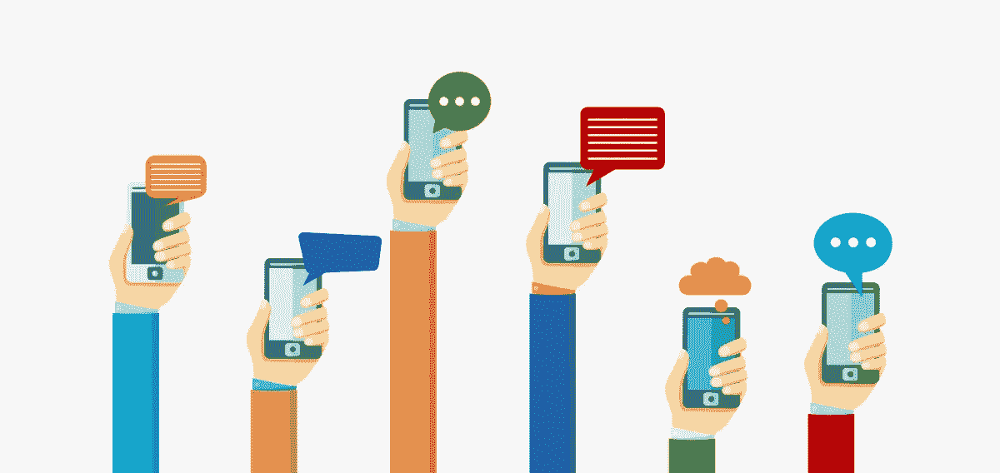
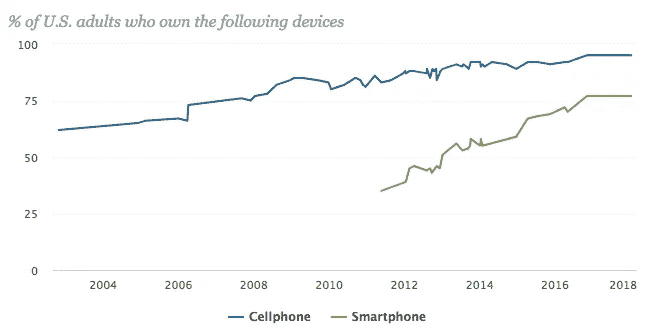
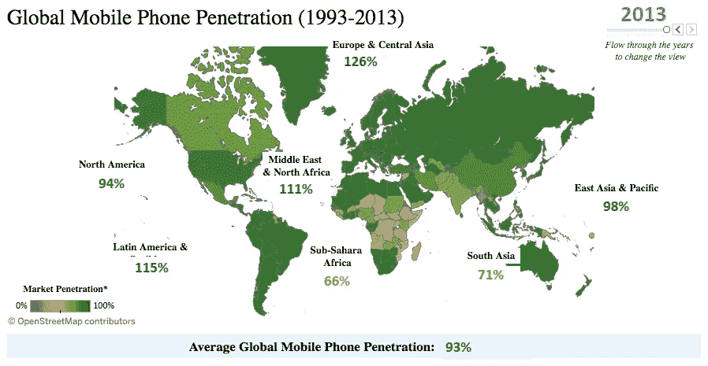
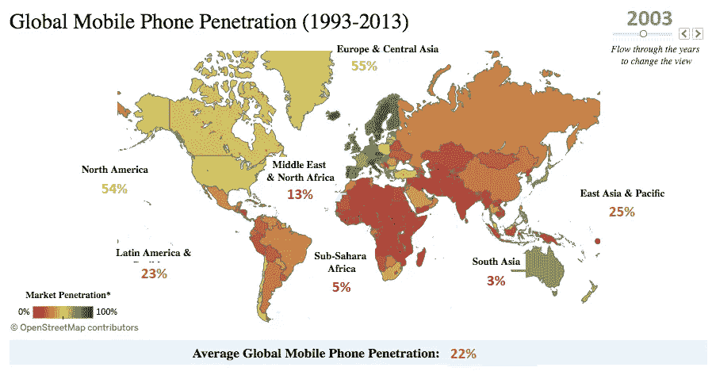
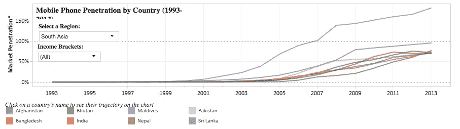
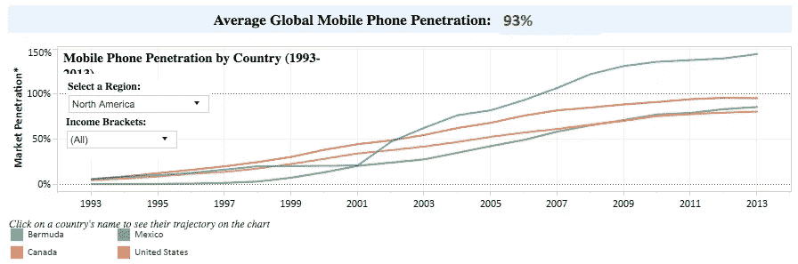
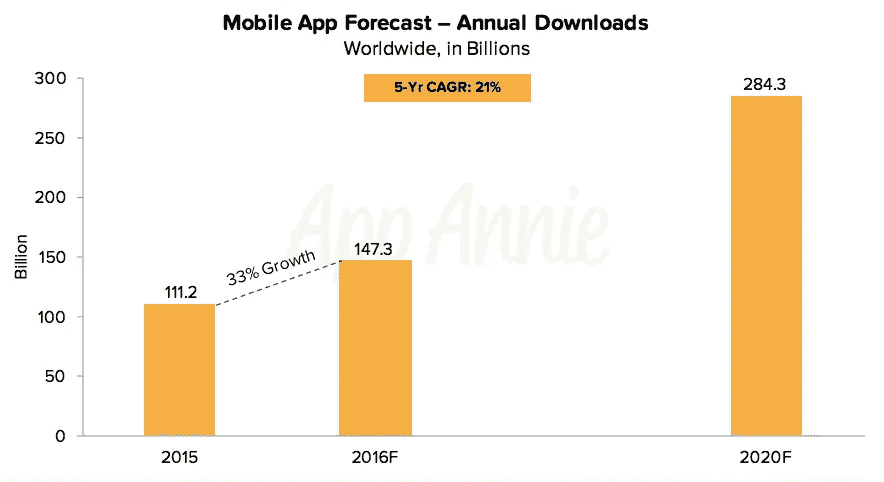

# 为什么越来越多的创业公司开始移动化的六个原因

> 原文：<https://medium.com/swlh/six-reasons-why-more-startups-are-going-mobile-first-7b466b3a7f4a>

第一批社交网站是在进入小屏幕之前在桌面上起步的:脸书、Twitter……MySpace！

一些手机游戏首先统治了 PC:侠盗猎车手，Farmville…接龙！

但如今，一切都与移动设备有关。

从表面上看，移动*一切*似乎都没有意义——你看着一个更小的屏幕，你为所有的数据付费，你的手机贬值比你的汽车更快——然而，手机是全世界数十亿人的首选设备。

由于消费者对他们的手持设备有如此牢固的控制，许多公司从第一天开始就转向了移动，从社交应用程序(Snapchat)，到游戏(Pokemon Go)，到约会应用程序(Tinder)——新公司被迫跟上。

以下是越来越多的创业公司选择移动化的六个原因:

# 使用手机的人比以往任何时候都多

根据皮尤研究中心进行的一系列调查，[95%的美国人拥有手机](http://www.pewinternet.org/fact-sheet/mobile/):

这意味着，在美国近 3.3 亿人中，约有 3.135 亿人拥有手机。

太惊人了！

智能手机的使用(图表中的绿线)增长更快，因为消费者选择的手机不仅仅是拨打和接听电话。今天，人们不再购买手表、计算器、手电筒、照相机、电脑和手机，而是依赖一个可以完成所有功能的设备。

# 有些人只有移动设备

你知道当你搬到一个新的地方或更换供应商，他们试图卖给你一个捆绑的互联网，有线电视和家庭电话？嗯，就像有些人只有网飞，有些人只有手机，企业必须相应地适应。

美国政府在 2016 年底进行的调查显示，超过一半的美国人表示，他们[只拥有手机](https://www.cbsnews.com/news/milestone-for-cellphones-vs-landline-phones/)——也就是说，没有家庭电话服务。在上述皮尤研究调查的智能手机用户中，[20%不在家使用宽带服务](http://www.pewinternet.org/fact-sheet/mobile/)——即没有家庭互联网。

如今，消费者有太多的选择，提供商使自己与众不同的唯一方式是通过营销和其他激励措施(如 T Mobile 为你的网飞付费)。

底线是，移动正变得越来越有吸引力和可及性。一切都迎合了移动，使其成为消费者的首选媒体和通信。

# 在全球范围内，移动设备占据主导地位

截至 2013 年，[全球平均手机普及率](https://blog.cartesian.com/the-rise-of-mobile-phones-20-years-of-global-adoption)为 93%。您可以在下面的地图中看到地区百分比。

拥有一台以上移动设备的人占 100%以上。现在，看看这张图表，与 10 年前相比:

这是一个鲜明的对比，真正有助于说明全球移动运动。被认为欠发达的国家，如撒哈拉以南非洲和南亚地区，现在在活跃的移动使用方面接近世界其他地区。

关于这些地区的问题是增长发生的速度有多快，并且会持续下去。增长不仅仅是稳定的，而是迅速的。看看下面南亚相对于北美的手机增长就知道了。虽然我们已经在西方世界发展了这些技术和特权，但其他的只是最近才被介绍给他们。

发展中经济体正在扩张，而我们的增长保持稳定。长期成功的关键将是弄清楚如何最好地渗透那些饱和市场。北美尚未开发的潜力有限，因此全球化对于任何寻求发展壮大的初创公司来说都至关重要。事实是，这些全球社区最容易通过手机联系到。

# 比以前有更多的赚钱机会

人们如何从应用程序中赚钱？

这取决于你如何定价和营销你的应用。有从广告中赚钱的免费应用程序，对特殊的应用内插件和功能收费的免费增值应用程序，付费应用程序，付费增值应用程序和订阅。您可以在我们的[定价策略资源](https://www.mindsea.com/wp-content/uploads/2018/05/Everything-There-Is-To-Know-About-Pricing-Strategies-For-Your-Mobile-App.pdf)中详细了解每种模式。

随着时间的推移，这些策略发生了很大的变化。有些更适合游戏应用，有些更适合用户群越大的应用——但只要你仔细考虑你的选择，每种策略都提供了一个为你的业务做出巨大改变的机会。

# 未来是移动的

所有的研究都指向了手机的持续增长。GSMA 的[视频很好地展示了这一切:](https://www.gsma.com/mobileeconomy/)

GSMA 预计在 2025 年:

*   将有 59 亿独特的移动用户
*   将会有 50 亿移动互联网用户
*   77%的移动连接将是智能手机
*   移动产业将占整体 GDP 的 5%

特别是应用程序，App Annie 预计到 2020 年(T1)，应用程序下载量将达到 2843 亿次。

手机肯定不会很快普及。

# 现在是时候了！

你还在等什么？

选择建立你的应用理念是第一步。如果你准备好构建你的应用程序，但不知道从哪里开始，[给我们一个欢呼](http://content.mindsea.com/schedule-your-free-meeting-with-our-product-strategist)！

这是将你的应用推向市场的最佳时机，因为请记住，消费者并不在那里寻找你。为了接触到你的观众，你需要到他们所在的地方，而且是在他们的移动设备上。

今天的移动经济和未来的预测是积极的。你的那份馅饼就在那里等着你去拿！

*原载于 2018 年 6 月 4 日*[*www.mindsea.com*](https://www.mindsea.com/startups-go-mobile-first/)*。*

## 这篇文章发表在 [The Startup](https://medium.com/swlh) 上，这是 Medium 最大的创业刊物，拥有 336，210 多名读者。

## 在此订阅接收[我们的头条新闻](http://growthsupply.com/the-startup-newsletter/)。

