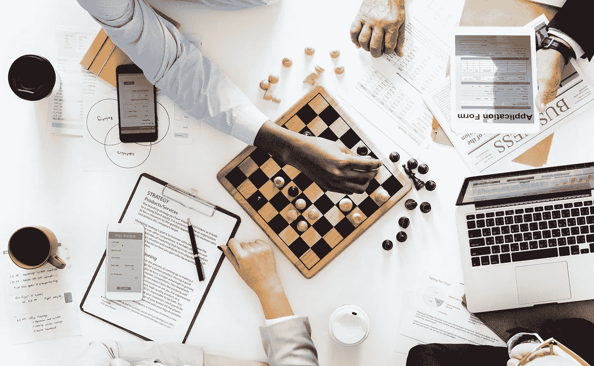

# 六种科学支持的技术帮助你做出艰难的决定

> 原文：<https://medium.com/swlh/six-science-backed-techniques-to-help-you-make-hard-decisions-fde6e234c887>

Originally published on [**JOTFORM.COM**](http://jotform.com)

典型的成年人每天做出 35，000 个决定。

如果你计算一下(算上七个小时的睡眠)，每小时大约有 2000 个决定——或者说每两秒钟一个选择。

大多数决定实际上都是微小的选择，比如点击一个链接或者喝一口咖啡。但是有些选择让人感觉意义重大。