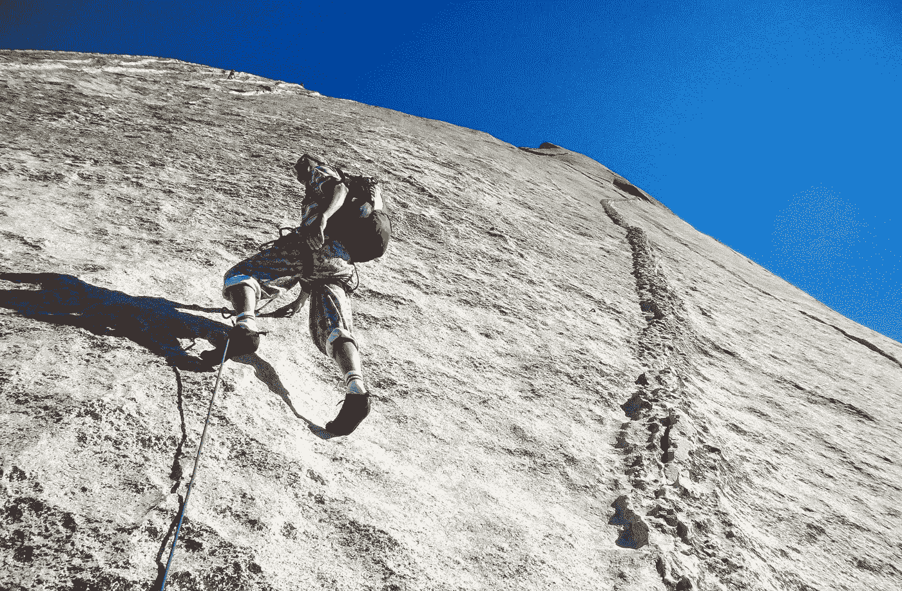

# 清醒的十月教会我的六件事

> 原文：<https://medium.com/swlh/six-things-that-sober-october-taught-me-6558d857c1a8>

要享受健康，要给家人带来真正的幸福，要给所有人带来和平，一个人必须首先训练和控制自己的心。如果一个人能控制他的思想，他就能找到开悟之路，所有的智慧和美德都会自然而然地来到他身边。—佛陀

Photo by [Christoph Deinet](https://unsplash.com/photos/CpMdKHawSRk?utm_source=unsplash&utm_medium=referral&utm_content=creditCopyText) on [Unsplash](https://unsplash.com/search/photos/climbing-mountain?utm_source=unsplash&utm_medium=referral&utm_content=creditCopyText)

称之为自满，昏睡或者只是放任自己，但是九月的某一天，我醒来，在磅秤上称了称自己，看到数字一直在增加 0 > > > 50 > > > 100 > > > 150 > > > 170 > > > 185 lbs！我吓坏了。现在给你一些视角，如果你在 2013 年冬天遇见我，你会看到我是一个 25 岁左右，154 磅，瘦瘦的印度人。在过去，我总是能够轻松自如地随心所欲地减肥，而且速度很快。然而，自从我 30 岁以后，我发现这不再那么容易了。由于缺乏表面上的目的，任何半扳起的尝试都会受到连枷。这可能是我对自己重复的一个心理谎言，但它本身却是一个不可否认的事实。

回到这篇文章的目的，2018 年 9 月中旬，我在想我应该如何利用 10 月份减肥，重新回到更健康的饮食。这与我在乔·罗根的播客中听到的内容不谋而合，他正与他的朋友们开始一个“清醒的十月”,进行为期一个月的清醒和高强度的锻炼。

听了那个播客后，我受到启发，想打造一个属于我自己的“清醒的十月”。作为这次经历的一部分，我学到了以下格言，这些格言比我在 2018 年 10 月份的经历具有更深远的影响。

# 1.弄清楚什么对你来说是重要的

任何探险或冒险的第一步都必须弄清楚你想要完成的是什么。你不一定需要有一张详细的地图来说明你将如何实现它，但是**你需要知道它是什么**。试图理解你想要前进的方向，是你可以采取的最重要的一步，这将帮助你更容易地做出后续决定。

对我来说，就是在月底前减肥并变得更健康。它可以很容易地延伸到你想要完成的任何目标，无论是体育、写作、职业还是任何你想要实现的目标。不同的人有不同的动机。对我来说，精神和身体健康是金字塔的顶端。正如他们在飞机广播上说的，在帮助别人之前，先照顾好自己。虽然从表面上看，说或做似乎是一件自私的事情，但如果你处于表现能力的巅峰，那么在任何情况下，你都可能对你的家人、朋友和周围的人更加有用。

# 2.有具体的目标

当我们还是孩子的时候，经历了教育和学校的严酷考验，进步的模式似乎整齐地摆在我们面前，除了执行任务之外，我们不需要做任何努力。中间的里程碑用图腾很好的定义，比如等级，考试和已经设置好的升级，以职业升级的形式。这种积极的强化表现为频繁的进步——从一个阶级到另一个阶级的提升，这在我们作为孩子和年轻人时是理所当然的。然而，一旦我们跨过那道障碍，步入成年，我们似乎就失去了设定具体目标的能力。当然，我们在工作中有诸如加薪或升职之类的事情，但并不是很多事情都是一成不变的或真正由我们决定的。

对于个人目标和成就来说也是百分之百的正确。当谈到职业和个人成就时，作为成年人，我们更可能“即兴发挥”，而不是对未来几年的发展方向有一个实际的计划。每个人都知道一个经典的面试问题“你认为 5 年或 10 年后的自己是什么样的？”但是没有多少人自己知道答案。当然，你可以说“Arjun，你不知道你在说什么。我很清楚我需要做什么”对此我会说“对你有好处！”。我当然不是想说这适用于每个人，但这是我最肯定感到内疚的事情。

回到这一点的相关性，给一些“清醒的十月”的背景，一旦我决定了我想要前进的方向，我的具体目标是在十月减掉 15 磅。我对自己说，我想在 11 月到来时体重达到 170 磅，并给自己设定一个清晰且容易衡量的目标。

# 3.现实一点，保持简单

当你开始按照自己制定的方案来完成一项任务时，有时不清楚如何执行微小的子任务。在你的头脑中，大局可能是清晰的，但是日常的执行可能是模糊的。每当我面临这样的难题时，我往往会求助于**奥卡姆剃刀**。奥卡姆剃刀是解决问题的原则，即最简单的解决方案往往是正确的。我们倾向于将众多的解决方案融合在一起，并找出一条越来越难实现的道路。相反，有时候保持简单可能是最简单的前进方式。

举个例子，当面临恢复健康饮食的问题时，有无数种饮食可供选择。有古，克托，纯素，阿特金斯，南滩，原料，水果…这样的例子不胜枚举。对我来说，这是令人难以置信的，我很困惑什么路线对我来说是最好的。在这方面，我决定采用健康饮食的第一原则，这听起来很讽刺，但我是真心的——“少吃多锻炼”。当然，这并不是每个人都能做到的，每个人都必须从各种选择中选择一条最好的路，但对我来说，我认为这是最好的路。所以我抓住了公牛的角，决定进行低于 1500 卡路里的饮食，并提供所有必要的营养。这就要求我在计算卡路里时，密切关注与食物相关的宏观因素。基本上，我转向了低碳水化合物-高蛋白饮食，并放弃了所有不必要的碳水化合物和淀粉，如大米、面包、面食和所有其他美味的食物。正如《清醒的十月》中的“清醒”所证明的，饮酒当然是饮食的另一个牺牲品。作为更健康饮食方式的伴侣，我还进行了高强度间歇训练(HIIT)，每周至少三次。我相信解决这个问题的所有这些不同的方面会给我一个很好的机会来实现我的目标。信封背面的数学似乎支持我的假设，所以我勇往直前。

# 4.有时候不知道一切是好的

这一点与我之前的对话有些矛盾，但只是一点点。这是我在过去几个月里开始更加重视的事情之一。由于我在整篇文章中一直在背诵一些不言而喻的真理，这里再来一个——**“无知是福”**。这有两个方面。一方面，这些天我们痴迷于了解一切。我们必须掌握最新的新闻、八卦、播客、照片，以免错过一次谈话/经历，或者在别人面前显得无知。另一方面，随着我们在生活中的进步和知识的积累，我们变得越来越厌恶风险，越来越不愿意带着年轻时的天真去进行新的冒险。然而，如果我年轻一点，我会更容易接受失败的选择，但现在我对某项特定投资的回报更加愤世嫉俗。

然而，有时候你必须要有一个信念的飞跃，相信自己和自己有能力取得成就。在我决定要在这个月内减掉 15 磅之前，我没有可以比较的基准。我认为减掉那么多体重是完全合理的，因为我不知道还有什么更好的方法。十月份才过了两周，我就在某处读到，对于我的体型和体重来说，每周减掉大约 1.5-2 磅是合理的预期。如果这是我在清醒的 10 月份出发前读过的东西，我会将我的最终目标削减近一半，以符合其他人的合理预期。我很高兴我没有。因为我已经是清醒的 10 月中旬，我决定继续前进，把我已经决定投资的工作投入进去，看看潮流会把我引向何方。

# 5.拒绝的力量

这个月最严峻的挑战之一是放弃那些已经成为我生活方式一部分的事情。这包括沉迷于一些我最喜欢的食物，或者参与到某种程度的饮酒社交活动中。根据你的目标执行任务的最重要的方面是你有能力对与目标没有直接关系的事情说不。说不很难。经常说“是”是阻力最小的途径。说不会让你感到反胃和不舒服。有时候，你可能会觉得自己走在一条孤独的路上，但是如果目标对你很重要，你就必须坚持下去。当然，应该对什么说不完全取决于你的谨慎，但是对什么是不 v/s 作出正确的判断是可以区分结果的成功与失败的。在这个月里，我拒绝了很多事情，比如社交活动或在外面吃午餐/晚餐，因为这意味着我不知道我的食物中到底加入了什么。鉴于我正在计算卡路里，这不是一个最佳结果。然而，我确实注意到我的朋友，参加了一些郊游，但没有参加任何食物或饮料，因为这将是两个世界的平衡。当人类的大脑开始关注某件事情时，它会变得异常强大。

# 6.构建、测量和学习

实现目标的最佳方式之一是能够设定一个可衡量的目标，并进行一致的检查，以确定您或您的过程是否需要自我校准才能实现它。我用我的健身计划来跟踪我所有的卡路里摄入量，并记录我的锻炼时间。看到我的食物摄入量以及我的收获的可视化，是一个伟大的助推器，推动我走向完成。在我看来，能够在精神上形象地想象出你正努力实现目标的地方，这要强大得多。构建、衡量、学习是一种哲学，诞生于精益创业方法论学派，由 Eric Ries 提出，实际上是贯穿学科和生活方式的东西。

# 包扎

我成功地坚持到月底，那时，我站在体重秤上，看到自己的体重是 170.2 磅！不完全是我希望达到的 170 磅，但织补接近。我没有在失败的细枝末节上责备自己，而是把它看作是十月灌输给我的积极态度。无论如何，随着时间的推移，与其说是实际人数，不如说是被灌输的整体纪律。我期待着继续这种可持续的生活方式，并在接下来的努力中应用这些学到的原则。

# **想了解我更多，请在 www.arjunrao.co******顺道拜访并问好！或者在 Twitter 上关注我**[**@ raoarjun**](https://twitter.com/raoarjun)**。如果你想分享自己的经验，欢迎在下面评论！👏👏👏****

****

## **这篇文章发表在 [The Startup](https://medium.com/swlh) 上，这是 Medium 最大的创业刊物，拥有+386，607 名读者。**

## **在这里订阅接收[我们的头条新闻](http://growthsupply.com/the-startup-newsletter/)。**

****