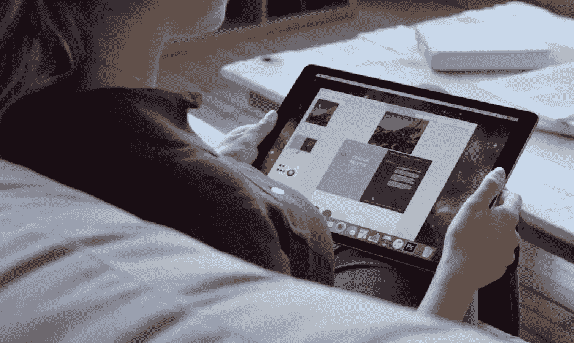
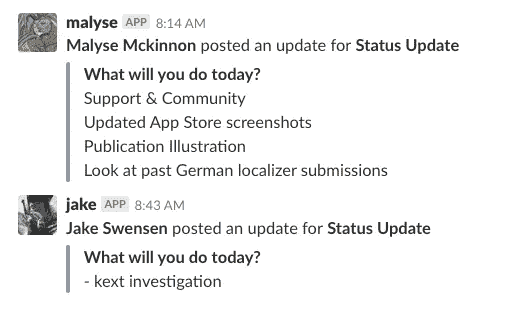
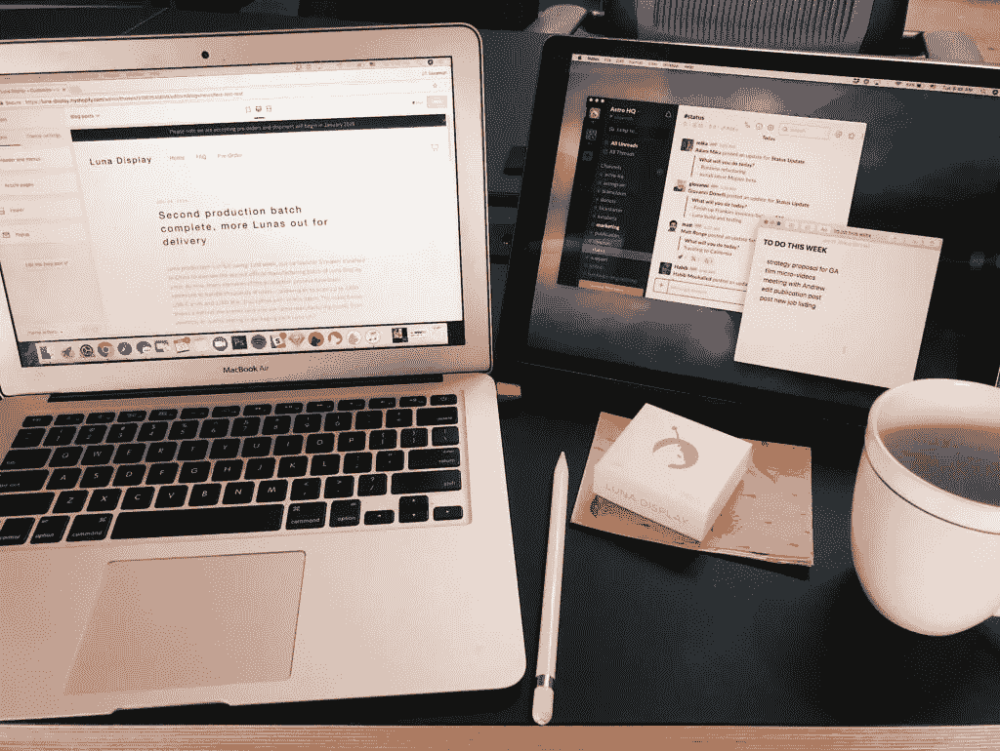
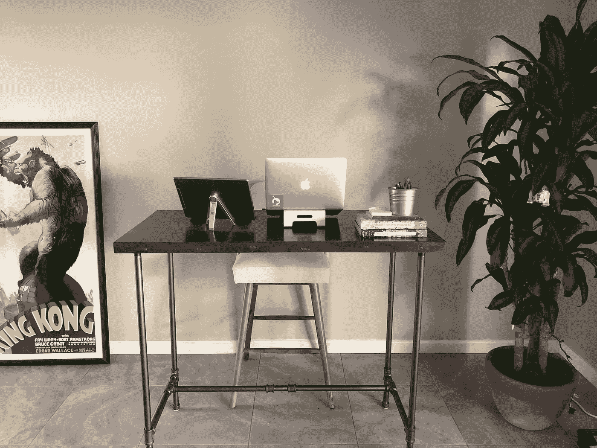

# 过渡到全职远程工作的六个技巧

> 原文：<https://medium.com/swlh/six-tips-for-transitioning-into-full-time-remote-work-3d997f36a4df>

## 作为一名远程工作人员，我如何保持工作效率并与团队保持联系

That’s me!

我已经在 Astro 工作了两年多，我热爱我的工作。它的节奏很快，我有很多责任，我们总是在做一些新的东西。但是当我的男朋友开始一个新的研究生项目时，我面临着从明尼阿波利斯搬到洛杉矶地区的可能性。

因为 Astro 被设计成一家远程公司，谢天谢地，我不用在和男朋友在一起还是保住工作之间做出选择。我基本上可以在任何地方工作——所以我只是收拾好我的车，开车穿越这个国家，继续在加利福尼亚为 Astro 远程工作。

这一举措中最大的调整之一是转变为 100%远程工作。这种生活方式有很多优点和缺点，而且肯定不适合每个人。虽然灵活性很好，但有时也会很孤独。以下是我做的六件事，让我更顺利地过渡到远程生活方式:

# 1.过度在线交流

人们总是说沟通是关键…嗯，他们没有错。远程工作意味着你有额外的责任让你的队友跟上你的工作进度，以及它如何与更大的公司目标相适应。如果在沟通上存在差距，随着时间的推移，你可能会开始感到孤立，并与公司的其他部门脱节。像我们规模的许多其他团队一样，我们依靠 Slack 进行大部分沟通。

在 Slack 中，我们还集成了 Geekbot 和 Donut 等工具。[极客机器人](https://geekbot.io/)是每日站立会议的替代品，帮助团队让每个人了解他们当天关注的最新情况。 [Donut](https://www.donut.ai/) 是另一个机器人，它随机地将团队成员配对进行每周会议，目的是通过视频通话相互了解。这在数字上相当于在办公室和你想进一步了解的人一起喝咖啡。

Each team member shares a daily “Status Update” with Geekbot

我们还严重依赖于 [Zoom](https://zoom.us/) 视频通话来进行长时间的交谈，这在空闲时间是无法进行适当讨论的。除了每周一的全公司会议之外，我每周两次定期通过 Zoom 与我的老板联系。

# 2.时区妥协

明尼阿波利斯和洛杉矶之间有两个小时的时差。但是因为和我一起工作的大部分人都回到了中西部，我发现如果我尽可能地遵循他们的工作时间表，事情会变得更容易。这意味着我比西海岸的大多数人更早开始工作，更早结束工作。这确保了我与团队成员有足够的重叠，以防我有任何问题或需要快速接听电话。另外，它帮助我避开了洛杉矶的交通高峰，对此我无可厚非。；)

# 3.创造一个日常生活

如果你以前从未远程工作过，你可能会有这样的印象:远程工作人员只是整天坐在沙发上，穿着内衣进行视频通话。抱歉让你失望了，但事实并非如此！至少对我来说不是。你很快就会发现，如果你太安逸了，完成工作是极其困难的。

对我有帮助的一个技巧是做好准备，就好像我要去办公室一样。在我坐在电脑前，我会化妆、穿衣服、喝杯咖啡。奇怪的是，穿上鞋对我的工作效率也有很大的影响。这都是为了欺骗自己，让自己处于一种富有成效的心态。就像你有一个夜间作息来通知你的大脑该睡觉了(洗脸，刷牙，穿上睡衣)，你也可以建立一个早晨作息来通知你该去工作了。

我也喜欢在日常生活中安排休息时间。坐在你的电脑前吃午饭很容易，但相反，我喜欢故意停下来吃午饭，花时间远离我的电脑。有时我会去午间跑步，帮助理清思绪，从不同的角度思考工作。

# 4.加入共同工作空间

如果你像我一样，几周后你可能会厌倦在家工作。我会几天不出门，除了去健身房，过一段时间后，你的士气开始受到打击。所以，我加入了一个合作空间！这是一个开放的办公空间，有远程工作者、自由职业者、艺术家和小型创业公司的大杂烩——有咖啡、啤酒和康普茶。我有灵活的会员资格，所以我可以来去自由。我通常每周有三天在我的共同工作空间工作，其他时间在家工作。

共同工作空间不仅是改变我工作环境的好方法，也是认识人的好方法。因为我刚到这个州，当你是一个远程工作者时，很难交到朋友——但是共同工作给了我机会去认识和我情况一样的人。

# 5.为您的工作空间配备合适的工具

仅仅因为你不在办公室工作并不意味着你不需要合适的工具来完成你的工作。我个人有三个必备工具用于我的设置——强大的 WiFi、立式办公桌和 Luna 显示器。

强大的 WiFi 连接是显而易见的。由于我与队友的大部分协作都是通过变焦视频通话完成的，我不想因为连接不畅而处理视频问题。

在我的家庭办公室里放一张立式办公桌更像是我的个人喜好。我每天花在电脑上的时间太多了，所以我喜欢站着工作来弥补。

最后，我每天都用 [Luna Display](https://lunadisplay.com/?utm_source=Tips%20for%20Remote%20Work&utm_medium=The%20Startup%20Medium&utm_campaign=Tips%20for%20Remote%20Work) 把我的 iPad 变成 Mac 的第二个显示器。我们开发 Luna 的部分原因是因为作为一家公司，我们了解远程工作流的痛点。我喜欢它，因为它很容易携带，安装也非常简单——无论是在我的共同工作空间、咖啡店还是在飞机上。

My coworking space setup with Luna Display

My standing desk at home with [Luna Display](https://lunadisplay.com/?utm_source=Tips%20for%20Remote%20Work&utm_medium=The%20Startup%20Medium&utm_campaign=Tips%20for%20Remote%20Work)

# 6.安排时间和你的团队出去玩

即使有最巧妙的远程设置，也没有什么能完全取代与你的团队面对面交流的价值。我非常感激的一件事是，在去完全偏远的地方之前，我和我的老板在同一个城市工作了两年。在那段时间里，如果我有一个问题或者一个新的想法，我可以直接找他进行简短的交谈。它是随意和不费力的。那段时间真的让我和我的老板对我们的工作方式有了很好的了解，所以当我去偏远地区的时候，误解的机会已经很少了。

作为一个团队，我们也有一年两次的“太空周”，每个人都飞到明尼阿波利斯一起工作一周。这几周不怎么有成效，更多的是出去玩。我们一起度过了很多快乐时光，一起吃饭，花时间互相了解。我们的天文周使我们剩下的远程合作更加真实和顺利。

如果你正在考虑转为全职远程工作，记得把它作为一个迭代的过程。你和你的团队应该一直努力寻找让体验更自然的方法。这可能会让你感到尴尬和沮丧一段时间，但是随着时间的推移,*会变得更容易。*

*最初发表于* [*Astro HQ*](https://blog.astro-hq.com/remote-work-tips/) *。*