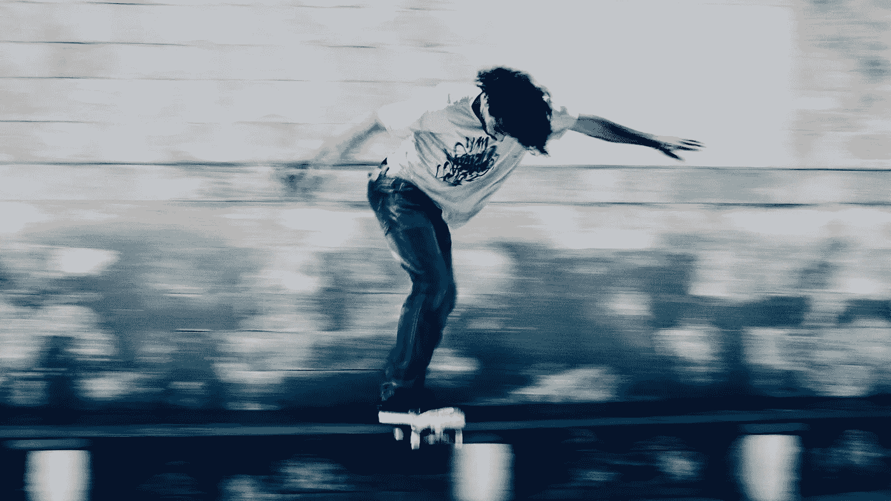

# 自我保健滑板

> 原文：<https://medium.com/swlh/skateboarding-for-self-care-78b831e49b8b>

## 通过快乐建立适应力。

Photo by [Sweet Ice Cream Photography](https://unsplash.com/photos/hGo6lgpBwIw?utm_source=unsplash&utm_medium=referral&utm_content=creditCopyText)

我喜欢滑板，我一直都喜欢。我年轻的时候经常骑自行车，但后来我在跳楼梯时受伤了，就不再骑了。这是一次特别愚蠢的跳跃——它太高了，而且着陆表面不够平滑。我用前脚踩碎了木板的前部。我弄断了木板，结果弄断了我的脚踝。

之后我就放弃了。我没有把板子换成新的。

受伤后不久，为了努力成长，我进入了咨询行业。在我看来，人们似乎把自己看得很重。至少我开始把自己看得太重了。有了强制性的联想笔记本电脑和西装，他们似乎不得不将自己的身份一分为二。

*工作*的自己，和*真实*的自己。

一方面，去找客户，谈论数字和投资回报的自我。另一方面，那个自由地谈论快乐和压力的自我。裤子下面有纹身的那个自己。喜欢音乐，艺术，喜欢滑板的自己。

我羞愧地离开了它。我否认了很大一部分我是谁。我认为滑板对我不好，因为我可能会受伤。我认为自己浪费了时间。自我对话持续不断:我应该做些更有成效的事情。

我过去喜欢去玩滑板。我们经常出去，练习技巧和滑轨。迫在眉睫的危险和内在的挑战是我们坚持下去的动力。乔丹·彼得森断言:

> “孩子们需要足够危险的游乐场来保持挑战性。人们不寻求最小化风险；他们寻求优化它。当不受约束和鼓励时，我们更喜欢生活在边缘。在那里，我们仍然可以对我们的经历充满信心，并面对帮助我们发展的混乱局面。”

我们正在建立信心和韧性。不管怎样，我们又试了一次。我们不在乎后果。我们没有考虑到骨折的风险。除了最终的成功之外，没有什么需要考虑的了。我们知道这将会发生。如果不是今天，那就是明天。

然后就发生了。我着陆了。

当我做的时候，我没有做记录。我没有考虑拿到墩牌的几率。我没有计算投资回报率——我投入练习的时间与着陆的次数之比。

我重新开始骑马，纯粹是为了享受骑马的乐趣。

无处可去。一事无成。享受这一刻吧。

足够安静的是，在滑板运动中可以学到很多关于生活的东西。当你无处可去的时候，你享受这一刻。没有议程，没有复杂性。只有风，你，和旋转的车轮。你可能会摔倒，但你不会去想它。一小块岩石随时可能挡住车轮。你可能会绊倒。

有时候你会。不过，通常不会发生什么严重的事情。你掸掉灰尘，回到冲浪板上。

同样，生活给了你无法预见的障碍。你可能会在任何时刻被绊倒。你不能控制所有的结果；你不可能提防每一块小石头。你不能控制每一种情况。

你*只是* *的坐骑*。尽你所能保持领先。当你摔倒时，你必须站起来保持平衡。如果你喜欢这个过程，如果你喜欢你的日子，你会在跌倒后兴奋地站起来。

> 我不得不改变观点，意识到保持快乐是我自己的责任。

最近一年，我开始努力接受自己。通过大量的自我反省、指导和养成新习惯，我取得了真正的进步。没有判断。我不再自嘲了。

我对自己很满意。

我什么都不应该做。不后悔。一切都很好。

除此之外，我了解并接受了我喜欢玩滑板。我错过了。我决定为了乐趣而定期骑车。

所以我给办公室买了一块便士板。不开玩笑。

它是香蕉黄色的。

我骑车去买杯咖啡，我骑车去打电话。我短途旅行。我喜欢每一个。纯粹的幸福。

如果出了问题，我每天都有一点期待。

这是我每天的快乐。

*(我也非常感谢他们让我在办公室里骑行)*

问问你自己:

*   我一天中有多少这样的时刻？
*   我是享受还是克制自己？
*   我每天都在期待什么？

我们楼里的一位服务小姐问我今天早上过得怎么样。我告诉她我过得很好。她回答说听到这个消息太好了，她非常喜欢听到人们这么说。

她说遇到快乐的人给了她希望。

当我问别人怎么样时，他们通常会这样回答:

> “还可以更好。”

但是它真的能变得更好吗？

我们很幸运生活在这样一个时代，我们可以自由地用时间做几乎任何我们想做的事情。如果你身体健康，有工作保障，还有比这更好的吗？

当你完成了今天计划的工作的恐惧，明天也不会变好。下个月项目结束时，情况也不会好转。十年后，当你为你想要的东西存钱，或者当你最终做了你喜欢的工作时，情况也不会更好。

除了今天，没什么好担心的。你是唯一能掌控你日常快乐的人。

你有责任让你的一天变得精彩。

# 写下让你快乐的事情

谢丽尔·理查森讲述了她不久前做的一个练习。她曾经每天写下十件让她快乐的事情。一些小事情，比如在甲板上晒日光浴，或者爬下到干净的床单上，或者享用一顿丰盛的晚餐。或者专注地听一首喜爱的歌曲。

她意识到她生活中没有多少乐趣。她明白了她必须先照顾好自己才能为他人服务。当她受到挑战时，她知道她有一个给她带来快乐的活动库。

她接着写了一本关于极度自我护理艺术的畅销书。她一直在为其他人服务，是美国最受认可的高管教练之一。

她必须先倒满自己的杯子。

除了这一刻，没什么好担心的了。

我们意识体验的现实总是现在。

**今天当家。**

*非常感谢您的阅读。我努力通过探索你的创造力让你的一天变得更好。请通过回复这篇文章来分享你的经历。* ❤️

## 这篇文章发表在 [The Startup](https://medium.com/swlh) 上，这是 Medium 最大的创业刊物，有+ 379，528 人关注。

## 订阅接收[我们的头条新闻](http://growthsupply.com/the-startup-newsletter/)。

