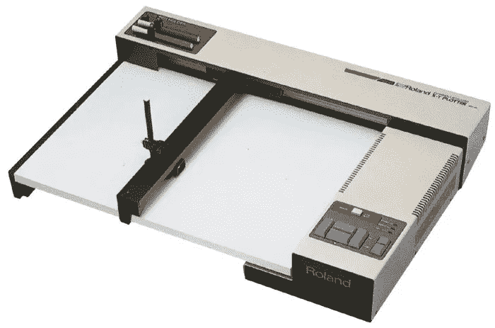
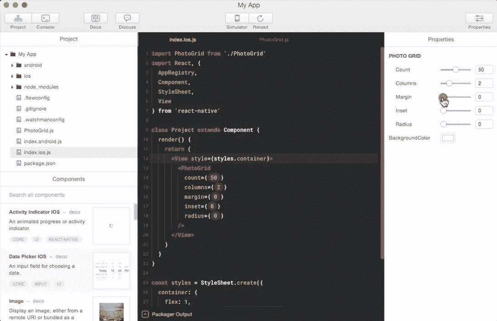
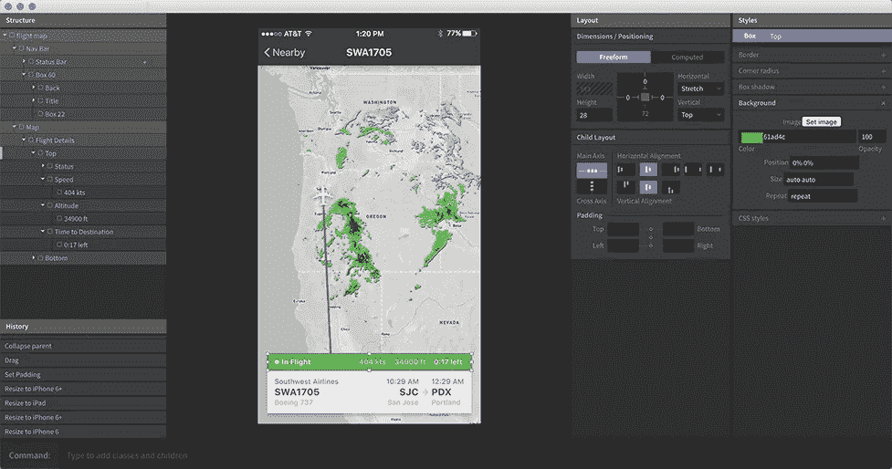
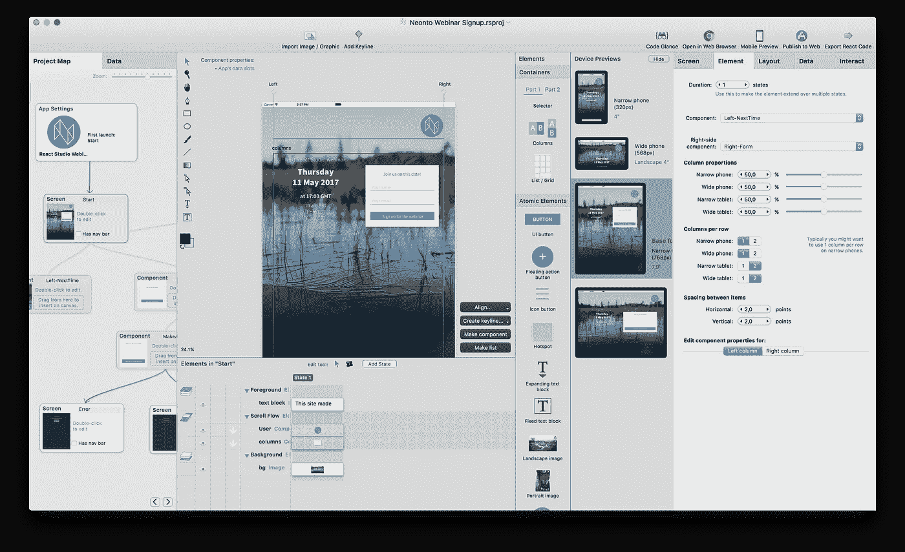
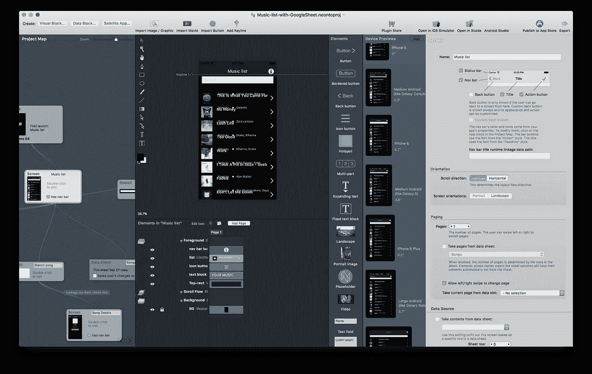

# 草图不是 UX 的设计工具

> 原文：<https://medium.com/swlh/sketch-is-not-a-ux-design-tool-e819e55e7f54>

> 这款流行的 Mac 设计应用是对“纸笔模拟器”的改进，但并不试图模拟用户体验。甚至那些构建了一个完整的 React 渲染器来为 UX 设计使用 Sketch 的人也在寻求摆脱它。未来在别处。

绘制矢量图形是个人电脑最早的专业应用之一。在 20 世纪 70 年代末的西部蛮荒时代，一旦有了质量尚可忍受的微处理器和显示设备，你还会发现勇敢的黑客试图以某种方式将线性代数算法和详细的模型数据压缩到 64K 的内存中。他们中的一些人成功了，一些人甚至赚了数十亿——我最喜欢的创业书籍[欧特克文件](https://www.fourmilab.ch/autofile/)是一个这样的公司迅速崛起的未经编辑的账户。

我正在输入这篇文章的计算机的内存是那些系统的 262144 倍，令人难以置信，但矢量图形软件看起来惊人地相似。那些原始的绘图程序实际上是“纸笔模拟器”，因为它们的输出是绘图仪。如果你是 Snapchat 一代，解释这款设备最简单的方法就是用一张图片:

A Roland DXY-100 plotter from 1982

绘图仪很简单，是一个非常原始的机器人，在纸上移动笔。普通市场上还没有高质量的激光和喷墨打印机，所以绘图仪是将矢量图从计算机中取出并放到永久介质上的唯一选择。(你真的想这么做。那个时代的磁盘肯定不是一个长期存储任何有价值数据的地方...)

从绘图仪派生的矢量图形应用程序的基本设计。你的屏幕工作区是一个画板——一张纸。钢笔工具代表了一支真正的钢笔。路径的默认渲染操作是“描边”,因为这是钢笔的功能。填充和渐变是后来才出现的(在 Adobe 发明和标准化 PostScript 之后)。Illustrator 建立在 PostScript 的光栅功能上，但没有改变以纸张为中心的核心工作流程。

这一切似乎显而易见。怎么可能不是呢？一个可能的答案是，我们可以看看计算机设计工具的另一条进化路线，它不受同样的纸笔约束:3D 建模和渲染。

总的来说，3D 是一种“真正的数字”表现形式。有用于工业设计的 CAD 工具可以对物理世界的行为进行建模，但是作为基线，建模和动画工具甚至不会假装代表任何物理事物。您拥有无限的工作空间和无限多种组合元素的方式。为了从模型中生成图像，可以使用着色器，这是一个真正的数字概念，来源于编程，而不是任何特定的物理模型。(着色器可用于模拟物理表面材料，也可用于模拟纯粹虚拟的视觉模型——这是一个很好的例子，说明了超越仅仅模拟笔和纸的重大概念飞跃。)

所以现在，在 Illustrator 首次发布 30 年后，设计工具领域几乎没有什么变化。随着时间的推移，Illustrator 本身自然积累了包袱，最近的竞争对手如 Sketch 和 Figma 通过提供相同功能的简化版获得了成功……但基本模型本身保持不变。您可以通过选择画板尺寸来创建草图文档，然后在其中放置元素；所有的东西都是由路径构建的，这些路径并不比 1980 年用来模拟绘图仪绘图的路径更智能。还是纸笔模拟器。

最近的一个开源项目凸显了这个问题。上个月，Airbnb 发布了一款名为 [React-sketchapp](https://airbnb.design/painting-with-code/) 的有趣工具。它是一个将 React JavaScript 代码的输出转换为草图文档的库。随着这一发布的消息在社交媒体上传播，人们普遍感到兴奋……(“反应”和“草图”是当今 UI 黑客的迷魂药。)但是也有普遍的困惑:一个人到底如何使用这个库？

在[黑客新闻讨论帖](https://news.ycombinator.com/item?id=14196077)上，该图书馆的开发者乔恩·戈尔德(Jon Gold)有益地解释了它在 Airbnb 的用例。在代码中实现可视化组件后，团队可以使用 React-sketchapp 创建包含与代码匹配的渲染矢量图形的草图文件。在像 Airbnb 这样的大公司，这将代码作为“真实的来源”,并确保设计师使用最新版本的视觉组件。

这个房间里有一只大象:为什么代码需要被转换成平面的“纸笔模拟器”类型的文档，以便设计人员可以对其进行处理？想象一下，如果这个库被称为“React-plotter”:它将从代码中生成与绘图仪兼容的文件，这样设计师就可以得到 UI 组件的打印输出，并可以使用剪刀和胶水来制作他们的设计……这听起来有点倒退，不是吗？然而，将有生命的组件平面化为无生命的草图文档的现实基本上是一样的。

我没有以任何方式批评 React-sketchapp。这是一个非常聪明、实现非常漂亮的库，解决了 Airbnb 规模的一个尖锐问题。但现实是作者自己也认识到了我指出的问题。在上面链接的黑客新闻中，他写道:

> [……]这是一小步，让我们了解到 Deco 和 Subform 等以组件为中心的工具已经足够好，可以让我们的设计团队真正转向。

那些构建了一个完整的 React 渲染器，仅仅是为了能够为 UX 设计使用 Sketch 的人正在寻求摆脱它。未来在别处。

下一代工具不能再是纸笔模拟器了。画板、图层和路径已经有 40 年的历史了，但它们并不适合用来比喻设计软件。你看不到建筑师使用乐高积木来规划整个建筑…那么为什么软件行业的设计师仍然坚持使用与乐高积木对建筑的用户界面具有相同(不存在)建模智能水平的工具呢？

我相信 CAD 工具的发展也可以为软件行业提供一些非常有价值的想法。在接下来的一篇文章中，我将探索 CAD 建模的现状，以及一些概念如何应用于软件开发。*【2018 年 8 月补充:* [*新文章来了！*](/swlh/design-development-and-the-wysiwyg-trap-what-the-software-industry-can-learn-from-architecture-7398642af80c)

*一个核心的学习是:UI 设计师将需要开始在一个更高的层次上思考— *,但这也意味着放弃一些控制*。建筑师使用的 CAD 工具不会将注意力集中在挑选窗帘和桌布的精确颜色上；然而，在 UX 世界，这种对细节的过分控制往往被视为设计工作的核心焦点。(并不是说关注细节不重要——它很重要！但是建筑的目的和形式比窗帘的质地更重要。)*

*现在，我将为您留下一些新工具的链接，这些工具试图以一种设计者友好的方式对软件 UX 建模，包括上面引用的 Jon Gold 的话中提到的两个工具:*

**

***德科** [https://www.decoide.org](https://www.decoide.org)*

*用于 React Native 的以组件为中心的 IDE。*

*这还是一个程序员的工具。Deco 没有用于创建布局的设计 UI，所以你需要知道 JavaScript 和 React Native 来制作任何东西。*

*该公司最近被 Airbnb 收购，工具[的开发已经停止](https://techcrunch.com/2017/05/02/airbnb-has-acquired-partner-deco-software-deco-ide-is/)，但是整个 decode 是开源的，所以任何人都可以继续工作。*

**

***子表单
【https://subformapp.com】**T3*

*一个新的设计工具，指出了我希望看到的类似 CAD 的未来。*

*到目前为止，Subform 还没有提供给除了 beta 测试人员之外的任何人，所以不可能判断它实际上如何实现承诺。*

*Subform 的另一个缺点是它不提供开发者链接。设计仍然是独立于代码的静态实体，因此实现它们仍然需要像以前一样手工编程。似乎也没有任何方法可以将代码中实现的组件带回设计环境(类似于 React-sketchapp 所做的)。*

**

***React 工作室**
[https://reactstudio.com](https://reactstudio.com)*

*web 应用的前端设计工具。*

*React Studio 制作完整的 ReactJS 项目(使用脸书的[“create-react-app”工具链](https://facebook.github.io/react/blog/2016/07/22/create-apps-with-no-configuration.html))。*

*这种代码生成是独特的卖点:使用 React Studio 不需要成为程序员，但软件也提供了许多钩子，供开发人员通过脚本和插件定制代码输出。React Studio 的核心叫做[“设计编译器”](/@reactstudio/meet-the-design-compiler-17ae89f985bb)。使用插件，您还可以将手动编码或修改的 React 组件引入设计环境，因此这是一个双向链接。*

*缺点是有一个相当长的学习曲线:许多概念对于有传统图形背景的设计师来说是陌生的。*

**

***neon to
neonto.com/nativestudio[原生工作室](https://neonto.com/nativestudio)***

*React Studio 的姊妹产品。它使用相同的设计编译器方法，但输出 Xcode 和 Android Studio 项目。*

*Native Studio 提供了一种叫做“无框架跨平台移动开发”的东西。很简单，这意味着该工具为每个平台生成本机代码；没有中间框架或库。传统的跨平台解决方案，如 Xamarin、React Native 等。所有这些都使用运行时库将跨平台代码翻译成本地概念。相反，Native Studio 方法在构建时生成本机代码。这是一种非常不同的跨平台方式，需要设计者和开发者之间一定程度的合作/信任才能真正有效。*

*你认为这里应该提到的任何其他软件？请在评论中告诉我！*

*(你也可以[在 Twitter 上关注我](https://twitter.com/pauliooj)，如果你绝对坚持的话！)*