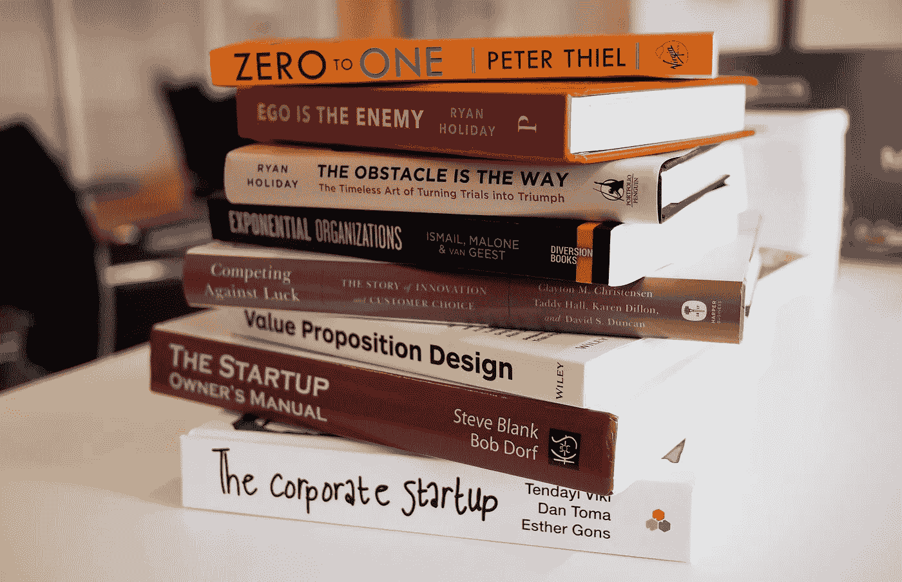

# 我在创业第一年低估的技能

> 原文：<https://medium.com/swlh/skills-i-underestimated-in-the-first-year-of-my-startup-a938e7bd71d7>

我深知创业的风险和挑战，这让我兴奋地直面风险，战胜挑战。我相信每一个想成为企业家的人和许多真正的企业家都有这样一个问题:“我具备成为企业家的条件吗？”当然，网上有很多建议和技巧，甚至是激励你前进的名言。激情和动力都在，所以肯定没问题。但是，你有技巧吗？

> 学会如何学习是人生最重要的技能—托尼·布赞

在我和其他三位联合创始人创业的第一年，我知道团队中拥有不同技能的重要性。作为个人，我通过获取新技能和发挥我的内在技能来努力实现个人和专业的卓越。一路上，有一些基本技能我完全低估了它们有多难学。

以下是我创业第一年低估的三项技能。

# **1。** **评书**

我开始意识到，讲故事是我们如何相互交流的基础，无论是在我们的个人生活、商业还是社交圈子中。一个精心设计的故事能有效地传递信息，并让许多人铭记于心。影响听众，抓住他们的兴趣，跨越所有的年龄障碍是一个有效的讲故事的影响。

了解并运用讲故事不仅会强化你的故事，还会培养观众想要的兴趣。通常，我们用太多的信息把故事搞得过于复杂，需要很长时间才能抓住要点。而一个真实的故事旨在保持故事情节简单，让故事尽可能贴近观众，具有情感吸引力。

这听起来很容易，但我可以告诉你这并不容易，因为讲故事的人和听故事的人之间的接触是故事变得生动的原因。这就需要你去练习，去思考你的故事讲的是什么，讲给哪些观众听，最重要的是带着什么情调。如果有一件事我学到了并且必须遵守，那就是人们会忘记我做了什么和我正在做什么，但是人们永远不会忘记我带给他们的感受。

> “讲故事是将想法融入世界的最强有力的方式。”—罗伯特·麦基

所以，跟我分享一下你的故事吧。

# **2。** **建立业务关系**

当你计划创业时，你围绕你的事业建立的关系将影响你 80%的成功。不管你的想法有多棒，你的团队有多少人才，或者你有多少资金，如果你没有稳固、有效的业务关系，你将为生存而进行不必要的战斗。因此，建立业务关系应该是你的首要任务。

就我而言，我一直喜欢建立关系，仅仅是因为结识新的人，如供应商、客户或合作伙伴，让我感兴趣。然而，困难的部分不仅仅是建立一种关系，而是长期维持这种关系——相应地互相帮助，真诚地关心对方的幸福和成功。

这里有一个转折:偶尔，我不得不与我不喜欢的人，或者与我完全不相关的人一起工作。但是，为了生意，我必须和他们保持职业关系。有时候，那些意想不到的人会真正为我的网络增加价值。所以，我想说的是，在你生活的各个方面与人建立牢固的商业关系。

> 如果你认为生意是建立在关系上的，那就把建立关系变成你的生意—斯科特·斯特拉特恩

# **3。** **团队管理**

有人会认为管理一个团队不应该那么困难，但是仍然有很多挑战。因为我是管理这个团队的人，我知道这有多难。让我回忆一下我不得不面对的一些挑战:

*   每个人都有自己的观点，但并不是每个人都愿意付诸行动或努力将这个伟大的想法变成现实。有些人更容易站在一边批评。
*   信任很难获得，更难维持。
*   团队成员的不作为导致团队内部更多的冲突。

然而，如果团队成员之间步调一致，团队可以取得惊人的成果。这需要团队经理抽出时间以身作则，带领其他成员。投入更多的时间去了解团队——他们的个人故事、激情以及他们的优点和缺点。委派团队，果断决策。

更重要的是， ***享受吧*** 。团队管理通常具有挑战性，但通常是有益的。领导一个工作出色并交付成果的团队是一种很棒的感觉，所以去做吧！

*原载于 2018 年 2 月 6 日 ye-chen.com***。**

**

## *这个故事发表在 [The Startup](https://medium.com/swlh) 上，这是 Medium 最大的企业家出版物，拥有 293，189+人。*

## *在这里订阅接收[我们的头条新闻](http://growthsupply.com/the-startup-newsletter/)。*

**