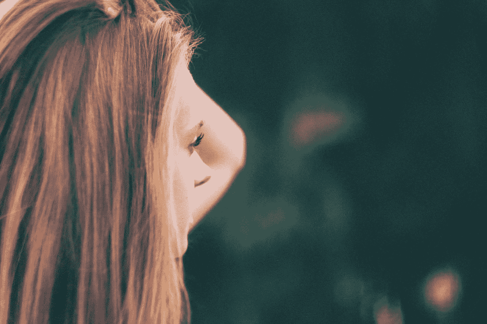
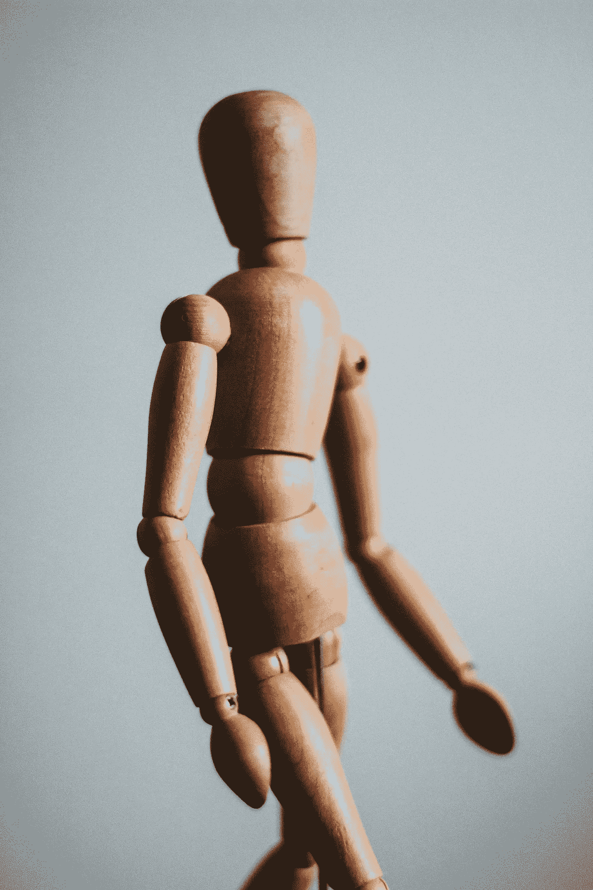
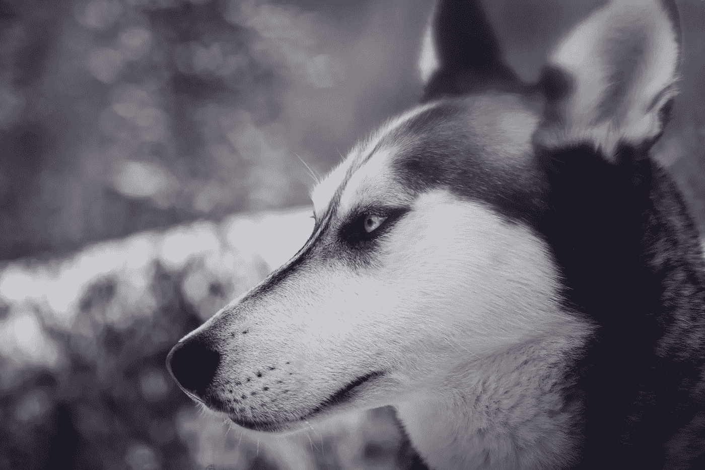

# 重新找回你的天赋的技能

> 原文：<https://medium.com/swlh/skills-to-reconnect-to-your-genius-8a466486b14b>

对我来说*要学习的最伟大的事情之一就是*从我的脑海中消失*。*

*回顾过去，我明白了世界就是这样运转的。所以我花了几十年的时间，相信每一个出现的想法。反复思考，有时对过去耿耿于怀，害怕或期待未来会发生什么特别的事情。*

*这些“技能”没有帮助我应对生活带给我的任何挑战。*

*我相信我的思维越强，我就能更好地理解我的生活，生活也会更顺利。*

*我不再关注我的身体。只要它在需要的时候有食物，一点运动和温暖——我以为它被覆盖了。*

*所以当我发现自己竟然一丝不挂时，我感到很惊讶。*

*我一直在简化我的一个主要部分——***天才部分***——我的身体及其直觉知识。*

## ***一种认识方式***

*创造力一直是我生活中很重要的一部分。当创业和抚养孩子成为头等大事的时候，我已经完全放下它好几年了。*

**

*Photo by [Kira auf der Heide](https://unsplash.com/photos/_Zd6COnH5E8?utm_source=unsplash&utm_medium=referral&utm_content=creditCopyText) on [Unsplash](https://unsplash.com/search/photos/creative?utm_source=unsplash&utm_medium=referral&utm_content=creditCopyText)*

*我涉足了人们通常认为的大多数“艺术”形式，从图形到陶瓷到素描和绘画。*

*这件事早就被遗忘了，直到有一天，我和一个好朋友谈起我们在大学时创建的项目。*

*在一阵兴奋和期待中，我们翻出了我的旧作品集。一些我多年来从未想过的事情。*

*我们终于找到了。1979 年我刚上大学时，母亲给我做的文件夹。*

*它被藏在我的地下室储藏区的后面。我把它拿出来，满是灰尘，快散架了。*

*一想到要看到我存放在那里的东西，我就越来越兴奋。我终于找到了拉链的拉环——铁锈已经把它熔上了。*

*我们难以置信地看着对方。*

*我决定，“反正都快散架了……我要把它切开”。*

*我照做了。*

*当我把作品拿出来看的时候，我感到一股鸡皮疙瘩涌遍全身，只有它在我的脑海里像火花一样。然后，当鸡皮疙瘩掉下来的时候，一种压倒一切的对快乐的回忆涌上心头。*

****那种刁蛮的感觉说明了一切。****

*我突然对自己的身体高度敏感，因为所有创作和表达的记忆都涌了回来。*

*我认为自己是一个“创造性感知”的人。*

*无论是素描、绘画还是着色，具有“创造性”不仅仅是涉猎艺术材料——它是一种感知、思考、存在和联系的方式。*

*在过去 10 年左右的时间里，我研究了许多涉及人类心理学和个人成长的项目——但没有一个项目的影响力能与创造性正念相提并论。*

*我正在开设一门课程，从 2018 年 3 月 12 日**开始**，使用名为**的创造性正念来产生你的内在天赋**。如果你想了解更多，[这里有链接。](https://lucys-school.thinkific.com)*

> *“我们有一种称为神经可塑性的天然能力，这意味着如果我们学习新知识，获得新经验，我们可以开发新的神经元网络或电路，并真正改变我们的想法。”乔·德彭扎博士*

## ***改变的技巧***

*创造性的正念可以转变。它将人类成长的最前沿**方法、**身心连接**(正念)以及**艺术疗法**(创造力)汇集成一个实用生活技能的集合体。***

*这些过程帮助我重新连接了我的思想和身体，所以我变得完整了。*

*从仅仅相信出现的每一个想法并据此做出反应，到一个完全真实和完整的人。*

**

*Photo by [Melissa Chabot](https://unsplash.com/photos/dbRzRdHfXho?utm_source=unsplash&utm_medium=referral&utm_content=creditCopyText) on [Unsplash](https://unsplash.com/search/photos/mindful-animals?utm_source=unsplash&utm_medium=referral&utm_content=creditCopyText)*

****完全呈现并用心调谐。****

*这让我发现如何更容易地释放情绪和痛苦的事件，这样他们就没有力量把我拖下水，并为我控制我的思想。*

*相反，我可以**识别“重复”的生活模式**，创造新的更健康的生活模式。*

*在那些时候，当挑战性的情绪或情况出现时，我可以**让自己**扎根，而不是陷入沉思。*

*我可以更清楚地听到其他人在交流什么，从而变得更真实，加深关系。*

> *诺曼·多吉说，“没有什么比被固定在同样的环境中更能加速脑萎缩了。”*

*创造性正念和我研究过的其他项目一起**彻底改变了我的观点，**以及我每天如何面对我的工作、我的孩子、我的家人、我的朋友——我之外的世界。*

*改变的机会每天都围绕着我们。*

*只有当我们在场并参与其中时，它们才变得显而易见。*

*想想那些被错过的机会，因为你一直在你的身体里空着，坐在你的头脑里，而它一直在远处漂浮。*

*对自己有信心。*

*知道你是有韧性的。*

*做个决定。*

*并采取行动。*

****你比你相信的还要多。****

*在我的网站[这里](http://www.lucycrisetig.com)注册，下载我的电子小册子*“创造你的内在天才”*。*

**

## *这篇文章发表在《创业公司》杂志上，这是 Medium 最大的创业刊物，有 303，461 人关注。*

## *订阅接收[我们的头条新闻](http://growthsupply.com/the-startup-newsletter/)。*

**