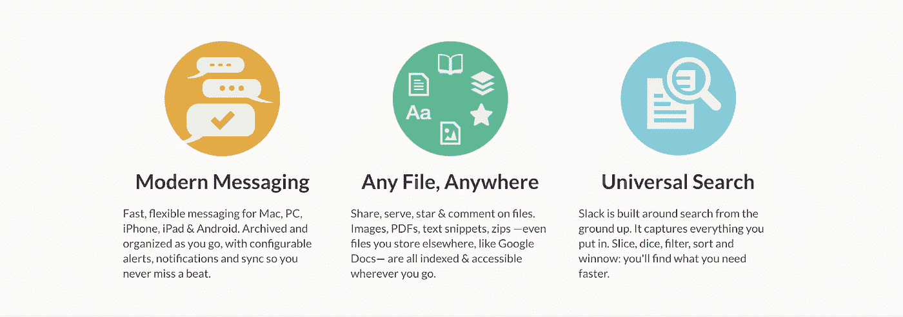

# 懈怠文案:他们对每月 960 万的浏览量说了什么

> 原文：<https://medium.com/swlh/slack-copywriting-what-they-say-to-9-6-million-pageviews-every-month-4351888f1c2c>

*对 Slack 主页五次更新的调查显示:*

*   当卖功能比卖好处更有力量的时候
*   一种经常被忽视的通过网站分享情感的技巧
*   Slack 如何改变他们所说的最重要的特征

话不是凭空出现的。它们源于思想和价值观，经过精心组合、选择和提炼。一遍又一遍又一遍。

正确的单词，以正确的顺序，在正确的时间，在正确的地方，引发了读者大脑中数十亿的神经元。大脑说，*“啊哈！”意识到话语的力量，Slack 创始人[斯图尔特·巴特菲尔德写道](/@stewart/we-dont-sell-saddles-here-4c59524d650d)他们的使命很重要，但“我们的工作也是理解人们认为他们想要什么，然后将 Slack 的价值转化为他们的语言。”*

以下是每位首席执行官、营销人员和广告文案都需要考虑的五种网站技巧:

# 1.何时销售功能而非优势

[*Full version (December 5, 2013)*](http://web.archive.org/web/20131205150613/https://slack.com/)

有一个基本的销售和营销理念，那就是每个人最好卖的是利益而不是功能。大多数人认为这是一个硬性规定，一个永恒的最佳实践。文案鲍勃·布莱(Bob Bly)[写道](https://www.bly.com/Pages/documents/STIKFS.html)，“在消费者广告课上，我们被教导利益就是一切，功能并不重要。”

[在给他的团队的备忘录中](/@stewart/we-dont-sell-saddles-here-4c59524d650d)，Butterfield 坚持这一原则，确认销售有价值的结果，如“降低沟通成本”将使 Slack 找到更多的买家，而不是只写他们的软件产品或特定功能集。这正是他们在其网站的第一版(V1)中所做的，“不要那么忙”

[*Full version (October 20, 2014)*](http://web.archive.org/web/20141020014409/https://slack.com/)

他们网站的 V2 没有这么多的话，但[讲解者视频中的主要故事是通信如何限制增长](https://www.youtube.com/watch?v=B6zVzWU95Sw)(“我告诉他，我的公司完全依靠电子邮件和 Dropbox 运行，我们做得很好……这是不可持续的，因为我希望我的公司增长。必须有所改变”)。

该网站提出的问题是，“Slack 真的有用吗？”该网站将提供答案，也能理想地迫使读者采取行动。

然而，Slack 对他们网站的 V3 采取了意想不到的，艰难的，正确的做法。标题可能会让你挠头:

[*Full version (July 23, 2015)*](http://web.archive.org/web/20150723215138/https://slack.com/)

Slack 卖的不是一个结果，而是一个软件产品和一系列功能:

“面向团队的消息应用。”

"您所有的通信都集中在一个地方，与您每天使用的工具和服务集成在一起."

我不认为这是一种倒退或疏忽。在 V1，Slack 一开始有一个好处(“不那么忙”)。在 V3 中，Slack 希望更好地控制人们如何描述他们。

例如，Slack 小心翼翼地将自己定位为“一款信息应用”，而不是像《The Verge》和《T2 时代》对 Slack 的描述那样的“聊天应用”。“消息传递”的内涵听起来比“聊天”(AIM、ICQ 等)更专业、更现代。

更重要的是，Slack 还将他们最初出现在 V1 的功能提升为 V3 中的主要功能[，“在一个地方进行所有的交流”](https://medium.dave-bailey.com/the-magic-formula-to-describe-a-product-in-one-sentence-175ce38619c7)

这两个句子都是故意放在那里，让人们容易记住，并通过口头交流来分享。

投资者马克·安德森在推特上发布了这张图表，展示了 Slack 前所未有的病毒式口碑增长。为了利用这种轰动效应，Slack 的团队确保其他人可以用具体的方式描述它。“不那么忙”描述了结果，但没有描述真正的松弛是什么，所以人们被迫自由发挥一些笨拙的版本，“群聊，但更好。”

在那种情况下，谈话可能会以“哦，我们已经试过了”结束。让尽可能多的人分享一条容易记住的信息，对 Slack 来说会更好。在 V3 中，Slack 销售产品和引导功能，因为*通过口碑*让客户更容易理解、记住和分享。他们已经建立了他们可以产生的结果，产生共鸣的信息，他们想用口碑增长来火上浇油。

我还怀疑这份拷贝是为了表彰特定的客户，这是耐克表彰运动员和苹果表彰创造力的一种变体。这是在一个增量更新中暗示的，它建立在这个网站上…

在这半个迭代中，我们称之为 3.5 版，页面开始:

[*Full version (September 18, 2015)*](http://web.archive.org/web/20150918145153/https://slack.com/)

" "面向团队的消息应用程序"

然后动画打出，“谁把*机器人*放在*火星*！!"

NASA 的喷气推进实验室是世界上数以万计的团队之一，他们使用 Slack 使他们的工作生活更简单、更愉快、更有效率

最初的“团队信息应用”现在更有意义了。我可以看到 Slack 突出其他客户。例如，NBC 环球，“面向娱乐数百万观众的团队的消息应用程序。”它提供了强有力的社会证据，企业中较大的买家对这些名字感兴趣。(“如果它为美国宇航局工作，它也会为我们工作。”)

*Image by* [*Dwayne Nesmith*](https://dwaynenesmith.com/book-review-template/)

这就是这些大买家的本质，杰弗里·a·摩尔在他的开创性著作《跨越鸿沟》中称之为“实用主义者”他这样描述实用主义者:“推荐信和人际关系对这些人来说非常重要，有一种“陷阱 22”操作:实用主义者不会在你建立之前向你购买，但是你只有在他们向你购买之后才能建立。”

Slack 在这个网站上的目标是传播一个易于读者分享的升级句子，注入美国宇航局带给他们的社会证据。每当这些实用主义读者中的一个对他们的电子邮件或他们当前的群聊解决方案感到沮丧时，他们会记得 Slack 不仅仅是“一个信息应用程序”，而且是“美国宇航局使用的一个信息应用程序”

# 2.通过证明讲述情感故事

以下是 Slack 在 V1 首次自我介绍的方式:

“Slack 将您所有的交流集中在一个地方。这是现代团队的实时消息传递、归档和搜索。”

因此，他们的证明来自现代团队中的人:

现在，几乎每家公司都使用奖状。但是通过他们的推荐，Slack 开始强调具体的**情况**、*解决方案*、以及 ***感受*** 。请注意 Medium 设计和 UX 首席设计师达斯汀·塞诺斯的早期作品:

“**我们一直在寻找有助于团队沟通的东西**，直到我们开始使用 Slack，没有什么东西真正卡住了。它**看起来很好，感觉很对，搜索也很管用**:能够相信我在需要的时候能再次找到东西是件好事 ***心平气和*** 【着重号补充】”

或者，在 Slack 网站的第二版中，About.me 创始人托尼·康拉德说，“ ***我基本上爱上了 Slack*** 。*我们用了不到 24 个小时就把所有人都带上了*(你也知道，人是抗拒变化的)，而 ***简直太神奇了*** 。

自然，Slack 也有可能参与了这些感谢信的制作——类似于作者如何让忙碌的人们写书评。

随着人们对品牌的熟悉和信任，他们对解决方案的可信度不再感兴趣。产品功能的优先级越高。Slack 最终会将这些感谢信更深地植入他们的网站。

# 3.仔细删除功能描述

我注意到 Slack 非常严格地遵循三法则(“omne trium perfectum”)。如果你看一下上面的评价截图，他们在评价中展开了三个描述(“它就像是你整个团队的无限大脑”、“更快地做出更好的决策”和“一个搜索框搜索一切”)。

他们对这一规则的坚持延伸到他们对特征的描述。这些功能是如何演变的:

*V1*

***现代短信*** *快速、灵活地为 Mac、PC、iPhone、iPad & Android 发送短信。随着您的移动进行归档和组织，具有可配置的警报、通知和同步，因此您不会错过任何一个节拍。*

***任何文件，任何地方*** *分享，服务，明星&评论文件。图像、pdf、文本片段、压缩文件——甚至是你存储在其他地方的文件，比如谷歌文档——都被编入索引&，无论你走到哪里都可以访问。*

***万能搜索*** *懈怠是从地面开始四处搜索建立起来的。它捕捉你放进去的一切。切片、切块、过滤、分类和精选:你会更快找到你需要的。*

*V2*

Slack 是一个团队交流的平台:所有的东西都在一个地方，可以即时搜索，无论你走到哪里都可以使用。

*V3 —这是一个旋转标题 GIF。*

***渠道*** *通过跨团队、项目和主题的对话渠道保持组织有序*

***集成*** *把你已经在用的工具塞到 Slack 里，把你所有的通知放在一个地方。*

***强大的搜索*** *将你的搜索重点放在查找某个特定的人或时间的邮件或文件上。*

让我们来看看 Slack 是如何开发这些产品功能的:

V1 的“任何文件，任何地方”变成了 V2 的“所有东西都在一个地方”变成了 V3 的“集成”

V1 更具体和描述性，但使一些读者的眼睛掩盖了冗长的描述。V2 字面上是四个字。然后，V3 真的达到了期望的结果——“在一个地方获得所有的通知。”

V1 的“通用搜索”变成了 V2 的“即时搜索”，V3 的“强大搜索”

尽管像 V1 所描述的那样，搜索是从零开始建立的，这很好，但是 V3 Slack 发现大多数人想要两样东西——从特定的人或特定的时间找到某些东西。

这意味着，默认情况下，V1 的“现代信息”变成了 V2 的“随处可用”，变成了 V3 的“频道”V3 在这里发生了完全不同的转变。

“现代信息”和“随处可用”基本上是关于 Slack 的移动功能。但是，Slack 认为渠道在 V3 中更重要。我怀疑这个决定实际上是在最后一分钟做出的(考虑到副本缺少一个句号)。在这一点之前，手机已经是软件的赌注了，所以读者可以放心地认为 Slack 拥有了手机。更重要的是，这一点巩固了“组织”的概念团队可以通过团队、项目和主题来组织对话，而不是局限于“聊天室”(Hipchat(后来的 Stride)一直使用的术语)。

# 4.不要让别人来定义你

Slack 最初的“登陆和扩张”业务策略是 VMware、Twilio 和 Salesforce 采用的策略。以足够便宜的价格模式出售软件，让人们可以立即购买，而不需要法律或会计部门的许可。然后，软件将在整个组织中传播，通过口碑传播增长，价格也将相应提高(例如，每个用户的 Slack 费用、每个消息的 Twilio 费用、每个实例的 VMware 费用等。).

到目前为止，我只看了 Slack 的 V1、V2 和 V3，因为他们都尝试了相同策略的变体——为现代团队解决沟通问题，通常是在大型技术组织或较小的初创公司中。V3 已经开始做出这种改变，在 3.5 版中由 NASA 主演。但在他们网站的 V4 版中，Slack 转向了新的受众。它解决了一个不同的问题，更直接地与大型企业的业务经理对话，而不再是为他们工作的人。

[*Full version (January 15, 2017)*](http://web.archive.org/web/20170115124439/https://slack.com/)

> 工作发生的地方。
> *不管工作对你来说意味着什么，Slack 把你需要的所有东西和人聚集在一起，这样你就能真正把事情做好。

让我们来分解一下…

与 Slack 最初承诺用户将“不那么忙”，或者它是“团队的消息应用程序”相反，“工作发生的地方”，是 Slack 是工作发生的*地方*的承诺。对更多的人来说，这是一个不同于最初的承诺。它甚至没有提到一个关于消息或通信的字。

Slack 的商业策略是将通信问题作为进入组织的特洛伊木马来解决。他们在这里展示了一个更大的野心，成为一个生产力套件。他们不再只关注“工作”的“沟通”部分，这表明未来的功能/产品将针对其他生产力挑战。如果我们从 V3 进行推断，它可能试图将“你所有的工作放在一个地方。”这一消息变化恰逢 Slack 的风险投资基金公告一周年。该基金鼓励第三方集成，并扩展 Slack 的能力。

星号语法可能是从耐克的使命“给世界上每一个运动员带来灵感和创新”中重新组合而来的其中联合创始人比尔鲍维尔曼澄清，“如果你有一个身体，你是一个运动员。”很像 how 荣誉运动员，然后将定义扩展到每个人，这是 Slack 试图将他们的应用扩展到单一有限的受众之外。这不是 Slack 第一次重新组合他们渴望的品牌策略之一。

V3 主页上以产品为中心的内容并没有凭空消失。相反，他们把它移到了产品页面( [/is](http://web.archive.org/web/20170119044001/https://slack.com/is) )，稍微修改了一下，并突出了一个新产品。在后续文章中会有更多这方面的内容，将会涉及 Slack 的内容策略。

注意“工作*发生的地方”的故意被动尽管“不要那么忙”中的“Be”是一个被动动词，Slack 现在更多地将自己定位为一个无处不在的*场所*。“团队”不再被提及。Slack 的竞争对手现在已经不是 IRC，Hipchat，Campfire，和 Flowdock 了。它们是:

*   [微软团队](https://products.office.com/en-us/microsoft-teams/group-chat-software)(“微软团队。认识 Office 365 中的团队合作中心”)
*   [思科 Webex 团队](https://www.webex.com/products/teams/index.html)(“让团队合作成为你最好的工作。Webex Teams 是一款通过视频会议、群发消息、文件共享和白板实现持续团队合作的应用程序”)
*   [IBM 韵文电子邮件](https://www.ibm.com/ca-en/marketplace/business-email-platform)(类似于“IBM 韵文。利用了解您工作方式的商务电子邮件提高工作效率”)
*   [IBM Connections](https://www.ibm.com/ca-en/marketplace/ibm-connections)(“IBM Connections。借助集成的协作平台提高工作效率、做出更好的决策并促进创新”)
*   微软 Outlook 和 Gmail(用我朋友乔伊的话说，“Slack 最大的竞争对手一直是电子邮件”)

Gartner 可能会将 Slack 称为“[工作流协作(WSC)解决方案](https://www.gartner.com/doc/reprints?id=1-4K5I75F&ct=171108&st=sb)”，但 Slack 的文章吸引了不熟悉这些词的人。相反，Slack 将自己定位为引入一个全新的、无定形的类别。Slack 的描述仍然是具体的，没有提到诸如“团队”、“协作”或“生产力”之类的流行语。与他们作为消息应用的表现形式类似，WSC 解决方案标签对他们来说只是一个暂时的阶段。

引入一个新的类别并不容易，尤其是像电子邮件这样的过时技术已经统治了几十年。惯性是有原因的。然而，Slack 一直在向前推进，相信他们的产品和清晰的沟通会让人们看到 Slack 的价值。

# 5.展示，不要说，你卖什么

我记得和他们的一位顾问一起经历了一次客户推销练习。在我们所有的推销之后，顾问说，“推销很好，但是你需要激发和鼓舞我。”我相信大多数销售人员都以这样或那样的方式学到了这一课。

不幸的是，这通常表现为某种形式的“我很兴奋地告诉你，一个机会出现了……”和一个即将关闭标签的读者。

尽管组织转型是 Slack 的卖点(正如 Butterfield 所描述的)，但他们*从未公开提及此事*。首先，“组织转型”对他们的声音来说太专业了。

相反，Slack 给他们的网站注入了例子。一些更明显的例子——V2 向观众展示了实施 Slack 后三明治视频的变化。在 3.5 版本中，Slack 让人们体验了他们的消息应用如何改变了 NASA。

许多技术公司被束缚在一种认真的方法中，这种方法并不能使他们的产品公正。他们拥抱 Slack 的 V2(团队交流的平台)的喧闹版本，当他们更适合描述一个结果时(V1 的“不要那么忙”))，或者更大的未来愿景(V5 的“工作发生的地方”)，并展示他们*真正*在卖什么的例子。

Slack 从一个非常简单的以用户为中心的价值主张开始(“不那么忙”)。这个短语和副标题创造了一种强烈的视觉效果，一种持续他们网站每次迭代的模式。当你修改和升级你的网站时，根据你的产品的位置和你最重要的读者的痛苦和渴望来构建它。人——“读者”、“客户”、“市场”、“用户”——不断变化，他们的思想也是如此。

*如果你喜欢这篇文章，看看第二部分:*

 [## Slack 的内容战略是如何从单一页面扩展到媒体公司的

### 对 Slack 网站、社交媒体和内容策略的调查显示:

medium.com](/swlh/how-slacks-content-strategy-expanded-from-a-single-page-to-a-media-company-afe2e7fd9dbc) 

*特别感谢* [*乔伊·洛伊*](https://www.linkedin.com/in/joeyloi/) *和* [*维杰·杰亚帕兰*](https://www.linkedin.com/in/vijayjeyapalan/) *对这个早期版本的想法。*

*感谢阅读！我是赫伯特，* [*奇妙穿梭*](http://wondershuttle.com/work/) *的创意总监。我们是一家营销工作室，在网站和内容方面与 Shopify、Wattpad 和 Twilio 等客户合作。我们的* [*内容画布*](http://bit.ly/contentcanvas) *是营销人员和战略家用来创建有用的、有感染力的内容的框架。*

*截至 2018 年 7 月，SimilarWeb 估计 Slack 的首页是 1.28 亿浏览量* 的 7.5%访问的 [*。*](https://www.similarweb.com/website/slack.com#websiteContent)

## 这个故事发表在 [The Startup](https://medium.com/swlh) 上，这是 Medium 最大的企业家出版物，拥有 355，974+人。

## 在这里订阅接收[我们的头条新闻](http://growthsupply.com/the-startup-newsletter/)。

