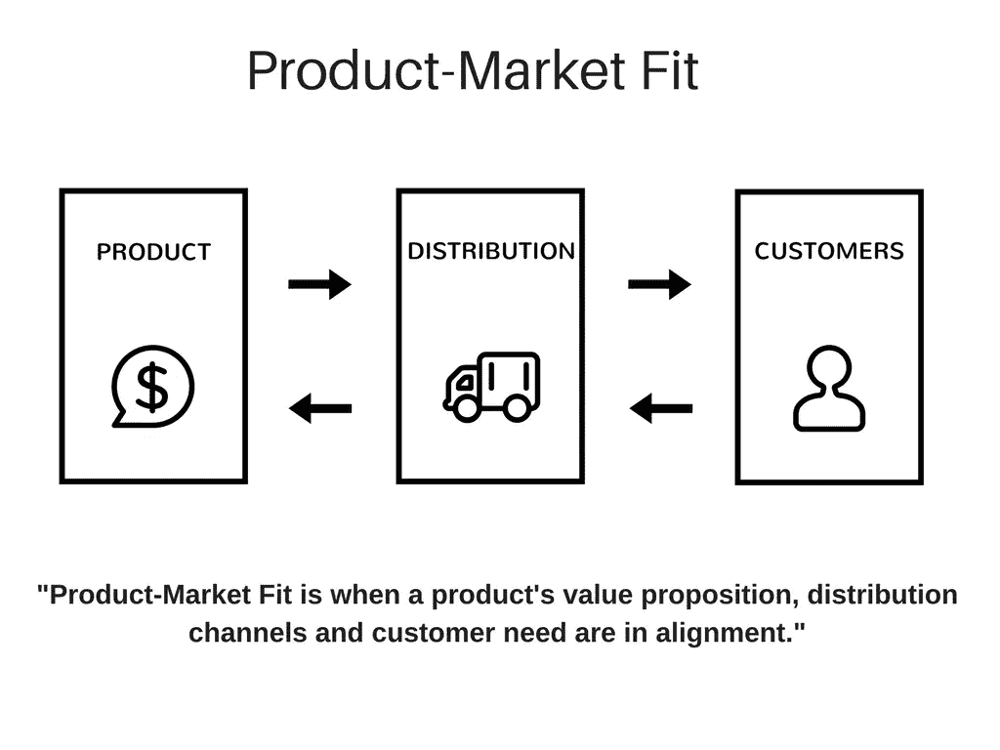

# Slack、Dropbox 和 Spotify 如何实现产品与市场的契合(以及你如何也能做到)

> 原文：<https://medium.com/swlh/slack-dropbox-spotify-product-market-fit-318838eb7de2>

Photo by [Farzad Nazifi](https://unsplash.com/photos/p-xSl33Wxyc?utm_source=unsplash&utm_medium=referral&utm_content=creditCopyText) on [Unsplash](https://unsplash.com/search/photos/startup?utm_source=unsplash&utm_medium=referral&utm_content=creditCopyText)

> “产品/市场匹配是指在一个好的市场中拥有一种能满足该市场需求的产品。”—马克·安德森

我发现有必要把产品市场适合(PMF)的定义放在这篇文章的前面和中心。这对任何商业或创业企业的成功都至关重要。

如果你能在一个市场中找到自己的位置，你就大大增加了成功的几率。

如果找不到，这往往是创业公司旅程的终点。

这篇文章将提供三个引人注目的例子，说明科技公司如何找到适合自己的市场，并在此基础上扩大规模。我还将提供三个重点领域来帮助确定市场。

首先，让我们更深入地了解一下我们所说的产品-市场匹配的含义及其构成。

## 什么是产品-市场契合度？

“产品”和“市场”这两个词的使用清楚地暗示了这一术语背后的含义。“适合”是具有约束力的部分，表明公司的产品和市场的消费者对所交付的价值达成一致。正如 Marc 所说，这为我们提供了一个良好的市场，一个满足其需求的产品。

一些定义中可能缺少的一个关键要素是分配的功能。在这一点上，我发现把 PMF 看作这三个部分的结合点是很有用的。

一家初创公司将需要全部 3 个 T2 才能真正达到 PMF。非常擅长这三项中的两项可能会带来一些短期收益，但从长期来看是不可持续的。一旦实现，快速增长的路径应该变得显而易见，并且可以有效地执行。

以下是三家知名科技初创公司寻找市场的情况。

## Slack:每个用户都很重要。

虽然现在是一个明确的企业组织，但该公司通过关注个人和团队用户规划了通往 PMF 的道路。由于专注于对产品问题的高度响应和[令人愉快的用户交互](https://twitter.com/SlackLoveTweets)，Slack 团队能够将客户转化为口碑营销力量来推动采用。

该应用从 2014 年 2 月推出时的 15，000 名日活跃用户增长到 2015 年 6 月的 110 万，再到 2016 年 10 月的[400 万](https://venturebeat.com/2016/10/20/slack-passes-4-million-daily-users-and-1-25-million-paying-users/)。所有这些都没有数百万美元的营销预算或销售团队。！！).

增长可以归功于自上而下以用户为中心的方法，创始人斯图尔特·巴特菲尔德在早期处理了 Twitter 的大部分评论。该公司继续将反馈作为核心资产，为用户提供多种与 Slack 团队沟通的方式。

Slack 的故事是赢得“客户”的故事之一。通过尽可能收紧反馈环，他们能够完成几件事:提高用户满意度，更快地迭代产品，更快地获得认同。将产品和客户紧密联系在一起也有助于销售:向团队销售，然后让那些满意的用户对公司大加赞赏。

## Dropbox:去你的市场所在的地方。

我们这个持续同步设备和云服务的时代已经模糊了我们的文件不经常排列的最近的过去。2008 年，Dropbox 推出了文件同步服务，改变了这一切。

虽然修复了一个明显而普遍的问题，但团队仍然难以吸引用户。怎么办？

Dropbox 的联合创始人德鲁·休斯顿设计了两种非常成功的方法来找到合适的产品。

首先:[他制作了现在著名的四分钟解说视频](https://youtu.be/7QmCUDHpNzE)，并在当时排名靠前的新闻聚合网站 Digg 上分享。[他们的测试候选名单一夜之间从 5000 飙升至 75000。](https://techcrunch.com/2011/10/19/dropbox-minimal-viable-product/)

休斯顿没有测试多种分销渠道，而是利用了 Digg 中的固定受众，在 Digg 中，社交分享是常态。Digg 的用户群(更年轻，懂技术)提供了大量早期用户，他确保包括社区成员认可的社会参考。

第二:Dropbox 发起了一场病毒式的推荐活动。该活动奖励现有用户额外的存储空间，用于在社交媒体、电子邮件或通过让他们的朋友注册来分享服务。

同样，Dropbox 找到了另一个很好的分销渠道，可以直接吸引现有的受众。通过激励他们的用户，所提供的社交证明自然吸引人们尝试这项服务。

## Spotify:攻击灰色地带。

灾难过后往往是机遇。机遇常常会使灾难本身相形见绌。

丹尼尔·埃克在 21 世纪初 Napster 和其他 P2P 文件共享网络崩溃后看到了这个机会。这些网络促进了大规模的“共享”(现在被视为大规模侵犯版权)，这在当时是新普及的互联网的一个巨大的灰色区域。因此，随着听众转向网上消费音乐，通常是从非法渠道购买，音乐产业已经开始看到专辑销量大幅下降。

埃克的理论:会不会有一部分人，哪怕是很小的一部分，愿意为合法消费支付一小笔费用？

事实证明，Spotify 诞生于这一特定的灰色地带。这家初创公司能够认识到，产品与市场匹配的许多要素已经到位，只差一个合法产品。音乐内容已经存在，在线和移动设备提供了完美的分销渠道和一个现成的音乐盗版市场，可以转化为合法的流媒体。

随着流媒体服务的发布，音乐爱好者现在可以免费访问几乎所有他们喜欢的歌曲，而没有任何合法性问题。这个简单的价值主张如此强大，以至于 Spotify 已经能够在推出近十年后[保持 20%至 30%的年增长率。](https://techcrunch.com/2018/03/26/spotify-thinks-its-revenue-growth-will-slow-to-reach-6-4-billion-this-year/)

## 找到适合你的

虽然这些评论有助于研究成功的初创企业是如何获得牵引力并迅速扩大规模的，但它们往往对新企业缺乏适用性。

*企业家如何才能让人们对一个为特定市场设计的产品产生兴趣？*

通过扩展视角和改变已有工作的意愿，产品与市场的契合可以更快实现。等式的每一部分都有 3 个想法。

## 1.经常迭代。

企业家最常犯的一个错误是过于依赖他们的特定产品，而不是他们试图解决的问题。打破这种束缚，你实施产品变革的意愿就会增加。

在早期阶段，应该抓住每一个机会来修补或调整产品，以便积极采用。缺点是最小的，通过实验可以学到的东西是非常有价值的。

独特的核心功能可能更难修改，但要注意产品整体提供的外部元素。网站文案、定价、包装、配色方案和试用长度都是激发兴趣的重要手段。

## 2.通过已建立的渠道工作。

正如 Dropbox 的例子所示，产品和市场之间的联系往往是最困难的部分。今天的数字时代为企业家提供了多种分销选择，但哪一种可能适合特定的产品呢？

保持事情简单，通过目标市场之间已经建立的渠道开展工作。消费者通常对他们习惯的渠道给予更多的信任和信赖，这有助于降低可能未经测试的产品的风险。

问自己一个好问题:如果我想了解更多关于 X 的知识，我会去哪里？

## 3.基于解决方案的定位。

每个人都有问题，收到的信息比他们能处理的还要多。

要脱颖而出，少一些“噪音”,多一些对客户的个人“声音”。向他们展示你如何解决一个特殊的问题，以及之后他们的生活会有多好。这种方法十有八九会成功。

重要的事情要记住:功能对大多数人来说毫无意义，时间通常是短缺的。跳到人们想听的内容，突出优势。

Photo by [José Martín Ramírez C](https://unsplash.com/photos/45sjAjSjArQ?utm_source=unsplash&utm_medium=referral&utm_content=creditCopyText) on [Unsplash](https://unsplash.com/search/photos/business?utm_source=unsplash&utm_medium=referral&utm_content=creditCopyText)

不那么有趣，也不那么实证的事实:许多伟大的产品和企业都因未能与市场接轨而消亡。

合理的商业想法、有共同问题的潜在客户群和付费营销活动都是徒劳的。

不结盟意味着没有美元。

让产品与市场相适应成为任何商业战略的核心部分，都会带来巨大的变化。以这一理念为核心的战略的效果，有助于为企业建立持续研究和学习的基础。

努力在这三个部分之间取得平衡，即使一切看起来都很好，也要继续实验。最终，没有一种适合是永久的。

## 您的企业如何满足客户的特定需求？

## 感谢阅读和分享！掌声👏 👏表达你的感激，也帮助朋友找到这篇文章。

## 你可以在 [LinkedIn](https://www.linkedin.com/in/richquintyn/) 或 [Twitter](https://twitter.com/richquintyn) 上找到我。

## 接下来:

 [## 自动驾驶汽车可能带来什么

### 当我们奔向无人驾驶的未来时，有些事情值得期待。

medium.com](/modern-thoughts/what-autonomous-vehicles-may-bring-7d761b524947) 

## 上一个:

 [## 现代卖家的 7 个销售博客

### 这里有 7 个增加你销售知识的好地方。

medium.com](/modern-thoughts/7-sales-blogs-for-the-modern-seller-eeace33554e2) 

## 这篇文章发表在《T4》杂志《创业》(The Startup)上，这是 Medium 最大的创业刊物，有 316，638 人关注。

## 在这里订阅接收[我们的头条新闻](http://growthsupply.com/the-startup-newsletter/)。

