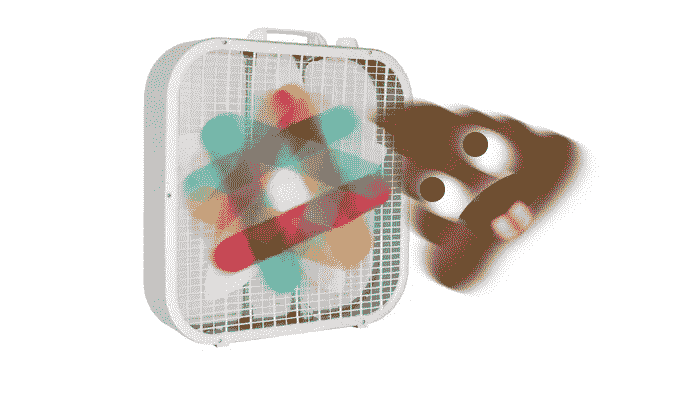
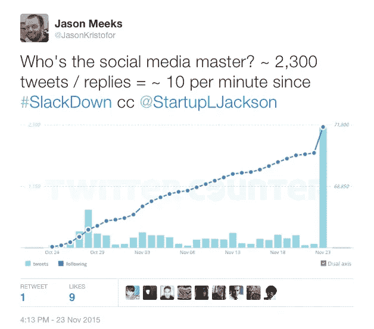
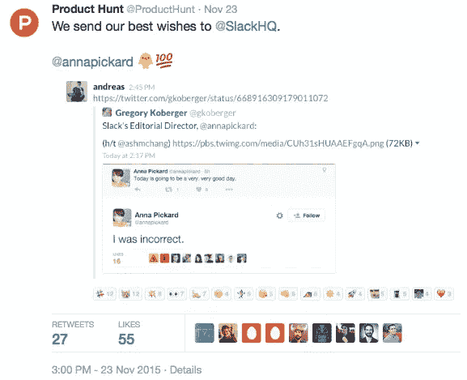

# #懈怠:品牌互动的一课。

> 原文：<https://medium.com/swlh/slackdown-a-lesson-in-brand-interaction-17f8c82b9fce>

昨天，[有些真的很好](https://medium.com/u/26d90a99f605#.lxYorPAgwn)，但我真正注意到的是其他人是如何使用 Twitter 的:

[SLJ is still the social media master.](https://medium.com/u/26d90a99f605#SlackDown 期间处理他们的 Twitter 账户的重要性和规模。</a>
<figure class=)

[事实证明，Slack 已经制定了一个计划，当狗屎击中粉丝时，该计划包括所有人都在甲板上的社交媒体清理人员。在几个小时的时间里，官方@ SlackHQ 账号以](https://medium.com/u/26d90a99f605#SlackDown 期间处理他们的 Twitter 账户的重要性和规模。</a>
<figure class=)[亲切](https://twitter.com/SlackHQ/status/668981033577095168)、[体贴](https://twitter.com/SlackHQ/status/668943618384752641)、[搞笑](https://twitter.com/SlackHQ/status/668996849076957184)的形式回复了用户关于服务中断的推文 2300 多次。

大多数用户都对个性化的回复感到高兴(没错，是真正的人手在打字)，一个很好的统计数据可以突出这一点，那就是@SlackHQ [昨天获得了超过 3300 名粉丝](http://twittercounter.com/SlackHQ)(超过上个月任何一天的 7 倍)。

当我滚动浏览几十条推文时，我清楚地知道 Slack 真的关心使用他们产品的人们的社区，使用该产品的人们真的关心该公司。许多用户甚至在推特上对 Slack 表示支持，以帮助他们度过这样一个困难时期，其中包括最好的社区之一，[产品搜索](https://twitter.com/ProductHunt)。

Tweet in a tweet of a tweet.

找到昨天真正在键盘后面的人并不太难(他们中的一些人喜欢我上面的推文，包括 [Slack 老板本人](https://twitter.com/stewart))，他们无疑度过了异常疯狂的一天。然而，需要承认的是他们所取得的成就，因为他们是我所见过的品牌应该如何与受众互动和互动的最佳范例之一。

因为做得对而支持懈怠。(感谢您让它恢复运行！)