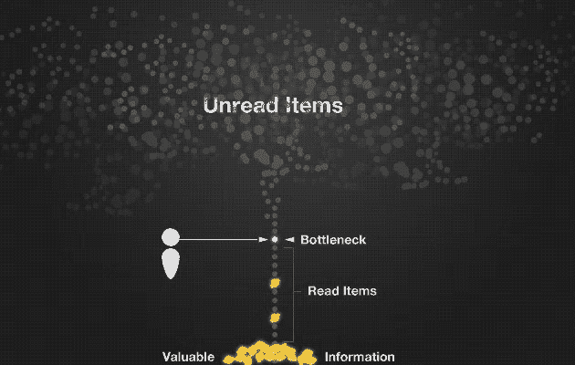
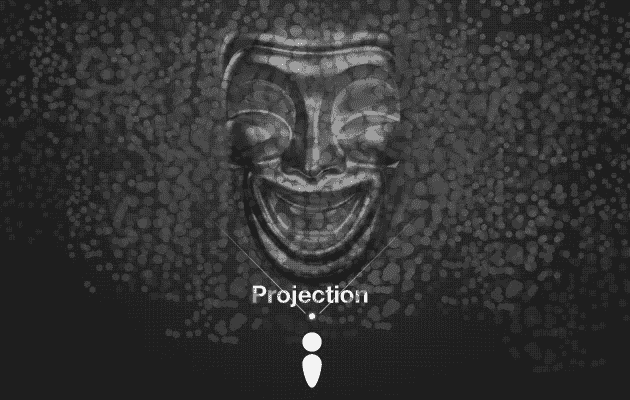

# 提要的奴隶—这不是我们一直在寻找的实时

> 原文：<https://medium.com/swlh/slaves-of-the-feed-this-is-not-the-realtime-we-ve-been-looking-for-538cc10582d7>

## 先说大部分人大概都能认同的。信息正在网上积累。可用信息的数量正以指数速度增长，有人说它每两年翻一倍。这意味着任何能够跟上正在发生的一切的幻想都是乌托邦式的，理解其原因是非常重要的。

大多数人都知道这一点，但这正是我们似乎都在努力做的事情。我们并不缺少内容聚合器和聚合器的聚合器，它们每天都在发展，为的是让我们更好地了解我们订阅的、我们现在依赖的所有信息来源。

这导致了源源不断的文章、新闻、图片、网站、产品、更新、更新的评论以及对这些评论的评论，一秒一秒地传递给我们，我们每个人都必须处理。

不断检查我们的订阅源以获取新信息，我们似乎希望发现一些有趣的东西，一些我们可以与我们的网络分享的东西，一些我们可以使用的东西，一些我们可以谈论的东西，一些我们可以采取行动的东西，一些我们不知道的东西。

这似乎是一种痴迷，许多数字技术的批评者会认为，通过这种方式消费信息，我们正在面临破坏人类之间社会互动的危险。有人甚至会说，我们已经成为饲料的奴隶。

这可能是一个困扰，但我认为这是一个困扰，许多评论家迟早会发现自己不得不屈服。

## 数字空间是不同的，但却是真实的。

信息积累并不是唯一呈指数增长的东西。人类社会互动也在加速向网上转移，这意味着我们在数字空间的行为后果会成倍地影响所发生的事情，不仅在数字空间，而且在物理空间。

如果你对此有疑问，问问音乐、电影、电信、出版、金融、新闻、媒体、摄影、设计、插图、编程、咨询、会计和广告行业。他们都感受到了这一趋势的影响，迫使他们重新思考如何开展业务。

在数字空间中，摩擦几乎为零。物理空间的限制不适用于数字，利用网络效应从未如此简单。无论你是发送者、接收者还是转播者，过去需要几天甚至几周才能到达公众头脑的信息，现在只需要几个小时甚至几分钟就可以传播到地球的遥远角落。信息让世界变得越来越透明，让公司屈服，让政府不安，并为全球即时互动提供了新的方式。

但是这并不是没有问题。随着信息量的增加而接近零摩擦；出现了噪音和冗余的问题。

为了获得“信号”,我们需要在嘈杂的信息中寻找对我们重要的金块。我们缺乏一次消费多个 *feed 项目*的能力，这种手工工作成为我们处理和评估信息速度的瓶颈。总得有所付出。

## **这不是你一直在寻找的实时网络**

很明显，我们需要信息，因为我们越来越多地通过网络生活来定位自己。但同样显而易见的是，我们处理我们所需要的信息的自然能力并没有很好地扩展。

我们发现自己所处的悖论是——一方面，我们不知道自己不知道什么，所以排除任何信息来源都没有意义。

另一方面，比我们被迫消费的东西少得多的东西对我们来说确实是相关的，但是我们只有在消费了之后才发现是什么。

在这个世界上，时间是最宝贵的资源之一，这是无法衡量的。

我们需要饲料的质量而不是数量。我们需要更好的能力来找到金块。但是，你们中的一些人可能已经问过自己，什么是质量？我们如何知道什么是真正相关的？因此，我们发现自己处于令人不安的矛盾之中。

## **为瓶颈设计**

我们拥有的聚合器能够从它们那里收集我们想要的几乎一样多的信息，但是我们必须评估每一条信息，这意味着我们必须围绕瓶颈来设计聚合器。意思是我们。

为了创建质量更好的数据流，人们试图解决这个问题。寻找单词或句子在短时间内突然开始达到峰值的单词突发算法就是一个例子。给定的*提要条目*的流行度可能是一种不同的方法。但是目前大多数算法都没有考虑个体的兴趣空间。相反，他们着眼于全球趋势，就像我相信《新月》是一部伟大的青春电影一样。当我点击趋势云中的标签时，我有点希望看到新月月亮。

我们发现自己处于这样一种情况，在数字空间中并不缺乏信息，但提取相关信息的能力非常有限，因此使我们依赖于如此多的手工劳动，人们有理由认为奴隶制实际上被重新插入了。

肯定有更好的方法来处理信息。一种将监控信息的繁重任务交给我们使用的机器而不是我们的方法。

## 社交机器——我们的潜意识记忆。

做到这一点的一种方式可能是，如果我们的机器(电脑、智能手机、平板电脑、小工具)开始交换更多的信息，以建立更紧密的相互关系。现在我们提要中的数据质量取决于我们知道它们指向什么来源。但是这么多有价值的信息隐藏在我们机器之间的交换中，我相信这是我们仍然只为瓶颈设计的主要原因之一。

如果我访问了 MagmaBooks 在线商店，那么就可以检索到各种相关信息。其中之一可能是物理地址，如果它存在的话，这样下次我在伦敦时，他们的机器就会通知我的机器(位置感知手机)他们就在我所在的拐角处。

换句话说，虽然人类可能在一个层面上工作，积极参与我们可能感兴趣的任何事情，但我们的机器应该在这些参与的基础上建立机器-社会关系。通过这种方式，可以创建一个更具上下文意识的生态系统，创建间接的、潜在的有意义的关系，而不需要我们处理信息片段。

提高供稿质量的方法不是减少信息量，而是增加信息量。不是通过增加另一个人工消耗的来源，而是通过供给系统，允许在次人类水平的机器-电子-机器上交换信息。

这样，我们就能最终开始建立一种关系，这种关系是我接下来要讲的内容所必需的。

## **作为物质的信息**

大多数人都知道，让我们读得好的不是我们一个字母一个字母地拼出每个单词，而是我们一个单词一个单词或一行一行地读。有些人甚至能够阅读几乎整段文字。

也许我们的机器应该做的是像阅读单词和句子一样阅读信息片段。也许信息可以不在条目的基础上收集和表示，而是作为基于累积信息的数字现实的模型。

也许我们需要为投影而不是瓶颈设计？

这意味着我们必须像大脑处理物质一样处理信息。既是离散的物体又是一个整体。这样，噪音就成为了信号的一部分，而不是让我们不得不一对一地与它联系起来，而是提供了意义产生的背景。这不是我们必须经历的，而是我们现实的一部分，覆盖在我们的物质现实之上。

信息作为物质的唯一目的是为我们提供足够的信息以达到更好的预测。我们收集的信息越多，投影的保真度就越高。投影的保真度越高，我们的信号就越好。如果我们还能称之为 feeds 的话。

也许这才是虚拟现实真正应该意味着什么。而不是建筑师根据特定的构图完成的 3D 投影。而是作为一个框架，在一个不区分噪音和信号的环境中把信息表现为物质。说到底，难道一个人的噪音不是另一个人的信号吗？

我不确定为投影而设计到底意味着什么。我知道这似乎有点遥远。我承认我并不完全清楚每一件事，但是我知道我们目前处理信息的方式不可能是这件事的最终结论。我们需要把自己从观看我们的提要的体力劳动中解放出来，我们可以用我们的时间做更多的事情。要做到这一点，我们需要将负担转移到机器上，而不是相反。

也许开始以不同的方式思考信息将把我们从已经背负了太久的枷锁中解放出来。

还有谁在考虑这个问题吗？让我知道你的想法。

*如果你喜欢这篇文章，你可以推荐* *it、* [***注册我的简讯***](http://000fff.us2.list-manage2.com/subscribe?u=70988277cb322d150c4001f07&id=5b220f9180) *或* [***支持我的 app***](https://www.ghostnoteapp.com) *。*

*这篇* [*短文*](http://000fff.org/slaves-of-the-feed-this-is-not-the-realtime-weve-been-looking-for/) *最初发表于 2009 年*[*000fff.org*](http://000fff.org/)

**

*发表于*[**# SWLH**](https://medium.com/swlh)**(***《创业》、《流浪癖》、《生活黑客》)***

************