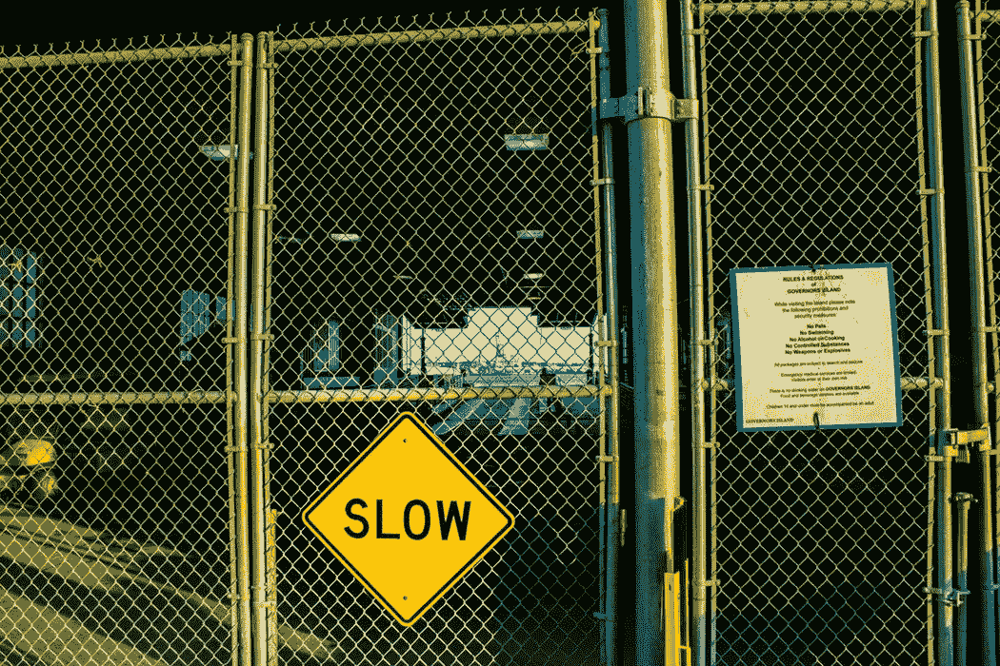
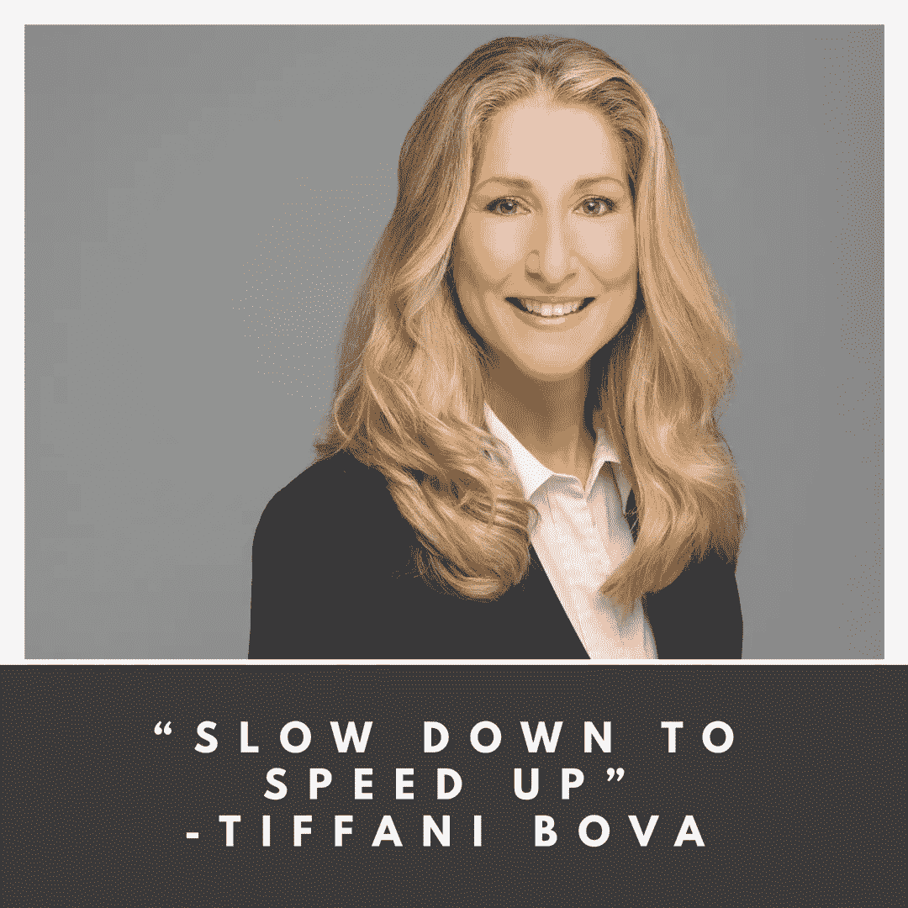

# 减速以加速

> 原文：<https://medium.com/swlh/slow-down-to-speed-up-ac27daeac7b8>

她的老板用一根手指向上指了指，然后走开了。

"这是在告诉我我是第一名吗？"蒂芬尼想。

蒂芬尼抬起头，想看看她的老板指着什么。她设计的狂欢节帐篷非常壮观，包括数千盏灯。

但是就在她老板手指的上方，她看到了。她的胃垂了下来。

一盏灯熄灭了。

在她设置的数千盏灯中，她的老板只能认出那盏没有打开的灯。

作为第一份“销售”工作的青少年，这对 Tiffani 来说是一颗难以下咽的药丸。

从几十年前的那一天起，Tiffani 学到了很多东西，并站在当今世界销售、营销和客户体验的最前沿。她是 Salesforce.com 的全球客户增长和创新宣传员，是“下一步是什么？”的播客主持人，做过 300 多次主题演讲，是她的新书《成长智商》的作者。

尽管她取得了一系列的成就，但她相信她发展的许多基本特征都来自于在“马戏团”的那些日子。

灯泡事件的教训？

> “减速加速。”

海豹突击队有一句口头禅:“慢就是顺，顺就是快。”这些哲学的伟大之处在于它们真的是可扩展的:它们适用于销售、写作、商业、人际关系和洗碗。

花额外的一分钟以正确的方式完成工作。为你所做的感到自豪。你会提高你的技能，你的声誉也会反映出来。

我喜欢让 Tiffani 在播客上谈论销售、时间管理以及千禧一代如何最大限度地实现增长。

# 关于作者

汤姆·阿莱莫 *是一名充满激情的 B2B 销售人员。他目前是* [*千禧一代动力播客*](https://soundcloud.com/ryan-warner-799706255) *的主持人，在这里他帮助千禧一代快速跟踪他们的个人发展。Tom 也是 TechTarget 的客户经理，住在旧金山。*

[网站](http://tomalaimo.com/) | [播客](https://soundcloud.com/ryan-warner-799706255) | [邮箱](mailto:thomasalaimo7@gmail.com) | [推特](https://twitter.com/TomAlaimo_TTGT)|[LinkedIn](https://www.linkedin.com/in/tom-alaimo-573a1878/)|*|*|[脸书](https://www.facebook.com/thomas.alaimo.12) | [Instagram](http://instagram.com/talaimo7) | [媒体](/@TomAlaimo_TTGT) |

## 这个故事发表在 [The Startup](https://medium.com/swlh) 上，这是 Medium 最大的创业刊物，拥有 360，974+人关注。

## 在这里订阅接收[我们的头条新闻](http://growthsupply.com/the-startup-newsletter/)。

