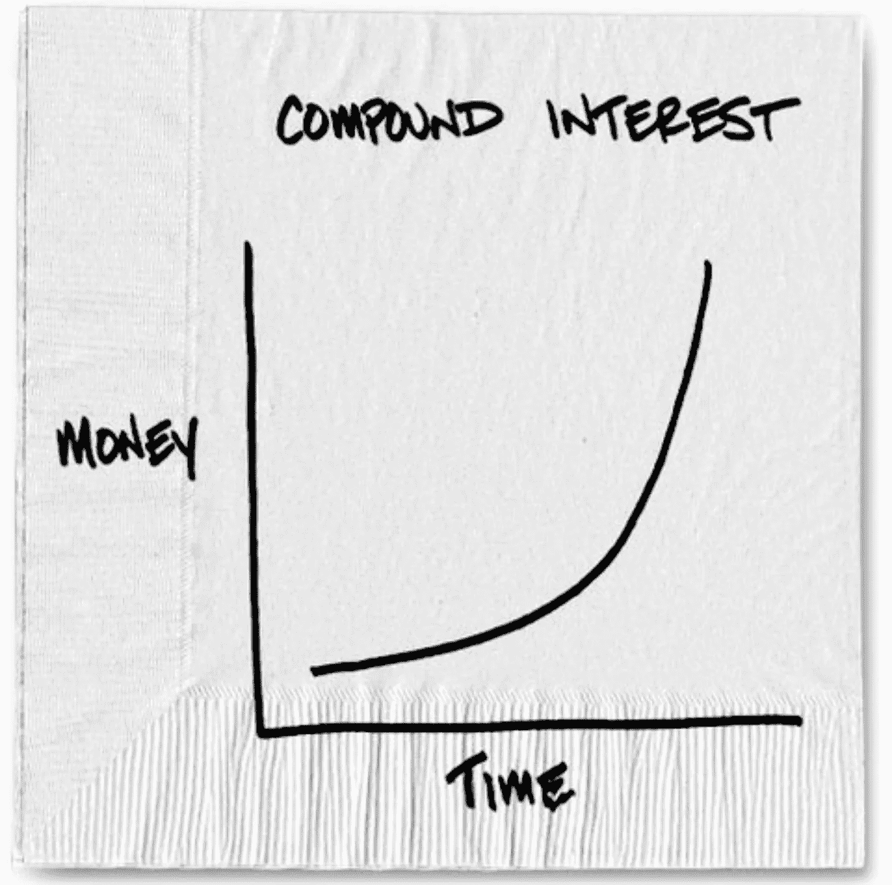

# 小习惯会给你的努力带来 100 倍的回报——以下是开始的方法

> 原文：<https://medium.com/swlh/small-habits-give-a-50-to-1-return-on-your-effort-heres-how-to-start-e2a51f75424c>

Photo: NY Times

## 彩票、复利和 10 分钟步行有什么共同点？

你有内部消息。

你在当地的便利店，有一个 5000 美元的彩票。你的内幕消息是，彩票中奖的几率是 50% —跟抛硬币一样。

你会买 1 美元的彩票吗？当然，你会的。

事实上，你会一直买票，直到你赢得 5000 美元。(买 5 张票意味着你几乎肯定会赢。)

你花不到 5 美元就能赢得 5000 美元。

如果中奖概率是 10%呢？你还会买票吗？

你可能——根据概率法则，如果你买了 25 张票，你就能拿到钱。你只需花 25 美元就能赢得 5，000 美元。

This is what having a new habit buys you

如果概率是 5%？你需要买 51 张票。你可以花 51 美元赢得 5000 美元。*那是你投资的 100 倍。*

你会这么做吗？

## 这甚至不是一场赌博

我们来谈谈快乐吧。你可以等着看会发生什么，或者你可以做点什么。无论哪种方式，时间都会过去——唯一的区别是你最后会得到什么。

增加快乐的一个好方法是在生活中做一些小的改进。这甚至不是一场赌博。它*将*发生。回报是巨大的。

## 你已经拥有的超能力

好习惯很有价值。原因如下:

*   一旦你养成了一种习惯，你不会注意到它。这个习惯不需要努力，因为你会不假思索地去做。它绕过了耗尽意志力的问题(你每天只有一定量的意志力)。
*   久而久之，习惯的好处*滚雪球般超过所有的预期*(就像[复利的奇迹](http://www.businessinsider.com/amazing-power-of-compound-interest-2014-7))。
*   这个习惯会在你的余生中回报你。

## 工作比你想象的要少

有道理的是，打算的动作越大，让它成为习惯的时间就越长。

根据一项调查研究，早餐后喝一杯水(一种健康的行为)变成日常习惯需要大约 20 天。

每天早上散步 10 分钟(这将极大地改善你的生活)会花费更长的时间，大约 50 天——但这是值得的。好处是巨大的——在你的余生中，你将极大地改善你的心情、你的健康、[以及更多。](https://www.wisebread.com/10-surprising-benefits-of-a-10-minute-walk)

## 想想看

那张彩票:50 美元让你的钱增加 100 倍。

一个健康的习惯:50 天——不到两个月——显著增加你余生的幸福感。

有各种各样有用的习惯——有些需要几秒钟，有些需要几分钟——这些习惯会在你的余生中改善你的生活。

这是本文的第 2 部分；这是关于[一个帮助你更快养成习惯的简单技巧](https://findyourbetterlife.com/31-actions-to-increase-happiness-and-how-to-get-there-e47220053d4e)——你会有你可以尝试的 31 个简单易学的习惯。它值得点击和阅读。你会很高兴你做了。

*亲爱的读者，媒介的决定允许 1 比 50👏🏽s 疯了。所以我认为鼓掌是 1 到 5 颗星的评级，10 次鼓掌= 1 颗星。*

我会为我读到的文章鼓掌 10 次或 20 次。完全不鼓掌感觉很糟糕。

请帮我一把。它帮助我接触到更多像你一样的人。谢谢！

## 这篇文章发表在 [The Startup](https://medium.com/swlh) 上，这是 Medium 最大的创业刊物，有+388，268 人关注。

## 在此订阅接收[我们的头条新闻](http://growthsupply.com/the-startup-newsletter/)。

