# 智能炼油技术区块链是汽车燃料生产的创新技术解决方案和设备

> 原文：<https://medium.com/swlh/smart-refinery-technology-blockchain-is-innovative-technical-solutions-and-equipment-for-the-316cb88e478f>

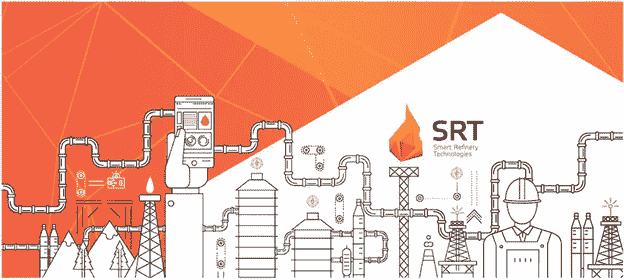

炼油厂是将原油加工成可直接使用的石油产品或成为石化工业原材料的其他产品的工厂/工业设施。炼油厂生产的主要产品是石脑油、汽油、柴油、煤油和液化石油气。炼油厂是非常复杂的工业设施，有各种类型的工艺设备和配套设施。炼油厂的存在在工业中是必要的，因为炼油厂是加工燃料的地方。在我们的日常生活中，我们总是需要燃料。例如，开车时我们需要燃料，做饭时我们需要汽油，等等。

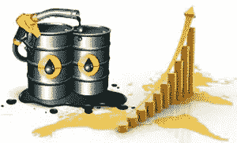

石油贸易是世界上一个非常大的市场。许多石油公司在各国建立炼油厂，将原油加工成燃料。目前，炼油厂已经使用复杂的技术来提高产量。另一方面，在石油贸易方面以及炼油厂本身仍然存在许多问题。这些问题就像高昂的燃料价格，因为缺乏炼油能力的地区物流复杂。发展中国家由于炼油工业的低生态标准而造成的环境污染。对于中小容量的燃油，没有安全的机油交换。用加密货币充电不可能支付油费。智能炼油技术集团公司肩负着解决上述问题的使命。但是……等等！你知道这家公司吗？

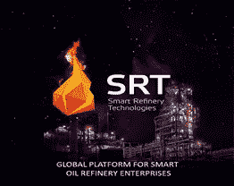

**Smart Refinery Technologies Group Company(公司，SRT 集团)**是一个项目的发起人，该项目旨在为汽车燃料行业创建一个工业区块链平台，并在其基础上形成一个小吨位炼油厂的全球网络，以及基于创新的专有设计炼油设备。**需要解决的问题**炼油厂目前经常出现的一些问题有:

**高油价**，高油价是一个经典问题。各种因素是造成高油价的原因，例如不断增加的石油需求和没有足够的供应与之匹配。炼油厂产能低也是全球石油供应不足的一个因素。从*这个问题出发，解决方案是* *利用组织的快速时间和智能炼油设施的试运行，从小型炼油厂的制造中创建一个分散的网络。*

**环境污染**，在环境污染行业，如果处理不当，确实是一个严重的问题。在大多数发展中国家，炼油厂造成的环境污染往往是由于生态标准低造成的。如果任其发展，环境污染将会导致健康危害。*解决方案是基于 SRT 集团*模块制造的环保型欧 5 燃料生产生态级

**缺乏一个方便的中、小容量燃料的石油交易平台**当石油交易商试图寻找合适的石油产品时，交易规模急剧扩大，计算方案复杂，争议风险高。*解决方案是基于区块链的去中心化石油交易所。区块链的 KYC 交易员，结算智能合约。AI 系统帮助交易者，SRT 代币佣金支付*。

**无法在加油站用加密货币支付燃油**看起来很难实现，因为目前它可能不会在全球范围内广泛应用。但是冷静点。*发行 SRT 国际加油卡，可享受高达 20%的折扣，并可使用纸币或加密货币支付加油费用*

**什么是智能炼油模块？**这里有一个智能炼油厂模块的图片示例和一个智能炼油厂模块的简要描述，可能有助于您的理解。

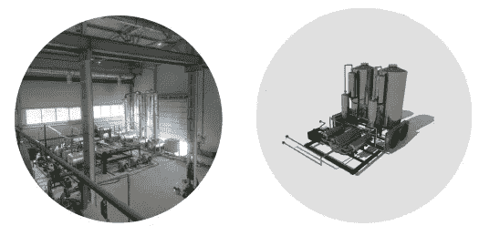

CATALYTIC ISOMERIZATION OF GASOLINE. Ensures production of marketable high-octane gasoline from straight-run gasoline.

该装置设计用于生产辛烷值为 90÷92 及以上的汽油，质量不低于欧五标准。这都是从石油和天然气凝析油，低辛烷值和高硫前端汽油馏分。

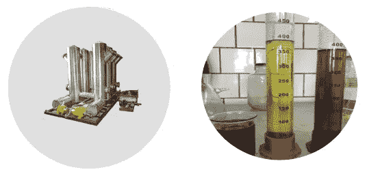

CATALYTIC DIESEL FUEL PARAFFIN REMOVAL. Ensures production of marketable high-octane gasoline from straight-run gasoline.

用夏季柴油生产北极柴油。将冰点降低到零下 55 度。从使用乐高积木原理的模块来看，小吨位炼油厂的年加工原料能力为 10，000 至 100，000 吨。此外，单个模块可以被引入到现有的小型炼油厂的基础设施中，这些炼油厂具有高达 100 万吨/年的加工原料的能力，用于它们的现代化。

**SRT 集团如何解决炼油问题？**

SRT 集团将小型炼油厂纳入区块链全球信息网络，以从世界各地的现有炼油厂获得收入。这种新商业模式的创建可以提高这个平台用户的经济效益。这可以通过自动化业务流程、降低交易成本和确保数据透明来实现

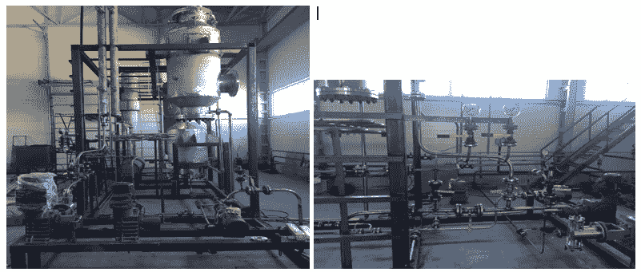

该公司开发了基于新一代沸石催化剂的技术工艺和设备。提议的设备通过增加炼油深度和提高产品质量(柴油和汽油)来提高小型炼油厂的效率。根据实际原材料加工量支付许可费的特殊设备租赁模式将用于确保基于 SRT 集团技术和设备的炼油网络的发展。区块链平台参与者的计算是使用 SRT 硬币完成的。SRT 区块链平台将为智能合同、自动数据收集和公司间交易提供便捷的工具和模板。

这一解决方案将有助于解决远离大型炼油厂的偏远地区的物流复杂性和高燃料价格等问题，解决小型炼油厂劣质石油产品的问题，并改善公司之间行政支付许可的难度。

**智能加油卡**

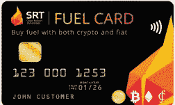

SRT 集团计划制造一种智能加油卡，允许用户在加油站使用法定货币或加密货币支付燃油费用。如果这个计划运行，那么这个策略对加密货币用户非常有利，可以保持加密货币的价值稳定。SRT 硬币持有者的好处如果他们使用智能加油卡支付，他们将获得一个简单快捷的支付程序。

**智能炼油技术区块链平台架构**

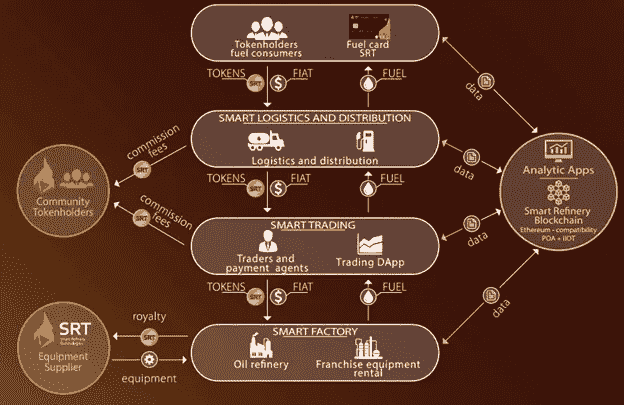

**关于 SRT 硬币代币的信息**

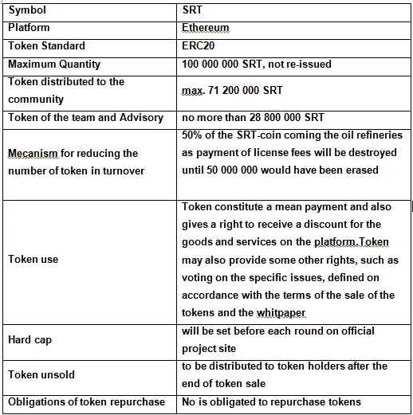

**令牌分配参数**

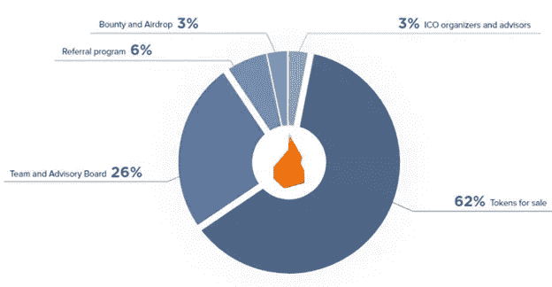

待售代币数量:62 00 万 SRT 币，分几轮配售。

令牌类型:实用程序令牌。

未售出的代币:当前回合中所有未售出的代币都将被出售

在下一轮以新的更高的价格。所有未交易的代币都将被销毁。

售价:0.5—10 美元。配售时代币的最低价格将

每轮都增加。

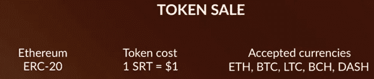

**如何购买代币的分步指南**

1.前往 http://srtcoin.io/en SRT 集团官方网站:

2.按“获取代币”按钮。

3.为了购买 SRTcoins，请选择 BTC、ETH、LTC、DASH、BCH。

4.您将在 SRT 集团官方网站的个人文件柜中获得您的简历。

**“ICO 于 10 月 25 日完成”**

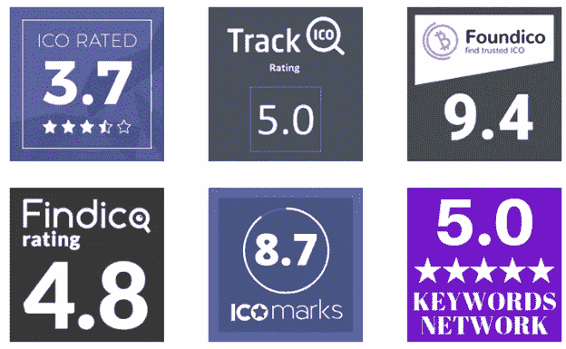

**主要项目链接:**

网址:[http://srtcoin.io/](http://srtcoin.io/)

电报:[https://t.me/SmartRefinery](https://t.me/SmartRefinery)

https://www.facebook.com/SmartRefinery

推特:[https://twitter.com/SmartRefinery](https://twitter.com/SmartRefinery)

安线程:【https://bitcointalk.org/index.php?topic=4905473.0】T2

SRTcoin 白皮书—【http://srtcoin.io/docs/en/wp.pdf 

## 这篇文章发表在 [The Startup](https://medium.com/swlh) 上，这是 Medium 最大的创业刊物，有+ 381，088 人关注。

## 订阅接收[我们的头条新闻](http://growthsupply.com/the-startup-newsletter/)。

