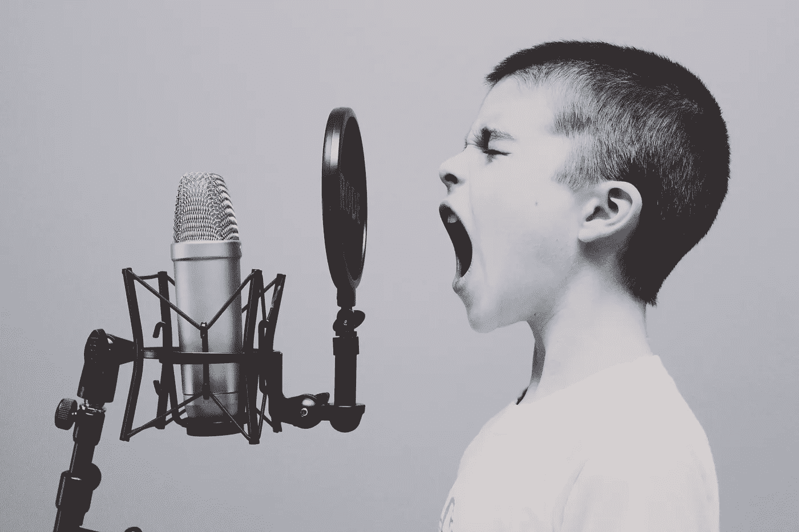

# 智能音箱作为门户药物

> 原文：<https://medium.com/swlh/smart-speakers-as-gateway-drugs-6f0a28be8de5>

Photo by [Jason Rosewell](https://unsplash.com/photos/ASKeuOZqhYU?utm_source=unsplash&utm_medium=referral&utm_content=creditCopyText) on [Unsplash](https://unsplash.com/search/photos/voice?utm_source=unsplash&utm_medium=referral&utm_content=creditCopyText)

## 有证据表明，智能扬声器的采用是欢迎语音机器人进入我们生活其他领域的跳板。

请原谅这一双关语，但语音助手在进入欧洲市场时似乎没有一个相对“口吃”的开始？

大概这和我们中的自我意识有关(包括我在内),在公共场合和机器人说话不太舒服。

然而，在过去两周，亚马逊的 Alexa 推出了新的“[耳语模式](http://uk.businessinsider.com/amazon-echo-alexa-whisper-mode-how-to-turn-on-2018-10)”。现在，即使是最不情愿的“演讲者”也可以激活他们的机器人，而不会引起周围人尴尬的目光。

听起来，声音革命即将到来。对于我们与人工智能交流的能力来说，这有望是一个巨大的飞跃。

[布雷特·金塞拉](https://medium.com/u/633e3124d363?source=post_page-----6f0a28be8de5--------------------------------)是世界上语音行业最重要的人物之一，并且是伦敦[聊天机器人和语音助手聚会](https://www.meetup.com/Messaging-Bots-London/)的主要发言人——通过视频链接从美国。他的网站 [voicebot.ai](https://voicebot.ai/) 和[播客](https://voicebot.ai/voicebot-podcasts/)是 voicebot 报道的主要资源。

## **2018 年声音:在哪里**

> 从 2011 年苹果的 Siri 开始，然后是亚马逊 Echo (2014 年)，最近是谷歌 Home (2016 年)，[金塞拉](https://www.linkedin.com/in/bretkinsella/)说，“我们正在进入语音助手大规模扩散的第二阶段。”

他以本周从美国一项全国性调查中收集的无懈可击的数据开始:

今天，美国有 5780 万人使用智能音箱。今年 1 月，这一数字为 4730 万，这意味着智能扬声器在 10 个月内增长了 22.2%。

也就是说，**智能音箱比智能手机增长快！**

英国的情况稍微平静一些，大约有 10%的人口居住在这里。尽管如此，这仍然是一个相当大的 660 万人。

> 除了美国和英国，早期的大规模采用者通常是嫌疑人:德国、加拿大、日本和澳大利亚。到 2018 年底，[金塞拉](https://twitter.com/bretkinsella?lang=en)说，“我们预计全球使用量将达到 1 亿台。”

## **智能音箱作为门户药物**

这听起来可能是最具煽动性的标题，但它得到了 voicebot.ai 用户群调查受访者的支持:

*   61%的早期用户鼓励他们的朋友购买智能音箱
*   54%的用户不想回到没有智能音箱的生活
*   56%的人认为，有了智能音箱后，他们更多地使用智能手机上的语音助手

仔细想想，前两个数据实际上没有标题显示的那么令人信服。我们需要把这三个都拆开一点来充分理解它们的庄严性。

可以说，前两种观点可以适用于任何时代、任何年龄段的任何产品或服务。它们在技术上与科技无关。

例如，一个正在享受索尼随身听的 20 世纪 90 年代的小学生很有可能会鼓励朋友也买一个。

同样，如今享受免费乘车证的养老金领取者可能更愿意带着它生活，而不是没有它。唉，这前两个统计有点多余。

然而，最终的统计数据意义重大。

智能扬声器是一项突破性技术，或者说是“门户药物”，让用户在其他地方使用“语音”。智能音箱不仅规范了与科技互动的方式。相反，他们训练人们如何和机器人说话。

从某种意义上说，这不仅仅是技术变得更加复杂的问题。它实际上也需要我们人类向前发展。

## 为什么声音如此重要？

数字时代的三个不同的技术时代被三个不同的用户界面(UI)所束缚:

对于网络，我们必须“点击”。

对于手机，我们只需要“触摸”。

对于即将到来的人工智能革命，我们将不得不“说话”。

金塞拉解释为什么人工智能需要语音识别。

> 人工智能要发挥潜力，就需要获得代理权。只有建立了信任的纽带，人们才会授予这种代理权。因此，为了让人工智能和人类联系起来，需要安装一种对用户来说独一无二的通信方法。

我们声音的复杂动态是独一无二的，而我们的指纹也是独一无二的，它们可以(并且已经)为技术激活提供了渠道，免提是我们与技术接触的深远的下一步。

## **你开始用语音了吗？**

十年前，智能音箱的增长速度超过了智能手机，这一统计数据目前看起来令人震惊。

显而易见的推论是，如果你还没有接受语音技术，你将在未来几年内接受。

事实是，麦克风将很快记录下一切。

然而，问题依然存在，话筒背后是什么？

*Craig 为*[*Calcey Technologies*](http://calcey.com/)*撰稿，这是一家植根于硅谷的精品软件产品工程代理公司，为世界各地的初创企业和扩大规模的企业提供软件开发服务。Calcey 的客户组合包括全球名称，如*[*PayPal*](https://www.paypal.com/)*和* [*斯坦福大学*](https://www.stanford.edu/) *，以及众多令人兴奋的初创公司，包括*[*Nutrifix*](http://www.nutrifix.co/)*(英国)*[*Nelly.com*](https://nelly.com/uk/womens-fashion/)*(瑞典)和* [*MyBudget【我的预算】位于斯里兰卡开发中心的 100 多名工程师团队正在寻求与更多创业公司合作。*](https://www.mybudget.com.au/)

## 这篇文章发表在 [The Startup](https://medium.com/swlh) 上，这是 Medium 最大的创业刊物，有+384，399 人关注。

## 在这里订阅接收[我们的头条新闻](http://growthsupply.com/the-startup-newsletter/)。

