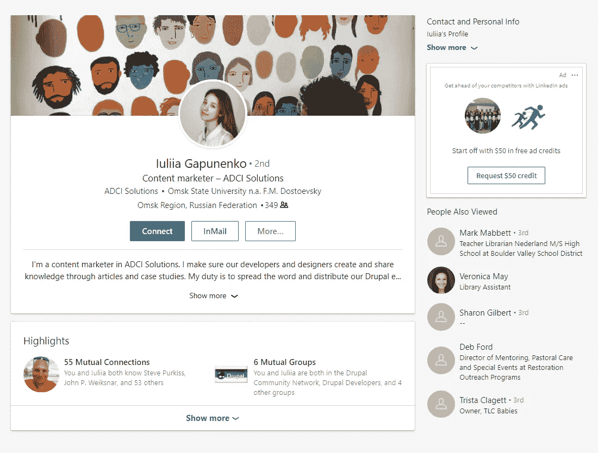

# SMM 入门包，第 2 部分:内容推广

> 原文：<https://medium.com/swlh/smm-starter-pack-part-2-content-promotion-eb090c65e061>

[By ADCI Solutions](https://goo.gl/8R2Mr2)

这是 SMM 初学者工具包系列文章的第二部分。如果你做到了这一步，你一定愿意学习如何通过社交媒体推广业务。我们已经在第一部分 中考虑了内容 [**的创建和管理，现在我们将继续测试所设计的内容计划、内容推广工具，并将内容推广到公司简介之外。**](https://goo.gl/CA65jx)

# 内容计划分析

下一个重要的步骤是分析你的内容:什么驱动流量最大和最小。

你的内容计划是否成功，可以通过你之前在社交网络上发帖的经历来衡量，当然，如果你有的话。如果有，你就有用户对不同类型内容反应的统计数据。如果你没有——花一两个月的时间进行测试来收集数据。你会知道你的 KPI 的平均值是多少，并且能够发现什么主题做得好，什么不好。

不要急着删除它们:下次再测试，测试语调的组成部分。让我们深入细节，看看我们如何测试我们的内容。

什么是好帖子？它触及你的目标受众，让他们完成一个 CTA。注意后果:你的帖子必须在第一时间到达受众——我们在第一部分已经讨论过了。一旦你确定帖子没有白费，你就可以投入更多的精力来掌握帖子的内容。

因此，我们提出了一个假设:不同的主题可能在不同的时间表现良好。看起来是这样的:

Best time to post on social networks

在第一列中，您可以看到已发布文章、演示项目、中等文章、博客文章等的标签列表。在第二列中，您可以看到这些标签表现较好的时间段和最佳发布时间，即特定类型的内容获得最多点击的时间。

我们仔细检查了 shortener 工具 goo.gl 的点击量，以及一个月来由这些帖子驱动的 Google Analytics 的会话数。结果向我们展示了帖子表现的微小差异，所以现在我们不太注意选择一个完美的时间:我们只是使用最常见的时间，当我们的帖子倾向于获得更多的触及和更多的点击。

一旦我们明确了发布时间，我们就开始改进内容。还记得我们谈论的语气吗？我们为 LinkedIn、Twitter 和脸书开发了 3 个帖子草稿。所有帖子(除了少数例外)必须包含以下元素:

# 商务化人际关系网

LinkedIn group post

*   包括徽标、公司名称和文章/博客名称(如果适用)的公司视觉材料
*   主 CTA
*   主 CTA 后面的链接
*   建议订阅时事通讯的附加 CTA(可选)
*   内容本身

# 推特

*   包括徽标、公司名称和文章/博客名称(如果适用)的公司视觉材料
*   主 CTA
*   主 CTA 后面的链接
*   建议订阅时事通讯的附加 CTA
*   内容本身(我们试图使用多达 140 个字母来保持它像 Twitter)
*   标签(不超过 3 个，包括当天的标签)

# 脸谱网

*   包括徽标、公司名称和文章/博客名称(如果适用)的公司视觉材料
*   主 CTA
*   主 CTA 后面的链接
*   建议订阅时事通讯的附加 CTA
*   内容本身
*   标签(不超过 3 个)

这里要检查什么:

*   在你的主要 CTA 上的点击次数(使用 goo.gl、bit.ly 或社交网络的 inner analytics 仪表盘来检查你的内容在多大程度上有助于实现一个帖子的目标)；
*   内容的点击量(使用社交网络的内部分析仪表板来查看公司简介的点击量、徽标点击量、内容点击量——这将提供受众对您的内容是否感兴趣的见解)；
*   如果你有一个额外的 CTA，点击的次数(这将让你知道两个 CTA 是否相处得很好，或者第二个 CTA 分散了读者对第一个 CTA 的注意力)。

# 内容推广

虽然内容创作是第一位的，但是你应该能够向你的访问者展示一些东西，对吗？—你最好尽早开始推广内容，后期在内容创作和推广上一定要齐头并进。我们将为你提供一些在社交网络上推广内容的低成本见解。对我们来说，推广的效率是根据点击量、网站会话数、覆盖面和关注者来定义的。你可以选择其他的，这取决于你在社交网络中的目标。

# Twitter、LinkedIn、脸书的一般建议

**网站应用**

考虑在你的网站上使用社交媒体插件，这样访客就可以成为你的追随者。

**电子邮件中的签名**

电子邮件标志真的被低估了:虽然它并不咄咄逼人，但它允许你用任何你想要的内容来填充它。

# 推特

**大众追随**

大量关注从来都不是一个坏决定(当然，除非你打破了 Twitter 的限制)。有了像“[Twitter 的大众关注](https://chrome.google.com/webstore/detail/mass-follow-for-twitter/lfmanfkmmgfigbnjibfemdnnfjboficn)”和“ [Twitter 关注者](https://chrome.google.com/webstore/detail/twitter-follower/hcghlfjkhaigchnbbkbcgadlnckobaei?hl=en-GB)”这样的应用程序，一切变得前所未有的简单。为了使这个过程更加一致，跟随属于你的目标受众的人(阅读第 1 部分以获得这方面的帮助)。

**取消跟随**

关注太多的人可能会破坏你在 Twitter 上的第一印象:没有人喜欢成为百万分之一。注意你的列表，及时取消关注。我们用 ManageFlitter 和 CrowdFire 来说拜拜。这些服务让你知道谁关注你，谁不关注你，你的关注者和你关注的人有多大影响力，他们的垃圾邮件分数是多少，等等。简直美。不要难过。

**社交活动**

社交活动是一个强大的免费工具。与用户的实时互动创造了品牌与人们之间的互动和纽带。

Communication with followers in Twitter

他们有反应，你也有反应——下一刻，你的帖子会毫不费力地再次出现在 Twitter 上。

# 商务化人际关系网

对于那些试图在没有预算的情况下获得晋升的人来说，LinkedIn 是一个真正的痛苦。但是也有一条出路。

**在 LinkedIn 群组中取得联系**

让你团队中的某个人在 LinkedIn 上创建一个个人资料，这样他们就可以在一个中立的领域与你的目标受众取得联系，例如，在 LinkedIn 群组中。欢迎您在此发布与群组相关的内容，与参与者互动。

**发送连接邀请**

一定要接近你的目标受众，扩大你的人际网络。但是请记住:解释你为什么发送连接请求，愿原力与你同在。

**LinkedIn 建议**

使用 LinkedIn 的默认功能进一步扩大你的社交网络。首先，与本页显示的人取得联系:你们有共同的关系，他们很有可能接受你的邀请。但别忘了在请求中解释你自己，好吗？

LinkedIn suggestions

其次，一定要和关系页面右边栏显示的人联系:他们和你已经联系过的人相似，如果你在 LinkedIn 上寻找新客户，这一点非常有价值。

LinkedIn 建议

第三，在 LinkedIn 上联系你的客户或长期客户，从上面的功能中获得更多。

**传播发布的内容**

不要忘记将您公司个人资料页面的内容转贴到您自己的页面。你也可以喜欢或评论帖子，你互动过的帖子将显示在你联系的新闻源中。

**建立公司页面的受众**

一旦你和熟人建立了亲密的关系，邀请他们到公司网页上，告诉他们为什么这对他们有好处。或者你也可以是一个时髦的人，在第一条信息中就邀请你的新朋友。

**与粉丝互动**

你注意到乔·布雷克积极地喜欢和评论你的帖子吗？联系他，建议他通过订阅时事通讯(如果你有的话)来接收更多你的内容。不然就问你公司的哪些服务为他创造了最大的价值，请求许可通知他。正如 Shopify 所说，“许可营销比过去向所有人发送垃圾邮件要有效得多。”

**使用 LinkedIn 数据库**

LinkedIn 允许你下载你个人资料的数据库。例如，如果你允许你的联系人就相关话题通知他们，把他们的电子邮件添加到你的时事通讯数据库中也是可以的。

*特别:*领英主编丹尼尔·罗斯[揭示了](https://www.cnbc.com/video/2017/12/15/linkedins-2018-top-trends.html)来自领英受众行为的威胁。

他们可能喜欢进行数字戒毒。不管他们在哪里，你都抓不到他们。注意你的发布时间。HubSpot 一直告诉我们，抓住忙碌的商务人士的最佳时间是在工作之前和之后。你没有被邀请参加家庭晚宴。

[订阅](https://business.linkedin.com/en-uk/marketing-solutions/blog)LinkedIn 营销博客，了解 LinkedIn 解决方案。

# 脸谱网

脸书确实是最好的。首先，LinkedIn 的许多功能都可以应用于脸书:小组互动、发送邀请、在团队成员的个人资料上传播内容、积累受众、与粉丝互动、使用脸书数据库。其次，你可以向任何你喜欢的群组转发内容(除了封闭的群组),这极大地推动了受众的建立。我们为什么爱它？它立刻吸引了许多新的追随者！

我们想让你对脸书的具体情况有更多的了解。

**业务页面描述**

脸书是由谷歌索引的，所以你必须在“关于”部分使用关键词。如果你在这个任务中挣扎或者不知道人们如何找到你，使用[LSI Graph 工具](https://lsigraph.com/):如果你至少知道你的一个关键词，这个工具会显示你可能想包括在描述中的相关关键词。Ubersuggest 基本上也是这样做的:向你展示一群相互关联的关键词。

**发送连接邀请**

脸书是一个非正式交流的平台，你的推销看起来会比在 LinkedIn 上更不合适。出于这个原因，要特别注意你在发送好友请求后写的联系理由。

**建立观众群**

就默认功能而言，脸书是一个典型的例子。其中之一是邀请你的朋友喜欢你的公司网页的可能性。

**轻松聊天**

打开给你的商业页面发送信息的可能性:当人们看到联系是多么容易时，它会消除沟通障碍。

**求助**

在你的脸书内容中插入清晰的行动号召:提问、给朋友加标签、请求分享一篇文章都可以。所有这些都让你的帖子在你的关注者的新闻订阅中可见。

*特别:*谨记脸书 2018 趋势

*   按照之前的想法，你应该知道脸书新闻 feed 现在对群组帖子的排名更低，这样人们就可以看到更多来自他们朋友的更新，而不是商业。因此，不要忘记让你的代表出现在脸书，与你的目标受众建立联系。
*   视频是内容之王:把它加入到你的内容计划中吧。如果你不想做任何视频，至少创建一个半心半意的 GIF。直播视频和广播也会帮你一个忙:它们被认为比其他内容更能吸引人。
*   脸书空间(一个人们可以交流的虚拟现实)和相机效果平台也应该会变得很大，所以请密切关注这两个平台。
*   360 度媒体:与滚动时简单跳过的普通照片不同，360 度媒体可以讲述整个故事，甚至更能吸引用户。

P.S .和题目没有直接联系，但是[你听过](https://techcrunch.com/2018/02/08/facebook-downvote-button/)吗？脸书正在测试向下投票按钮的评论。未来就在这里，伙计们，所以不要再发垃圾邮件了，在评论里宣传你自己吧。

内容本身并不是文章的主题，但是我们认为你应该认真对待它，并为之努力。

# 结论

今天到此为止。在接下来的文章中，我们将更深入地挖掘内容制作，我们将告诉你如何多次使用相同的内容及其原因，以及有哪些其他的传播内容和预热销售线索的方式。

如果你因为大量的社交网络工作而感到害怕，请告诉我们，我们会代替你去做。将您的信息写在此联系表中(我们每天都会检查，请相信我们的话)。干杯！

*最初发布于 ADCI 解决方案网站的* [*。*](https://goo.gl/tRE2BC)

**作者是 ADCI 解决方案公司的内容营销人员尤利娅·加普恩科。**

作为一名内容营销人员，Iuliia 努力为我们的网站提供当前感兴趣的优质内容。她设法以最有效且最具成本效益的方式营销 ADCI 解决方案。她酷爱 60 年代的音乐、美食和旅游。

在社交网络上关注我们: [推特](https://twitter.com/ADCISolutions) | [脸书](https://www.facebook.com/adcisolutions/) | [LinkedIn](https://www.linkedin.com/company/adci-solutions/)

 [## 10 个免费的 Drupal 模块，用于集成社交媒体

### 为什么你需要社交媒体整合

medium.com](/drupal-stories-an-insiders-view/10-free-drupal-modules-for-integration-with-social-media-fc529170a960) 

## 这篇文章发表在 [The Startup](https://medium.com/swlh) 上，这是 Medium 最大的创业刊物，有 327，829+人关注。

## 在这里订阅接收[我们的头条新闻](http://growthsupply.com/the-startup-newsletter/)。

