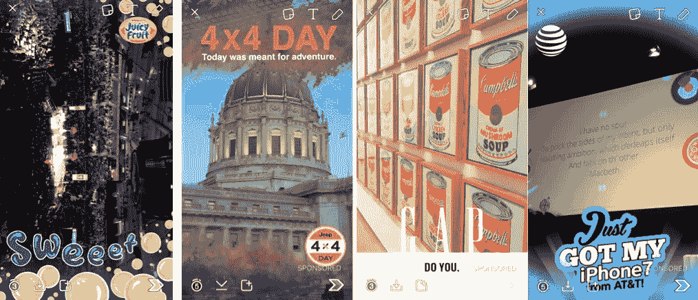

# 如何使用 Snapchat Geofilters 作为增长策略

> 原文：<https://medium.com/swlh/snapchat-geofilters-strategy-7cb150f070e8>

我是一个喜欢尝试新产品的早期用户。因此，当 Snapchat 在 2 月份宣布 geofilter 广告时，我为 Zumper 的增长实验感到兴奋。

# 战略

geofilter 定价的一个组成部分是平方英尺，因此我想在高密度位置创建 geo filter。为了最大化投资回报率，我列出了一个体育场场馆的清单，按容量排序。

A sample

这些体育场并不都有即将到来的活动，所以我把列表扩展到了圆顶、竞技场和中心。我连续七天记下每个地点的活动，然后选择一天购买过滤器——以增加在谷歌分析中看到影响的可能性。

在过去的 7 个月里，我已经运行了 3 组 Snapchat Geofilter 活动。

*活动#1* :各种活动，包括:

*   篮球
*   冰球
*   冰上迪士尼:冰雪奇缘
*   马戏团:林林兄弟
*   蕾哈娜演唱会:特拉维斯·斯科特的反世界巡回演唱会

*活动#2* :关注大学毕业典礼，包括:

*   Cal 聚
*   斯坦福
*   达特茅斯
*   加州大学圣巴巴拉分校
*   华盛顿大学

*活动#3* :聚焦夏季音乐会。
我选择了 5 个很少受到媒体关注的三线城市进行 Zumper 流量调查，因此流量激增可能要归功于此次活动。然后我在每个城市挑选了 3-6 场音乐会。音乐会包括:

*   雄鸭
*   皮特保罗
*   眨眼 182
*   贾斯汀·比伯
*   格温·史蒂芬妮

# 执行

1.  研究其他 geofilters:

我把看到的所有 Snapchat 广告截图。我在三月份策划第一次活动时，看到的广告很少。以下是过去几个月的一些情况:

Geofilters for movies

Geofilters for food/drink

2.制作地理过滤器:

我和另外两个 Zumps 合作设计: [Devin](https://twitter.com/dobrien123) (成长)和 [BZ](https://twitter.com/atav32) (工程)。每个过滤器都是针对活动定制的。这里有两个:

3.购买广告:

*第一步:上传资产*

*第二步:选择日期*

尽可能提前购买 geofilters。

随着 geofilters 越来越受欢迎，它们在储备方面也变得更具竞争力。

例如，几个月前我为麦迪逊广场花园购买了几个地理过滤器。但是现在你可能需要提前几周预定地理过滤器。秘密泄露了。

不幸的是，如果当时为您的位置预留了太多的 geofilters，您将不会立即得到通知。您可能会在几天后收到一封拒绝邮件。

**货币化建议** :
如果需求超过供应，Snapchat 应立即通知 geofilter 购买者。然后，客户可以立即购买另一个 geofilter。否则，这个人可能不会购买替换的 geofilter，Snapchat 的收入也会减少。

第四步:结账:

我申请观看 6 月 10 日在美国电话电报公司公园举行的巨人队对道奇队的棒球比赛的 geofilter 被拒绝了。我有比赛的门票，所以我很好奇，想看看是什么推广的过滤器“打败”了我:

我很惊讶地看到个性化的生日信息是 3 个专门的过滤器之一。显然，选择是基于时间排序。

**货币化建议** :
Snapchat 在购买 geofilter 时应该要求最高出价。然后，在上述拥挤的市场场景中，Snapchat 可以从需求增长中受益。此外，这也让愿意花更多钱的顾客更开心。:)

# **分析**

我在第一次竞选中依靠谷歌分析来衡量影响。幸运的是，随着 Snapchat 对货币化的关注，geofilter 平台已经有了很大的改善。新功能包括:

*   特定于每个 geofilter 的指标:

*   “我的地理过滤器”下的指标概述:

*   在线创建地理过滤器的选项:

# **外卖**

1.  关注你的**策略**。您希望通过选择 geofilter 来最大化密度，同时瞄准相关的潜在用户。一些想法:
    音乐应用:音乐会场地
    教育技术:高中&大学
    时尚创业:购物中心
    体育创业:健身房和体育赛事
    家居相关(家具、烹饪、清洁)创业:公寓楼
2.  **创建一个令人难忘的过滤器**，让人们愿意参与进来。和同事集思广益会很有成效！
3.  **未雨绸缪。**由于广告竞价还不是一项功能，请提前几周购买 geofilters，这样你就能排在队伍的最前面。

If you ❤ learning and experimenting with new products like me, [follow me on Twitter](https://twitter.com/inaherlihy) to see great articles I’m reading.

***相关文章***

## [**行为经济学帮助提高转化率、保留率和投资回报率的 9 种方式**](/@inaherlihy/9-ways-behavioral-economics-can-help-increase-conversion-retention-and-roi-3e245a2604e3#.86yh0dflb)

## [优化邮件的 8 个步骤:分析 125 封启动邮件](http://www.inaherlihy.com/blog/2015/1/27/8-steps-to-optimize-emails)

## [如何优化推荐项目](/@inaherlihy/how-to-optimize-182250e499d7)

分析 15 个创业推荐代码+登录页面

## [**媒介如何改变了我的生活**](/@inaherlihy/how-medium-changed-my-life-954662c5a73b#.voyb2qwus)

## 我是如何努力得到一份完美的工作的

