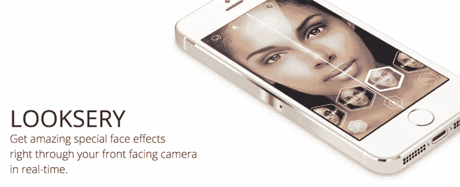
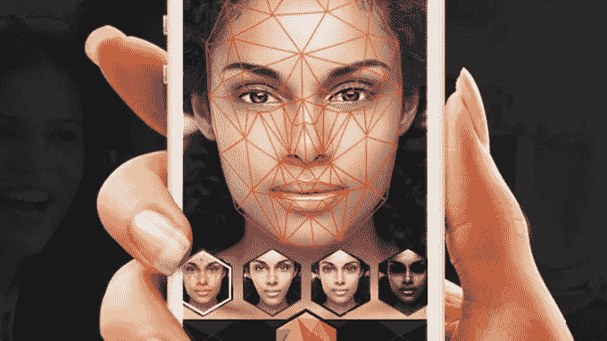
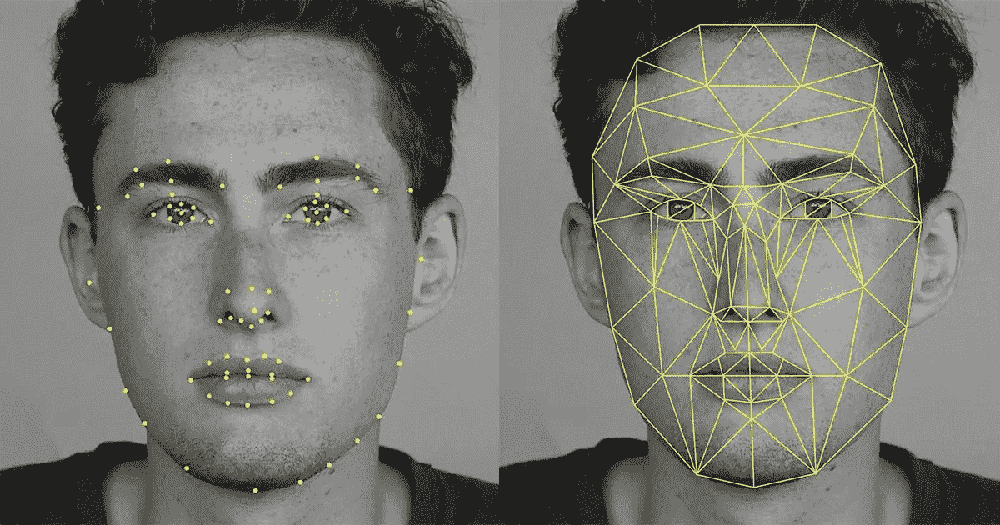
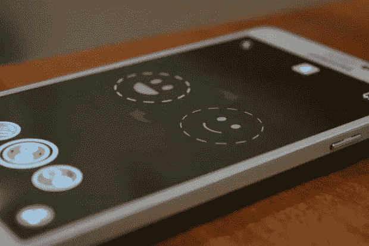

# Snapchat 的过滤器:计算机视觉如何识别你的脸

> 原文：<https://medium.com/swlh/snapchats-filters-how-computer-vision-recognizes-your-face-9ce536206fa7>

## **个性化面部识别背后的科学**

在那些无聊的时候，当你玩着 [Snapchat](https://www.snapchat.com/) 的滤镜——伸出舌头，模仿你的特征，想办法让花冠正好戴在你的头上——你肯定有过这样的时刻，你想知道在技术层面上发生了什么——Snapchat 是如何设法让你的脸与动画匹配的？

在网上搜索了两周之后，我很感激终于能够一窥幕后的真相。原来产品是计算机视觉应用的一个实例，是各种面部识别软件背后的主要燃料。

## **技术**

这项技术来自一家乌克兰初创公司 **Looksery** ，这是一款允许用户在视频聊天和拍照时修改面部特征的应用。Snapchat 于 2015 年 9 月以 1.5 亿美元收购了这家总部位于 Odesa 的变脸初创公司。据报道，这是乌克兰历史上最大的技术收购。

他们的[增强现实过滤器](http://www.supreality.com/2016/04/13/snapchats-augmented-reality/#comment-1138)进入了巨大且快速增长的计算机视觉领域。**计算机视觉**可以被认为是计算机图形学的直接对立面。计算机图形学试图从 3D 模型中产生图像模型，而计算机视觉试图从图像数据中创建 3D 空间。计算机视觉开始越来越多地应用于我们的社会。这就是你如何扫描你的支票，并从行中提取数据。你可以用手机存支票。这就是脸书如何知道谁在你的照片中，自动驾驶汽车如何避免碾过人，以及你如何给自己一个狡猾的鼻子。

## **Snapchat 过滤器如何工作**

Looksery 保持他们的工程更加保密，但每个人都可以在线访问他们的专利。Snapchat 滤镜使用的计算机视觉的特定区域被称为**图像处理**。图像处理是通过对所提供图片上的每个单独像素执行数学运算来转换图像。

**1 —面部检测:**

第一步是这样工作的:*给定一幅输入图像或视频帧，找出所有当前人脸，输出其包围盒(即矩形坐标形式:* ***X*** *，* ***Y*** *，* ***宽度****&****高度*** *)。*

自 21 世纪初以来，人脸检测一直是一个得到解决的问题，但面临一些挑战，包括检测[微小](https://arxiv.org/pdf/1612.04402.pdf)、[部分](https://arxiv.org/pdf/1603.09364.pdf) & [非正面](http://ieeexplore.ieee.org/abstract/document/5459421/)人脸。最广泛使用的技术是方向梯度直方图(简称为 [HOG](https://en.wikipedia.org/wiki/Histogram_of_oriented_gradients) )和支持向量机(简称为 [SVM](https://en.wikipedia.org/wiki/Support_vector_machine) )的组合，其在给出高质量图像的情况下实现了一般到相对较好的检测率，但是这种方法至少在 **CPU** 上不能进行实时检测。

*下面是猪/SVM 探测器的工作原理*:

给定一个输入图像，计算该图像的[金字塔](https://en.wikipedia.org/wiki/Pyramid_%28image_processing%29)表示，它是原始图像的多尺度缩小版本的金字塔。对于金字塔上的每个条目，使用滑动窗口方法。滑动窗口的概念非常简单。通过以恒定的步长在图像上循环，以不同的比例提取通常大小为 64×128 像素的小图像碎片。对于每个小块，算法会决定它是否包含人脸。为当前窗口计算 HOG，并将其传递给 SVM 分类器(线性或非线性),以进行决策(即，是否人脸)。完成金字塔后，通常会进行一个[非最大值抑制](http://users.ecs.soton.ac.uk/msn/book/new_demo/nonmax/)(简称 NMS)操作，以丢弃堆叠的矩形。你可以在这里阅读更多关于猪和 SVM 组合的内容。

**2 —面部标志:**

这是我们分析阶段的下一步，工作如下:*对于每个检测到的面部，输出该面部的每个成员或面部特征的局部区域坐标。这包括眼睛、骨骼、嘴唇、鼻子、嘴巴……坐标通常以点的形式(* ***X*** *、* ***Y*** *)。*

提取面部标志对于给定边界框(即带有目标面部的裁剪图像)的 CPU 来说是相对廉价的操作，但是对于程序员来说很难实现，除非使用一些*不太快的*机器学习技术，例如训练&运行分类器。

你可以找到更多关于提取面部标志的信息[这里](http://www.learnopencv.com/facial-landmark-detection/)或者这个 PDF: [用回归树集合进行一毫秒面部对齐](http://www.cv-foundation.org/openaccess/content_cvpr_2014/papers/Kazemi_One_Millisecond_Face_2014_CVPR_paper.pdf)。在一些明显有用的情况下，面部检测和界标提取被组合成单个操作。

**3 —图像处理**

现在面部已经被检测到，Snapchat 可以使用图像处理将特征应用到整张脸上。然而，他们选择了更进一步，他们想找到你的面部特征。这是在**活动形状模型**的帮助下完成的。

活动形状模型是已经通过在数百到数千幅图像上手动标记面部特征的边界来训练的面部模型。通过机器学习，创建了一个“平均脸”，并将其与提供的图像对齐。当然，这个平均脸并不完全符合用户的脸(我们都有不同的脸)，所以在拟合脸之后，检查“平均脸”边缘周围的像素，以寻找阴影的差异。因为算法所经历的训练，(机器学习过程)，它有一个特定面部特征应该是什么样子的基本框架，所以它在给定的图像中寻找类似的模式。即使一些初始变化是错误的，通过考虑它已经固定的其他点的位置，该算法将纠正它在认为你面部某些方面的位置方面犯下的错误。然后，模型会调整并创建一个网格(一个可以随着面部移动和缩放的 3D 模型)。

当你在选择滤镜之前看到白色网络时，整个面部/特征识别过程就完成了。然后，过滤器通过增强它们或在它们上面添加一些东西来扭曲所提供的面部的某些区域。

## **从滤镜到换脸**

几个月前，Snapchat 的更新版本具有与朋友交换面孔的功能，无论是实时还是通过从你的图库中访问一些面孔。注意脸型是如何可见的，这就是统计模型所在的位置。它有助于 Snapchat 快速对齐您和您朋友的面部，并交换功能。

找到所有特征后，应用程序会沿着你的脸创建一个网格，一帧一帧地粘在每个点上。现在可以按照 Snapchat 的感觉编辑和修改这个网格。

一些镜头通过让你扬起眉毛或张开嘴巴来做更多的事情。这也很容易思考，但是它需要更多的算法来暗示。

*   嘴巴里面比较黑，相对来说。所以这就暴露了嘴的张开。
*   当计算出用户抬起了眉毛时，眉毛相对于其他面部特征的变化被考虑在内。

如前所述，这项技术并不新鲜。但是在移动平台上实时执行所有这些过程需要大量的处理能力和一些复杂的算法。这就是为什么 Snapchat 认为支付 1.5 亿美元收购 Looksery 比仅仅建立其平台更好。

## **结论**

我希望这是有益的，并像它一样激起你的好奇心。现在，我将更深入地探索 Snapchat 过滤器，测试我最喜欢的面部镜头，了解并欣赏幕后进行的所有计算机视觉。

— —

*如果你喜欢这首曲子，我希望你能按下拍手按钮*👏*这样别人可能会偶然发现它。你可以在* [*GitHub*](https://github.com/khanhnamle1994) *上找到我自己的代码，在*[*https://jameskle.com/*](https://jameskle.com/)*上找到更多我的写作和项目。也可以在* [*推特*](https://twitter.com/@james_aka_yale)*[*上关注我直接发邮件给我*](mailto:khanhle.1013@gmail.com) *或者* [*在 LinkedIn 上找我*](http://www.linkedin.com/in/khanhnamle94) *。**

***其他资源:***

*   *[*Snapchat 滤镜如何工作*](https://www.technobyte.org/2016/11/snapchat-filters-work/)*【Technobyte】**
*   *[*Snapchat 滤镜如何工作——幕后*](http://techundred.com/how-snapchat-filter-work/)*【tech bain】**
*   *[*Snapchat 的滤镜如何工作*](https://www.youtube.com/watch?v=Pc2aJxnmzh0) *(Vox)**

**

## *这个故事发表在 [The Startup](https://medium.com/swlh) 上，这是 Medium 最大的企业家出版物，拥有 294，522+人。*

## *在此订阅接收[我们的头条新闻](http://growthsupply.com/the-startup-newsletter/)。*

**