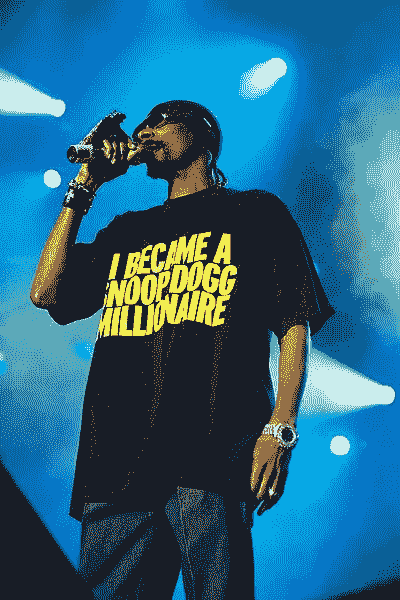
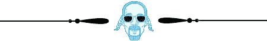
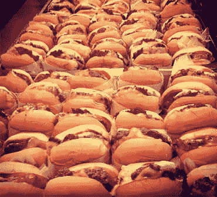
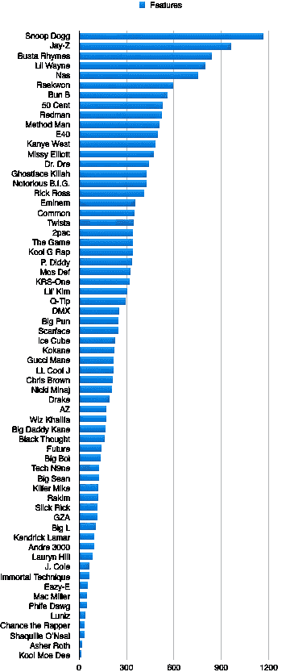
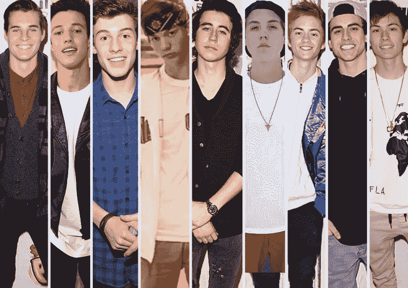

# 史努比狗狗营销

> 原文：<https://medium.com/swlh/snoop-dogg-marketing-b08fd5437a0b>

当我提起“*皮蒂·帕布鲁*”、“*神秘卡*”或“*杰梅因·杜普利*”这些名字时，我会想到什么？如果你是一个无可救药的嘻哈狂热者，你可能知道我在说谁。如果没有，你可能正在挠头。

上面提到的每一张说唱专辑都是格莱美最佳说唱专辑的过去提名者。在他们各自的年代里，他们登上了排行榜，向媒体示好，赢得了粉丝——或者至少赢得了足够多的粉丝，在红地毯上赢得了一席之地。

当然，这些地方总是不够用。但是有一个说唱歌手，年复一年，可疑地从提名名单中消失了:独一无二的 D-O-Doug-Snoop Doggy Dogg。

自 1992 年开始职业生涯以来，史努比已经获得了许多其他格莱美奖的提名(包括最佳雷鬼专辑和最佳说唱歌曲)，但他从未获得过最佳说唱专辑的提名，这是他的许多同龄人获得的荣誉。之前的提名者包括德瑞医生，米西·埃利奥特，布斯塔·莱姆斯，Jay Z，LL Cool J，2Pac，Biggie，Q-Tip 和吴唐家族的成员。

见鬼，连吹牛老爹都能够 ***赢*** 这该死的东西。

在他 44 岁的时候(相当于狗的 308 岁)，提名将是他紫色皮条客帽子上的一根漂亮的羽毛。但是狗爸爸没有受伤。

根据粗略的谷歌搜索，史努比·道格的银行存款约为 1.35 亿至 1.45 亿美元，每集收费可达 10 万美元以上，正准备出演他的第 36 部故事片——是《冲出康普顿》的续集。

虽然他没有出售任何公司(如 Jay Z、50 Cent 或德瑞医生)，但史努比·道格已经设法获得了比亿万富翁男孩俱乐部更令人印象深刻的东西:**他获得了永久的文化关联。**

> “由于他不可思议的嗓音，他不可否认的魅力，以及他无限的风格，**他永远离排行榜冠军只有一步之遥。”**
> 
> **—复杂的杂志**

但我不是来说史努比之流的。我不想听嘻哈历史的讲座。我甚至不是来发表一篇以音乐评论为幌子的尖锐的千禧年思考文章的。我在写一篇中型博客，哥们。注意节拍开关。

# 如何将其推向市场(如 Snoop)

嘻哈正在吞噬世界，营销行业也不例外。像 Snoop Dogg 这样的说唱歌手所采用的策略正在迅速成为积累追随者和注意力的首选方式，尤其是因为“Snoop Dogg 营销”不需要任何成本，只需要一点点努力就可以开始。它被 Product Hunt、Rap Genius、Unsplash、Reddit 和 Vine 等网站的饥饿自举者用来扩大他们的受众，尽管他们不是向我介绍这个概念的人。

向我介绍这个概念的人是尤尼斯 Uniburger 背后的智囊，也是给我第一份营销工作的人。我称他的方法为“史努比狗狗”,原因我稍后会解释。

尤尼斯面临一个典型的营销问题。他不仅在蒙特利尔拥有一家汉堡店。他拥有蒙特利尔最好的*汉堡店。尤尼斯汉堡是世界上最好的汉堡之一。“比五个人更好”、“比进进出出更好”和“比摇摇小屋更好”是他经常收到的称赞。*

*但是尤尼斯的商店被低估了。它是新的。这个地点不在人迹罕至的地方。它在社交媒体上的影响力还不够大。但这些是营销人员能够面对的最好的问题。毕竟，我们的工作就是要抓住弱者，让他们成为大狗。*

*Uniburger 还没有获得大众的认可。然而,*确实在**厨师**中有狂热的追随者。在为顾客提供了 250 美元一盘的雪蟹和 craquelin de porc 之后，蒙特利尔最著名的餐馆老板们会走进 Uniburger，点一杯可乐，大快朵颐市内出售的最嫩的汉堡。**

*为了准备他商店的两周年纪念日，Younes 想组织一次营销闪电战。他雇我管理他的社交媒体。与此同时，尤尼斯照顾“史努比狗”。*

> ****【史努比狗狗(n):*** *一种互惠互利的营销策略，小狗狗和大狗狗联手进行一个小规模的合作项目**

*尤尼斯的想法是这样的:在他的店开业两周年的那个星期，他会邀请该市最好的厨师来准备他们自己的经典 Uniburger 的“混搭”。我们将出售有限数量的这种特制汉堡——每天一个新汉堡——利润将捐给慈善机构。*

*我们称这个想法为“单汉堡周”。*

*我们俩都不确定这行得通。毕竟，这些都是著名的(忙碌的)厨师！尽管如此，我们还是准备了邮件，点击了发送，然后祈祷好运。你难道不知道吗——每个人都说是的。*

*虽然我们对 Uniburger 周的期望很低，但结果不言自明:每天都有大规模的全市范围的新闻报道。每天都有大量新的 Instagram 粉丝。汉堡呢？他们每天都在一小时内售完。*

*Uniburger 周的成功有几个原因。媒体喜欢它，因为这是一个机会，写一个关于这个城市的名厨的故事。厨师们喜欢它，因为这是一个打破常规，为慈善事业做些有创意的事情的机会。人们喜欢它是因为，人们喜欢汉堡。*

*I love it when you call me Big Whoppa*

**

> *那么史努比狗狗在哪里呢？*

*没有人比史努比·道格更擅长利用他人进行营销。他已经说唱了 20 多年，然而在这段时间里，没有人能比得上他的活力和与这么多人合作。*

*事实上，史努比·道格比其他说唱歌手出现在更多的歌曲中。(我数过了)。*

**

*Stats taken from the artist’s “featuring and presenting” credits on discogs.com*

*Uniburger Week 以一些有影响力的人物为特色取得了成功，但 Snoop Dogg 获得了以 ***规模*** 为特色的好处。他出现在 1000 多首歌曲中——许多是家喻户晓的名字，更多的是默默无闻的艺术家。*

*还记得我在介绍中提到的“皮蒂·帕布罗”、“神秘卡尔”和“杰梅因·杜普利”这些说唱歌手吗？Snoop Dogg 和他们至少合作了一首歌。他的努力可能没有赢得任何格莱美提名，但他能够利用这位艺术家的(短暂的)炒作，并利用这个机会推广自己的品牌。*

*然而，史努比狗狗*真的*需要“皮蒂·帕布罗”的宣传帮助吗？*

*令人惊讶的是，**是的。几乎可以肯定的是，一些皮蒂·帕布罗的粉丝，不管出于什么原因，从来没有听过史努比·多格的歌。在那些听说过史努比的皮蒂·帕布罗粉丝中，一段精选的诗句为他赢得了更多的尊重。当然，皮蒂·帕布罗从交易所得到的促销帮助比史努比·多格多。但是如果你做任何事情 1000 次，你将会在顶端结束。如果你记得皮蒂·帕布鲁，请举手。***

**

*合作不仅仅对于艺术家的爆发很重要。它们对知名艺术家也很重要。为了说明这一点，以下是坎耶·韦斯特职业生涯中合作过的(大约)438 人的不完整列表:*

> *塔利布·奎利、杰伊·Z、茅斯·达夫、布斯塔·莱姆斯、扩张的人民、布兰迪、共同、贫民窟村、约翰·传奇、卡隆、Rhymefest、杰米·福克斯、格斯特菲斯·基尔拉、尼欧、DJ·哈立德、法瑞尔、贾斯汀比伯、游戏、堕落男孩、T-Pain、小妹、*杰梅因·杜普利*、埃斯特尔、里尔·韦恩、扬·吉兹、安德烈·3000、T.I .、克利普塞、桑蒂戈尔德、吕克·李、里克·罗斯、基德·库迪、德雷克、阿姆、克里斯·布朗、斯特罗姆、劳埃德·班克斯 提阿非罗·伦敦，2 Chainz，碧昂斯，*皮蒂·帕布罗，*茜希·普林斯，克里斯·马汀，KRS-One，纳斯，拉基姆，保罗·沃尔，亚当·莱文，后果，RZA，斯威兹·比茨，妮琪·米娜…*

*你可能不认识合作者名单上的每一个名字，但是 Kanye 不需要你认识。**坎耶只需要你听他和这些人中*一个*合作的*一个*就能让你接触到他的音乐**——虽然他个人的击球率远高于 1/438。*

*(记住，史努比·道格合作过的人是坎耶的两倍多。)*

**

# *如此这般……*

*还有哪些行业的品牌通过有趣的小规模合作来利用名人的力量？我们已经解决了汉堡和说唱歌手——现在是时候分析另一组纸追逐者了。这一次，在科技世界里。*

## *Reddit*

*虽然比尔·盖茨可能没有最流畅的说唱，但任何称职的史努比·道格都会给 DOS 老板一首客串诗。*

*Reddit 上的 Snoop Doggers 知道这一点，并利用对大牌作家、科学家和名人的采访来发展他们的网站。比尔·盖茨、埃隆·马斯克和巴拉克·奥巴马以及许多其他有影响力的人都与 Reddit 合作，进行简短的即兴采访，由 Reddit 用户提出问题。*

*通常，名人会在接受采访前推广 Reddit，从而增加网站的影响力。反过来，名人可以接触到订阅 Reddit 采访的 1000 万人。采访很有趣，可以让名人直接与粉丝互动。难怪这么多精通营销的名人报名参加。*

## *Unsplash**

*Unsplash 是一个众包摄影平台，发布免费的“随心所欲”的照片。会员提交他们拍摄的照片，Unsplash 贴出最好的照片。由于 Unsplash 照片没有版权限制，成员可以自由地将它们用于任何目的，如桌面壁纸、相册封面艺术、登录页背景和广告牌广告。*

**我在这里工作。超级家庭。*

**

*Unsplash offers 10 hi-res photos delivered to your inbox every 10 days [https://unsplash.com/join](https://unsplash.com/join)*

*Unsplash 于 2013 年推出，现在每月提供 5 亿张照片。但它是如何将自己的触角延伸到摄影师之外的呢？当然是史努比狗狗营销。每周，Unsplash 都会联系艺术、商业和科技行业的有影响力的创意人士，邀请他们选出自己最喜欢的 Unsplash 照片。它在其网站、时事通讯和社交媒体账户上推广这些品牌照片集。*

*虽然他们从来没有被要求这样做，但有影响力的人经常与他们自己的追随者分享他们的照片集，从而向新人展示 Unsplash。Unsplash 以前的合作者包括美国宇航局和知识共享创始人劳伦斯·莱斯格。*

*Unsplash 也在试水“离线”窥探跟踪:上周，它开始为一本由 100 多名合作者制作的摄影书籍筹集资金。有这么多人参与了这本书的创作，Unsplash 这本书有一个内置的推广网络。除了漂亮照片的明显吸引力，其推广网络也是其 Kickstarter 运行如此顺畅的原因之一。如果你好奇的话，可以在这里看看《T2》这本书(利润归投稿艺术家)。*

# *奖励内容:*

## *[Rap Genius 和 Product Hunt 如何利用 Snoop Dogg 营销](/@bagelboy/snoop-dogg-marketing-bonus-content-813b4ee753e5)*

## ***藤蔓***

*Vine 在这些案例研究中的独特之处在于，Snoop Dogg 营销没有被 Vine 的管理层用来获得更多的市场份额。而是被 Vine 的 ***用户*** 雇佣。*

**

*Vine 是一个分享简短循环视频剪辑的平台。除了吸引名人用户(如 [Snoop](https://vine.co/v/bF5K5UElxpQ) )之外，它还能让一些“Viners”凭借自身实力成为名人。*

*最大的 Viners 现在有数百万的追随者，代言协议，和华而不实的好莱坞演出。也许更疯狂的是，15 个最大的葡萄园中有 6 个住在同一栋公寓楼里。*

*葡萄园主已经从俄亥俄州、佛罗里达州、法国和加拿大搬到好莱坞 **Vine Street** (说真的)的一个私人庄园。这完全是出于商业原因:*

*通过相互靠近，Vine Street 的国王和王后可以出现在彼此的视频中——这使得相互的自我宣传更加容易。*

*顶级 Vine 视频很少只展示一个人。像说唱歌手一样，通常有许多合作者参与其中。合作者将在他们的视频中互相标记，并重新记录他们邻居的视频。因此，如果你追随任何一个 Vine Street Viners，不可避免的是，你最终会遇到所有六个。*

*当然，这是一种极端的合作——这不是大多数营销人员能够完成的小规模变化。虽然很难“超越”史努比·道格，但藤街上的人们已经非常接近了。*

**

## ***总之(有三句格言，因为你们都爱它们)***

# ***1。良好的市场营销能让所有的人受益***

*有些人说外面是一个竞争激烈的世界。但至少在说唱、汉堡和初创企业方面，这更像是一个狗帮狗的世界。*

*说唱以其激烈的争斗而闻名，但正是形成创造性伙伴关系的意愿给了嘻哈歌手征服全球销售排行榜所需的营销优势。*

> *“当工作人员互相抱怨时，粉丝们很兴奋……但当他们**和**一起创作**时，粉丝们更兴奋。经典作品诞生了，钱也流入了这个行业。这引发了一场浪潮，抬高了我们所有的船只。”***
> 
> *——[塔利布·奎利·格林](https://medium.com/u/8e0387b95df0?source=post_page-----b08fd5437a0b--------------------------------)，[黑星](https://www.youtube.com/watch?v=Rx5aVI2zsFE)*

# *2.好的营销是慷慨大方*

*史努比·道格活生生地证明，最好的营销策略不是索取，而是给予。*

*不管是格莱美获奖艺术家还是书呆子式的说唱歌手:当史努比被邀请出演一个角色时，他会在门口检查自己的自尊心，并利用这个机会扩大自己的粉丝网络。这种营销道德不仅为他赢得了大量的绿色，还让他在说唱歌手的典型到期日之后仍然保持着文化相关性。这都是因为当别人要求他帮助别人时，他说“是”。*

# *3.好的营销要求过高*

*哇，我只有三句格言，但不知何故，我无法避免自相矛盾。记得，就像，前两段，当我说，最好的营销策略不是问，而是给？*

> *"最好的营销策略不是索取，而是给予."*
> 
> *——我，两段前*

*忘了它吧。**要求更多。***

*你可以一直祈祷，希望某个名人会给你免费的播出时间。然而，你最好想出一个有趣而新颖的方法让他们参与到你的产品中。给他们一个机会，让他们做一些有趣的事情，为了一个好的理由——一些他们可以引以为豪并向自己的粉丝炫耀的事情。哪怕只是一个汉堡。或者精选的诗句。*

**

*Snoop Dogg marketing 是一个新名字，但合作业务并不新鲜。嘻哈音乐走了极端，但它仍然是大多数娱乐形式的主要内容。人们邀请“嘉宾海报”为他们的博客写稿，播客邀请“嘉宾主持人”参与他们的广播，相互竞争的深夜节目主持人互相拜访，相互推销自己。诚然，科技行业现在才刚刚开始流行起来——但是谁说你不能教一只新狗老把戏呢？*

**

# *乔·麦克尼尔是一名来自加拿大蒙特利尔的作家。*

## *恭喜你通过了整篇文章，伙计。如果你喜欢它，请确保登录并♥它。如果你是一个真正的 MVP，看看 Unsplash Book [Kickstarter](http://kickstarter.com/projects/mikaelcho/the-unsplash-book) 和[订阅](http://eepurl.com/bHw9kT)船员博客。有关 mixtape 的功能和未来的文章，请在 [Twitter](http://twitter.com/mtlbagelboy) 和 [Medium](/@bagelboy) 上关注我。*

**

> *乔·麦克尼尔的其他文章:*

* [## @ FairmountBagel 的兴衰

### 我当时很年轻。我太天真了。我发起了一场全市范围的百吉饼战争，不抓任何俘虏。

medium.com](/p/43bfcbea8505)*