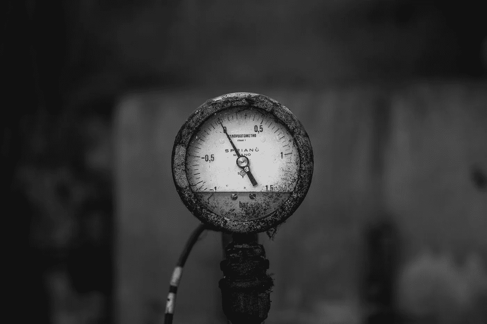

# 这就是他们所说的倦怠

> 原文：<https://medium.com/swlh/so-this-is-what-they-call-burnout-44d0ad4bbfb0>

## 当你到达跑步机的终点时。

你在领导力方面学到的第一课是，你的远大抱负会很快被排山倒海的被动繁忙工作淹没，尤其是当你的角色处于被称为中层管理的混乱地带时。

日复一日，优先事项可能会大幅变动。你需要尽你所能让自己不负债。你扑灭了一场火，却面临着另一个意想不到的挑战或要求，需要你的关注。

你尽你最大的能力攀爬、适应、跳舞、躲闪和躲避，试图确保在试图支持你的团队时没有任何闪失。似乎永远没有时间来整理你的思绪或提前计划。你感觉到其中一个盘子掉到地板上只是时间问题。

管理装配线在你的能力极限下运行，但你太在意让生产在你的眼皮底下停止。你就是这样被连接的。即使内心感到疲惫、沮丧和焦虑，你也要继续战斗，尽自己最大的努力。

尽管你的初衷是好的，但无情的压力会对你的思想、身体和情绪造成伤害。随着时间的流逝，你最终会变得疲惫不堪、愤世嫉俗和麻木。你变成了机器人。工作中的激情、兴趣和快乐会随着你的目标感一起消失。你试图为你的团队营造一种虚假的乐观感，但感觉很空虚。

当你不想起床的那一天到来时。你从没想过会发生在你身上。你总是能找到一条出路或抓住一些灵感，但今天你似乎无法集中精力回到跑步机上。

***“所以，这就是他们所说的倦怠。”***

你考虑辞职，但也有责任。账单要付。依赖你的人。这是一种选择，但很难选择。谁能说下一场演出不会更像以前一样。它会提醒你，为了达到这一步，你付出了多少。你能走开吗？

这就是你的关键时刻。你不能容忍事情一直这样发展下去。有些东西必须放弃。要么环境必须改变，要么你必须改变你对环境的理解和反应。也许两者都有。

是时候呼叫增援了。你向一个倾听你担忧的朋友伸出援手，然后问一些问题来帮助你做出选择。

**好吧，你是怎么来的？**

你考虑一下。随着时间的推移，这个问题变得越来越严重，因为你已经接受了越来越多的东西，却从来没有拿走任何东西。你意识到有些事情你可以授权，但是如果你甚至没有时间发展你的团队或者培训某人，你怎么能授权呢？如果你是诚实的，你甚至不确定你的团队中是否有合适的人，但是考虑到你正在处理的其他事情，你甚至已经被解决这个问题的想法淹没了。

**那么，*你是如何管理自己的时间的呢*？**

你想知道一些消耗你精力的问题是不是自己造成的。你是否忽略了真正的重点？是你在管理你的时间表，还是你的时间表在管理你？你想想你的日子是怎么过的，什么样的任务消耗了你的注意力。当你可以投资于能让你实现真正价值的人和流程时，你还在追逐你的收件箱吗？

**你照顾好自己了吗？**

哎哟。没有那么多。你一直在用咖啡因给自己加油，吃得很差，不锻炼，睡眠不足。这是疲惫的秘诀。这只会增加你内心的期望和工作中的压力造成的倦怠。你意识到这是一个完全在你控制之下的领域，但是你已经让它和其他习惯一起溜走了，这些习惯曾经帮助你保持专注和精力充沛。

你能和谁聊天？

你一直在考虑如何向你的老板提出这件事。这是一次艰难的谈话。你会因为寻求帮助、重新安排优先事项或把一些责任转移到其他地方而被认为软弱吗？也许你会感到惊讶。可能他们真的没有注意到有多少东西落在了你的桌子上。你也回忆起一个你钦佩的人，她似乎能正确看待事物，而且工作效率很高。这个人能成为帮助你走出工作困境的导师吗？

你的动力是什么？

哦，那是一个大的。这个问题被重构为“你爱什么？”或者“是什么驱使你？”。你已经很久没有认真考虑过这个问题了，所以这个问题暂时还悬而未决。曾经有一段时间，你热爱自己的工作，即使工作同样艰难，你也能茁壮成长。这有什么不同？你认识到一些缺失的元素。你能找到一种方法让这些事情回到你的生活中吗？你必须放弃什么？你需要如何区分优先级？

**但是如果这样不行呢？**

好吧，那么你已经接受了你可以采取的行动，这些行动在你的能力范围之内，可能有助于扭转这种局面，或者让你朝着正确的方向前进。它们值得一试。但是，如果情况真的是这样，即使你做了这些努力，你仍然发现自己回到了筋疲力尽的边缘呢？你意识到无论如何你都在冒险。如果不采取行动来解决问题的话，保持倦怠会让你的工作面临同样大的风险。

你的朋友提醒你，唯一真正的问题是你的取向。你会是被动的还是主动的？你会决定下一步做什么，还是等待环境为你做出决定？你等待的每一天都是在扼杀你的幸福的情况下花费宝贵的生命单位。只要想着采取行动，乌云就开始消散。

你会全力以赴，因为你已经决定这是你成长需要做的事情，因为你关心你的团队。也许你甚至可以再次学会享受工作。如果故事没有变得更好，你会翻过这一页，开始新的一章，甚至可能是一本新书。

明天你将开始逃离倦怠。

*原载于 2018 年 2 月 14 日*[*【soul2work.com*](https://soul2work.com/2018/02/so-this-is-what-they-call-burnout/)*。*

## 这个故事发表在 [The Startup](https://medium.com/swlh) 上，这是 Medium 最大的企业家出版物，拥有 296，127+人。

## 在此订阅接收[我们的头条新闻](http://growthsupply.com/the-startup-newsletter/)。

