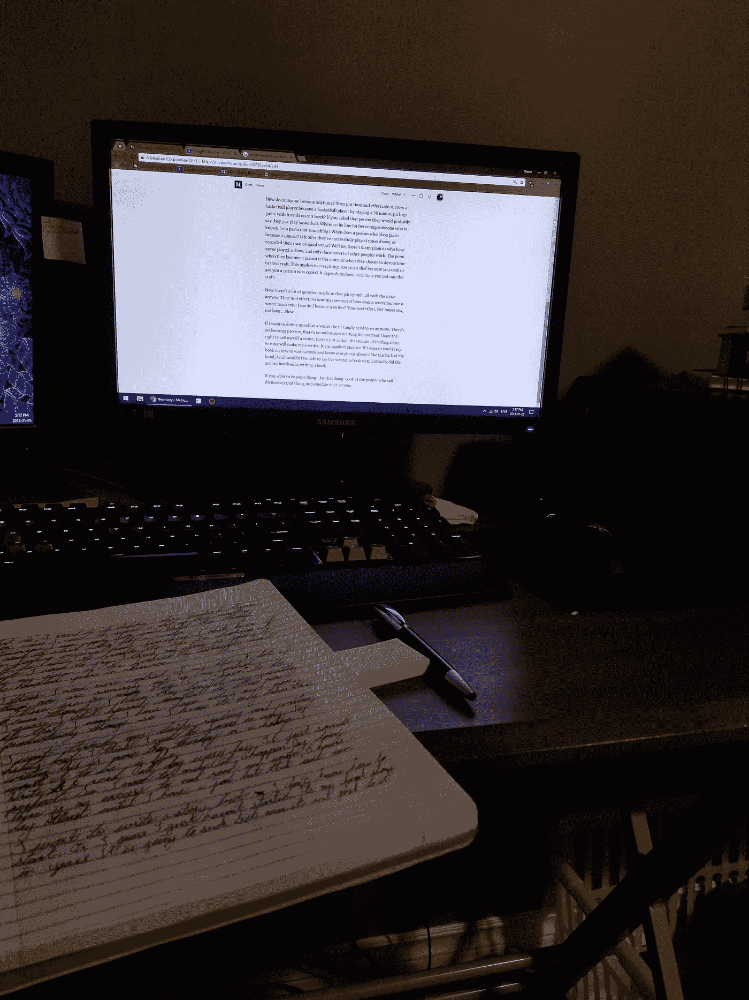

# 所以你想成为一名作家

> 原文：<https://medium.com/swlh/so-you-want-to-be-a-writer-6ee33720ae6d>

## 你在展示吗？

昨晚我写了“你想成为什么样的人，你就是什么样的人。你是谁，就是你想成为谁。”。这显然不是一个原创的想法，它来自格里·克鲁斯对《万能钥匙系统》一书中一个概念的解释。自从我听到这个概念，它就一直伴随着我，昨晚我用它来组织我的生活。

我推断，如果我想要一个有条理的生活，我不需要读一百本关于如何组织事情的书和文章…我只需要开始，把事情放回原处。这个概念的美妙之处在于它可以应用于生活中的许多方面。

我想成为一名作家。从 11 月份开始，我几乎每天都在写作(至少是公开的)。这能让我成为作家吗？是也不是。我是一个写作的人，但我不认为我会认为自己是一个作家。为什么不呢？嗯，作家就是花很多精力去创作的人。我在这些中等岗位上没怎么下功夫。我每天最多花一个小时把文字放到这个网站上。大多数日子都接近 30 分钟，有些低至 15 分钟。

作家如何成为作家？

任何人如何成为任何东西？他们投入了时间和精力。一个篮球运动员每周和朋友玩一次 30 分钟的篮球比赛就能成为一个篮球运动员吗？如果你问那个人，他们可能会说他们只是打篮球。成为因某件事而出名的人的界限在哪里？一个弹钢琴的人什么时候成为钢琴家？是在他们成功地播放了一些节目，或者录制了他们自己的原创歌曲之后吗？不，有很多钢琴家从来没有演奏过，只是翻唱了其他人的作品。当他们成为钢琴家的时候，就是他们选择把时间投入到自己的技艺中的时候。这适用于一切。你是因为做饭才当厨师的，还是做厨师的人？这取决于你在这门手艺上投入了多少时间。

现在那一段有很多问号，都是同一个答案。时间和努力。所以现在我关于作家如何成为作家的问题变成了:我如何成为作家？时间和努力。不是明天，不是以后…是现在。

如果我想把自己定义为一名作家，那么我只需要写更多。没有学习的过程，没有标志着我有权称自己为作家的里程碑，只有行动。再多关于写作的阅读也不会让我成为作家。这是一种应用实践。如果我读完了每本关于如何写书的书，并且对它了如指掌，我仍然不能说我已经写了一本书，直到我实际做了写书所涉及的行动。

如果你想成为某样东西…就成为那种东西。看看那些称自己为那个东西的人，然后模仿他们的行为。

## 这篇文章发表在 [The Startup](https://medium.com/swlh) 上，这是 Medium 最大的创业刊物，有 281，454+人关注。

## 订阅接收[我们的头条新闻](http://growthsupply.com/the-startup-newsletter/)。

