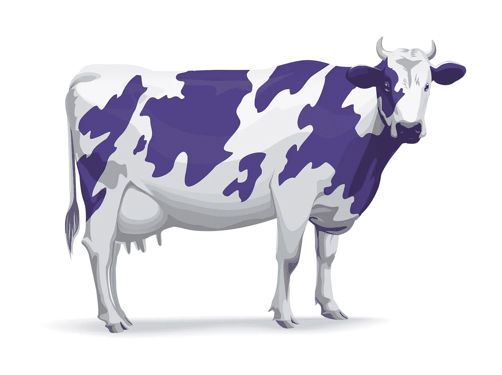

# 那么…你想成为下一个塞斯·戈丁吗？

> 原文：<https://medium.com/swlh/so-you-want-to-be-the-next-seth-godin-d9ba041a0011>

**作者米歇尔·拉什利，** [***更聪明的写作实验室***](https://smarterwritinglab.com)

我读过的第一本书是塞斯·戈丁的《紫牛》。我的意思是，光是标题就让人无法抗拒。紫色封面是决定性因素。但是，我最喜欢这本书的一点是:**它让我以一种我从未想过的方式思考我的业务。Seth 在大约 200 页有趣的书中写道。**