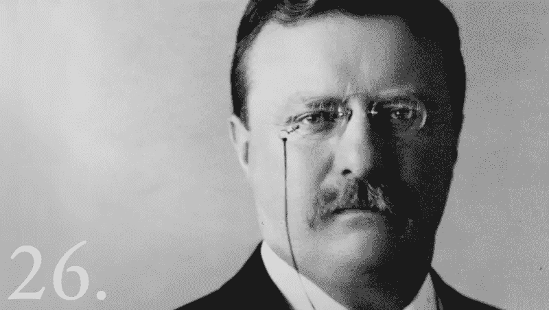

# 所以，你在挣扎？你不是唯一一个。

> 原文：<https://medium.com/swlh/so-youre-struggling-you-re-not-the-only-one-db90ae9da82f>

Photo by [Jeremy Perkins](https://unsplash.com/photos/oTHXpT6nJsE?utm_source=unsplash&utm_medium=referral&utm_content=creditCopyText) on [Unsplash](https://unsplash.com/search/photos/struggle?utm_source=unsplash&utm_medium=referral&utm_content=creditCopyText)

在你有所成就之前，你需要奋斗。

奋斗是世界上数百万人的方式，他们为自己赢得了在他们所做的事情上获得成功的权利。事实上，斗争永远不会结束。

在你进入任何事情的下一步之前，你总是需要奋斗。

在皇马艰难地晋级欧冠半决赛对阵拜仁慕尼黑之后，齐达内在接受媒体采访时说:

> “我们知道你不可能不经历磨难就进入(欧冠)决赛，这样更好。不过，这对你的心脏不好。

我认为这句(看似)简单的话有很多道理。

首先，它表明无论你现在站在哪里(即使你是世界上最好的人之一)，奋斗永远是前进过程中的一部分。

其次，它表明焦虑是这个过程的一部分，对于世界上的每一个人都是如此。这种焦虑很容易对你的身体造成伤害。

第三，它表明，正是这种斗争，使得这一过程最终是值得的。正是**因为**你经历了这么长时间的奋斗，你才会更加珍惜你的成就。

# 大多数人都在努力避免奋斗。

大多数人认为生活对他们不公平。他们认为，只有他们需要经历这些长期的斗争，而成功对其他人来说似乎很容易。

但这种看法从来都不是真的。

每个人都有自己的斗争方式。

在赢得比赛之前，职业足球运动员需要训练他们的评估能力和忍受焦虑的时间。作家需要花费数年时间努力工作，才能从他们的作品中挣到第一美元。

在其中一家相当成功之前，创始人通常会经历几次失败的创业。即便如此，他们自己可能也不会从中获得很多经济利益。

任何人想要取得有意义的成就，首先需要经历奋斗的阶段。

正如[拿破仑·希尔](https://en.wikipedia.org/wiki/Napoleon_Hill)所说:

> 只有通过不断的努力和奋斗，力量和成长才会到来。

# 五年没有收入

我自己的奋斗故事始于五年前，那时我 21 岁，爱上了写作。从那以后，我一直试图靠写博客谋生。

你猜怎么着我还没有从我的博客中赚到一块钱。

我偶尔会认为自己已经破产，可以从事一些自由写作。但是说到从我的博客和我自己的产品中赚钱，我还是一点收入都没有。

你可能会问我为什么不做更多的自由职业工作。因为这份自由工作让我偏离了我的目标。而且我的目标明确告诉我，我要靠自己的产品谋生。

就像我自己的书一样。

我自己的视频课程。

我自己的网络研讨会。

这些目标存在许多问题。要变得相当擅长写作需要几年时间。接下来，你需要更长的时间来积累足够多的追随者，以便将你的作品货币化。

也要花很多时间去发现什么可行，什么不可行。你的观众想要什么，需要什么。以及你需要如何包装它，让他们感兴趣。

总之整个过程要花很多时间。

与此同时，我经常一文不名，以至于被其他“闪亮的机会”分散了注意力，这些机会就在我身边。

每当我这样做时，结果都是一样的。

有几个月，我几乎什么也没写。我终于发现我在这件事上做得很糟糕，因为我并不真正喜欢它。所以我退出了这个副业，没有从中获得任何真正的利润。

> 六个月前，我最终决定成为一名全职作家，并对其他所有会出现在我面前的机会说不。

为什么？

因为没有简单的赚钱方法。

接受项目的唯一结果是，我需要更长的时间才能成为一名成功的作家，这些项目让我远离了写作过程。

因此，我决定把所有的东西放在一个篮子里。要么我从我的写作生涯中找到一种谋生的方式，要么我死也不会尝试。

# 拥抱斗争

The 26th President of the USA: Theodore Roosevelt. Photo taken from the website of the [White House](https://www.whitehouse.gov/about-the-white-house/presidents/theodore-roosevelt/).

**西奥多·罗斯福说得好:**

> “除非意味着努力、痛苦、困难，否则世界上没有什么值得拥有或值得去做……我一生中从未羡慕过安逸生活的人。我羡慕过艰难生活的许多人，他们过得很好。”

他的引用暗示了，有三种不同的人。这个世界上的每一个人都可以被归类为其中之一。

1.  **逃避斗争的人。**

这些人忽略了他们的梦想，这样他们就可以过上稳定安全的舒适生活。他们的觉醒通常以严重的中年危机的形式出现。

正是这种中年危机，让他们第一次明白，自己实质上已经虚度了一生。

**2。那些想要追求梦想，但又无法承受奋斗的人。**

在那五年里，我属于这一类。我想把我的梦想变成现实，但我对永远无法实现的恐惧，迫使我不断偏离我真正的目标。

属于这一类的人，被他们的恐惧所阻止。他们从来没有实现他们的目标，因为他们不愿意做必要的事情，以达到目的。

**3。热爱斗争的人们。**

这些人接受奋斗本身——这是通往成功的必经之路。他们知道，如果不首先经历长期的斗争，他们将无法取得任何实质性的成就。

他们明白一件事:

> 如果很容易，那就不值得做了。因为那样的话，每个人都会这么做。

# 结论:

老实说，对于你现在正在挣扎的事实，你只能做两件事:

1.  放弃自己的梦想，过一个充满安逸，但又不满和不幸福的生活。
2.  接受奋斗，不断前进。

走第二条路从来都不容易。你一定会面临焦虑和痛苦。你可能会经历长期的贫困。而且大多数人既然选择了安逸路线，就不会理解你。

你周围的人，根本不会理解你为什么要做这些事情。毕竟，这些是你的梦想。不是别人的。

对此你能做些什么？没什么。

你只能提醒自己，你现在做出的所有这些牺牲最终都是值得的。最终，你会创造出真正有意义的东西。

但你不必独自面对这一切。

如果你愿意，你可以加入我的社区，加入那些拥护这场斗争的人。它仍然是一个年轻的社区，但我们都在学习如何接受斗争，以便最终对世界做出真正的贡献。

在那之前，我希望你继续努力向前。

世界需要你，去建造只有你能建造的东西。

**如果你觉得这篇文章有用请做👏并与你的朋友分享。记住，你最多可以鼓掌 50 次——这对我真的很重要。**

**您也可以通过** [**点击这里**](https://mailchi.mp/b0d1e1fba452/struggle-first-thrive-later) **免费订阅我的时事通讯。**

## 这个故事发表在 [The Startup](https://medium.com/swlh) 上，这是 Medium 最大的创业刊物，拥有 321，672+人关注。

## 在此订阅接收[我们的头条新闻](http://growthsupply.com/the-startup-newsletter/)。

