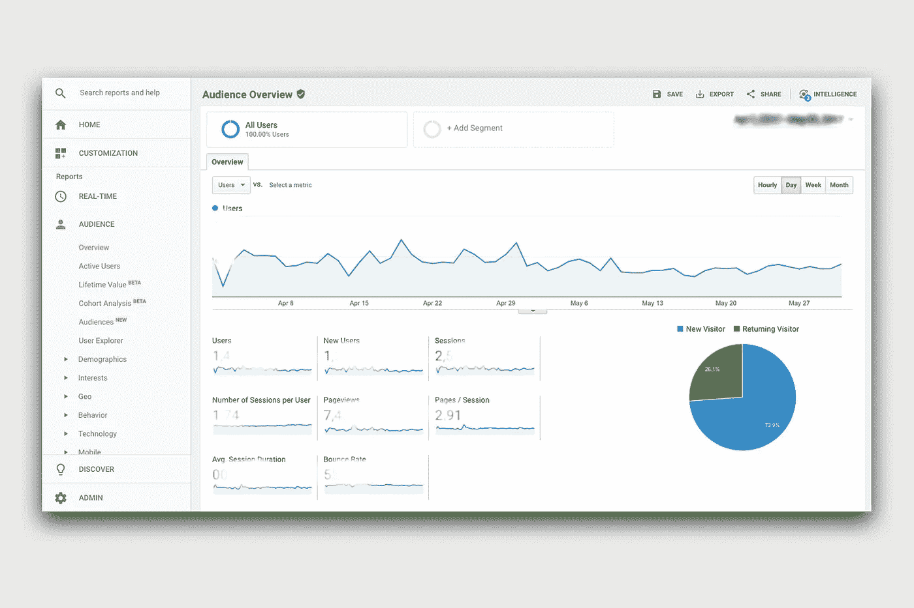
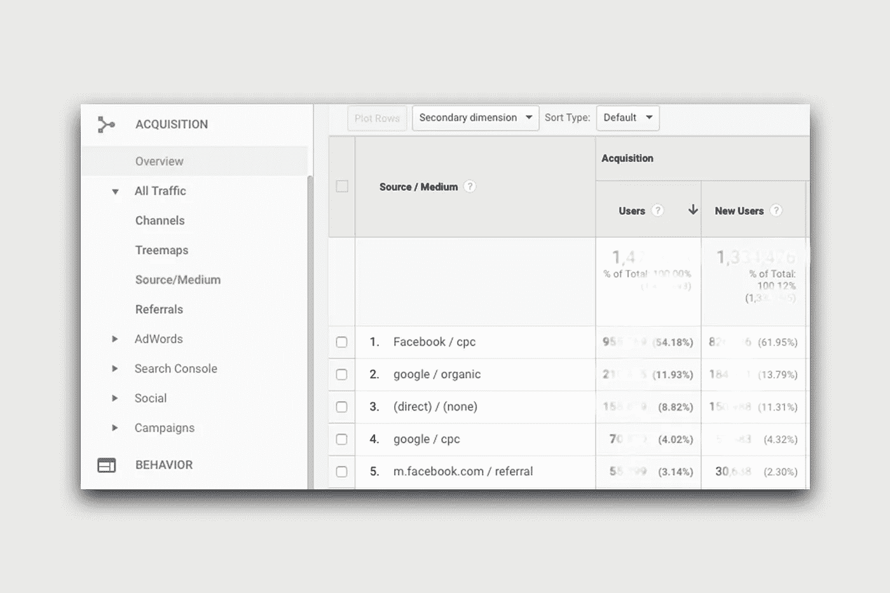
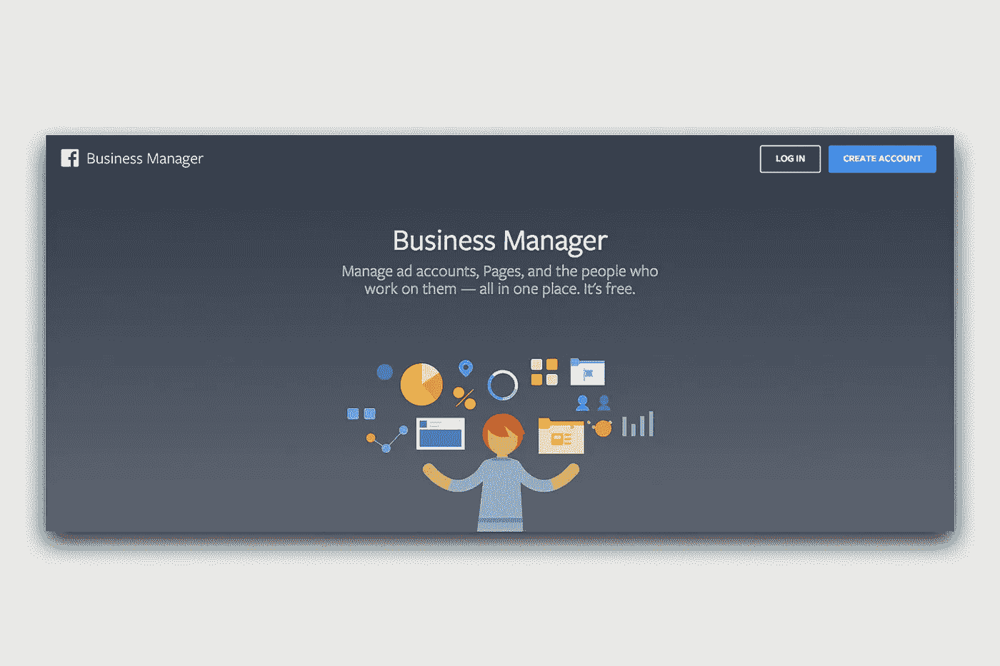

# 所以你是创业公司的 CMO。现在怎么办？

> 原文：<https://medium.com/swlh/so-youre-the-cmo-of-your-startup-what-now-f6f41d0db313>

## 以下是你开始工作时应该做的事情。

你和你的共同创始人一直梦想着开始你全新的创业想法。当你划分职责时，你就拥有了市场营销！耶。只有一个问题。

你以前从未做过市场营销。

谢天谢地，有了数字营销，有很多方法可以开始。还有搜索引擎优化、社交媒体、谷歌/脸书/Instagram 上的广告等等。你认为这会很简单，因为有这么多关于数字营销的文章，你可以很快指导自己。

等等。问题不在于缺乏数字营销的资源。问题是资源太多了。每个人似乎都在给你矛盾的建议。不要担心，最好的方法是简单地建立合适的基础设施，并直接从您的客户那里学习。跟着读。

## 为你的理想客户建立一个角色。

创建有效营销策略的第一步是确定它是针对谁的。当我创办我的第一家公司:一个用户以旧换新视频游戏的门户网站时，我们的主要客户是来自中产阶级家庭的游戏机玩家，他们买不起 60 美元的视频游戏。他可能还在上学或上大学，没有稳定的收入。

Identify your customer persona before diving into advertising.

## 找出你的顾客在哪里。

如果你的客户不在社交媒体上，那么社交媒体对你来说毫无用处。首先找出顾客花时间的地方——无论是线上还是线下。如果在网上，那么他什么时候上网购物。例如，在印度，大多数电子商务购物都发生在办公时间。)通过桌面，午夜左右通过手机。但是你不能假设所有的观众都有同样的作品。假设，如果你的核心客户群包括银行员工，那么他们可能不会遵循上述趋势，因为大多数银行限制上班时上网。

## 创建您的社交账户。

现在，你知道你的观众在哪里。确保你在客户所在的社交媒体平台上。然后，在客户目前没有的平台上创建账户。这将防止其他人(垃圾邮件发送者、欺骗者和竞争对手)创建类似的品牌帐户。

## 设置您的跟踪。

这将是你要做的最重要的战术。首先，你需要知道你的观众来自哪里，他们长什么样。这通常是通过嵌入一些 cookies 或来自跟踪器的像素来完成的。

从在你的网站上设置谷歌分析开始。谢天谢地，这是一个相当简单的过程，因为[谷歌在这里很好地概述了](https://support.google.com/analytics/answer/1008080?hl=en)。完成后，您应该能够看到访问您网站的访问者数量、他们来自的位置以及他们用来访问您网站的设备。

When starting out, Google Analytics is the only analytics tool you will need.

然而，你也需要找出他们来自其他什么网站。在这里，对 URL 进行一些巧妙的处理会有所帮助。当你通过脸书、Twitter 或任何其他媒体在线分享你的链接时，你可以给这些链接添加一些简单的“标签”来帮助你了解流量来自哪里。要添加这些标签，只需前往[谷歌的活动 URL 生成器](https://ga-dev-tools.appspot.com/campaign-url-builder/)并填写表格。

现在，每次你在线分享你的链接，无论是有机的还是通过你的广告，只需添加指定来源的标签，就大功告成了！

Go to Acquisition > Source/Medium to find out where your traffic is coming from.

## 设置您的广告帐户。

接下来，你必须为你的企业建立广告账户。去谷歌和脸书商务经理那里，建立你的商务广告账户。这不是一篇如何操作的文章，所以我不会深入讨论这些步骤。请记住以下几点:

*   尽可能在任何地方建立商业账户。尤其是对于脸书，最好使用企业帐户，因为它允许您添加具有不同访问级别的不同团队成员。此外，脸书经常会自动屏蔽你的个人广告账户，而不会发出警告，但它更理解商业账户。
*   确保您输入了所有正确的税收信息，以确保您获得正确的税收抵免。当你刚开始的时候，你可能不会从任何一家公司得到客户经理，所以解决问题需要很多时间。

Facebook’s business manager will allow you to set up multiple ad accounts and add team members.

## 创建一个博客。

但是在你这么做之前，问问你自己，你是否准备好了定期发帖。如果你不能保证每隔几天就会有时间写点什么，那就跳过这个。也就是说，请记住，执行良好的内容策略可以帮助您节省数千美元的广告支出，并与客户建立长期品牌。如果你真的建立了一个博客页面，我建议你使用 WordPress——它很容易上手，也很容易让多个团队成员参与进来。

然后开始写你的企业能增加什么价值。不要在意 SEO 大师们说的话——只要你在创造高质量的内容，就没有必要尝试和玩弄算法。如果你正在使用 WordPress，我建议你使用 [Yoast 的 SEO](https://yoast.com/) 插件，在你写博客的时候获得一些好的建议。你的建议不会打扰到你，而且能帮助你有效地写文章和给文章加标签。

如果你的目标受众不认同，你不需要遵循上面所有的步骤。总之，请记住以下几点:

*   首先确定你的目标受众。与你所有的联合创始人一起工作，确保每个人都与观众保持一致。
*   优先考虑你的目标受众已经使用的渠道。
*   设置你的社交账户，并确保你能够追踪所有访问你网站的流量来源。
*   在您将使用的顶级广告渠道上创建*商业*账户。
*   建立一个商业博客，与你的客户直接交流。

***如果你喜欢看这个故事，请给它一个“👏".此外，跟着我，你会得到更多这样的故事。如果你正在推出一项新的产品或服务，请前往 www.sapsonic.com******报名或给我留言。首次咨询是免费的！***

*原载于 2018 年 4 月 20 日*[*sapsonic.com*](http://sapsonic.com/so-youre-the-cmo-of-your-own-startup-what-now/)*。*

## 这篇文章发表在 [The Startup](https://medium.com/swlh) 上，这是 Medium 最大的创业刊物，有 319，283+人关注。

## 在这里订阅接收[我们的头条新闻](http://growthsupply.com/the-startup-newsletter/)。

