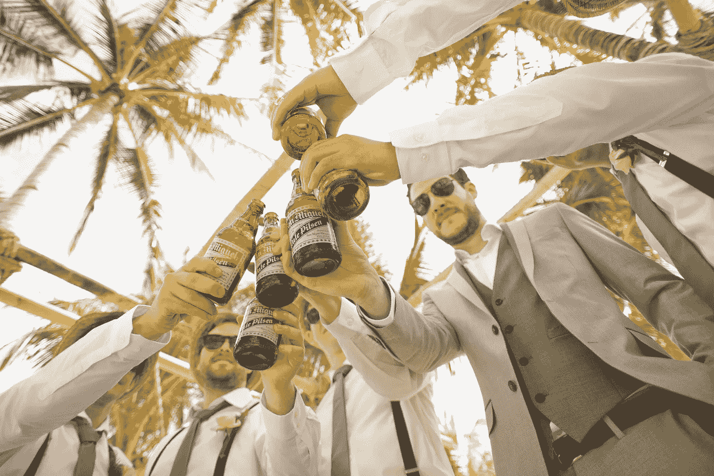
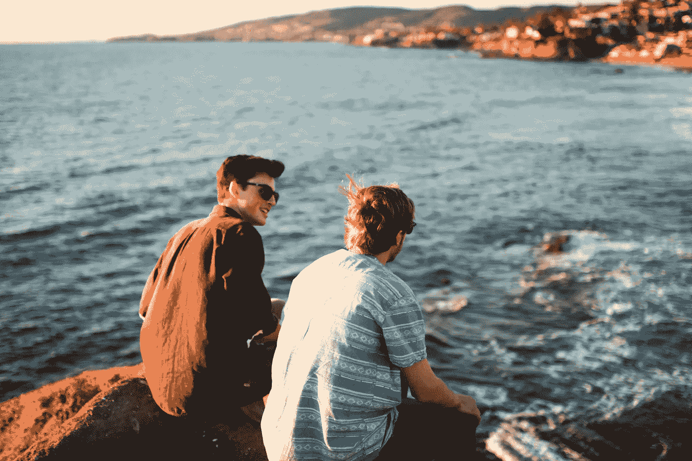
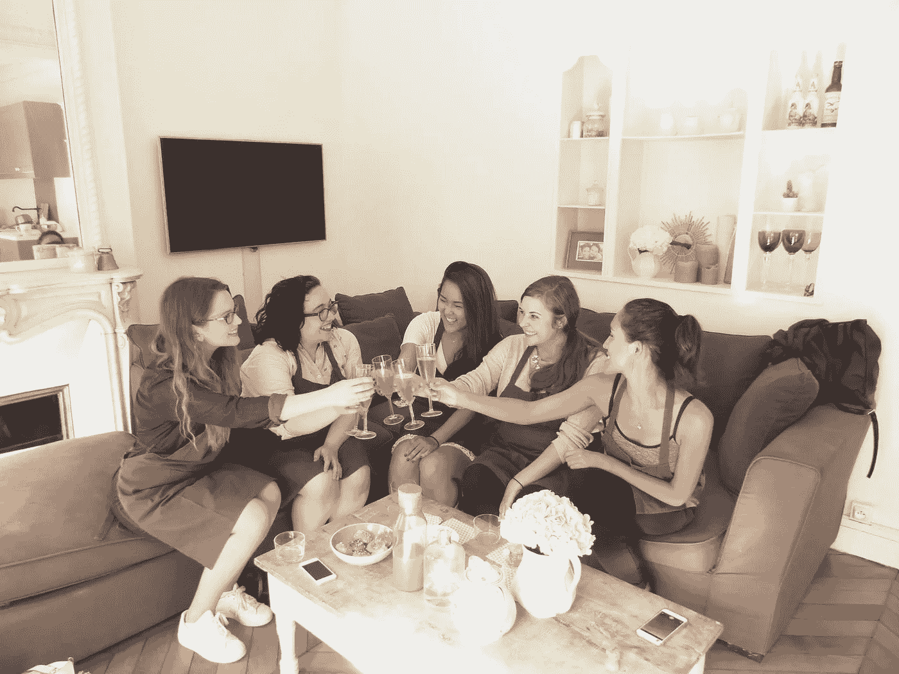
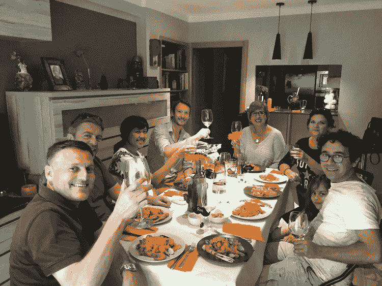
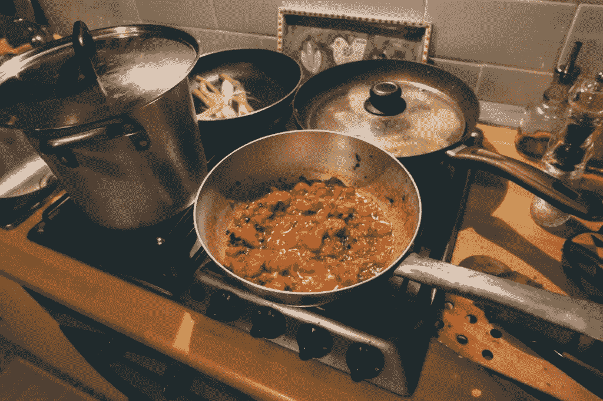

# 社交聚餐:旅行中最不尴尬的交友方式

> 原文：<https://medium.com/swlh/social-dining-the-least-awkward-way-to-make-friends-while-travelling-40e249fd3e36>

如果你看了足够多的电视节目，你就会知道单独监禁是监狱对任性的囚犯最严厉的惩罚之一。发明它们的目的是改造和惩戒那些越轨的囚犯。

然而，事实证明，一天 23 个小时盯着四面墙对囚犯来说太多了——或者对任何人来说都是如此。1951 年进行的一项研究探讨了这种隔离的影响[几乎让受试者发疯](http://www.pbs.org/wgbh/frontline/article/what-does-solitary-confinement-do-to-your-mind/)。没有一个待在“只有一张床的小房间里进行感觉剥夺实验”的学生能坚持超过七天。

最初的计划是观察他们六周。

为什么不能忍受孤立？简而言之，人类是天生如此的群居动物。我们大脑中的新皮层——促进许多社会功能——远远大于这个星球上的任何其他动物。我们需要与他人互动。

可以理解的是，旅行时很难接触当地人并与他们交朋友。你从哪里开始？简单地随意走向当地人是行不通的，因为他们可能会怀疑你的意图。

得益于共享经济，与当地人互动变得容易多了，而且不会让人觉得可疑。

跳上一辆优步，你会在旅途中得到司机的全力关注。通过 Airbnb 租一个房间，然后*瞧！你会有即时的室友。通过 BonAppetour 预订晚餐，你可以品尝正宗的当地美食，同时在用餐时结交快速的朋友。*

# 一起吃饭的传统

用餐本来就是一种社交活动。事实上，餐桌在传统上被认为是一个社区场所。这就是为什么家庭聚餐的古老传统今天仍然存在。这是一个安全的空间，人们可以放下戒备，讲述当天的事件，交换新旧故事，并相互联系。

爱丽丝·朱利尔在她的书《一起吃饭》中说:“一起吃饭可以从根本上改变人们的观点:它减少了人们对不平等的看法，食客们倾向于认为不同种族、性别和社会经济背景的人比他们在其他社会场景中更平等。”

简而言之，用餐体验让每个人都处于平等的地位。不管你是律师、教师还是司机，与你旁边的人分享当地食物这个简单的行为对建立友谊和长期关系大有帮助。

俗话说:“一起吃饭的家庭，要待在一起。”我们也可以说“一起吃饭的朋友，呆在一起。”这就是为什么 BonAppetour 鼓励游客和当地人一起吃饭。

# 吃饭时结交家人和朋友

以旅游博主本为例。本于 2009 年从英国搬到巴塞罗纳，他描述道，在[厨师特蕾莎的家庭餐厅](https://www.bonappetour.com/teresa-hernandez-genis/delicious-tapas-seafood-paella-with-a-trained-spanish-chef-just-available-on-saturdays-for-dinner-sundays-for-lunch)用餐的经历[让他“感觉像是在一个新国家的当地人”](http://www.driftwoodjournals.com/eat-homemade-paella-and-tapas-at-chef-teresas-home-in-barcelona/)

当本讲述他的午餐经历时，他几乎感觉像是和家人在一起:

> 我们愉快地聊着天，偷拍了特蕾莎和她的朋友米雷拉在厨房里大吵大闹的照片。她会不时吸引我们的注意力，向我们展示肉菜饭的配料，并解释她是如何准备的。
> 
> 特蕾莎把肉菜饭堆在我们的盘子里，然后和我们一起坐下来吃，这又让我们感觉像是在庆祝一个家庭，当我们坐下来把多汁的大虾的头拔下来，用大块的 pan con tomate(有西红柿、大蒜和橄榄油的面包)舀起米饭时，我们慢慢炖，直到发出低沉的隆隆声。

没有什么比家常菜更能温暖你的胃和心灵了。

[*阅读:开始你的家庭餐馆生意:6 个便利的小贴士*](https://www.bonappetour.com/blog/starting-your-home-based-restaurant-business-6-handy-tips/)

爱上罗马的美国人娜塔莉在桑德拉的家里度过了一段更安静但同样亲密的时光。更少的“喧闹的家庭庆祝”和更多的“最好的朋友联系”体验:

> 在聊罗马、食物和激情的时候，我被要求切茴香和切洋葱。桑德拉煎锅的时候，我和她并肩站在她的厨房里，按照她的指示准备新鲜的意大利面。

听起来就像最好的朋友在悠闲的周六晚上会做的事情。

在一天结束的时候，他们就是这样——在外国的新朋友:

> 我们来到她温馨的罗马阳台坐下，为新朋友和美食干杯[…]被邀请到桑德拉家参加三道菜的盛宴是一种享受。这是重返罗马的完美之旅，离开时，我兴奋地认识了一位新的罗马美食朋友。

**准备好和当地人一起吃饭，交朋友了吗？立即在您选择的城市** [**这里**](https://www.bonappetour.com/e/explore) **找到一家家庭餐馆。**