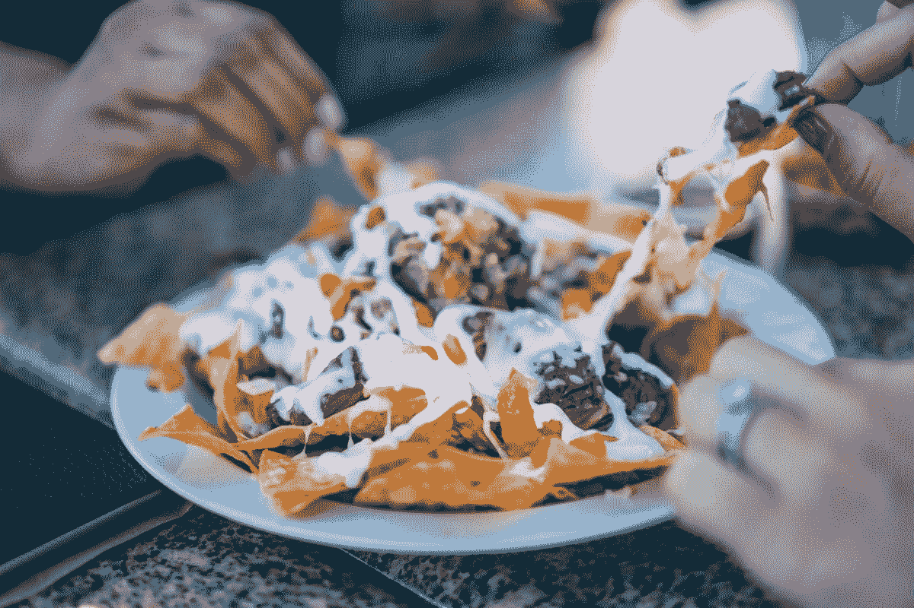

# 社交媒体，一个有着孤独深度的广阔表面

> 原文：<https://medium.com/swlh/social-media-a-wide-surface-with-a-lonely-depth-c2c5e01f10af>

我不禁注意到我周围的人都把自己的脸贴到手机屏幕上，包括我自己。无论我们是在等公交车，坐在沙发上，甚至是在准备考试，不知何故，我们都会把手伸进口袋，查看每个社交媒体平台，这样我们就不会错过任何更新。最糟糕的是，当我们和一群亲密的朋友在一起时，我们的智能手机总是在视线范围内，当通知弹出时，注意力从“面对面”转移到“面对面”上。

> “不让社交媒体偷走你的时间需要自律。”亚历克西斯·奥哈尼安

社交媒体很棒，它正在重新设计我们彼此联系的方式。然而，这也意味着我们必须重新思考我们需要什么来满足我们的关系。我们迟早会意识到，再多的推文、帖子或状态更新也无法填补我们的空虚，因为在线社交网络和真实社交网络之间存在着深刻的差异。

# 社交媒体与孤独感的相关性

匹兹堡大学在 2014 年进行了一项研究，调查了 1787 名年龄在 19 岁至 32 岁之间的成年人对当时最受欢迎的社交媒体平台的使用情况——脸书、YouTube、Twitter、Google Plus、Instagram、Snapchat、Reddit、Tumblr、Pinterest、Vine 和 LinkedIn。

该报告表明，如果你每天花在社交媒体上的时间超过两个小时，你感到孤独的几率会增加一倍。此外，有人认为社交媒体正在推动 FOMO 的崛起(害怕错过)，这可能会导致对需要更新的焦虑，因为害怕变得不相关，因此变得无关紧要。

然而，从这项研究中，尚不清楚社交媒体是否会导致孤独，或者已经孤独的人更有可能在社交媒体上花费更长时间。尽管如此，研究人员辩称，不管年龄差异如何，社交媒体的使用和孤独感之间存在关联。

合著者伊丽莎白·米勒提到，现在还不知道社交媒体的使用和孤独感哪个先出现。有可能最初感到孤独的年轻人转向了社交媒体，也有可能是他们越来越多地使用社交媒体不知何故导致了被现实世界遗忘的感觉。

# 建立真正的联系

正如我在《 [*脆弱，乔装英雄*](https://ye-chen.com/vulnerability-a-hero-in-disguise/) 》中所写的，互相帮助是人类的天性，通过脆弱，我们向彼此敞开心扉。我们愿意看着某人的眼睛，倾诉我们的灵魂，并对此感到舒适。我们希望别人了解 [*真实的我们*](https://ye-chen.com/blogs/unfold-series/) 而不是每次进入公众视野都强颜欢笑。

我们无法通过社交媒体建立如此深的联系。社交媒体允许我们控制我们分享的东西，这迎合了我们的脆弱性。我们可以挑选分享哪些照片，并巧妙地编辑我们的文字，以确保我们传达了我们希望别人看到的形象，这往往会助长现实生活中友谊的假象。

在建立个人和职业关系方面，数字交流永远无法取代面对面的接触。

# 不要误解我

在线技术不是某种罪恶，远非如此。这是一个跨越距离、时区和年份与人保持联系的伟大工具。我们都见证了它的力量，它将人们团结在崇高的事业后面，使人们能够接入资源和信息，并提供比以往任何时候都更有效地开展业务的机会。但是像所有的工具一样，我们必须学会如何用好它，而不是让它利用我们。

以下是我建立更好的面对面社交网络的三大策略。

# 1.成为更好的倾听者

太多时候，我们倾向于说多于听。学会 [*听好*](https://ye-chen.com/an-ear-listening-a-heart-understanding-and-a-silence-engaging/) 并容忍我们的言语失误是如此重要。我们无法巧妙地编辑真实的对话，我们也不想这样做。当我们犹豫不决，说不出话来，或者发现自己沉默不语时，我们会向他人展示自己，并与他人建立更深的联系。正如我之前提到的，我们通过自己的弱点与他人联系，而不是通过我们的智力。

> “多听少说。没有人通过听自己说话学到任何东西。”—理查德·布兰森

# 2.练习对话

练习对话和与人交往要一小步一小步来。充分利用所有的社交机会，无论是和为你煮咖啡的咖啡师交谈，还是和坐在你旁边的人交谈。对一些人来说，仅仅是眼神交流就很困难。所以，也许你必须从这一点开始。

> “交谈需要练习；我们做得越多，就越好，也越容易做到。”—苏珊·罗恩

# 3.邀请人们一起吃饭

这是我最喜欢的一个。然而，许多人害怕邀请别人吃饭，甚至是喝杯咖啡。一些最好的对话发生在喝咖啡或者吃便餐的时候，比如 T2 T3。是的，这可能有点可怕，但真正的联系总是需要一定程度的风险和脆弱性。话说回来，有什么值得努力的事情不值得呢？

> “告诉我你吃什么，我就知道你是谁。”让·安塞尔姆·布里拉特-萨瓦林

*原载于 2018 年 5 月 8 日*[*ye-chen.com*](https://ye-chen.com/social-media-a-wide-surface-with-a-lonely-depth/)*。*

## 这个故事发表在 [The Startup](https://medium.com/swlh) 上，这是 Medium 最大的企业家出版物，拥有 322，555+人。

## 在此订阅接收[我们的头条新闻](http://growthsupply.com/the-startup-newsletter/)。

