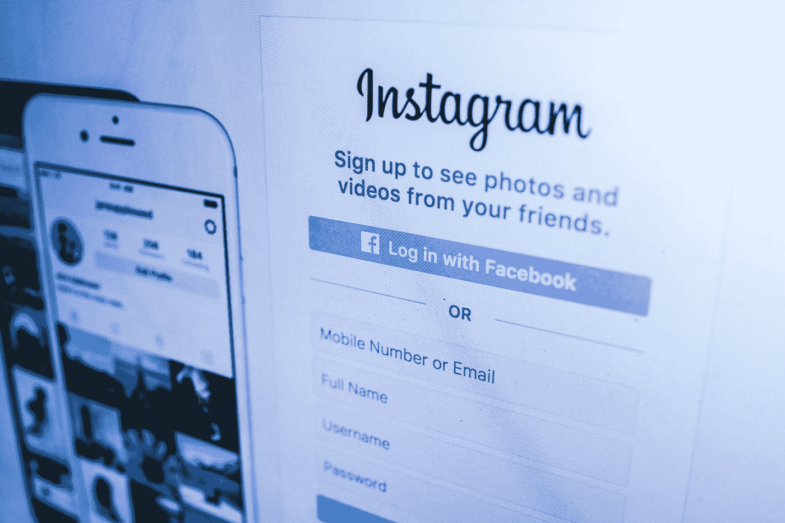

# 社交媒体让你

> 原文：<https://medium.com/swlh/social-media-is-enabling-you-76c01a46c7c4>

## 不是好的方面

“Instagram screengrab” by [Fancycrave](https://unsplash.com/@fancycrave?utm_source=medium&utm_medium=referral) on [Unsplash](https://unsplash.com?utm_source=medium&utm_medium=referral)

我们今天生活在一个非常喜欢装腔作势的世界。

这意味着在大多数人面前，我们可以成为我们想成为的任何人。

社交媒体使我们能够做出一般性的评价，“看看我的草坪多漂亮”或“看看我自己做的这个 DIY 项目”，而不会让我们对自己的弱点负责。