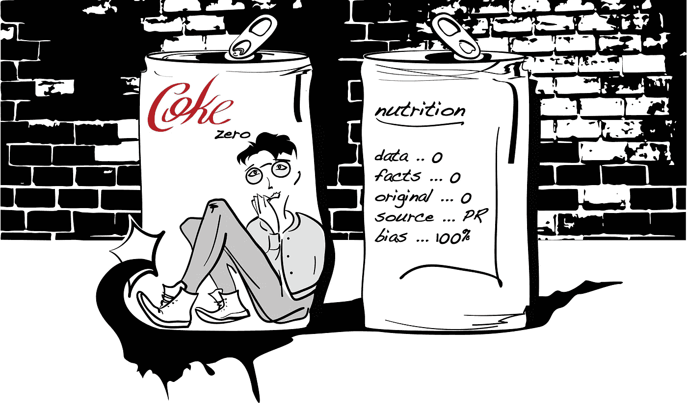
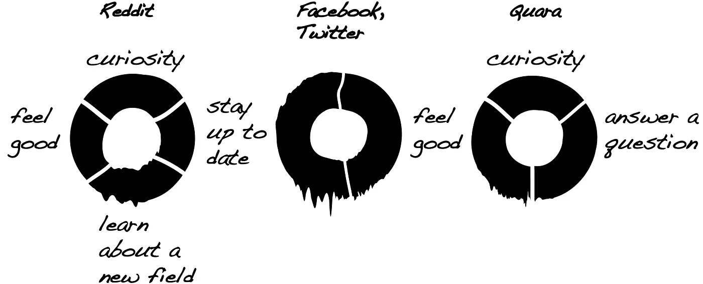

# 社交媒体是新的精制糖

> 原文：<https://medium.com/swlh/social-media-is-the-new-refined-sugar-dd7e04953ffa>

Illustration by Katya Obyedkova

当我走进一家杂货店时，我必须走过蔬菜区才能到达加工食品区。我可能不会总是做出最健康的选择，但我有意识地意识到有一个选择。

对许多人来说，在社交媒体上阅读新闻就像是在加工食品区登陆，却没有看到农产品区。

食品包装标志着新鲜、质量和价值。精心设计的包装在创造支付意愿方面起着重要的作用。我们经常愿意支付额外的费用来支持我们所信仰的事业:有机与传统，可回收与不可回收，本地与非本地。

商品的包装或多或少都是一样的，运送方式也是一样的，而且越来越丰富。当我浏览手机上的新闻提要时，我看到不同来源的文章被捆绑在一个同质列表中。一个标题，一个缩略图，一个来源，也许还有一个快速总结。我点击了一个煽动性的标题。缩略图现在非常大，一些我昨天看的耳环的广告弹出来，也许一个随机的视频开始大声播放。我向下滚动阅读这篇文章。四到七个分享按钮卡在我的视野里。我开始思考这篇文章是否值得分享，但我真的不知道，因为我太分心了，无法阅读。当我读到结尾时，我看到一个捐钱的呼吁。啊，这让我很难过。我急忙关上窗口，继续向下滚动我的无限新闻提要，尽管现在有一点点内疚。

当这是我们在线阅读体验的基线时，我们为内容付费的意愿极低就不足为奇了。只有大约 10%的在线用户为他们的新闻付费。67%的人说他们不会为他们最喜欢的品牌支付任何费用。(1)

每秒钟都有无数的 A/B 测试实验在进行，社交媒体是为上瘾而设计的。(2)社交媒体平台的收入来自广告，这意味着你登录越多，点击越多，滚动时间越长，他们的广告机会就越多。然而，对于一篇内容给读者提供了多少价值，却没有一个估计。尽管不完美，食品工业提供的信息使消费者能够做出更好的选择。自 1990 年以来，美国食品和药物管理局要求在大多数出售的包装食品上贴上营养标签。然而，媒体行业却没有这样的对等物。**选择的可见性**是任何杂货店购物体验的基础。我们需要找到有效的数字媒体替代品来替代食品行业中所谓的******营养标签**和**包装**。****

****我们正在建立一个任何人都可以被听到的世界，但我们最终得到了一台宣传机器，它放大了我们想听到的一切。我们责怪自己不愿意付钱。我们责怪自己不愿意跳出自己的泡泡。然而，问题是社交媒体成为了新的快餐行业。****

********

****Illustration by Katya Obyedkova****

****就像快餐业依靠统计数据找到糖、盐和脂肪的最佳含量来吸引我们一样，社交媒体使用复杂的内容监管算法来保证我们会再次光顾。快餐如此强烈地影响我们的感官，以至于它触发了大脑中的奖赏回路，超越了抑制食欲的激素。(5)奖励的感觉是强烈的，但是短暂的，所以我们渴望更多。根据《市场营销杂志》的一项研究，引发“高度兴奋”情绪的内容在网上表现更好。(6)能引起强烈情感反应的内容在社交媒体上最成功。因此，分享内容就是分享情感。****

******我们为什么读书？******

****先来分解一下我们阅读新闻文章的一些原因。
1。)阅读以理解一个问题并采取立场。
2。)阅读以跟上时代。
3。)通过阅读来了解一个新领域。
4。)通过阅读来站在一个行业的顶端。
5。)阅读回答一个问题。6。)通过阅读来理解他人。7。)读书是为了满足好奇的自己。8。)读书要心情好。****

****当我们在社交媒体上发现新闻时，从根本上来说，这是为了保持最新和感觉良好。我们使用谷歌主要是因为我们的问题需要得到解答，或者我们出于好奇正在学习一些东西。然而，缺少的是帮助我们理解问题并采取立场、帮助我们了解新领域、帮助我们保持行业领先地位以及帮助我们更好地理解他人的平台。****

********

****Illustration by Katya Obyedkova****

******市场的一片空白******

****T 这是一个等待填补的市场空白。任何成功的人都将提高新闻业的标准，帮助人们做出更明智的决定，并将为社区的思维方式带来更多透明度。****

****为了解释为什么空白会首先形成，我想看看数字媒体发展的两条主要轨迹。第一个轨迹是从传统印刷新闻向数字媒体的演变。这种轨迹的特点是以数字形式复制印刷杂志的结构。大多数时候，网上的文章看起来和印刷的文章非常相似。第二条轨迹是由社交媒体公司推动的。他们已经成为传统媒体公司的主要分销渠道。阅读新闻只是人们想在社交媒体上做的“另一件事”。一旦传统媒体公司失去了对发行的控制，就很难产生利润。阅读新闻变得商品化了。****

****我不关心拯救传统媒体这条正在下沉的船，也不特别喜欢当前的任何社交媒体产品。我认为我们应该取两种模式之长。****

****传统媒体仍然是专业新闻的最佳资源。社交媒体已经清楚地表明，谁分享内容比谁发布内容更重要。它表明，没有一个单一的品牌可以为我们提供所有我们想要阅读的内容。阅读不仅仅是了解正在发生的事情，它还是与社区联系的一种方式。尽管有其优势，社交媒体也有一些腐蚀性的副作用:回音室效应，巨魔，虐待行为，以及大量的个人和专业营销。****

****最重要的是，社交媒体只对一种特定类型的阅读有益，即“感觉良好”的那种。它可能会让我们感到联系，证实我们的偏见，“很高兴这不是我”的满足感，廉价的刺激，搔痒，或幸灾乐祸。像精制糖一样，它能让人很快兴奋起来，但可能对智力没有太大好处。****

******媒体营养标签******

****当我拿到我最喜欢的印刷新闻杂志的最新一期时，我知道该期待什么。我瞥了一眼目录，快速浏览我最喜欢的部分，寻找最有趣的标题。我对这个品牌的熟悉程度、杂志的布局以及记者的名字都提供了一个重要的背景。如今，当我们在社交媒体上发现文章时，上下文很弱或缺失。主要上下文是谁分享了这篇文章。我们可能不熟悉特定的品牌或作者，这使得理解一篇文章隐含的偏见和可信度变得更加困难。我为每篇文章建议了一个注释，可以帮助我们在上下文中定位它，一个“营养标签”****

****正如我们想知道我们所消费的食物的营养价值一样，我们也想知道我们所消费的物品的智力价值。一篇文章的营养标签应该是什么样的？****

****一篇文章的营养标签将有助于读者欣赏作品，并有可能产生付费意愿。以此类推，知道农产品是有机的可能是一个很好的理由让顾客支付额外的美元。特朗普获胜后,《纽约时报》的订阅量飙升就很能说明问题。(7)什么让一个故事更有价值？社交媒体上的故事大多是纯 PR。几十年来，公关大大降低了出版商的生产成本。大多数时候，它与其他故事没有什么区别，这是它取得最大成功的关键。公关是为什么网上总会有很多免费内容的原因。问题是，公关和官方来源产生的故事与记者创造的故事的比例已经发生了巨大的变化(8)。根据对一个美国城市的新闻生态系统的研究，过去是 40-60 或 50-50(8)，2009 年是 86 -14。(9)如果记者创造的故事比例只有可怜的 14 %,我们还会发现水门事件吗？****

****如果我们想阅读真正批判性和发人深省的故事，一个好的营养标签不仅会帮助我们找到它们，还会增加我们的付费意愿。我的“营养标签”将包括两个组件:内容创建组件和用户生成组件。****

*****内容创建组件:*****

*   ******资金来源**。****
*   ******事实准确性**。****
*   ******原始报告的百分比。根据皮尤的一项研究，“研究的十个故事中有八个只是重复或重新包装了以前发表的信息。”(9)原始报告需要时间、精力和资源。一个故事一旦发布，就很容易被复制。******
*   ******对一个故事的独立认同和追求。很难相信一名记者能够为公众的利益服务，因为公关与记者创造的故事的比例高达 86-14。(9)******
*   ******专家主导的报道相对于内部人士报道相对于调查者报道。******
*   ******基于数据的见解。对大多数人来说，阅读数据远不如阅读一篇关于数据含义的文章有趣。一个能从数据中看到故事的作家是非常有价值的。******
*   ******定制资产。**这可以包括原创和难以制作的摄影/音频/视频。****
*   ******政治倾向**:中立、左倾/右倾、极左/极右。换句话说，这个故事如何融入这个世界？第一步是《赫芬顿邮报》的互动[工具](http://interactives.huffingtonpost.com/2017/the-flipside)，用于探索新闻机构在广泛问题上的偏见。****

*****用户生成组件:*****

****我们需要开始收集一篇文章给读者提供了多少价值的数据。除了简单地喜欢或分享一篇文章，我们可以将一篇文章评为信息丰富、发人深省、必读、帮助我理解某个问题或有趣的观点。****

******选择可见性******

****当我们在社交媒体上发现新闻时，我们有一个虫眼视角。即使我们想看看我们自己的网络之外，这几乎是不可能的。能够看到社区而不是个人在谈论什么是强大的。内部工具可以在 B2B 的基础上获得，尽管它们可能很贵。对于一个好奇的人来说，很难进入不同的社区，看看他们在谈论什么。****

********

****Illustration by Katya Obyedkova****

****虽然公司已经获得了更复杂的工具来理解社区的行为，但我们却越来越多地生活在自己的泡泡里，结果阻止了我们发现更好的内容，削弱了我们理解我们关心的问题的能力，并使我们意识不到可能挑战我们自己的观点。想象一下，你可以搜索任何你感兴趣的社区，看看它是如何谈论时事的。****

******包装******

****包装是传达内容价值的机会。当印刷媒体过渡到数字空间时，它并没有实质性地改变一篇文章的呈现方式。公司尝试了交互式可视化，但是规模太小了。包装对一篇文章的价值如何传达以及一个故事如何讲述都有着根本性的影响。****

******结论******

****在中，为了显著改变公关与新闻报道的比例，我们需要从根本上重新思考内容是如何被发现和呈现的。我相信，如果我们能让内容发现对读者来说更有意义，并坦诚内容的“营养属性”，对更高质量内容的需求就会随之而来。对高质量内容需求的增加将反过来产生付费意愿，并提高记者的工作能力。****

****我们需要改变社交媒体的范式，从向我们展示晦涩的算法认为我们想要的东西，到向我们提供有意义的选项。****

******参考:******

1.  ****[http://www . digital news report . org/survey/2015/paying-for-online-news-2015/](http://www.digitalnewsreport.org/survey/2015/paying-for-online-news-2015/)****
2.  ****[https://www . Forbes . com/sites/kashmir hill/2014/07/10/Facebook-experiments-on-users/# 3c 1 BD 8781 c 3d](https://www.forbes.com/sites/kashmirhill/2014/07/10/facebook-experiments-on-users/#3c1bd8781c3d)****
3.  ****[http://www . eating well . com/diet _ health/nutrition _ news _ information/a _ history _ of _ what _ is _ required _ on _ food _ labels _ and _ the _ nutrition _ facts _ panel](http://www.eatingwell.com/diet_health/nutrition_news_information/a_history_of_what_is_required_on_food_labels_and_the_nutrition_facts_panel)****
4.  ****[http://www . CBC . ca/news/health/food-cravings-engineered-by-industry-1.1395225](http://www.cbc.ca/news/health/food-cravings-engineered-by-industry-1.1395225)，迈克尔·莫斯****
5.  ****[https://www . scientific American . com/article/is-obesity-an-addiction/](https://www.scientificamerican.com/article/is-obesity-an-addiction/)****
6.  ****[http://journals.ama.org/doi/abs/10.1509/jmr.10.0353](http://journals.ama.org/doi/abs/10.1509/jmr.10.0353)****
7.  ****[http://www . CNBC . com/2016/11/29/new-York-times-subscriptions-soar-ten fold-after-Donald-trump-wins-presidency . html](http://www.cnbc.com/2016/11/29/new-york-times-subscriptions-soar-tenfold-after-donald-trump-wins-presidency.html)****
8.  ****《美国新闻业的生与死》，罗伯特·w·麦克切斯尼和约翰·尼科尔斯****
9.  ****[http://www.journalism.org/analysis_report/how_news_happen](http://www.journalism.org/analysis_report/how_news_happen)****